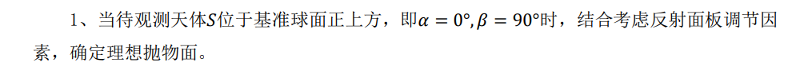
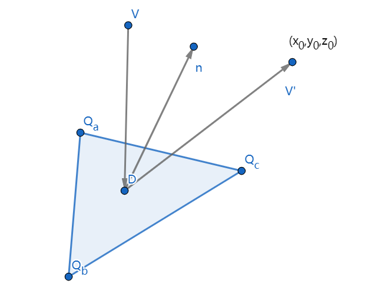
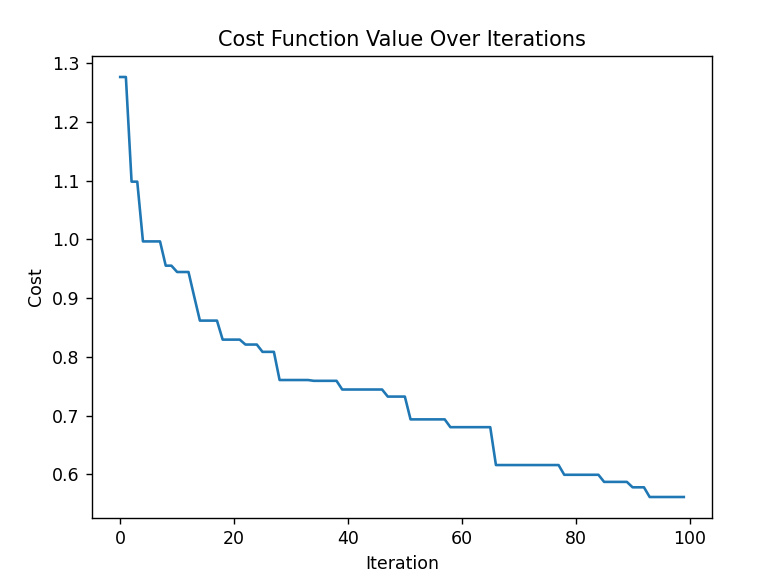
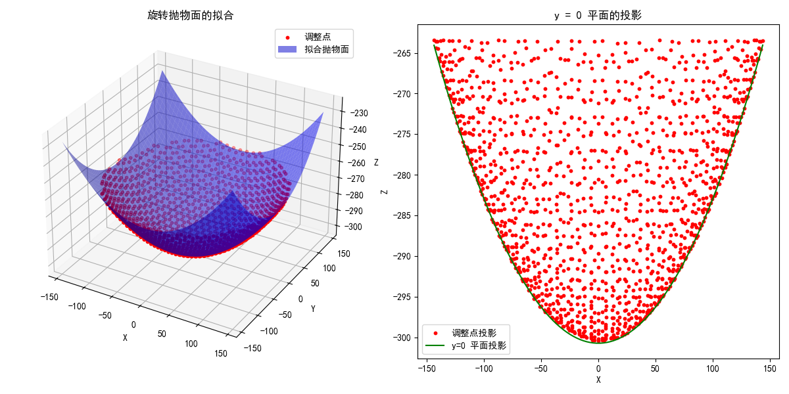
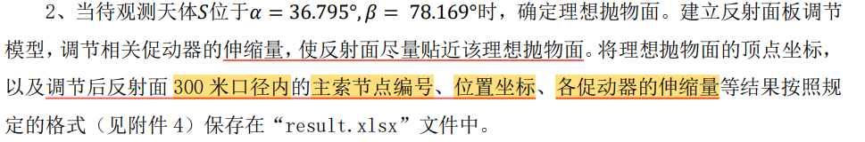
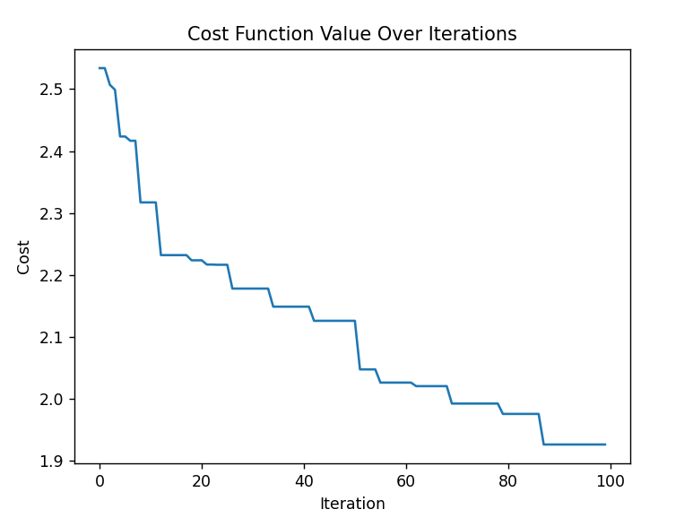
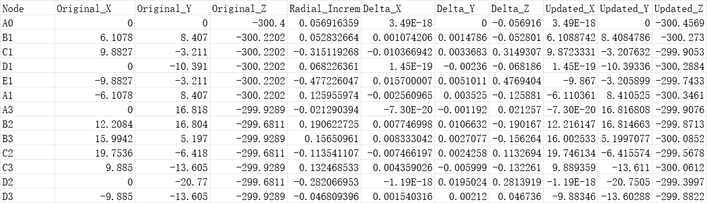
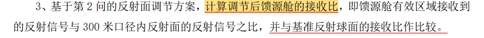

# 2021国赛A题

这是一个调节主动反射面来对天体进行观测的题目,题目要求,主动反射面要尽可能贴近旋转抛物面,以达到尽可能多的星光被收集的效果

非常开心的是,每块反射镜对应的主索节点的编号已经完全给出,不需要我再去根据距离去一个个判断,这样可以极大节省我们的计算时间.

## 第一问

### 光学方程及其约束

虽然说,要近似贴近旋转抛物面,但是,我们只需要一条聚焦的性质就可以了,不需要用到旋转抛物面的任何其他信息.

设需要调节的总共有$N$面镜子,$n$个主索节点,特定的三个主索节点构成一面镜子,万幸的是,附件中已经给出了每一面镜子对应的主索节点的坐标.

由于接受平面具有一定的范围限制,所以这对这些主索节点的坐标提出了限制,接受区域口径为300 m

$$
x_i^2+y_i^2\le 150^2
$$

考虑第$i$面镜子,不妨设其三个顶点为$Q_a,Q_b,Q_c$,其聚焦点为$(x_0,y_0,z_0)$,其几何关系如下图所示:

入射光线单位向量记做$V$,反射光线单位向量记做$V'$,单位法向量记做$n$,根据入射光线等于反射光线的条件,会满足如下所示的方程:

$$
\vec{V}\cdot\vec{n}=\vec{n}\cdot \vec{V'}
$$

由于星星位于正上方,所以星光向量记做:

$$
\vec{V}=(0,0,1)
$$

法向量由三个顶点决定,设三个顶点的坐标为:

$$
\begin{aligned}
(x_a,y_a,z_a) \\
(x_b,y_b,z_b)\\
(x_c,y_c,z_c)
\end{aligned}
$$

那么其法向量为:

$$
\vec{n}=\frac{\vec{AB}\times\vec{AC}}{|\vec{AB}||\vec{AC}|}
$$

反射光线向量可以根据反射点和聚焦点去实现.

一种简化策略是令反射点直接为镜面的中心,另一个策略则是在镜面中取若干点进行蒙特卡洛模拟,显然后面一种策略会更加精确,但是计算量飙升,所以我们采用第一种策略,用中心处的点代替所有反射点,那么反射光线就可以表示为:

中心点坐标:

$$
M=(\frac{1}{3}(x_a+x_b+x_c),\frac{1}{3}(y_a,+y_b+y_c),\frac{1}{3}(z_a+z_b+z_c))
$$

我们将聚焦点设置在接受平面的中心,所以:

$$
\begin{aligned}
&x_0=0 \\
&y_0=0\\
&z_0=-0.534R=-160.2m
\end{aligned}
$$

于是反射光线向量化简为:

$$
V'=(-\frac{1}{3}(x_a+x_b+x_c),-\frac{1}{3}(y_a,+y_b+y_c),-160.2-\frac{1}{3}(z_a+z_b+z_c))
$$

### 优化和求解

我们有n个平面,事实上,就可以列出n个光学方程,直接求解光学方程是费时费力且不现实的,同时,这N个方程组成的方程组不一定有解,所以我们尝试使用智能优化算法去近似求解,哪怕最小值不是0,我们的优化算法也能求出一个逼近0的值从而得到一个较好的策略,定义坐标向量:

$$
\begin{aligned}
X=
\begin{bmatrix}
x_1\\
\vdots\\
x_n   
\end{bmatrix} \\
Y=
\begin{bmatrix}
y_1\\
\vdots\\
y_n   
\end{bmatrix} \\
Z=
\begin{bmatrix}
z_1\\
\vdots\\
z_n   
\end{bmatrix} \\
\end{aligned}
$$

所以就可以定义代价函数为:

$$
J(X,Y,Z)=\sum_{i=1}^N (\vec{V}_i\cdot\vec{n}_i-\vec{n}_i\cdot \vec{V'}_i)^2
$$

所以优化问题就为:

$$
\begin{aligned}
& \min J(X,Y,Z)=\sum_{i=1}^N (\vec{V}_i\cdot\vec{n}_i-\vec{n}_i\cdot \vec{V'}_i)^2 \\
&s.t. x_i^2+y_i^2\le 150^2
\end{aligned}
$$

我们的目标就是求这个函数的最小值,通过调整X,Y,Z,按照我们的期望,其最小值应该尽可能趋向于0,这样,所有镜面的中心光线都能汇聚到接收器的中心,这样也算是近似构造了一个旋转抛物面,真正精确的办法还是要对每个镜面做蒙特卡洛模拟,然后聚焦点设置在约束范围内即可,但是这样的实现不太现实.

首先,这个约束条件可以通过筛选来满足,由于主索节点的调节量很小,满足初态筛选的节点在调整后也会满足上述约束条件

我们采用粒子群优化的办法对上述函数的最小值进行求解,由于促动器只能在径向调节,所以可以定义一个广义坐标向量:

$$
q=
\begin{bmatrix}
r_1\\
r_2\\
\vdots\\
r_n
\end{bmatrix} \\
$$

为了加速更新,根据题意,我们知道,主索节点只会在一个较小的范围内调整,所以,坐标向量可以写成:

$$
q=
\begin{bmatrix}
    r_1^0\\
    r_2^0\\
    \vdots\\
    r_n^0
\end{bmatrix}+
\begin{bmatrix}
    \xi_1\\
    \xi_2\\
    \vdots\\
    \xi_n
\end{bmatrix}=q^0+\xi
$$

注意到促动器的伸缩是有限制的,所以存在约束:

$$
-0.6\le \xi_i\le 0.6
$$

每一次更新只需要对$\delta$做出改动即可,这样有利于减少搜索范围,使得算法可以更快收敛

$$
\min J(\xi)=\sum_{i=1}^N (\vec{V}\cdot\vec{n}_i-\vec{n}_i\cdot \vec{V'}_i)^2
$$

设定五十个粒子,随机初始化他们的位置和速度,某一次迭代中,位置和速度更新的表达式如下:

$$
v^{(n+1)}_i=\omega v^{(n)}_i+c_1p_1(pbest^{(n)}-\xi^{(n)}_i)+c_2p_2(best^{(n)}-\xi^{(n)}_i)
$$

$$
\xi^{(n+1)}_i=\xi^{(n)}_i+v^{(n)}_i
$$

经过运行的代价函数曲线如图所示,迭代100次的代价函数值为0.56,符合要求的节点有706个,平均每个节点的误差为0.07%,在误差范围内,精度应该足够,停止迭代.

### 参数拟合

最终可以得到调整后的所有主索节点的坐标,注意到反射点是镜面中心,所以可以得到$N$个反射点:

$$
M_i=(\frac{1}{3}(x_a^{(i)}+x_b^{(i)}+x_c^{(i)}),\frac{1}{3}(y_a^{(i)},+y_b^{(i)}+y_c^{(i)}),\frac{1}{3}(z_a^{(i)}+z_b^{(i)}+z_c^{(i)}))
$$

题目要求我们得到旋转抛物面,第一题的旋转抛物面的方程可以定义为:

$$
z=-\omega(x^2+y^2)+b
$$

这两个参数可以根据我们求出的M点坐标来近似拟合:

参数拟合的代价函数为:

$$
 \min J(\omega,b)=\sum_{i=1}^N (-\omega({x_M^{(i)}}^2+{y^{(i)}_M}^ 2)+b-z^{(i)}_M)^2
$$

显然这是一个凸优化问题,可以使用梯度下降法求最好的$\omega,b$值

拟合结果如图所示

对应的系数为:

$$
\begin{cases} \omega=0.00177, &  \\ b = -300.729, &  \end{cases}
$$

## 第二问

此时的星星不再位于正上方,而是有一定的方位角和仰角,于是,星光的方向向量可以表示为:

$$
\vec{V}=(\cos \beta\cos\alpha,\cos \beta \sin \alpha,\sin \beta)
$$

此时,要调整方向的反射镜的角度限制范围又与第一问不同

被观测天体确定了,基态球面的球心是确定的,所以就可以确定照明区域的对称轴:

点到直线的距离要小于等于照明半径:

$$
d=\frac{|\vec{OM}\times \vec{V}|}{|\vec{V}|}=|\vec{OM}\times \vec{V}|\le 150
$$

重新筛选后调用第一问的程序计算即可

这个似乎更难更新了,如果下降到0,应该需要更多的迭代时间

一部分运行结果如图所示

## 第三问

这个题应该采用蒙特卡洛模拟,对于第二问中选定区域范围内的反射镜,在反射镜范围内随机取点,作为星光的反射点,根据坐标变换矩阵求解其在P坐标系下的坐标,计算点是否在接收器范围内,将接收器的总接受数与所有反射镜内的总投点数之比作为接受比:

不妨设每个镜子随机投点$m$个,接受器接受到的总光线根数为$N_r$,那么接受比为:

$$
\eta=\frac{N_r}{mN}
$$

根据上述公式可以分别计算基准球面和调整后旋转抛物面的接受比.

关于判定光线是否穿过圆盘,需要使用一些坐标变换的知识,假设我们现在存在两个坐标系$z-x-y$和$z'-x'-y'$,考虑一个点$M$的坐标在两个坐标系中分别为:$(x,y,z)$和$(x',y',z')$,如何找到一个坐标变换矩阵,可以描述两个坐标之间的变换关系?假设两个坐标系的原点重叠.

这个时候,考虑$z'-x'-y'$的三个坐标轴在地面坐标系中的坐标为:

$$
\begin{bmatrix}
    a_i\\
    b_i\\
    c_i
\end{bmatrix}
$$

那么,就存在如下坐标变换关系:

$$
T
\begin{bmatrix}
    1,0,0\\
    0,1,0\\
    0,0,1
\end{bmatrix}=
\begin{bmatrix}
    a_1,a_2,a_3\\
    b_1,b_2,b_3\\
    c_1,c_2,c_3
\end{bmatrix}
$$

也就是说,坐标变换矩阵就是三个轴在地面坐标系中的坐标矩阵.

如果$z'-x'-y'$与地面坐标系的原点不重合,那么我们先将坐标原点进行平移,然后再使用旋转矩阵,于是得到坐标变换关系:

$$
\begin{bmatrix}
    x\\
    y\\
    z
\end{bmatrix}
=T\begin{bmatrix}
    x'\\
    y'\\
    z'
\end{bmatrix}+O'
$$

现在,尝试得到这个T,假设我们知道法向量也就是z轴向量的方位角(与x轴正半轴的夹角),以及高度角(与O-x-y平面的夹角),此时O-x'-y'平面还可以任意旋转,不妨将x'轴和地面轴取做一致,所以会有:

$$
\hat{z'}=
\begin{bmatrix}
    \cos \beta \cos \alpha\\
    \cos \beta \sin \alpha\\
    \sin \beta
\end{bmatrix},\quad \hat{x'}=
\begin{bmatrix}
    1\\
    0\\
    0
\end{bmatrix}
$$

y'方向上的单位向量可以根据叉乘得到:

$$
\hat{y'}=\hat{z'}\times \hat{x'}=\begin{bmatrix}
    0\\
    \sin \beta\\
    -\cos \beta\sin \alpha
\end{bmatrix}
$$

所以我们的坐标变换矩阵为:

$$
T=\begin{bmatrix}
    \cos \beta \cos \alpha,&1,&0\\
    \cos \beta \sin \alpha,&0,&\sin \beta\\
    \sin \beta,&0,&-\cos \beta\sin \alpha
\end{bmatrix}
$$
