# 2022国赛B题

这是一个无人机飞行的纯方位无源定位问题,即通过飞行编队内自身的信号调整来保持飞行编队内飞机的相对位置保持不变.

## 第一问

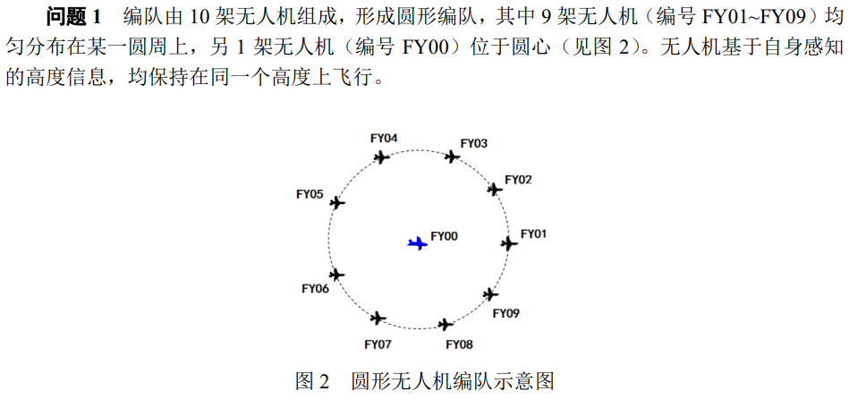

### 第一小题

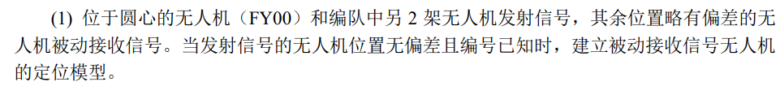

意思就是通过接受到的三个信号,对无人机进行定位,位于圆心处的无人机编号为0,不妨设另外两架发射信号的无人机的编号为$i$和$j$,以$i$为x轴,FY00为原点构造极坐标系:

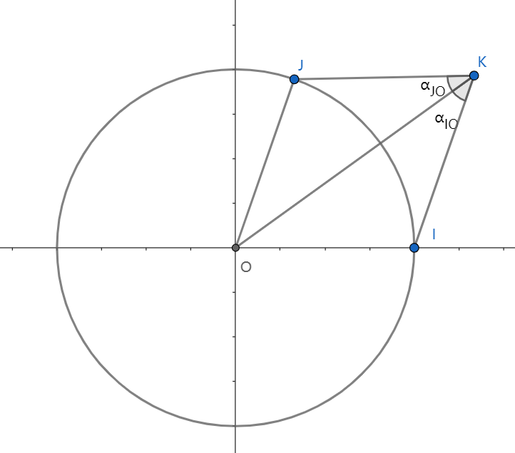

要确定定位信息,即确定H的极坐标$(\rho,\theta)$,由于B,C编号已知并且位置无偏移,不妨设他们离原点的距离为$R$

将i,j所代表的向量分别设做$\vec{f_i},\vec{f_j}$,位置向量设做:$\vec{f}$

可以获得三个方位角信息

$$
\begin{cases} \displaystyle \cos \alpha_{IO}=\frac{\vec{f}\cdot(\vec{f}-\vec{f_i})}{|\vec{f}||\vec{f}-\vec{f_i}|}, &  \\\displaystyle \cos \alpha_{JO}=\frac{\vec{f}\cdot(\vec{f}-\vec{f_j})}{|\vec{f}||\vec{f}-\vec{f_j}|} , &\\  
\displaystyle cos\alpha_{IJ}=\frac{(\vec{f}-\vec{f_i})\cdot(\vec{f}-\vec{f_j})}{|\vec{f}-\vec{f_i}||\vec{f}-\vec{f_j}|}
\end{cases}
$$

其中$\vec{f_i},\vec{f_j}$的直角坐标由下式给出:

$$
\begin{cases} \vec{f_i}=(R,0), &  \\ \vec{f_j}=(R\cos\theta_{ij},R\sin\theta_{ij}), &  \end{cases}
$$

其方位角可以根据编号关系得到:

$$
\theta_{ij}=\frac{2\pi}{9}|i-j|
$$

化简之后得到方程:

$$
\begin{cases} 
\displaystyle \cos \alpha_{IO}=\frac{\rho-R\cos\theta}{\sqrt{\rho^2-2\rho R\cos\theta+R^2}}\\
\displaystyle \cos\alpha_{JO}=\frac{\rho-R\cos(\theta-\theta_{ij})}{\sqrt{\rho^2-\rho R\cos(\theta-\theta_{ij})+R^2}}\\
\displaystyle \cos \alpha_{IJ}=\frac{\rho^2-\rho R\cos(\theta-\theta_{ij})-\rho R\cos\theta+R^2\cos\theta_{ij}}{\sqrt{\rho^2-2\rho R\cos\theta+R^2}\sqrt{\rho^2-\rho R\cos(\theta-\theta_{ij})+R^2}}
\end{cases}
$$

从几何的角度看,无人机应该出现的地点应该是以OJK三点为圆,以OIK三点为圆和以IJK三点为圆的六个圆的其中三个的共同交点处:

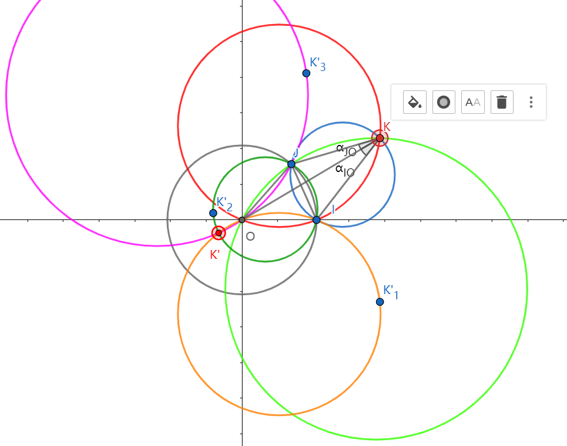

从中可以发现,K的解有两个,即三个方位信息还不能实现对点的有效定位.


### 第二小题

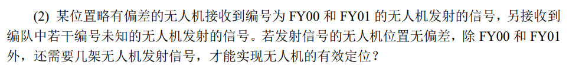

我们尝试多加一个点,然后观察几何图像,看是否还会有多解的情况出现:

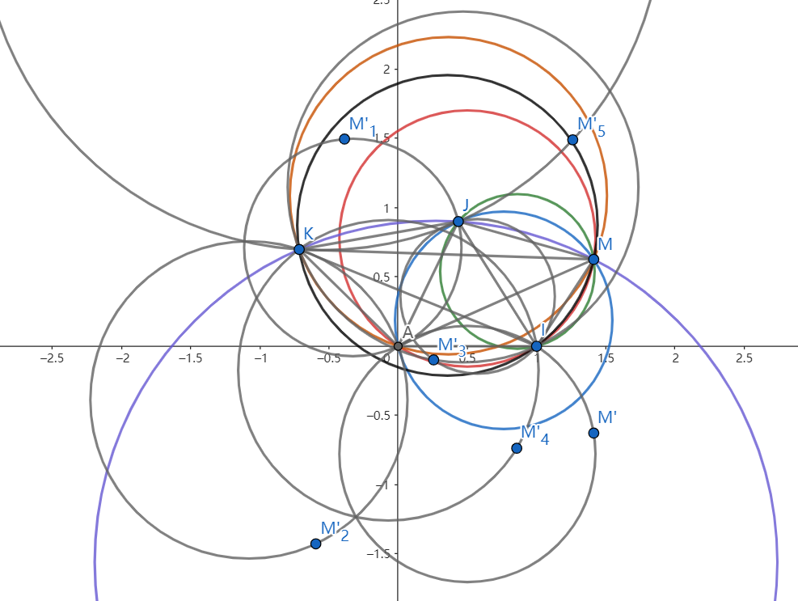

有色彩的圆只有一个唯一交点就是M,将M关于其他无人机与FY00的连线做轴对称,然后画出一系列灰色的圆,注意到这些灰色的圆没有一个统一的交点,图像中有六个圆相交的唯一点就是M,所以我们猜测,只需要再增加两架无人机,总共有四架发射信号的无人机,就能够唯一确定被探测无人机的方位,当然,前提是我们要知道圆的半径.

下面就是从代数的角度证明解的唯一性.如何证明???


### 第三小题

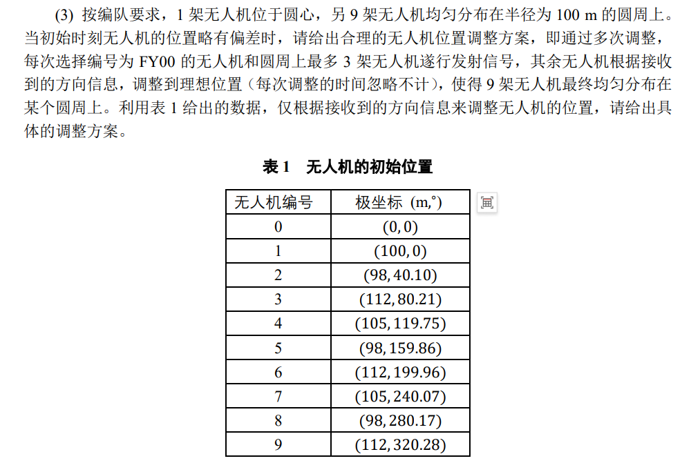

可以认为FY00无人机没有偏差,不需要调整,剩下需要调整的就只有9架无人机.

初始状态无人机的编号和位置已知,所以可以直接将角度调整到位,并且在之后的调整中不再调整角度,所以,只需要调整每个无人机的极径,我们不知道最后的半径是多少(不能确定最好的半径),也不知道每次发射信号的无人机是哪几架.

我的初步思路是基于粒子群算法的一个调整机制:在每一轮迭代开始的时候,根据不同粒子的坐标由最小二乘法拟合出一个最佳半径

$$
R^{(n)}=\frac{1}{9}\sum_{i=1}^9 \rho^{(n)}_i
$$


评估误差,误差最小的点适应度最好:

$$
(\rho-R)^2
$$

将误差$(\rho-R)^2$最小的两个无人机i和j作为发射信号用的无人机,将每个被探测无人机的坐标位置带入到方位角方程中:

首先,先进行坐标变换:

$$
\begin{cases} x=\rho\cos\theta, &  \\ y=\rho\sin\theta, &  \end{cases}
$$

然后就是方位角方程:

$$
\begin{aligned}
&\cos \alpha_{IO}=\frac{(x-x_i)x+(y-y_i)y}{\sqrt{x^2+y^2}\sqrt{(x-x_i)^2+(y-y_i)^2}} \\
&\cos \alpha_{JO}=\frac{(x-x_j)x+(y-y_j)y}{\sqrt{x^2+y^2}\sqrt{(x-x_j)^2+(y-y_j)^2}} \\
&\cos\alpha_{IJ}=\frac{(x-x_i)(x-x_j)+(y-y_i)(y-y_j)}{\sqrt{(x-x_i)^2+(y-y_i)^2}\sqrt{(x-x_j)^2+(y-y_j)^2}}
\end{aligned}
$$

由于可行解偏离圆并不多,所以往往只需要除圆心外的三个方程就能确定位置.

由于无人机的初始方位已知,如果我们确定了调整方案,那么每次调整的时候无人机的坐标都是已知的,根据方位角方程组是否被满足决定被探测的无人机坐标

如果某个无人机满足,那么就能定位这个无人机是几号无人机,下一步调整速度,设当前的速度是$v^{(n)}$,那么,更新后的速度为:

$$
v^{(n+1)}=\omega v^{(n)}+c_1p_1(\rho_{best}-\rho)+c_2p_2(\rho_{pbest}-\rho)
$$

更新极径:

$$
\rho^{(n+1)}=\rho^{(n)}+v^{(n)}
$$

探测波发射到所有的无人机后,结束本次迭代,更新最优半径重新评估适应度,进行下一轮迭代.

具体的流程如下:

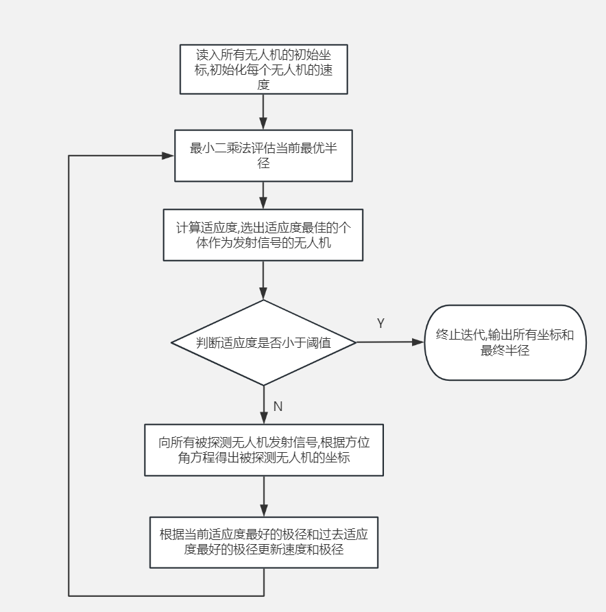

最后求解结果如图所示:

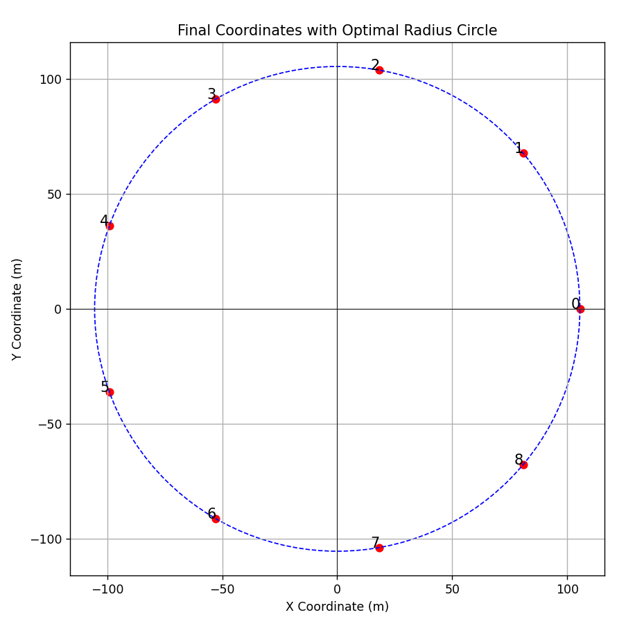

对应的最优半径和城市坐标为:

```
Optimal R: 105.4477473616003
坐标: 
[[105.44776532   0.        ]
 [105.44775709  40.        ]
 [105.44774885  80.        ]
 [105.44777713 120.        ]
 [105.44774888 160.        ]
 [105.44777061 200.        ]
 [105.44773813 240.        ]
 [105.44773191 280.        ]
 [105.44772551 320.        ]]
```

## 第二问

可以基于动态规划去调整无人机的相对位置,于是我们首先要指定两架无人机的位置是完全正确的,先将无人机按照行和列排序:

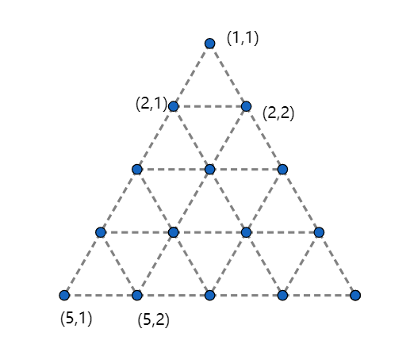

例如,在第一行第一个就记做(1,1),我们将坐标原点定义在(1,1),并且固定(2,1)的坐标,不妨将它的坐标设做$(-\frac{1}{2},-\frac{\sqrt{3}}{2})$

根据这两个固定点,其他点就可以根据递推关系不断调整自己的位置,一个点可以选择它周围发射信号的两个点,根据角度关系调整自己的相对直角坐标.

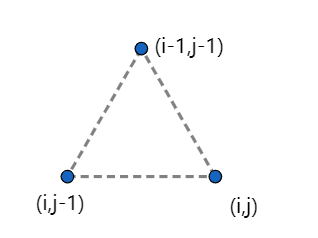

考虑这样一个小三角形,我们希望他满足最优条件,所以可以写出状态转移方程:

对于j=1:

$$
\begin{align*}
x(i, 1) &= x(i-1, 1) - \frac{1}{2} \\
y(i, 1) &= y(i-1, 1) - \frac{\sqrt{3}}{2}
\end{align*}
$$

对于j>1:

$$
\begin{align*}
x(i, j) &= x(i, j-1) + 1 \\
y(i, j) &= y(i, j-1)
\end{align*}
$$

以及初值条件:

$$
\begin{aligned}
&x(1,1)=0\\
&y(1,1)=0\\
&x(2,1)=-\frac{1}{2}\\
&y(2,1)=-\frac{\sqrt{3}}{2}
\end{aligned}
$$

所以最后得到运行结果:

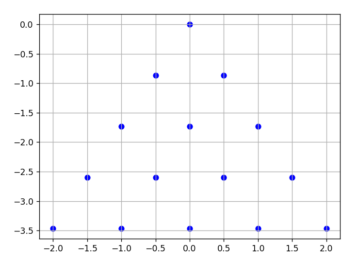

## 总结

这个题我没搞懂他的意思到底是什么,感觉我的做法明显很不符合题意,这种题目看的很清晰做的很模糊,而且做的也不是很漂亮,不如做这一年波浪能那个题,虽然分析难,但是思路很清晰.