# 2023国赛A题

每次看到A题都会害怕,因为信息太多了实在是不想做.....

## 第一小题

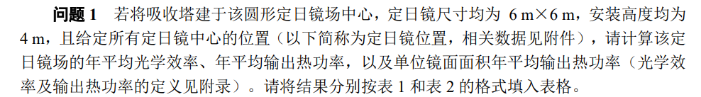

给出了所有定日镜的坐标,并且题目说,所有的定日镜都会随着太阳的转动而转动,只要使得所有的定日镜反射的光线始终指向集热器.

太阳射出的光线并不是平行光,由于太阳比地球要大得多,所以太阳射出的光线往往是带有一定锥角的锥形光线:(地球可以视作一个点,所以处处都是一样的平行锥形光线)

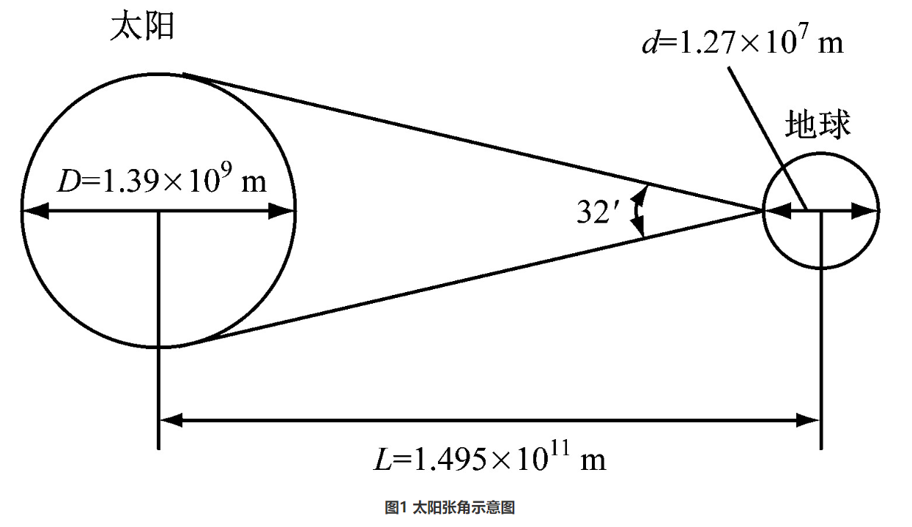

## 相关公式

1. 太阳高度角
   
$$
\sin \alpha_s = \cos \delta \cos \phi \cos \omega + \sin \delta \sin \phi
$$

1. 太阳方位角
   
$$
\cos \gamma_s = \frac{\sin \delta - \sin \alpha_s \sin \phi}{\cos \alpha_s \cos \phi}
$$

2. 太阳时角

$$
\omega = \frac{\pi}{12} \left(ST - 12\right)
$$

3. 太阳赤纬角
   
$$
\sin \delta = \sin \left(\frac{2\pi D}{365}\right) \sin \left(\frac{2\pi}{360} 23.45\right)
$$

4. 法向辐照强度

$$
\text{DNI} = G_0 \left[ a + b \exp \left( - \frac{c}{\sin \alpha_s} \right) \right]
$$

$$
\begin{aligned}
a = 0.4237 - 0.00821(6 - H)^2 \\
b = 0.5055 + 0.00595(6.5 - H)^2\\
c = 0.2711 + 0.01858(2.5 - H)^2
\end{aligned}
$$

5. 定日镜场输出的热功率

$$
E_{field} = \text{DNI} \cdot \sum_{i=1}^{N} A_i \eta_i
$$

6. 定日镜光学效率

$$
\eta = \eta_{sb} \eta_{\cos} \eta_{at} \eta_{trunc} \eta_{ref}
$$

## 模型假设

1. 定日镜的法向由反射光线决定,并且,一个定日镜由于其面积较小,我们认为其反射光线可以由定日镜中心的反射光线代表
2. 我们所有反射光线的聚焦点设置在集热器的中心位置,即绝对坐标(0,0,84)

### 余弦损失

为了让光线聚焦到集热器上,定日镜的法向和太阳光线锥的中心线往往是不平行的,会存在一定的夹角,所以定日镜不能直面太阳,即正对太阳的面积减小了,获取的能量相比于正对太阳会有一定的损失,这个损失被称作余弦损失.

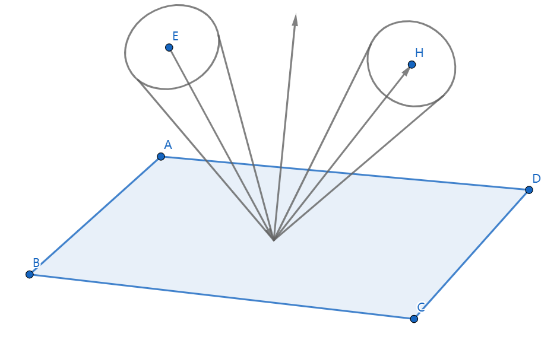


不妨设定日镜法向和入射光线的夹角为$\theta$,那么余弦效率就为:

$$
\eta_{\cos}=\cos\theta
$$

### 阴影遮挡损失

#### 集热塔阴影

首先,集热塔会在太阳光的照射下产生阴影,特别是在早晨和傍晚,这部分阴影会全部遮盖所有的定日镜,导致这部分定日镜全部失去工作能力

其次,定日镜之间会有相互的遮挡,一部分遮挡来源于前面定日镜对太阳光的直接遮挡,另一部分遮挡来源于后面定日镜的反射光线被前面的定日镜遮挡.

集热器中心离地面的高度是80m,集热器高8m,所以吸收塔的总高度为88m,吸收塔直径为7m,所以会随着太阳的移动在地面上透射出一个长度不断变化的长方形阴影.

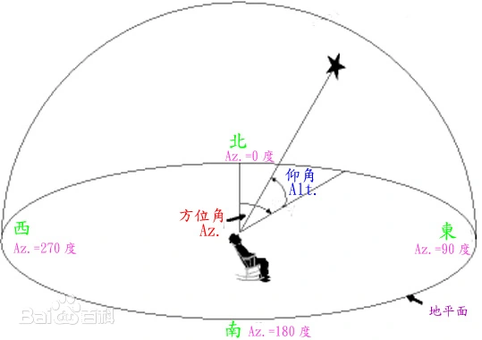

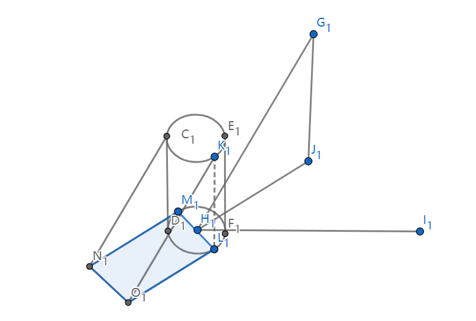

如图所示的阴影范围内,定日镜都不能工作,阴影遮挡效率为0,阴影遮挡损失为100%(这里做了一步简化,不考虑边界定日镜还有部分能反射的情况)

尝试写出数学形式,即写出这一块阴影部分的数学表达式:

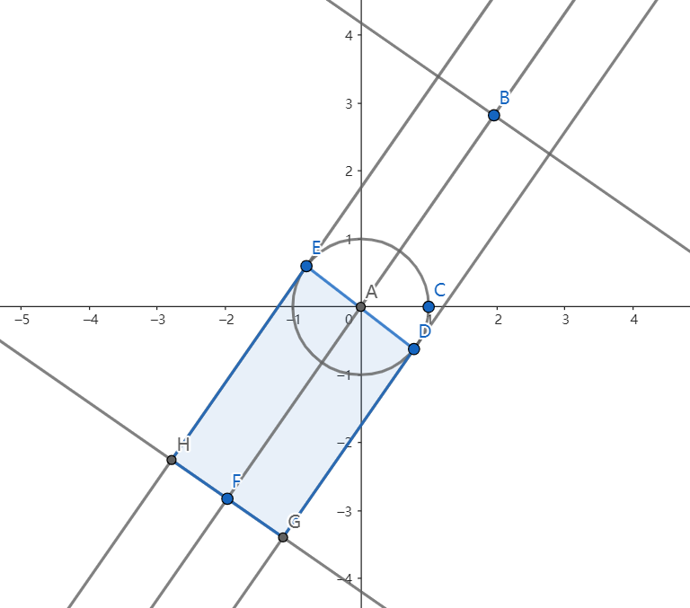

如图所示

太阳方位角即为中心直线与y轴的夹角$\gamma_s$,长为$l$,宽为$d$是吸收塔的半径.h为吸收塔的高度:

$$
l=\frac{h}{tan \alpha_s}
$$

阴影部分的区域可以描述为:

$$
\begin{cases}
y\le \tan(\pi-\gamma_s)x\\
y\ge \tan(\pi-\gamma_s)x-(\frac{d}{2}\sin\gamma_s+l\cos\gamma_s)\\
y\le tam(\frac{\pi}{2}-\gamma_s)x+\frac{d}{2\sin\gamma_s}\\
y\ge \tan(\frac{\pi}{2}-\gamma_s)x-\frac{d}{2\sin\gamma_s}
\end{cases}
$$

遍历所有定日镜的坐标,如果存在不满足上述约束的定日镜,再对这些定日镜进行定日镜阴影遮挡讨论.

#### 定日镜阴影

对于别的遮挡情况,事实上只要考虑两种情况.

1. 对于入射光线向量$(a,b,c)$和镜面上的一个反射点$(x_1,y_1)$(这是在1号镜子的坐标系中的入射点表示)相交,判断入射光线与另外一个镜面的平面相交的交点$(x_2,y_2)$(在镜面2坐标系中的表示)是否在镜面2范围内,如果是,这就是一个有效的入射遮挡.

2. 对于反射光线向量$(m,n,t)$,也和上面做相同的操作,判断反射光线是否被遮挡.

然而,一面镜子上有无数的点,我们不可能对每个点都展开讨论,这里采用蒙特卡洛模拟的方法,在镜面上均匀取较多的入射点,对任意一个入射点,先做入射光遮挡判别,如果遍历所有定日镜都没有被遮挡,那就对其进行反射光遮挡判别,还没有被遮挡的话就不予记录,反之,只要有任意一个环节被遮挡,判别就能终止,于是,某个定日镜的阴影遮挡效率可以表示为:

入射光被遮挡,权重+2,反射光被遮挡,权重+1

$$
\eta_{sb}=1-\frac{被遮挡的点的总权重}{2\times 总取点个数}
$$

算法流程:

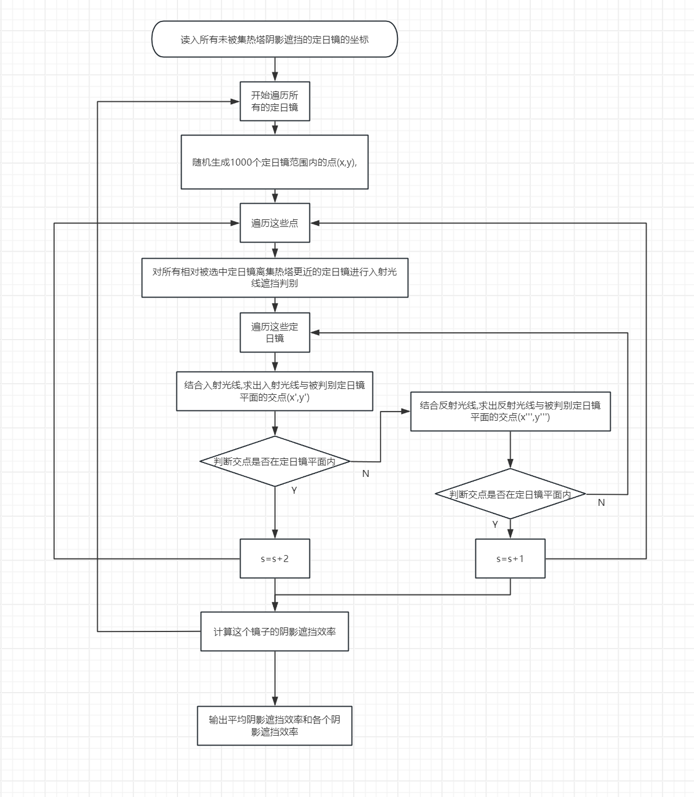

数学形式:

设镜面1坐标系中,反射点的坐标为$(x_1,y_1)$,地面坐标系中光线的a单位方向向量记做$V_0=(a,b,c)^T$,根据几何关系:

$$
\begin{cases} a=\cos\alpha_s\sin\gamma_s, &  \\y=\cos\alpha_s\cos\gamma_s , &\\c=\sin\alpha_s  \end{cases}
$$

根据坐标变换矩阵以及定日镜中心的位置,可以将镜面坐标中的$H_1=(x_1,y_1)^T$变换到地面坐标的$H_1'=(x_1',y_1')^T$,再变换一次到镜面2的坐标系中$H_1''=(x_1'',y_1'')^T$

其中坐标变换矩阵为:

$$
\begin{equation*}
T_A=
\begin{pmatrix}
-\sin E_A & -\sin A_A \cos E_A & \cos A_A \cos E_A \\
\cos E_A & -\sin A_A \sin E_A & \cos A_A\sin E_A \\
0 & \cos A_A & \sin A_A
\end{pmatrix}
\end{equation*}
$$

其中,E代表定日镜法向仰角,A代表方位角

如何得到定日镜的法向向量?鉴于法向位于入射光线和反射光线的角平分线上,所以只需要将入射光线的法向向量和出射光线的方向向量相加即可,设出射光线的单位方向向量(集热塔中心和定日镜中心的连线的单位向量)为:

$$
(m_A,n_A,t_A)^T
$$

所以定日镜的法向向量为:

$$
\vec{n}=(\alpha_A,\beta_A,\gamma_A)^T=(a+m_A,b+n_A,c+t_A)^T
$$

其方位角为:

$$
\begin{cases} E_A=\arctan \frac{\gamma_A}{\sqrt{\alpha_A^2+\beta_A^2}}, &  \\ A_A=\arctan\frac{\alpha_A}{\beta_A}, &  \end{cases}
$$

反射点在地面坐标系中的坐标为:

$$
\begin{equation*}
H'_1 = 
T_A
\cdot H_1 + O_A =
\begin{pmatrix}
x'_1 \\
y'_1 \\
z'_1
\end{pmatrix}
\end{equation*}
$$

在镜面2坐标系中的位置为:

$$
\begin{equation*}
H''_1 = 
T_B^T
\cdot (H'_1 - O_B) =
\begin{pmatrix}
x''_1 \\
y''_1 \\
z''_1
\end{pmatrix}
\end{equation*}
$$

光线在镜面2坐标系中的位置为:

$$
\begin{equation*}
\overrightarrow{V_H} = 
T_B^T
\cdot 
\begin{pmatrix}
a \\ b \\ c
\end{pmatrix} = 
\begin{pmatrix}
a' \\ b' \\ c'
\end{pmatrix}
\end{equation*}
$$

联立方程可以解得光线在镜2坐标系中的位置:

$$
\begin{cases}
\begin{array}{l}
\displaystyle x_2 = \frac{c'x''_1 - a'z''_1}{c'} \\
\displaystyle y_2 = \frac{c'y''_1 - b'z''_1}{c'}
\end{array}
\end{cases}
$$

然后判断点是否在镜面范围内:

$$
\begin{cases} -3\le x\le 3, &  \\ -3\le y\le 3, &  \end{cases}
$$

对反射光线做判断的时候,只需要把$a,b,c$换成$m,n,t$

### 溢出损失

传统的方法是使用蒙特卡洛光线追迹法,可以实现精确模拟,但是我觉得我的电脑可能算不动了,就参考了兰州交通大学的几篇硕士论文,非常奇葩的是,几篇论文里给出的公式竟然都不一样,我是对比参照了好几篇才猜测得到了下面这个看起来比较正确的公式,真无语.

HFLCAL 计算模型由 DLR(德国航空航天中心)提出，采用圆形高斯通量密度函数来计算吸热面上热流密度的分布。与常用的蒙特卡洛光线追迹法相比，HFLCAL 计算模型更为简单，计算速度更快(相同模拟条件下，其计算时间是蒙特卡洛光线追迹法的几百分之一)，同时其模拟精度也有一定的保障。

HFLCAL指出,被锥形光线照射的吸热面表面的能流密度为:

$$
q(x,y)=\frac{P_m}{2\pi\sigma^2}e^{-\frac{x^2+y^2}{2\sigma^2}}
$$

其中,坐标$(x,y)$是以吸热面上聚焦点为坐标原点的吸热面上其他点的坐标,$P_m$是这个定日镜提供的总功率,$\sigma$被称作有效偏差,由定日镜本身和定日镜的位置共同决定.

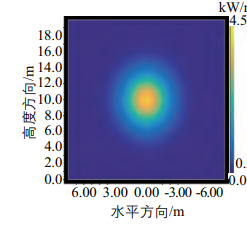

由于吸热平面本身长度和宽度优先,不能接受全部的能流,所以可以根据能流密度的表达式在吸热平面内进行积分,除以定日镜提供的总功率就是我们要求的溢出效率:

$$
\eta_{int}=\frac{1}{2\pi\sigma_{tot}^2}\iint_{D}\exp(-\frac{x^2+y^2}{2\sigma_{tot}^2})dxdy
$$

D是集热器表面吸热面的面积

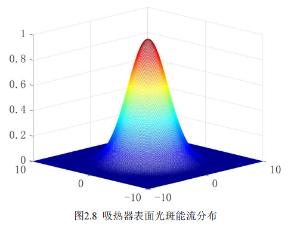

能流密度随着离聚焦中心距离的增大而逐渐减小,我们将集热器的受热面近似处理成一个长度为8m,宽度为7m的平面


参数$\sigma_{tot}$为集热器表面聚光光板的总标准差:

$$
\sigma_{tot}=\sqrt{\frac{d^2(\sigma^2_{sum}+\sigma^2_{bq}+\sigma^2_{ast}+\sigma^2_{track})}{\cos \delta}}
$$

$\cos\delta$是吸热面法线和反射光线的夹角,其余的标准差参数可以由下面的公式给出:

$$
\begin{align*}
\sigma^2_{bq} &= (2\sigma_s)^2 \\
\sigma_{ast} &= \frac{\sqrt{0.5\left( H_t^2 + W_s'^2 \right)}}{4d} \\
H_t &= \sqrt{LW \times LH} \left| \frac{d}{f} - \cos \omega \right| \\
W_s &= \sqrt{LW \times LH} \left| \frac{d}{f} \cos \omega - 1 \right|
\end{align*}
$$

$LW$和$LH$是定日镜的宽度和高度,$d$是反射距离,$f$是定日镜的轴向焦距,$\omega$是光线入射角.

其他的一些参数可以由实际测量给出,一般:

$$
\begin{cases} \sigma_{sum}=2.51mrad, &  \\ \sigma_{s}=0.94mrad, & \\
\sigma=0.63mrad\\
\end{cases}
$$


## 输出功率

至此可以计算所有的光学效率,定日镜场输出的热功率由以下公式给出:

$$
E_{\text{field}} = \text{DNI} \cdot \sum_{i}^{N} A_{i} \eta_{i}
$$

DNI为法向直接辐照强度,N为定日镜个数,$A_i$是第i面定日镜的采光面积,在第一小题中是36平方米.

对四个时间段的光学效率和输出功率做平均即可得到平均光学效率和平均输出功率.


## 结果

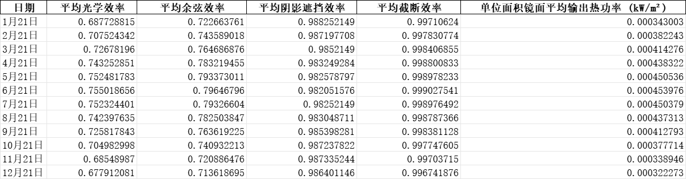

这个溢出效率应该偏高,阴影遮挡效率应该不太准确,每个定日镜我只用了10个点进行蒙特卡洛模拟,这都跑了五个小时,我实在是没办法了,后面两个题要调用第一题的程序求解,完蛋.


## 第二小题

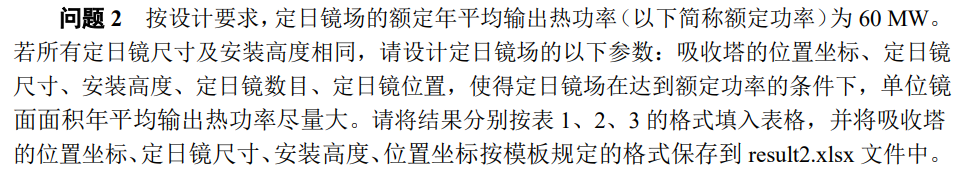

定日镜的安装高度和位置会改变各个效率,而阴影遮挡效率严重依赖于蒙特卡洛模拟,所以这个题应该不能够写成数学规划的形式,考虑使用一些启发式算法进行解决,特别是粒子群优化

限制条件为:

$$
E_{filed}\ge 60MW
$$

希望最大化的是:

$$
mean=E_{filed}/n
$$

变量为:

1. 吸收塔的位置坐标:

$$
(x_0,y_0,84)
$$

2. 定日镜的位置坐标,包括安装高度z,$i=1,2,\cdots,n$
   
$$
(x_i,y_i,z)
$$

3. 定日镜的尺寸$(x_{m},y_{m})$

4. 定日镜的数目$n$

由于涉及到定日镜的数目,而n又是出现在下标这个位置上,考虑给定一个初始的n,多次调用优化算法,如果不能满足最低能量需求,那么就增加定日镜个数,反之,如果能满足定日镜能量需求,则减少定日镜个数.

定义特征向量:

$$
X=
\begin{bmatrix}
    x_1,y_1\\
    x_2,y_2\\
    \vdots\\
    x_n,y_n
\end{bmatrix}
$$

所以,输入向量为:

$$
I=
\begin{bmatrix}         
x_0\\
y_0\\
X\\
z\\
x_m\\
y_m
\end{bmatrix}           
$$

可以调用第一题的程序去计算输出功率:

$$
E=f(I,n)
$$

给定一个比较大的n,求当前$E$的最大值,判断是否大于等于600MW,如果是,则继续减小n,直到小于600MW为止,输出临界的定日镜个数

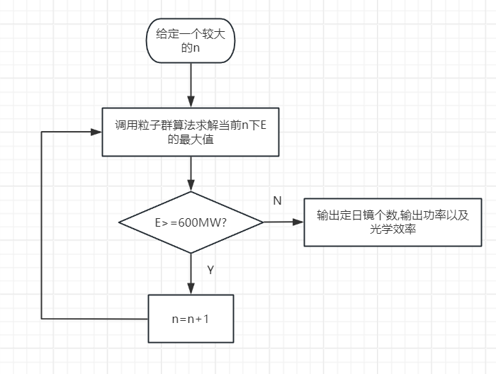

后来我才注意到,还存在几个约束,一个是定日镜的宽度不能超过两倍的定日镜高度,不然旋转的时候就有可能碰到底部,另一个是定日镜之间存在一定的距离约束,因为是粒子群优化,可操作性比较强,可以修改一下代价函数,即代码中的代价函数可以加入if-else语句,如果不满足约束,适应度直接return 0,但是数学规划中要实现这个就非常麻烦,这也算有失有得吧.

```python
def objective_function(x):
    global k
    # x 是一个包含所有粒子变量的矩阵，每一行是一个粒子，每一列是一个变量
    n_particles = x.shape[0]
    results = []
    
    for i in range(n_particles):
        # 对于每个粒子，提取对应的变量
        x0 = x[i, 0]
        y0 = x[i, 1]
        z = x[i, 2]
        x_m = x[i, 3]
        y_m = x[i, 4]
        X = x[i, 5:].reshape((k, 2))  # 重塑为 k*2 的矩阵

        if min(distance(X))<y0+5:
            result.append(0)
        elif y0>2*z:
            result.append(0)
        else:
           # 计算目标函数值，并取负数以进行最小化
           E_mean, _, _, _, _ ,_= E(x0, y0, X, z, x_m, y_m)
           results.append(-E_mean)  # 因为是最小化，取负值

    
    return np.array(results)  # 返回结果数组，每个粒子的目标函数值

```


## 第三小题

在第二问的基础上增加了变量.只需要把一维输入变量改写:

$$
\mathbf{z}=[z_1,z_2, \ldots ,z_n]^T
$$

$$
\begin{aligned}
\mathbf{x_m}=[x_m^1,x_m^2, \ldots ,x_m^n] \\
\mathbf{y_m}=[y_m^1,y_m^2, \ldots ,y_m^n]
\end{aligned}
$$

输入向量改写为:

$$
I=
\begin{bmatrix}         
x_0\\
y_0\\
X\\
\mathbf{z}\\
\mathbf{x_m}\\
\mathbf{y_m}
\end{bmatrix}           
$$

调用第二小题的计算程序即可.

## 总结

蒙特卡洛模拟的那一部分效率太低了,第一题就算不出来,我后来改成使用10个点进行模拟才勉强算出来,这直接导致后面两个题做不下去,我觉得方法是可行的,只是在阴影遮挡计算的实现上需要做一些优化.

还有就是,网上搜索的论文不一定可信,即使是硕士毕业论文也有可能存在明显的错误,不能盲目抄过来用,而且抄过来计算效果竟然也不是很准确.