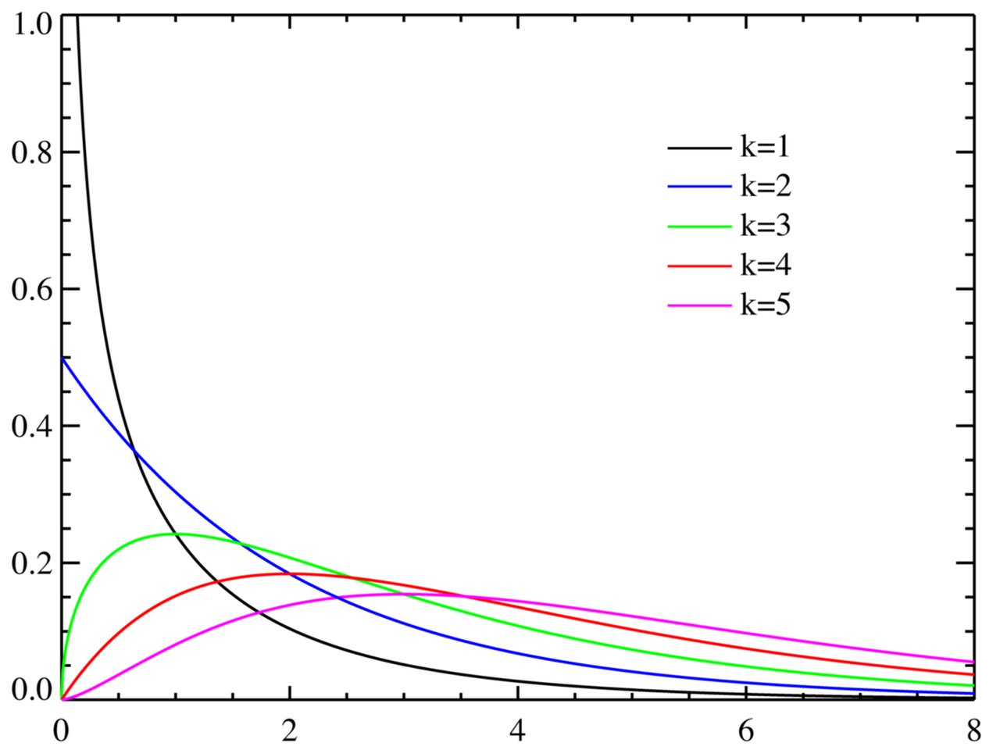
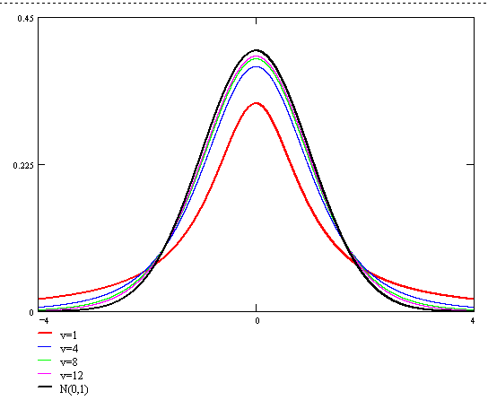
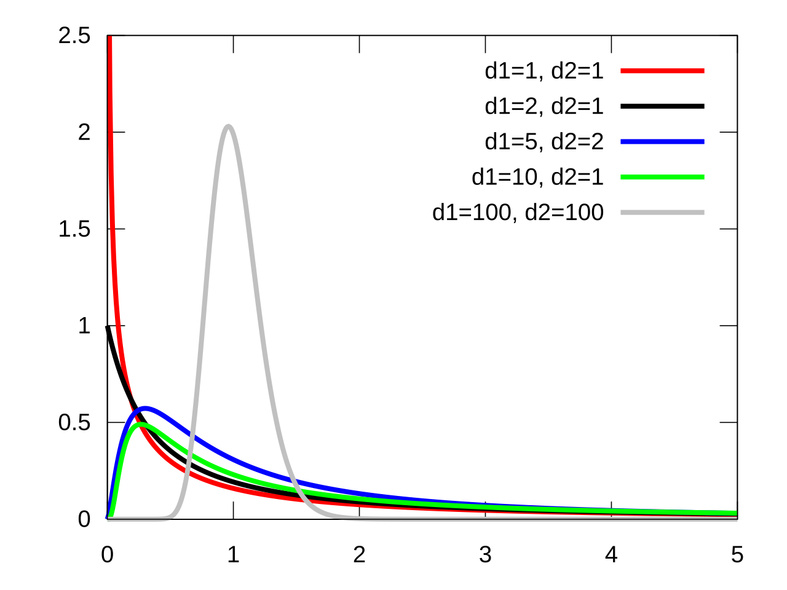

# 抽样分布

在确定了样本的前提下,我们的一切推断都是基于样本的数据进行的,所以,对样本信息的观察就是我们推断总体的唯一途径.

通过样本我们可以构造一个统计量$g(X_1,X_2, \ldots ,X_n)$,统计量也是一个随机变量,统计量的分布被称作抽样分布

## $\chi^2$分布

设 $X_1,X_2,...,X_n$ 为独立同分布，服从 $N(0,1)$。则称

$$\chi_{n}^{2}=\sum\limits_{i=1}^{n}X_i^2$$

服从自由度为 $n$ 的 $\chi^2$ 分布，记 $\chi_{n}^{2}\sim \chi^2(n)$。

概率密度函数:

$$
f_{\chi^2}(x)=
\left\{
\begin{aligned}
&\frac{1}{2^\frac{n}{2}\Gamma(\frac{n}{2})}x^{\frac{n}{2}-1}e^{-\frac{x}{2}},&x>0,
\\
&0,&\text{else},
\end{aligned}
\right.
$$

- 均值:$E(\chi^2)=n$
- 方差:$D(\chi^2)=2n$

## t分布

设 $X\sim N(0,1)$，$Y\sim \chi^2(n)$，且 $X,Y$ 相互独立，则称随机变量 

$$T=\frac{X}{\sqrt{Y/n}}$$

服从自由度为 $n$ 的 $t$ 分布，记做 $T\sim t(n)$。

$t$ 分布的密度函数:

$$
f_t(x)=\frac{\Gamma[(n+1)/2]}{\sqrt{\pi n}\Gamma(\frac{n}{2})}(1+\frac{x^2}{n})^{-\frac{n+1}{2}},\;\;-\infty<x<+\infty
$$

其中 $\Gamma(\alpha)=\int_0^{+\infty}t^{\alpha-1}e^{-t}\mathrm{d}t$，$\Gamma(\alpha+1)=\alpha\Gamma(\alpha)=\alpha!(if\;\alpha\in\mathbb{Z})$，$\Gamma(0.5)=\sqrt{\pi}$。

## F分布

设 $U\sim\chi^2(n_1)$，$V\sim \chi^2(n_2)$，且 $U,V$ 相互独立，则称随机变量 

$$F=\frac{U/n_1}{V/n_2}$$ 

服从自由度为 $(n_1,n_2)$ 的 $F$ 分布，记 $F\sim F(n_1,n_2)$。

$F$ 分布的密度函数:

$$
f_F(x)=\frac{
\Gamma(\frac{n_1+n_2}{2})(\frac{n_1}{n_2})^{n_1/2}x^{(n_1/2)-1}
}{
\Gamma(\frac{n_1}{2})\Gamma[\frac{n_2}{2}](1+(n_1x/2))^{(n_1+n_2)/2}
},\;\;x>0
$$

