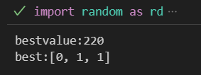
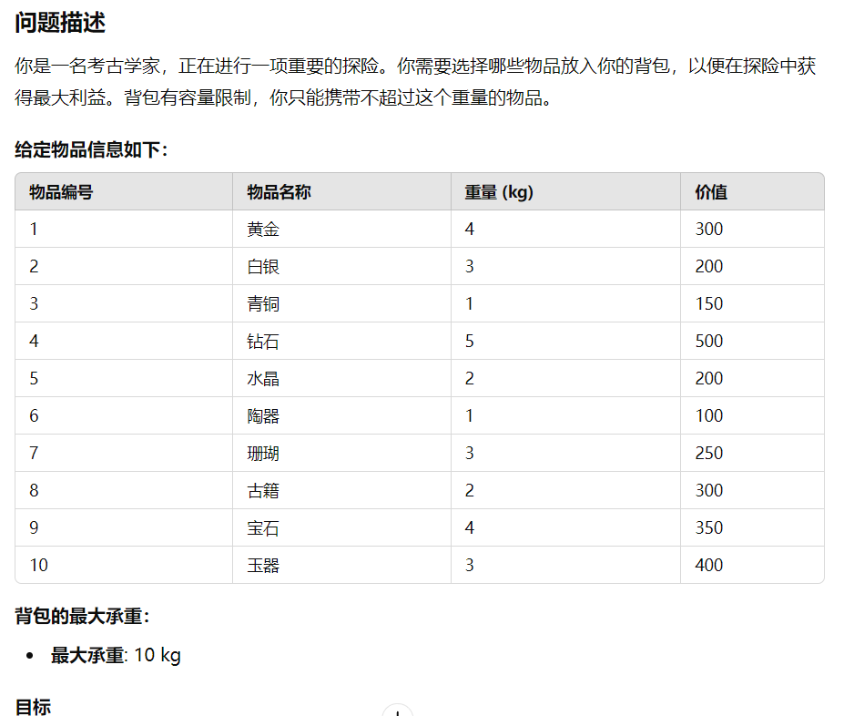
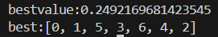
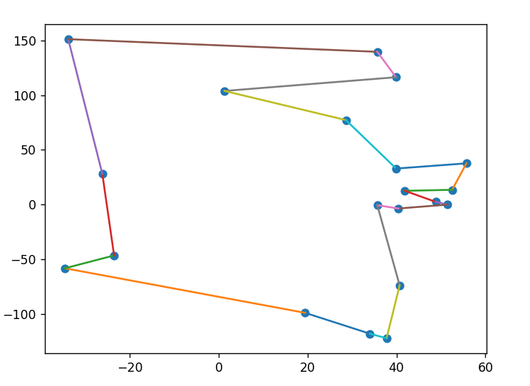
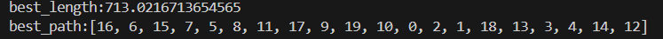

# 智能优化算法实例

常见的智能优化算法在python库中均有封装,其代码也进行了优化,我要使用这个算法的时候肯定也是去调用库,而不是自己写一个,本文档尝试手搓一些智能优化算法应用于经典的优化问题，以提高笔者的熟练度

这里先给出调用库使用的代码

## 调库代码

### 粒子群优化

具体的代价函数,维度,粒子个数,因子系数根据实际问题设定

```python
# 导入必要的库
import numpy as np
import matplotlib.pyplot as plt
from pyswarms.single import GlobalBestPSO
from pyswarms.utils.plotters import plot_cost_history

# 1. 定义目标函数
def rosenbrock(x):
    """
    Rosenbrock函数（目标函数）定义。
    输入: x, 形状为 (n_particles, dimensions) 的 numpy 数组
    输出: 返回每个粒子的目标函数值，形状为 (n_particles,)
    """
    return .....

# 2. 设置PSO参数
options = {
    'c1': 0.5,  # 认知参数（个人学习因子）
    'c2': 0.3,  # 社会参数（群体学习因子）
    'w': 0.9    # 惯性权重（控制粒子速度）
}

# 3. 初始化粒子群优化器
dimensions = 2  # 粒子的维度（例如，2维优化问题）
bounds = (-5 * np.ones(dimensions), 5 * np.ones(dimensions))  # 位置的边界
optimizer = GlobalBestPSO(n_particles=30, dimensions=dimensions, options=options, bounds=bounds)

# 4. 运行优化器
cost, pos = optimizer.optimize(rosenbrock, iters=100)

# 5. 输出结果
print(f"最佳解的位置: {pos}")
print(f"最小化的目标函数值: {cost}")

# 6. 可视化优化过程
plot_cost_history(cost_history=optimizer.cost_history)
plt.title('粒子群优化的目标函数值变化曲线')
plt.xlabel('迭代次数')
plt.ylabel('目标函数值')
plt.show()


```

### 遗传算法

```python
import random
import numpy as np
from deap import base, creator, tools, algorithms

# 1. 定义目标函数（适应度函数）
def rastrigin(individual):
    """
    Rastrigin函数：测试优化算法的非线性函数
    输入: individual, 一个代表解的列表（个体）
    输出: 适应度值（Rastrigin函数值的负值，因为DEAP默认求最大值）
    """
    A = 10
    n = len(individual)
    return A * n + sum([(x**2 - A * np.cos(2 * np.pi * x)) for x in individual]),

# 2. 设置遗传算法参数

# 定义最大化适应度为目标的单目标优化问题
creator.create("FitnessMin", base.Fitness, weights=(-1.0,))
creator.create("Individual", list, fitness=creator.FitnessMin)

# 初始化工具箱
toolbox = base.Toolbox()
toolbox.register("attribute", random.uniform, -5.12, 5.12)  # 个体特征的初始化范围
toolbox.register("individual", tools.initRepeat, creator.Individual, toolbox.attribute, n=2)  # 个体初始化
toolbox.register("population", tools.initRepeat, list, toolbox.individual)  # 种群初始化

toolbox.register("mate", tools.cxBlend, alpha=0.5)  # 交叉操作
toolbox.register("mutate", tools.mutGaussian, mu=0, sigma=1, indpb=0.2)  # 变异操作
toolbox.register("select", tools.selTournament, tournsize=3)  # 选择操作
toolbox.register("evaluate", rastrigin)  # 评估函数

# 3. 运行遗传算法
def main():
    # 设置随机数种子
    random.seed(42)

    # 初始化种群
    population = toolbox.population(n=100)  # 种群数量

    # 记录统计信息
    stats = tools.Statistics(lambda ind: ind.fitness.values)
    stats.register("avg", np.mean)
    stats.register("std", np.std)
    stats.register("min", np.min)
    stats.register("max", np.max)

    # 运行遗传算法
    population, logbook = algorithms.eaSimple(
        population, toolbox, cxpb=0.5, mutpb=0.2, ngen=50, stats=stats, verbose=True
    )

    # 输出最佳解
    best_individual = tools.selBest(population, 1)[0]
    print(f"最佳个体: {best_individual}, 最佳适应度值: {best_individual.fitness.values[0]}")

    # 返回日志记录和最佳个体
    return logbook, best_individual

# 4. 执行主函数
if __name__ == "__main__":
    logbook, best_individual = main()

# 5. 可视化优化过程
import matplotlib.pyplot as plt

gen = logbook.select("gen")
fit_min = logbook.select("min")

plt.plot(gen, fit_min, label="最小适应度值")
plt.xlabel("世代数")
plt.ylabel("适应度值")
plt.title("遗传算法优化过程")
plt.legend()
plt.grid()
plt.show()

```

### 模拟退火算法

```python
import numpy as np
import matplotlib.pyplot as plt
from scipy.optimize import basinhopping

# 定义目标函数
def rastrigin(x):
    A = 10
    return A * len(x) + sum([(xi**2 - A * np.cos(2 * np.pi * xi)) for xi in x])

# 初始解
x0 = np.array([5.0, 5.0])  # 任意初始点

# 定义模拟退火的“跳跃”步长
minimizer_kwargs = {"method": "L-BFGS-B"}

# 运行模拟退火算法
result = basinhopping(rastrigin, x0, minimizer_kwargs=minimizer_kwargs, niter=200)

# 输出结果
print("最佳解的位置:", result.x)
print("最小化的目标函数值:", result.fun)

# 绘制目标函数和最佳解
x = np.linspace(-5.12, 5.12, 400)
y = np.linspace(-5.12, 5.12, 400)
X, Y = np.meshgrid(x, y)
Z = rastrigin([X, Y])

plt.figure(figsize=(8, 6))
plt.contour(X, Y, Z, levels=np.logspace(0, 5, 35), cmap='viridis')
plt.plot(result.x[0], result.x[1], 'r*', markersize=15)
plt.title("Rastrigin Function with Simulated Annealing Solution")
plt.colorbar()
plt.show()

```

### 贝叶斯优化

机器学习中超参数调优使用的一种算法,运行速度快,特别高效.

```python
import optuna
import numpy as np

# 定义目标函数（Rosenbrock函数）
def objective(trial):
    # 定义超参数的搜索空间
    x = trial.suggest_uniform('x', -5.0, 5.0)  # 定义变量x的搜索范围
    y = trial.suggest_uniform('y', -5.0, 5.0)  # 定义变量y的搜索范围
    
    # 计算目标函数值（Rosenbrock函数）
    return ...

# 创建一个优化器（study），默认使用TPE算法（贝叶斯优化的一种）
study = optuna.create_study(direction='minimize')  # 指定最小化目标
study.optimize(objective, n_trials=50)  # 进行优化，指定最大迭代次数为50

# 输出最佳结果
print(f"最佳解的位置: {study.best_params}")
print(f"最小化的目标函数值: {study.best_value}")

# 可视化优化历史
optuna.visualization.plot_optimization_history(study).show()

# 可视化参数重要性（需要安装 optuna[plotly] 才能使用）
optuna.visualization.plot_param_importances(study).show()

```

## 手搓的代码

### 遗传算法实例


#### 背包问题

让GPT生成了一个例子，我们现在尝试用遗传算法来求解这个问题,虽然有点高射炮打蚊子，但是可以练练手。


```python

import random as rd

#先定义种群规模
N=100

#定义进化代数
n=0

zhongqun=[]

best_value=0
best=[]

for i in range(N):
    t=[]
    for i in range(3):
        t.append(rd.randint(0,1))
    zhongqun.append(t)

while True:
    #评价适应度
    #定义一个适应度数组
    value=[i for i in range(N)]
    for i in range(N):
        u=10*zhongqun[i][0]+20*zhongqun[i][1]+30*zhongqun[i][2]
        v=60*zhongqun[i][0]+100*zhongqun[i][1]+120*zhongqun[i][2]
        

        #淘汰掉生成的不合理个体
        if(u>50):
            value[i]=0
        else:
            value[i]=v
    

    #选择适应度最高的进行存储：
    best_value=max(value)
    best=zhongqun[value.index(best_value)]

    #设定概率：
    p=[value[i]/sum(value) for i in range(N)]

    #定义交配空间J
    J=[]


    i=0
    while True:
        if rd.random()<p[i]:
            J.append(zhongqun[i])
        if len(J)==N:
            break
        i += 1
        if i==N:
            i=0
    
    #设定交配概率
    p_0=0.85
    #定义一个交配数组J_0
    J_0=[]
    yubeizhongqun=[]

    for i in range(N):
        if rd.random()<p_0:
            J_0.append(J[i])
        else:
            yubeizhongqun.append(J[i])
    
    #然后再配对
    if len(J_0)==1 or len(J_0)==0:
        yubeizhongqun=J
    else:
        
        #单点配对交配
        i=0
        while(i<len(J_0)-1):
            k=rd.randint(0,2)
            J_0[i],J_0[i+1]=J_0[i][0:k]+J_0[i+1][k:],J_0[i+1][0:k]+J_0[i][k:]
            i=i+2
        
        yubeizhongqun +=J_0

        #变异，定义变异概率

        p_b=0.1

        for ele in yubeizhongqun:
            if rd.random()<p_b:
                k=rd.randint(0,2)
                ele[k]=1-ele[k]
        
        zhongqun=yubeizhongqun
        n=n+1

        if n>=100:
            break

print(f'bestvalue:{best_value:}')
print(f'best:{best:}')
        
            
        
```

运行结果为：



与预期结果一致，在运算过程中也发现，如果种群数目太少，可能迭代很多次都还没有收敛，如果种群数目太大，那么占据的计算资源过多，导致运算缓慢

下面是一个稍微复杂一点的例子：



我们只需要稍微修改一下代码：

```python

import random as rd

#先定义种群规模
N=100

#定义进化代数
n=0

zhongqun=[]

best_value=0
best=[]

weight=[4,3,1,5,2,1,3,2,4,3]
value_0=[300,200,150,500,200,100,250,300,350,400]

for i in range(N):
    t=[]
    for i in range(10):
        t.append(rd.randint(0,1))
    zhongqun.append(t)

while True:
    #评价适应度
    #定义一个适应度数组
    value=[i for i in range(N)]

    for i in range(N):
        u=sum([weight[j]*zhongqun[i][j] for j in range(10)])
        v=sum([value_0[j]*zhongqun[i][j] for j in range(10)])
        

        #淘汰掉生成的不合理个体
        if(u>10):
            value[i]=0
        else:
            value[i]=v
    

    #选择适应度最高的进行存储：
    best_value=max(value)
    best=zhongqun[value.index(best_value)]

    #设定概率：
    p=[value[i]/sum(value) for i in range(N)]

    #定义交配空间J
    J=[]


    i=0
    while True:
        if rd.random()<p[i]:
            J.append(zhongqun[i])
        if len(J)==N:
            break
        i += 1
        if i==N:
            i=0
    
    #设定交配概率
    p_0=0.85
    #定义一个交配数组J_0
    J_0=[]
    yubeizhongqun=[]

    for i in range(N):
        if rd.random()<p_0:
            J_0.append(J[i])
        else:
            yubeizhongqun.append(J[i])
    
    #然后再配对
    if len(J_0)==1 or len(J_0)==0:
        yubeizhongqun=J
    else:
        
        #单点配对交配
        i=0
        while(i<len(J_0)-1):
            k=rd.randint(0,9)
            J_0[i],J_0[i+1]=J_0[i][0:k]+J_0[i+1][k:],J_0[i+1][0:k]+J_0[i][k:]
            i=i+2
        
        yubeizhongqun +=J_0

        #变异，定义变异概率

        p_b=0.1

        for ele in yubeizhongqun:
            if rd.random()<p_b:
                k=rd.randint(0,9)
                ele[k]=1-ele[k]
        
        zhongqun=yubeizhongqun
        n=n+1

        if n>=100:
            break

print(f'bestvalue:{best_value:}')
print(f'best:{best:}')
        
            
 
```
得到的运行结果是：


完全正确！

#### TSP问题

依旧是用GPT生成的题目


代码如下所示：

```python

import random as rd
from math import sqrt,exp

import matplotlib.pyplot as plt

#定义一个距离函数
def distance(i,j):
    dis=sqrt((zuobiao[i][0]-zuobiao[j][0])**2+(zuobiao[i][1]-zuobiao[j][1])**2)
    return dis

#先定义种群规模
N=500

#定义进化代数
n=0

zhongqun=[]

best_value=0
best=[]

#给定所有的城市坐标
zuobiao=[
    [0,0],[3,7],[5,1],[10,6],[7,2],[4,8],[9,3]
]

#生成种群
for i in range(N):
    t=[0]  #注意必须从0出发
    for i in range(6):
        t.append(rd.randint(1,6))
    zhongqun.append(t)

while True:
    #评价适应度
    #定义一个适应度数组,和种群规模一致
    value=[i for i in range(N)]

    for i in range(N):
        s=0
        for j in range(6):
            s=s+distance(zhongqun[i][j],zhongqun[i][j+1])
        s=s+distance(0,zhongqun[i][6])
        
    
        #评价函数需要修改，还要增加走过的城市数目,增加了一个修正项
        num=len(set(zhongqun[i]))
        value[i]=num/s


    #选择适应度最高的进行存储：
    best_value=max(value)
    best=zhongqun[value.index(best_value)]

    #设定概率：
    p=[value[i]/sum(value) for i in range(N)]

    #定义交配空间J
    J=[]


    i=0
    while True:
        if rd.random()<p[i]:
            J.append(zhongqun[i])
        if len(J)==N:
            break
        i += 1
        if i==N-1:
            i=0
    
    #设定交配概率
    p_0=0.9
    #定义一个交配数组J_0
    J_0=[]
    yubeizhongqun=[]

    for i in range(N):
        if rd.random()<p_0:
            J_0.append(J[i])
        else:
            yubeizhongqun.append(J[i])
    
    #然后再配对
    if len(J_0)==1 or len(J_0)==0:
        yubeizhongqun=J
    else:
        
        #单点配对交配
        i=0
        while(i<len(J_0)-1):
            k=rd.randint(1,6)
            J_0[i],J_0[i+1]=J_0[i][0:k]+J_0[i+1][k:],J_0[i+1][0:k]+J_0[i][k:]
            i=i+2
        
        yubeizhongqun +=J_0

        #变异，定义变异概率

        p_b=0.1

        for ele in yubeizhongqun:
            if rd.random()<p_b:
                k=rd.randint(1,6)
                ele[k]=rd.randint(1,6)
        
        zhongqun=yubeizhongqun
        n=n+1

        if n>=3000:
            break

print(f'bestvalue:{best_value:}')
print(f'best:{best:}')

plt.figure(1)

x=[zuobiao[i][0] for i in range(7)]
y=[zuobiao[i][1] for i in range(7)]

plt.scatter(x,y)

for i in range(6):
    plt.plot(
        [zuobiao[best[i]][0], zuobiao[best[i+1]][0]],  # X 坐标
        [zuobiao[best[i]][1], zuobiao[best[i+1]][1]]   # Y 坐标
    )
    
# 最后一条线段，从最后一个城市回到第一个城市
plt.plot(
    [zuobiao[best[6]][0], zuobiao[best[0]][0]],  # X 坐标
    [zuobiao[best[6]][1], zuobiao[best[0]][1]]   # Y 坐标
)

plt.show()
            
         
```

运行结果为：



航行轨迹为：


非常完美，美中不足的是算的太慢了。


### 禁忌搜索算法实例

#### TSP问题

##### 邻域变换

首先我们考虑邻域变换的形式，对于任意的一个路径：

$$
j_1,j_2, \ldots ,j_i, \ldots ,j_k, \ldots ,j_n 
$$

任选其中的两个元素$j_i$和$j_k$，将他们互换顺序，得到：

$$
j_1,j_2, \ldots ,j_k, \ldots ,j_i, \ldots ,j_n 
$$

这样，最少会得到$n(n+1)/2$个邻居（因为有可能有重复的），当城市数目比较多的时候，所得到的邻域会非常大，所以我们在里面挑选50个作为我们的候选集合

##### 禁忌表和禁忌期限

禁忌表的长度通常按照城市数目的25%左右来确定，禁忌期限通常选用：

$$
t=[\sqrt{\frac{N(N+1)}{2}}]
$$

为邻居数目的开根号。同时，我们对以上禁忌期限进行一定的改进，让禁忌期限在迭代次数较小的时候比较小，这样能有利于扩大搜索空间，在迭代次数较大的时候比较大，这样能有利于他收敛到全局最优解：

$$
t=[\sqrt{\frac{N(N+1)}{2}}\exp(a\frac{n}{n_{\max}})]
$$

其中a是参数，可以根据效果进行调整

##### 特设准则


关于特赦准则，我们采取简化的策略，当禁忌表满了的时候，把最早加入禁忌表的元素踢出去，然后在禁忌表的末尾加入元素。

下面让GPT生成一个问题，准备开始写代码吧


```python
import random as rd
from math import sqrt,exp

import matplotlib.pyplot as plt

# 城市坐标列表
zuobiao = [
    (34.05, -118.25),
    (40.71, -74.01),
    (37.77, -122.42),
    (51.51, -0.13),
    (48.85, 2.35),
    (35.68, 139.65),
    (55.75, 37.62),
    (39.90, 116.40),
    (-33.87, 151.21),
    (-23.55, -46.63),
    (19.43, -99.13),
    (1.29, 103.85),
    (41.89, 12.49),
    (40.42, -3.70),
    (52.52, 13.40),
    (28.61, 77.21),
    (39.92, 32.85),
    (-26.20, 28.04),
    (35.68, -0.63),
    (-34.61, -58.38)
]

#定义一个距离函数
def distance(i,j):
    dis=sqrt((zuobiao[i][0]-zuobiao[j][0])**2+(zuobiao[i][1]-zuobiao[j][1])**2)
    return dis

#定义一个总长函数
def length(ele):
    l=0
    for i in range(len(ele)-1):
        l += distance(ele[i],ele[i+1])
    l += distance(ele[len(ele)-1],0)
    return l

#定义一个禁忌表table

table=[]

table_time=[]

#产生一个可行解，这里采用每次的局部最小，现在啥也没有，就是按照顺序的解

best_path=[i for i in range(20)]
best=length(best_path)

#定义迭代次数
n=0

max_n=1000

#定义禁忌期限

time=int(sqrt(19*(19-1)/2)*exp(n/max_n)/100)


while(n<max_n):

    #定义候选集合和候选字典

    houxuan=[]
    
    houxuan_dict={}

    #使用邻域变换生产候选集合

    value=[]


    while len(houxuan)<50:
        i=rd.randint(1,19)
        j=rd.randint(1,19)

        if i!=j and (i,j) not in table and (i,j) not in list(houxuan_dict.values()):

            ele=best_path[:]

            ele[i],ele[j]=ele[j],ele[i]

            houxuan.append(ele)

            value.append(length(ele))

            houxuan_dict[length(ele)]=(i,j)

    
        
        else:
            continue
        
    if(min(value)<best):

        best=min(value)

        best_path=houxuan[value.index(min(value))]

    #在禁忌表中添加元素

    if len(table) <= 9:
        table.append(houxuan_dict[min(value)][:])
        table_time.append(time)
    else:
        #特赦准则，如果禁忌表已经满了，就把最前面的那个踢出去
        table_time.pop(0)
        table.pop(0)
        table.append(houxuan_dict[min(value)][:])
        table_time.append(time)

    #减小禁忌时间
    # 使用索引倒序删除元素以避免遍历和删除冲突
    for i in range(len(table_time) - 1, -1, -1):
        table_time[i] -= 1
        if table_time[i] == 0:
            table_time.pop(i)
            table.pop(i)
            
    
    n=n+1

print(f'best{best:}')

print(f'best_path{best_path:}')

plt.figure(1)

x=[zuobiao[i][0] for i in range(20)]
y=[zuobiao[i][1] for i in range(20)]

plt.scatter(x,y)

for i in range(19):
    plt.plot(
        [zuobiao[best_path[i]][0], zuobiao[best_path[i+1]][0]],  # X 坐标
        [zuobiao[best_path[i]][1], zuobiao[best_path[i+1]][1]]   # Y 坐标
    )
    
# 最后一条线段，从最后一个城市回到第一个城市
plt.plot(
    [zuobiao[best_path[19]][0], zuobiao[best_path[0]][0]],  # X 坐标
    [zuobiao[best_path[19]][1], zuobiao[best_path[0]][1]]   # Y 坐标
)

plt.show()


```

运行效果不是很理想，可能我设计的也不是很好，导致每一次的输出都不太稳定，下面这个比较优的运行结果已经是多次运行后一个较好的结果了：





### 蚁群算法实例

#### TSP

具体的流程已经在组合优化当中叙述过了，下面直接给出代码。

```python
import random as rd

from math import sqrt
import matplotlib.pyplot as plt

#定义蚂蚁个数

m=10

#给出城市坐标
zuobiao = [
    (34.05, -118.25),
    (40.71, -74.01),
    (37.77, -122.42),
    (51.51, -0.13),
    (48.85, 2.35),
    (35.68, 139.65),
    (55.75, 37.62),
    (39.90, 116.40),
    (-33.87, 151.21),
    (-23.55, -46.63),
    (19.43, -99.13),
    (1.29, 103.85),
    (41.89, 12.49),
    (40.42, -3.70),
    (52.52, 13.40),
    (28.61, 77.21),
    (39.92, 32.85),
    (-26.20, 28.04),
    (35.68, -0.63),
    (-34.61, -58.38)
]


#定义距离函数和总长函数

def distance(i:int,j:int):
    dis=sqrt((zuobiao[i][0]-zuobiao[j][0])**2+(zuobiao[i][1]-zuobiao[j][1])**2)
    return dis

def length(a:list):
    l=0
    for i in range(len(a)-1):
        l=l+distance(a[i],a[i+1])
    l=l+distance(a[-1],a[0])
    return l


#定义迭代次数和最大迭代次数

n=0
max_n=1000

#定义最短路径和最短路径长度

best_length=1000000000000
best_path=[]

#定义信息素浓度字典,初始化信息素，随便一个常数
tau={}

for i in range(20):
    for j in range(20):
        if i!=j:
            tau[(i,j)]=1


#定义蒸发率
r=0.1
#蒸发率

#定义概率参数
a=1
b=2
#b是启发参数，通常要大一点，a和b应该都要大于1，之前两个都设置小于1算法不收敛


while n<max_n:
    #定义所有蚂蚁的路径列表：

    ant_list_sum=[]

    #定义所有蚂蚁的边集的集合
    slide=[]

    for num_of_ant in range(m):
        #定义出发地点和路径列表
        t=rd.randint(0,19)
        path=[]
        path.append(t)


        while(len(path)<20):

            #定义一个转移概率字典，来决定蚂蚁的下一步决策
            p={}

            for j in range(20):
                if j not in path:
                    s=tau[(t,j)]**a*(1/distance(t,j))**b/(sum([tau[(t,k)]**a*(1/distance(t,k))**b for k in range(20) if k not in path]))
                    p[j]=s
            
            
            #用轮盘赌选法选取蚂蚁前往的下一个城市
            p_0=rd.random()

            # 我们把数轴按照概率进行划分
            cumulative_prob = 0.0
            for city, prob in p.items():
                cumulative_prob += prob
                if cumulative_prob >= p_0:
                    t = city
                    break
            
            path.append(t)
        
        #把这只蚂蚁加到路径集合当中去
        ant_list_sum.append(path)
        #定义一个k号蚂蚁的边集
        slide_k=[]
        for i in range(len(path)-1):
            slide_k.append((path[i],path[i+1]))
        slide_k.append((path[-1],path[0]))

        #把它加入到总边集合中去
        slide.append(slide_k)

    
    #所有的蚂蚁都跑了一边，现在更新信息素
    for i in range(20):
        for j in range(20):
            if i!=j:
                s=0
                for x in range(len(ant_list_sum)):
                    if (i,j) in slide[x] or (j,i) in slide[x]:
                        s=s+1/length(ant_list_sum[x])
                tau[(i,j)]=(1-r)*tau[(i,j)]+s
    
    n=n+1
    
    
    if min([length(path) for path in ant_list_sum])<best_length:
        best_length=min([length(path) for path in ant_list_sum])
        
        for path in ant_list_sum:
            if(length(path)==min([length(path) for path in ant_list_sum])):
                best_path=path[:]

print(f'best_length:{best_length:}')
print(f'best_path:{best_path:}')

plt.figure(1)

x=[zuobiao[i][0] for i in range(20)]
y=[zuobiao[i][1] for i in range(20)]

plt.scatter(x,y)

for i in range(19):
    plt.plot(
        [zuobiao[best_path[i]][0], zuobiao[best_path[i+1]][0]],  # X 坐标
        [zuobiao[best_path[i]][1], zuobiao[best_path[i+1]][1]]   # Y 坐标
    )
    
# 最后一条线段，从最后一个城市回到第一个城市
plt.plot(
    [zuobiao[best_path[19]][0], zuobiao[best_path[0]][0]],  # X 坐标
    [zuobiao[best_path[19]][1], zuobiao[best_path[0]][1]]   # Y 坐标
)

plt.show()

                
```

代码运算的结果如下：




这个算法的性能非常强大，用比较少的蚂蚁和迭代次数就能稳定的输出最优解，但是值得注意的是，参数一定要设定正确，不然会出现算法不收敛的情况。


