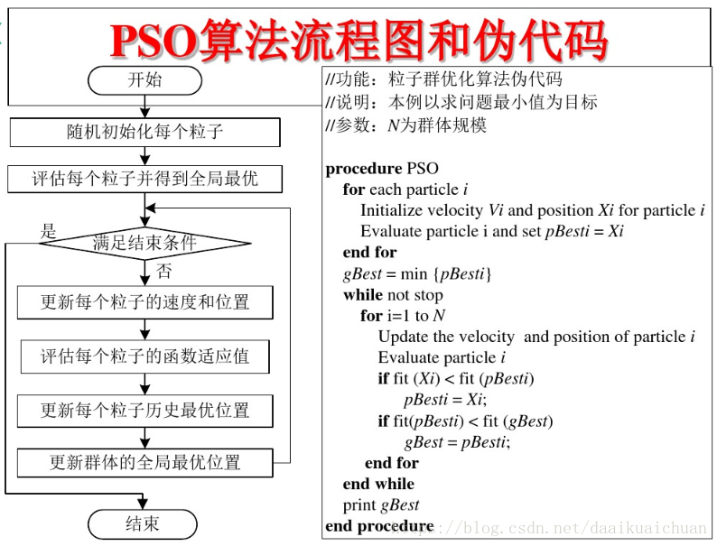

# 智能优化算法补充

## 遗传算法改进

### 种群初始化
1.初始化的时候生成更多的个体,例如我维持的种群规模是N,那么一开始就生成5N个个体,只留下最好的N个

2.对初始生成的每个个体做梯度下降优化(这个怎么做到,随机交换两个基因然后梯度下降?)

3.定向初始化:结合问题的信息进行初始化

### 收敛准则

1.固定代数

2.在得到的解足够好的时候就停止优化算法

3.在种群不再改进的时候停止优化(平均适应度没有明显改进,最好的个体的适应度没有明显的改变)

有的时候在代数进一步提升的时候,性能有断崖式的增长,但是消耗的计算资源明显增多,得不偿失


### 编码方式

可以将不同的解统一编成二进制编码,作为遗传算法的基因型,但是采用二进制编码会有明显的缺点就是,两个相隔比较远的数可能只有一位不同,而两个相近的数的编码反倒会有可能大不相同,例如011加一个1就是100,他们三位编码全不相同,为了消除汉明距离,可以采用一种叫做格雷编码的编码方式:


### 选择方案


为了防止漏掉最好的个体,需要限制每个个体最少被选择到的次数和最多被选择到的次数


### 选择压力


### 交叉方案


### 精英策略


## 禁忌搜索

禁忌搜索算法是改进局部搜索算法的一种组合优化算法，他能有效避免算法在迭代的过程中陷入局部最小值的情况，采用了一种叫做禁忌的思想，即在每一次找到局部最小值（最大值）后就把他打上一个标记，纳入到禁忌表当中去，这样，继续迭代的过程中，就不会陷入这个局部最小值，使得该算法拥有更加广阔的搜索空间。

下面是一个形象的图示：

!!! info "图示"

      

以下是一些名词解释：

### 禁忌表

用来存放每一次搜索后得到的局部最小值，确保下一次不会再陷入这个局部最小值，禁忌表有长度限制，会影响到算法运行的效率

那么，为什么禁忌表的长度有限呢？如果禁忌表的长度无限，那么我就可以禁用所有的能获得局部最小值的操作，导致算法在之后的过程中会陷入大量的循环，无法跳脱出现有的搜索空间，达不到一个广泛搜索的目的。从这个角度看，禁忌表的长度也不能太长，当然也不能太短，不然很容易陷入局部最小值当中。

### 禁忌对象

禁忌表中的元素，为了使算法在运算过程中不再陷入局部最小值，禁忌表中的元素的存在形式可以是多种多样的，例如，在TSP问题中，每一次邻域变换实际上就是交换路径中的两个城市，然后获得其总长度。

那么禁忌对象既可以是交换方式，也可以是禁忌表中已经获得的总长度，无论是哪种禁忌对象，都可以一定程度上避免算法“走老路”


### 禁忌期限

禁忌期限也被称作禁忌长度，指的是，禁忌表内的元素，在一定的迭代次数$t$内都不能被选取或者操作，每当迭代进行一次后：

$$
t=t-1
$$

直到$t=0$后，该元素被解禁，具体的禁忌长度可以自己设置，也可以根据邻域中邻居的个数来设定：$t=[\sqrt{n}]$


### 特赦准则

当邻域太小，但是禁忌期限又比较长的时候，就会出现所有的操作都被禁用的现象，此时不一定找到了优化问题的全局最小值，但是不能进行任何操作，这就白白增加了迭代次数，所以，这个时候要使用特赦规则，挑选禁忌表中的某个元素，如果他能够使得目标函数发生较大的变化，则特赦此元素，将他解禁。

### 邻域


每一次对局部最优解的映射都会产生一个邻域，在邻域中选择若干邻居进行评价，得到的新的局部最优解替换掉原来的局部最优解，同时与它进行比较，决定是否替换全局最优解


### 算法流程

!!! info "流程图"
      


具体细节可以参考这篇文章

!!! info 
      - 知乎：[🔗](https://zhuanlan.zhihu.com/p/404205364)

## 粒子群优化

粒子群优化是效仿鸟类觅食的一种优化算法,一个鸟群在觅食过程中,他会参考自己之前找到食物的方向以及种群中找到最多食物的鸟的方向,长此以往,所有的鸟都会在食物最多的地点汇合.

写成数学的形式就是:

设当下的鸟的速度是$v^{(i)}$,位置是$x^{(i)}$,那么他的速度更新的表达式为:

$$
\begin{aligned}
v^{(i+1)}=\omega v^{(i)}+c_1p_1(pbest^{(i)}-x^{(i)})+c_2p_2(gbest^{(i)}-x^{(i)})\\
\end{aligned}
$$

符号说明:

1. $\omega$被称作惯性因子,惯性因子较大,则算法全局寻优能力强,反之,则局部寻优能力强,一般从0.5取到1.5

2. $c_1$被称作个体学习因子,代表从过去的经验中学习到的方向,一般取2

3. $c_2$被称作社会学习因子,即从种群最优个体中学习的方向,一般取2

4. $x^{(i)},v^{(i)}$代表当前的位置和速度
   
5. $pbest^{(i)}$代表这一时刻及其过去这个个体到达的最好的地点
   
6. $gbest^{(i)}$代表这一时刻的全局最优个体所在的位置
   
位置更新的表达式为:

$$
x^{(i+1)}=x^{(i)}+v^{(i)}
$$

每一步的运动时间取做1

在较大的时间容许范围内,鸟群总可以通过这种方式找到食物最多的地方(目标函数全局最优)



这个算法我感觉相当好用,特别是涉及到一些连续空间的优化问题,很难描述可行解的变化过程,这个时候粒子群算法就给出了一种可行解的变化方式.

## 调库代码

### 粒子群优化

具体的代价函数,维度,粒子个数,因子系数根据实际问题设定

```python
# 导入必要的库
import numpy as np
import matplotlib.pyplot as plt
from pyswarms.single import GlobalBestPSO
from pyswarms.utils.plotters import plot_cost_history

# 1. 定义目标函数
def rosenbrock(x):
    """
    Rosenbrock函数（目标函数）定义。
    输入: x, 形状为 (n_particles, dimensions) 的 numpy 数组
    输出: 返回每个粒子的目标函数值，形状为 (n_particles,)
    """
    return .....

# 2. 设置PSO参数
options = {
    'c1': 0.5,  # 认知参数（个人学习因子）
    'c2': 0.3,  # 社会参数（群体学习因子）
    'w': 0.9    # 惯性权重（控制粒子速度）
}

# 3. 初始化粒子群优化器
dimensions = 2  # 粒子的维度（例如，2维优化问题）
bounds = (-5 * np.ones(dimensions), 5 * np.ones(dimensions))  # 位置的边界
optimizer = GlobalBestPSO(n_particles=30, dimensions=dimensions, options=options, bounds=bounds)

# 4. 运行优化器
cost, pos = optimizer.optimize(rosenbrock, iters=100)

# 5. 输出结果
print(f"最佳解的位置: {pos}")
print(f"最小化的目标函数值: {cost}")

# 6. 可视化优化过程
plot_cost_history(cost_history=optimizer.cost_history)
plt.title('粒子群优化的目标函数值变化曲线')
plt.xlabel('迭代次数')
plt.ylabel('目标函数值')
plt.show()


```

### 遗传算法

```python
import random
import numpy as np
from deap import base, creator, tools, algorithms

# 1. 定义目标函数（适应度函数）
def rastrigin(individual):
    """
    Rastrigin函数：测试优化算法的非线性函数
    输入: individual, 一个代表解的列表（个体）
    输出: 适应度值（Rastrigin函数值的负值，因为DEAP默认求最大值）
    """
    A = 10
    n = len(individual)
    return A * n + sum([(x**2 - A * np.cos(2 * np.pi * x)) for x in individual]),

# 2. 设置遗传算法参数

# 定义最大化适应度为目标的单目标优化问题
creator.create("FitnessMin", base.Fitness, weights=(-1.0,))
creator.create("Individual", list, fitness=creator.FitnessMin)

# 初始化工具箱
toolbox = base.Toolbox()
toolbox.register("attribute", random.uniform, -5.12, 5.12)  # 个体特征的初始化范围
toolbox.register("individual", tools.initRepeat, creator.Individual, toolbox.attribute, n=2)  # 个体初始化
toolbox.register("population", tools.initRepeat, list, toolbox.individual)  # 种群初始化

toolbox.register("mate", tools.cxBlend, alpha=0.5)  # 交叉操作
toolbox.register("mutate", tools.mutGaussian, mu=0, sigma=1, indpb=0.2)  # 变异操作
toolbox.register("select", tools.selTournament, tournsize=3)  # 选择操作
toolbox.register("evaluate", rastrigin)  # 评估函数

# 3. 运行遗传算法
def main():
    # 设置随机数种子
    random.seed(42)

    # 初始化种群
    population = toolbox.population(n=100)  # 种群数量

    # 记录统计信息
    stats = tools.Statistics(lambda ind: ind.fitness.values)
    stats.register("avg", np.mean)
    stats.register("std", np.std)
    stats.register("min", np.min)
    stats.register("max", np.max)

    # 运行遗传算法
    population, logbook = algorithms.eaSimple(
        population, toolbox, cxpb=0.5, mutpb=0.2, ngen=50, stats=stats, verbose=True
    )

    # 输出最佳解
    best_individual = tools.selBest(population, 1)[0]
    print(f"最佳个体: {best_individual}, 最佳适应度值: {best_individual.fitness.values[0]}")

    # 返回日志记录和最佳个体
    return logbook, best_individual

# 4. 执行主函数
if __name__ == "__main__":
    logbook, best_individual = main()

# 5. 可视化优化过程
import matplotlib.pyplot as plt

gen = logbook.select("gen")
fit_min = logbook.select("min")

plt.plot(gen, fit_min, label="最小适应度值")
plt.xlabel("世代数")
plt.ylabel("适应度值")
plt.title("遗传算法优化过程")
plt.legend()
plt.grid()
plt.show()

```

### 模拟退火算法

```python
import numpy as np
import matplotlib.pyplot as plt
from scipy.optimize import basinhopping

# 定义目标函数
def rastrigin(x):
    A = 10
    return A * len(x) + sum([(xi**2 - A * np.cos(2 * np.pi * xi)) for xi in x])

# 初始解
x0 = np.array([5.0, 5.0])  # 任意初始点

# 定义模拟退火的“跳跃”步长
minimizer_kwargs = {"method": "L-BFGS-B"}

# 运行模拟退火算法
result = basinhopping(rastrigin, x0, minimizer_kwargs=minimizer_kwargs, niter=200)

# 输出结果
print("最佳解的位置:", result.x)
print("最小化的目标函数值:", result.fun)

# 绘制目标函数和最佳解
x = np.linspace(-5.12, 5.12, 400)
y = np.linspace(-5.12, 5.12, 400)
X, Y = np.meshgrid(x, y)
Z = rastrigin([X, Y])

plt.figure(figsize=(8, 6))
plt.contour(X, Y, Z, levels=np.logspace(0, 5, 35), cmap='viridis')
plt.plot(result.x[0], result.x[1], 'r*', markersize=15)
plt.title("Rastrigin Function with Simulated Annealing Solution")
plt.colorbar()
plt.show()

```

### 贝叶斯优化

机器学习中超参数调优使用的一种算法,运行速度快,特别高效.

```python
import optuna
import numpy as np

# 定义目标函数（Rosenbrock函数）
def objective(trial):
    # 定义超参数的搜索空间
    x = trial.suggest_uniform('x', -5.0, 5.0)  # 定义变量x的搜索范围
    y = trial.suggest_uniform('y', -5.0, 5.0)  # 定义变量y的搜索范围
    
    # 计算目标函数值（Rosenbrock函数）
    return ...

# 创建一个优化器（study），默认使用TPE算法（贝叶斯优化的一种）
study = optuna.create_study(direction='minimize')  # 指定最小化目标
study.optimize(objective, n_trials=50)  # 进行优化，指定最大迭代次数为50

# 输出最佳结果
print(f"最佳解的位置: {study.best_params}")
print(f"最小化的目标函数值: {study.best_value}")

# 可视化优化历史
optuna.visualization.plot_optimization_history(study).show()

# 可视化参数重要性（需要安装 optuna[plotly] 才能使用）
optuna.visualization.plot_param_importances(study).show()

```