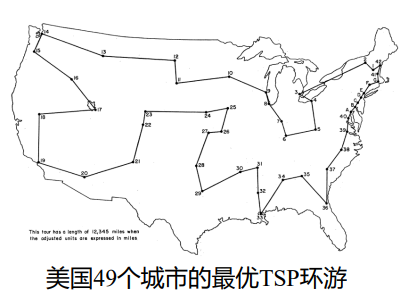

# 组合优化

应用于离散对象的优化叫做组合优化,从多个可行解中找出目标函数进而实现最优化,与组合优化相对应的是连续优化,应用于连续的对象.相较于连续优化来说,组合优化的最优解的性质不太好,求解较为困难,下面,我将给出组合优化的一些例子以及一些他们的求解方案

## 背包问题

### 连续背包问题

现在,存在$n$件物品,物品$j$的价值为$p_j$,大小为$w_j$,现在,我要把这些物品放入到容量为C的背包当中,使得我能够携带的物品的价值最大,如果此时物品可以切割,就称之为连续背包问题.

解决这个问题很自然的思路是优先装价值体积比较大的物品,由于物品可以切割,这样获得的利益一定是最大的.

我们不妨按照单位体积的价值进行降序排序,对于$n$个物品有:

$$
\frac{p_1}{w_1}\ge \frac{p_2}{w_2}\ge \cdots\ge \frac{p_n}{w_n}
$$

对于$j=1,2, \ldots ,l-1$,有$x_j=1$

对于$j=l$,有

$$
x_l=\frac{1}{w_l}(C-\sum_{j=1}^{l-1}x_j)
$$

对于$j=l+1, \ldots ,n$,有$x_j=0$

这样,背包问题的解就可以描述为,存在上述$x_j$,使得:

$$
\begin{aligned}
\min \sum_{j=1}^n x_jp_j\\
\sum_{j=1}^{n}w_jx_j=C
\end{aligned}
$$

### 离散背包问题

将上述条件中的物品可分割改为物品不可分割

在离散问题中,采取贪心的策略得到的不一定是最优的解,因为有可能到最后背包没有装满,该问题可以描述为:

$$
\begin{aligned}
\min \sum_{j=1}^n x_jp_j \\
\sum_{j=1}^{n}w_jx_j\le C
\end{aligned}
$$

其中:

$$
x_j=\begin{cases} 1,该物品被装入 &  \\0 ,该物品没有被装入 &  \end{cases}
$$

## 旅行商问题-TSP

一个旅行商从某个城市出发,经过地图上的所有城市后回到他出发的那个城市,问,旅行商该如何规划他的路径,使得他走过的总路程最短.解决这个问题的算法很多,不一一列举,这里给出它的数学形式:

设总共有$n$座城市,他们的标志分别为$\pi_1,\pi_2\cdots\pi_n$

要找到一种排列方式$\{ \pi_{j_{1}},\pi_{j_{2}}, \ldots ,\pi_{j_{n}} \}$

使得:

$$
\min \sum_{k=1}^{n-1}\Vert\pi_{j_{k}}\pi_{j_{k+1}}\Vert+\Vert\pi_{j_{1}}\pi_{j_{n}}\Vert
$$

可以写成规划的形式,定义$x_{ij}={0,1}$,当旅行商选择从$i$出发前往$j$时,$x_{ij}=1$,反之则为0

$$
{\displaystyle {\begin{aligned}\min &\sum _{i=0}^{n}\sum _{j\neq i,j=0}^{n}c_{ij}x_{ij}&&\\&0\leq x_{ij}\leq 1&&i,j=0,\cdots ,n\\&u_{i}\in \mathbf {Z} &&i=0,\cdots ,n\\&\sum _{i=0,i\neq j}^{n}x_{ij}=1&&j=0,\cdots ,n\\&\sum _{j=0,j\neq i}^{n}x_{ij}=1&&i=0,\cdots ,n\\&u_{i}-u_{j}+nx_{ij}\leq n-1&&1\leq i\neq j\leq n\end{aligned}}}
$$

其中u这个整数变量的引入是为了确保整个回路是一个大回环,不然的话,有可能出现一个个独立的小环.

## 车辆路径问题-VRP

### 无额外约束

可以看做是TSP问题的推广,设总共有$n$个顾客,顾客$i$位于地点$i$处,从地点$i$前往地点$j$所需要的成本是$c_{ij}$(可以理解成距离),现在,有$m$辆运输车前往这$n$个地点为客户服务,怎么样分配任务使得总路程最短.

定义变量$x_{ijk}=0,1$

当车辆$k$服务完$i$之后向着$j$运动,那么$x_{ijk}=1$,反之就为0

于是目标函数就为

$$
\min \sum_{i=0}^n\sum_{j=0}^n\sum_{k=1}^mc_{ij}x_{ijk}
$$

为什么$i,j$从0开始,因为车从车库出发,出发点加上客户总共$n+1$个点

约束条件:

$$
\sum_{j=1}^n\sum_{k=1}^mx_{ijk}=1
$$

对于任意的$i$都要成立,这确保每个客户只被服务一次

环游约束:每一辆车都要从0处出发,最后回到0处.

$$
\sum_{j=1}^{n}x_{0jk}=1
$$

这代表对任意一辆车$k$,他有且只有一个出发点(服务的第一个客户)

$$
\sum_{i=1}^n x_{i0k}=1
$$

这代表第$k$辆车有且只有一个回归点

### 有容量约束
有$m$辆运输车,容量均为$Q$,$i$个地点已知,把这$n$个顾客分别分配给$m$辆车,使得每辆车所需要满足的需求都不超过车的容量.

只需要添加两个约束条件:

车容量限制:

$$
\sum_{j=1}^{n} q_j x_{ijk}\le Q
$$

$$
\sum_{k=1}^{m}\sum_{j=1}^{n} q_j x_{ijk}=\sum_{j=1}^{n}q_j
$$

### 时间窗口约束

每个客户有一个指定的时间窗口，在这个时间窗口内才能接受货物。

## 指派问题

现在有$n$个人,$n$个任务,人员$i$完成任务$j$的时间是$c_{ij}$,现在给每个人都指派任务,如何指派可以使得总时间最小?

定义:

$$
x_{ij}=\begin{cases} 1,第i个人被指派了j号任务 &  \\0 ,其他 &  \end{cases}
$$

所以问题可以描述为:

$$
\min \sum_{i=1}^{n}\sum_{j=1}^{n}x_{ij}c_{ij}
$$

$$
\begin{aligned}
s.t.\quad \sum_{i=1}^{n}x_{ij}=1 \\
\sum_{j=1}^{n}x_{ij}=1
\end{aligned}
$$

## 排序问题

研究如何利用有限资源，在给定的限制条件下将一批任务安排在某些时间段内完成，并使效益最大，

* 早期研究的排序问题背景源自工业生产，习惯上把可用的资源称为机器(machine)，需要完成的任务称为工件(job)
* 对部分排序问题，可行解由工件加工的顺序决定，这类问题最早也被称作sequencing·

### 广义排序(调度)问题
课程表、时刻表、排班表、赛程等

## 贪心

在每一次决策时,选定当时对自己最有利且可行的策略

### 场馆安排问题

某场馆收到$n$项借用申请，第$i$项申请的活动开始时间为$s_i$ ，结束时间为$t_i$ ，持续时间为$d_i=t_i-s_i$

• 场馆在同一时刻只能进行一项活动，一项活动开始后必须连续进行直至结束
• 希望选择接受部分申请，使得场馆能开展的活动数量尽可能多

一个显著的贪心思想就是把所有活动的结束时间按照从小到大的顺序排列起来,然后依次考虑是否接受,如果某次决策时,该活动的开始时间落在上一次已接收活动的时间范围内,则不接受该活动,反之则接受该活动.

下面我们来证明这个贪婪思想的最优性,设存在最优解$\sigma$,满足贪婪策略,不妨将某一次接受场馆安排的时刻设为时间$t=0$,此时最早结束的活动的终止时间为$i_0$

反证法,如果这个时候选择$i_0$不是最优解,那么有以下两种情况:

1. 在时间段$i_0$内,不安排任何活动,这显然与最优解的要求不符合,因为,安排这个活动会比不安排这个活动的活动个数多一个.
2. 安排一个终止时间更大的活动$i>i_0$,如果说这个也是最优解$\sigma_1$,那么我把$i$替换成$i_0$,对$i$后面的活动没有任何影响,并且活动数不变,所以$\sigma$还是最优解,与假设矛盾.

综上所述,采取终止时间最早的贪婪策略获得的是最优解.

## 动态规划

动态规划是一种数学方法,不是一种算法,其核心思想在于将问题按照时空划分为阶段动态过程,把多阶段决策过程变成相互联系的单阶段最优决策问题.

### 背包问题的动态规划

连续背包问题在上面已经解决了,这里考虑的是离散背包问题

设背包内前 $k\le n $ 个物品和容量为 $w\le C$ 的背包组成的实例为$I(k,w)$,背包所能装上价值的最大值(最优解)为$V(k,w)$

!!! tip "动态规划"
      现在,对第$k$件物品展开讨论

      1. 在背包中不装入这件物品,那么装进来的只有在前$k-1$件物品中选:
         
         $$
         V(k,w)=V(k-1,w)
         $$

      2. 在背包中装入这件物品,那么背包的容量会相应减少成$w-w_k$
         
         $$
         V(k,w)=p_k+V(k-1,w-w_k)
         $$

         当$w_k>w$时,无法装入这件物品:

         $$
         V(k,w)=V(k-1,w)
         $$

综上所述,可以写出递推关系:

$$
V(k,w)=\max\{ V(k-1,w),p_k+V(k-1,w-w_k) \}
$$

按照获利最大进行每一步决策,层层递进,初始条件为:

$$
V(0,w)=0
$$

我们要求解的最大价值即为$V(n,C)$

### 麦子收集问题

一个$n$行$m$列的棋盘,棋盘上某些格子内放有麦子,麦子的坐标已知,现在,一个机器人从$(0,0)$这个格子出发,他只能向右或者向下移动,问,机器人该怎么样规划自己的路径,使得他收集到的麦子尽可能的多?

很自然的一个想法,假设说$t$时刻机器人位于$(i,j)$这个位置,那么他能从哪里来?他只能从他的左边或者他的上边来,即前一个时刻他的位置为:$(i-1,j)$或者$(i,j-1)$

我们再定义一个变量$c(i,j)$

$$
c(i,j)=\begin{cases}1 ,(i,j)处有麦子 &  \\ 0, 其他&  \end{cases}
$$

所以,机器人在坐标$(i,j)$处所能够获得的最大的麦子个数$P(i,j)$为:

$$
P(i,j)=\max\{ P(i-1,j),P(i,j-1) \}+c(i,j)
$$

每一步决策都使得$P(i,j)$达到最大,从而规划出最优路径

初值条件:

$$
P(0,0)=0
$$

要求的是$P(n,m)$

## 启发式算法

借助一些直观想法和假定,依靠物理,化学,生物领域中的一些原理设计的算法,通常比较精妙也比较复杂

### 模拟退火算法

这个算法起源于统计热力学,在高温下,粒子的运动较为剧烈,微观状态数比较多,容易发生重新排列组合,随着降温的不断进行,粒子运动逐渐减弱,物体被冷却,当物体被完全冷却的时候,晶体成型,系统处于定态之中.

模拟退火可以看做是对梯度下降算法的改进,因为梯度下降容易陷入到局部最小值当中去,然而,模拟退火算法由于高温下粒子的活泼性,有一定几率跳出局部最小值继续迭代,随着温度的逐渐降低,这几率越来越小,直到收敛到全局最小值.

迭代的操作在于扰动,每一次扰动后,系统的能量就会从$E_i$变化成为$E_j$

如果$E_j<E_i$,那么系统趋于稳定接受新状态

但是当$E_i>E_j$的时候,系统能量升高,但是由于系统处于高温状态比较不稳定,仍会以一定的概率接受这个新状态.

#### 玻尔兹曼分布

我们知道,系统的状态在统计力学中满足玻尔兹曼分布:

!!! tip "玻尔兹曼分布"
    $$
      P(x=i)=\frac{e^{- \frac{E_i}{RT}}}{\displaystyle\sum_{k=1}^{\infty}e^{-\frac{E_k}{RT}}}
    $$

分母是配分函数,可以认为只和温度有关,所以:

$$
\frac{P(x=j)}{P(x=i)}= e^{-\frac{E_j-E_i}{RT}}=e^{-\frac{\Delta E}{RT}}
$$

于是定义状态转移概率:

$$
P(i \to j)=e^{-\frac{\Delta E}{RT}}
$$

系统有一定概率抵达能量升高的新状态,并且这个状态随着温度的降低趋于0.但是温度的变化一定是一个比较缓慢的过程,确保每一时刻都抵达热平衡.

这里的能量函数可以替换成我们的目标函数$f(x)$,通过设定一个较高的初始温度并且缓慢降温,使得目标函数逐渐收敛到全局最小值.

#### 算法流程

!!! info "模拟退火算法"

      0.设定一个较高的初始温度$T_0$

      1.扰动获得目标函数的新的值,与原函数值作差得$\Delta f(x)$

      2.接受概率为

      $$
      P=\begin{cases} 1&,\Delta f(x)>0  \\  e^{\frac{\Delta f(x)}{RT}}&, \Delta f(x)<0  \end{cases}
      $$

      3.降温:

      $$
      T=\alpha T,\alpha<1
      $$

      4.重复上述操作,迭代终止条件为:

      $$
      T<\varepsilon
      $$

'''
### 遗传算法

遗传算法是根据达尔文进化论思想设计的算法：物竞天择，适者生存，在自然选择的作用下，生物被一代一代筛选，最后剩下的就是最适应环境的个体，我们可以认为，自然选择是通过适应度函数进行的，适应度函数会对每个个体进行打分，从而计算出他们的适应度，对应于优化领域，适应度函数就是我们的目标函数。

下面是几个算法的基本概念

#### 种群

对于一个优化问题，我们拥有许多的可行解，每个可行解被称作一个个体，这些可行解所组成的集合就是种群，适应度函数会对种群进行选择，从而达到优化的目的

#### 基因

每个可行解必然蕴含着一系列特征，这个特征可以用向量表示出来，向量的每个元素就称之为这个个体的基因，例如，在背包问题中，我们用1代表背包内装入了该物体，用0代表没有装入

所以，背包问题的一个可行解就可以描述为：

$$
1000100100110\cdots
$$

这些数字就可以认为是这个可行解的基因。

同理，在TSP问题中，每个城市都有自己的编号$01234\cdots$,同理，TSP的一个可行解也可以描述为：

$$
(2,7,3,1,9,0\cdots)
$$

城市的编号就是他的基因

#### 交配
交配带来的是基因重组，产生新的个体，适应度越大的个体越有机会交配，那么，如何实现这一点呢？

假设初始种群个体数为$N$个，我们先对这$N$个个体进行打分，得到他们的适应度，然后定义一个交配空间$J$,以适应度占适应度综合的比例(归一化)选定个体进入交配空间。

其中，交配空间的大小和种群大小一致：

$$
\Vert J\Vert=N
$$

个体被选中的概率为（定义适应度为$z_i$）:

$$
P=\frac{z_i}{\sum_{i=1}^{N}z_i}
$$

这种选择方法被称为轮盘赌选择法，如图所示：

{width=350}

对交配空间内的所有个体，他们并不是一定要交配的，每个个体是否选择交配是独立并且有一定概率的，这个概率被称之为交配概率，记作$p$,对于选择交配的个体对于实行随机配对，如果有剩下的，剩下的那个自动进入子代，两个配对的亲本实行交配，产生两个子代，这样我们就得到了一个子代种群。

交配的方式有很多种，但是目的是为了实现基因重组：

##### 单点交叉

交配过程中随机选择一个断点，交换断点后的一串基因，产生两个新的子代：

##### 多点交叉

随机选择多个断点，进行所谓的互补交叉

交配完成后，得到一个规模和父代一致的子代种群，对子代中的所有个体进行打分，选出适应度最高的那个，与父代中适应度最高的那个进行比较，如果适应度较高，就把他保留下来，反之则不保留，同时进化代数加一。

交配进化多代之后，最佳适应度会逐渐收敛，小于误差范围后，或者进化代数超过一定次数，算法结束。

#### 变异

基因重组只能对现有基因进行排列组合，当自然选择来临的时候，种群的个体多样性不够，难以很好的适应环境，于是很容易造成种群被淘汰的现象，在自然界中，种群内部往往存在规模很小的基因突变群体，当环境发生剧烈变化的时候，变异的个体拥有种群内部绝大多数个体所没有的基因，从而在自然选择中占据优势，使得变异基因得以保存，扩大，延续。

在遗传算法中，通过交配得到的子代，我们需要对每个个体执行变异判断，正如在现实中所发生的那样，变异的概率很低，一旦某个个体发生变异，算法将随机选定某一个基因，然后把它替换成其他东西

变异有利于实现种群的基因多样性，种群可以通过变异获得种群内没有的基因，有利于算法收敛速度的加快。

#### 适应度函数 
以背包问题为例，适应度函数就是背包内所蕴含的价值，所蕴含的价值越高，适应度函数所判定的适应度就越大。对于求目标函数最小值的优化问题，只需要把适应度函数取做一个较大的正数减去目标函数就可以了。

#### 算法流程
遗传算法的具体流程图如下所示：

!!!info "流程图"
      

### 蚁群算法

蚁群算法的思路来源于自然界中蚂蚁找食物，人们发现，蚂蚁寻找食物的路线总是遵循最短路径，经过研究发现，原来，蚂蚁在运动过程中会释放信息素，对于较短的路径，单位时间内经过的蚂蚁的数目较多，所以路径上的信息素浓度会比较高，这样，下一次蚂蚁在选择路径的时候，会下意识向着信息素浓度高的路径走去，这样，越来越多的蚂蚁会选择较短的路径，同时，长的路径上的老的信息素会随着时间不断的蒸发，这样，信息素都富集到了较短的路径上，形成了正反馈调节，导致算法收敛到了全局最优解上。

蚁群优化算法相比于实际的蚂蚁找食物做了一些简化，比如，这只蚂蚁是一只上帝超距蚂蚁，他在走完路径后计算出了总路径长度，然后再根据路径的总长在路径上释放信息素，还有就是，所有蚂蚁可以不从一个初始点出发，而是可以分散在多个出发点，这样有利于扩大搜索空间。

#### TSP的蚁群算法解法

以TSP算法为例：

先初始化信息素，对于任意的城市$(i,j)$，初始化他们路径$E(i,j)$上的信息素浓度为$t_0$

我们的蚁群有$m$只蚂蚁，他们分别随机选择不同的城市作为出发点，然后开始执行搜索，最后回到出发点,这样一次就产生了$m$个可行解。

下一步，对这$m$个可行解的质量进行判断,比较他们的总长度，然后根据长度更新下一轮的信息素，同时，注意到，路径上的信息素经过一轮循环后会蒸发掉一些。

定义$\rho$为信息素的蒸发率，$\tau(i,j)$为边$E(i,j)$上的信息素浓度，所以，状态更新方程为：

$$
\tau(i,j)_{(n+1)}=(1-\rho)\tau(i,j)_{(n)}+\sum_{k=1}^m \Delta \tau_k(i,j)
$$

这个方程的第一项代表上一轮残余的信息素,第二项是这$m$只蚂蚁分别在这条边上留下的信息素，通常定义为：

$$
\Delta \tau_k(i,j)=\frac{1}{l_k}
$$

其中$l_{k}$为$k$号蚂蚁路径的总长度。如果$k$号蚂蚁的路径包含$(i,j)$或者$(j,i)$

好，这样下一批蚂蚁就有经验了，再生成$m$只蚂蚁，然后随机分配他们的出发点，

考虑单步的决策过程，将$k$号蚂蚁走过的城市集合记作$R_k$，每一只蚂蚁走到某个城市$i$后，它可以选择的城市的集合记作$J_k(i)$,于是，这个蚂蚁下一步选择$j\in J_k(i)$城市的概率就可以表示为：

$$
p_{k}(i,j)=\begin{cases} \displaystyle \frac{[\tau(i,j)]^{\alpha}[\eta(i,j)]^\beta}{\displaystyle \sum_{u\in J_k(i)}[\tau(i,u)]^{\alpha}\displaystyle [\eta(i,u)]^\beta} &, j\in J_k(i)  \\ 0&,  \text{others} \end{cases}
$$

其中，$\eta(i,j)$为蚂蚁从$i$出发选择$j$的期望，通常写成：

$$
\eta(i,j)=\frac{1}{d(i,j)}
$$

即谁离$i$越近，越容易选择谁。

其中，$\alpha,\beta$是两个参数，如果$\alpha=0$，那么这个算法就是纯纯的随机贪心算法，每次决策都尽可能选最短路径，如果$\beta=0$，那么蚂蚁纯按照信息素走，算法收敛太快了，有可能陷入到局部最小值当中。

确定了概率后，每一步决策我们就按照轮盘赌选法进行，然后继续迭代，限定迭代次数后输出最小值。

 
