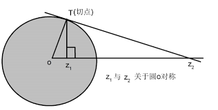

# 保角映射

保角映射是复变函数中的一个重要概念,通过将一个复杂区域上的问题映射到另一个简单区域,它可以简化很多问题的求解.

## 保角映射的概念

考虑导数关系:

$$
\Delta w=f'(z)\Delta z
$$

所以就会有幅角关系:

$$
\arg(\Delta w)=\arg(f'(z))+\arg(\Delta z)
$$

故我们考虑在复平面相交的两条直线(两个变化方向,$\Delta z_1,\Delta z_2$,交点为$z$),并且考察其交点在映射过后的夹角,注意到其是在同一个点相交,所以:

$$
\begin{aligned}
arg(\Delta w_1)=\arg(f'(z))+\arg(\Delta z_1) \\
arg(\Delta w_2)=\arg(f'(z))+\arg(\Delta z_2) \\
\end{aligned}
$$

上下相减得到:

$$
\arg(\frac{\Delta w_1}{\Delta w_2})=\arg(\frac{\Delta z_1}{\Delta z_2})
$$

也就是说,映射后两条直线的夹角保持不变.这就是保角映射.

## 保角映射基本定理

### 局部保角映射的充要条件

函数$f(z)$是区域$D$内的局部保角映射,当且仅当$f(z)$在区域$D$内解析,并且满足$f'(z)\neq 0$.

### 黎曼映射定理

对于复平面上的两个单连通区域D,G,对于两个区域上的两个点,一定存在唯一的从D到G的保角映射,使得$f(z_0)=w_0$,$arg(f'(z_0))=\alpha_0$.

### 边界对应原理

设简单闭曲线$\Gamma,\Gamma'$围成的区域为$D,D'$,那么从D到D'的保角映射可以延拓到边界上,并且对应顺序保持不变.(即边界对应边界,逆时针对应逆时针)

## 简单的保角映射

### 整线性映射

即为:

$$
w=az+b
$$

代表旋转伸缩再平移.

例如区域$\{ D|0<Re(z)<a \}$,经过旋转90度,并且再伸缩就可以得到$\{ D'|0<Im(w)<\pi \}$,映射关系为:

$$
w=\frac{\pi}{a}e^{i\pi/2}z
$$

之后我们可以看到,这个区域可以很轻松的变为上半平面后再变成单位圆.

该映射把圆周映射成为圆周,所以具有保圆性.

### 倒数映射

$$
w=\frac{1}{z}
$$

除去0和无穷远点,这个映射在平面上处处保角,不保角的两个点可以通过规定把它变成保角的.

倒数映射有一个很重要的性质就是保持广义圆的对称性,我们把直线和圆都称为广义圆.一根直线在经过倒数映射后会变成一个圆,而关于直线对称的两点在倒数映射后也会关于圆对称.

定义关于圆对称为:

$$
OP\cdot OP'=R^2
$$

其中O是圆心,P,P'分别是圆内圆外的对称点.

### 幂函数映射

$$
w=z^n
$$

除去原点外,此映射在平面上处处保角.

这个映射主要是扩张模长和幅角,所以把圆映射成圆,射线映射成射线,角形区域映射成为一个张角更大的角形区域.

### 指数函数和对数函数映射

指数函数映射为:

$$
w=e^z
$$

把实部和虚部展开就是:

$$
\rho=e^x,\phi=y
$$

所以,对于一根平行与实轴的直线,其经过映射角度不变,模长从0到正无穷,即一根射线,所以一个带状区域经过映射后会成为一个角形区域.而一根平行于虚轴的直线,其映射后模长不变,角度从负无穷到正无穷,即映射成为一个圆.

对数映射是指数映射的逆映射,但是对数函数是有多值性的:

$$
z=Ln w= \ln |w|+iArg w=\ln |w| +i arg w +2k\pi
$$

对于一个除去负实轴的复平面,其对数映射会是一个个以2π为间隔的带状区域,k=0的那个分支称之为对数主支.

### 分式线性映射

$$
w=\frac{az+b}{cz+d}
$$

其本质上就是整线性映射和倒数映射的复合映射,因此分式线性映射也会保持广义圆的对称性.

一个比较显然的结论是,如果一个圆上任意一点都不映射成为无穷远点,则映射后仍然是一个圆,反之,映射后就是一条直线.

#### 三个点确定一个分式线性映射

如果说平面上三个不重合的点$z_1,z_2,z_3$映射到$w_1,w_2,w_3$,则存在唯一的分式线性映射$w=\frac{az+b}{cz+d}$使得$f(z_i)=w_i$,并且这个映射由下面这个式子给出:

$$
\frac{w-w_1}{w-w_2}\cdot\frac{w_3-w_2}{w_3-w_1}=\frac{z-z_1}{z-z_2}\cdot\frac{z_3-z_2}{z_3-z_1}
$$

事实上,为了方便记忆,可以这样写:

$$
\frac{\frac{w-w_1}{w-w_2}}{\frac{w_3-w_1}{w_3-w_2}}=\frac{\frac{z-z_1}{z-z_2}}{\frac{z_3-z_1}{z_3-z_2}}
$$

#### 上半平面映射成单位圆

将上半平面内的一点$z_0$映射成单位圆的圆心的分式线性映射为:

$$
w=e^{i\theta}\frac{z-z_0}{z-\overline{z_0}}
$$

还有一个待定参数$\theta$没有确定,需要再指定一个映射对应点,这样这个分式线性映射就被唯一确定下来了.

#### 单位圆内部映射成为单位圆内部

将单位圆内部的一点$z_0$映射成单位圆的圆心的分式线性映射为:

$$
w=e^{i\theta}\frac{z-z_0}{1-\overline{z_0}z}
$$

