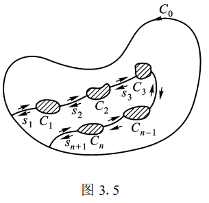

# 复积分

复积分即为复变函数的积分,复变函数可以看做二元向量函数,那么复积分实际上就可以类比为第二类曲线积分.

于是,复积分有两种计算方式,一种是仿照第二类曲线积分的计算方式,另一种则是使用参数化进行变量替换实现积分.

## 定义

对于一个复平面上的简单曲线,其可以参数化的表示为:

$$
C:z=z(t)=x(t)+iy(t)
$$

所以,定义复积分为:

$$
\int_C f(z)dz=\int_\alpha^\beta f(z(t))z'(t)dt
$$

然后将实部与虚部分离出来,最终就得到了两个一元实数定积分,这在一些计算情形下比较好用,但是在很多情况下会复杂到难以处理.

例如下面这个积分,我们难以使用参数化的方法直接计算,但是可以适当进行放缩:

$$
\int_{|z|=1} \frac{\sin z}{z^2}dz\le \int_{|z|=1} \frac{|\sin{z}|}{|z|^2}dz=\int_{|z|=1}\frac{|e^{iz}+e^{-iz}|}{2}dz\le \int_{|z|=1}\frac{e^y+e^{-y}}{2}dz\le 2\pi e
$$

## 柯西积分定理

如果说,封闭曲线C包围了一个单连通区域D,且$f(z)$在D内解析,则会有:

$$
\oint_C f(z)dz=0
$$

由于$f(z)$在区域D内解析,所以$f'(z)$在区域D内存在且连续,对复积分我们应用格林定理:

$$
\oint_Cf(z)dz=\oint_C udx-vdy+i\oint vdx+udy=\iint_D[-\frac{\partial v}{\partial x}-\frac{\partial u}{\partial y}]dxdy+\iint_D[\frac{\partial u}{\partial x}-\frac{\partial v}{\partial y}] dxdy=0
$$

有了上述的柯西积分定理,我们可以导出一些推论,考虑$f(z)$在区域D内解析,我们在D内随便做一个封闭曲线,其内部为解析的单连通区域,对这根曲线运用柯西积分定理,将这个曲线分为两部分,我们就得到了积分与路径无关这一结论:

$$
\int_{C_1} f(z) dz=\int_{C_2}f(z)dz
$$

其中$C_1,C_2$具有相同的起点和终点.

同时,可以将柯西积分定理推广到多连通区域,假设区域D由曲线C围成,曲线C又可以分为外部的大曲线封闭$C_0$和内部的小封闭曲线$C_1,C_2, \ldots ,C_n$,由于曲线都是默认以逆时针为正向,所以:

$$
C=C_0+C_1^- + C_2^- + \cdots +C_n ^-
$$

然后,考虑构造一个曲线,从外部曲线伸出大量的直线直接连接到内部曲线上然后再返回外部曲线,这样得到的新曲线就把区域变成了单连通区域.

将这个新曲线记做$\Gamma$:

$$
\oint_\Gamma f(z)dz=0=\int_Cf(z)dz+\sum_{k=1}^n\int_{s_k^+}f(z)dz+\sum_{k=1}^n\int_{s_k^-}f(z)dz
$$

求和项之和显然为0,所以就得到:

$$
\int_C f(z)dz=0
$$

这就证明了多连通区域下的复变函数的柯西积分定理.由此可以导出内部曲线的积分和与外部曲线的积分相等:

$$
\int_{C_0}f(z)dz=\sum_{k=1}^n \int_{C_k}f(z)dz
$$

特别的,为:

$$
\int_{C_0}f(z)dz=\int_{C_1}f(z)dz
$$

上述结论被称作形变原理.

运用上述结论,可以将原本难以计算积分的曲线变成比较好计算积分的曲线,例如曲线C中包含了奇点$z=a$,那么:

$$
\oint_C \frac{1}{(z-a)^n}dz=\oint_{|z-a|=1}\frac{1}{(z-a)^n}dz=\int_{t=0}^{2\pi}\frac{ie^{it}}{e^{int}}dt=2\pi i或者0
$$

## 原函数定理

设$f(z)$在单连通区域D内解析,则:

$$
F(z)=\int_{z_0}^z f(\zeta)d\zeta\quad z\in D
$$

也是解析函数,并且满足$F'(z)=f(z)$

于是我们定义$f(z)$的原函数为:

$$
G(z)=F(z)+C
$$

C是任意一个复数常数.

其性质和实变函数微积分的原函数性质几乎一致.

## 柯西积分公式

设函数$f(z)$在有界闭区域$\bar{D}=D+C$上解析,则满足:

$$
f(z_0)=\frac{1}{2\pi i}\oint_{C} \frac{f(z)}{z-z_0}dz\quad (z_0\in D)
$$

考虑使用形变原理:

$$
\frac{1}{2\pi i}\oint_{C} \frac{f(z)}{z-z_0}dz=\frac{1}{2\pi i}\oint_{|z-z_0|=\delta} \frac{f(z)}{z-z_0}dz\le 
\frac{1}{2\pi i}\oint_{|z-z_0|=\delta} \frac{|f(z)|}{|z-z_0|}ds 
$$

然后考虑参数化:

$$
\frac{1}{2\pi i}\oint_{|z-z_0|=\delta} \frac{|f(z)|}{|z-z_0|}ds =\frac{1}{2\pi i}\int_{0}^{2\pi} \frac{|f(z)|}{\delta}\delta dt=\frac{1}{2\pi i}\int_{0}^{2\pi}f(z_0)dt=f(z_0)
$$

上式的最后一步运用了$\delta$的任意性,我们将它取得充分小以至于z逼近$z_0$,但是,值得注意的是,极限和积分可以交换次序需要在一致连续的条件下才能做到.

运用柯西积分公式,我们可以解决很多我们本解决不了的积分,例如:

$$
\oint_C \frac{\sin z}{z^2}=\oint_C \frac{\frac{\sin z}{z}}{z-0}=\lim_{z\to 0}\frac{\sin z}{z}=1
$$

柯西积分公式不仅仅可以应用于单连通区域,也可以应用于多连通区域,值得注意的是,尽量避免区域内产生奇点,不然难以直接应用柯西积分公式.

### 解析函数的积分平均值定理

这个其实就是柯西积分公式的应用:

$$
f(z_0)=\frac{1}{2\pi}\int_0^{2\pi}f(z_0+Re^{i\theta})d\theta
$$

上式实际上为:

$$
f(z_0)=\frac{1}{2\pi i}\oint_{|z-z_0|=R}\frac{f(z_0)}{z-z_0}dz
$$

的等价变形.

## 解析函数的无穷可微性

复变函数在一个区域内解析就可以保证其在该区域内无穷阶可导,这其实来源于复变函数导数存在的条件很强的因素

### 高阶导数的柯西积分公式
为了证明这一点,首先我们要导出高阶导数的柯西积分公式,首先考虑二阶的

对于可导点$z_0$和其领域内的一点$z$:

$$
\begin{aligned}
f(z_0)=\frac{1}{2\pi i}\oint_C \frac{f(\xi)}{\xi-z_0}d\xi \\
f(z)=\frac{1}{2\pi i}\oint_C \frac{f(\xi)}{\xi-z}d\xi
\end{aligned}
$$

然后使用它们构造导数:

$$
f'(z_0)=\lim_{z \to z_0}\frac{f(z)-f(z_0)}{z-z_0}d\xi=\lim_{z \to z_0}\frac{1}{2\pi i}\oint_C \frac{f(\xi)}{(\xi-z_0)(\xi-z)}
=\frac{1}{2\pi i}\oint_C\frac{f(\xi)}{(\xi-z_0)^2}d\xi
$$

这样我们就证明了一阶导数的柯西积分公式,根据数学归纳法,我们可以证明n阶导数的柯西积分公式:

$$
f^{(n)}(z_0)=\frac{n!}{2\pi i}\oint_C \frac{f(\zeta)}{(\zeta-z_0)^{n+1}}d\zeta
$$

由于该积分总是存在且收敛的,所以就得到该解析函数是无穷可微的.

### 柯西不等式

设函数$f(z)$在闭圆盘$|z-z_0|\le R$上解析,则:

$$
|f^{(n)}(z_0)|\le \frac{n!}{R^n}M
$$

M为该区域范围内的复变函数模的最大值.

考虑使用高阶导数的柯西积分公式进行放缩即可得到:

$$
|f^{(n)}(z_0)|=\frac{n!}{2\pi }\oint_{|\zeta-z_0|=R} \frac{|f(\zeta)|}{R^{n+1}}ds\le \frac{n!M}{R^n}
$$

### 刘维尔定理

有界整函数必定为常数.

证明:由于其在整个复平面范围内有界,所以存在M>0,对于任意的z都满足:

$$
|f(z_0)|\le M
$$

所以,根据刘维尔不等式就会有:

$$
|f'(z_0)|\le \frac{M}{R}
$$

由于该函数在整个复平面上解析,那么不妨令R趋于正无穷,就得到一阶导数的模为0,也就是一阶导数恒为0,即该函数为常数.

### 代数学基本定理

代数学基本定理可以描述为,非常数的n次多项式在复数域至少有一个根,换句话说,只要有一个根,我就可以通过短除法不断除掉这个一次多项式,也就是说:
n次方程必定有n个根.

接下来我们来证明这个定理,采用反证法,假设该多项式$P(z)$在复数域中没有零点,也就是说:

$$
w=\frac{1}{P(z)}
$$

是一个整函数.由于$P(z)$没有零点,所以$w$是有界的,于是根据刘维尔定理,$w$一定是一个常数.

这和我们的条件相悖,所以假设不成立,即$P(z)$至少有一个零点.