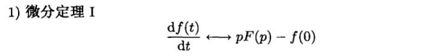
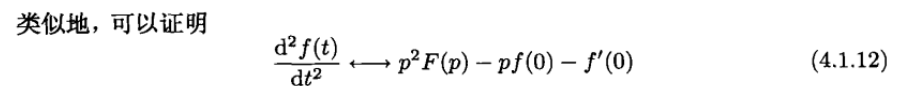
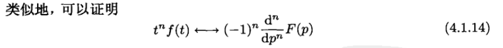
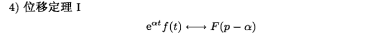
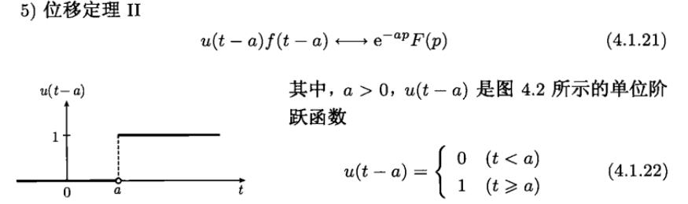
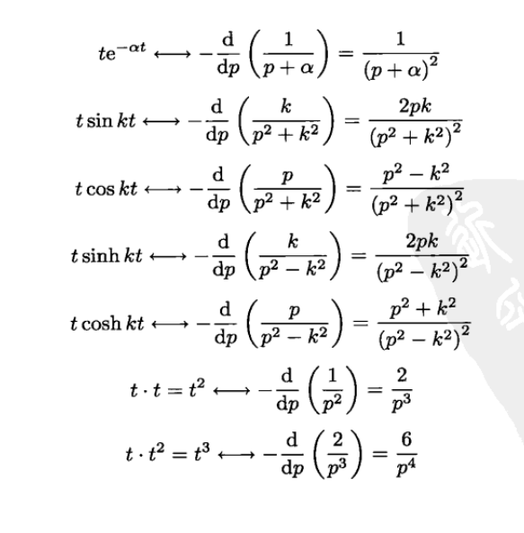
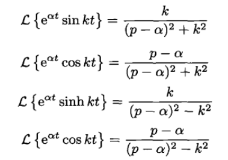

# 拉普拉斯变换

## 导出

很多时候,我们想要对它进行操作的函数,其自变量往往是时间,也就是说,函数的定义域为$[0,+\infty]$.

然而,傅里叶变换的积分范围是$[-\infty,+\infty]$,并且要求被积函数在整个定义域上绝对可积,这是一个比较严格的要求,于是,我们就思考,能不能用一种只在$[0,+\infty]$上操作的积分变换去操作我们的函数,这就是拉普拉斯变换的由来.

考虑一个定义在实数域的函数$g(t)$,想要他满足傅里叶变换的绝对可积条件,首先,先乘上一个阶跃函数$u(t)$干掉其负数的部分,然后再乘上一个衰减因子$e^{-\beta t}$确保其在t较大的时候衰减到0,得到的新函数往往可以满足傅里叶变换:

$$
\int_{-\infty}^{+\infty}g(t)u(t)e^{-(\beta+i \omega)t}dt=\int_{0}^{+\infty}g(t)u(t)e^{-(\beta+i \omega)t}dt=\int_{0}^{+\infty}f(t)e^{-pt}dt
$$

这样我们就得到了拉普拉斯变换:

$$
F(p)=\mathcal{L}(f(t))=\int_{0}^{+\infty}f(t)e^{-pt}dt
$$

不难发现,拉普拉斯变换存在的充分条件是:

1. $f(t)$分段连续
2. $|f(t)|<M\exp(\alpha t)$

拉普拉斯逆变换的形式较为复杂,涉及到复积分,原函数通常使用瞪眼法和拉普拉斯变换的性质直接得到.

## 拉普拉斯变换的性质

1. 线性性
   
2. 微分定理1
   
   
3. 微分定理2
   
   
4. 积分定理
   
5. 位移定理
   
   
6. 卷积

拉普拉斯变换中的卷积定义和傅里叶变换中的相同,但是由于拉普拉斯变换的特殊性,卷积可以进行一定程度的化简:

$$
f(t)*g(t)=\int_{t=0}^{+\infty}f(\xi)g(t-\xi)d\xi=\int_{t=0}^{t}f(\xi)g(t-\xi)d\xi+\int_{t}^{+\infty}f(\xi)g(t-\xi)d\xi
$$

对第二项积分,注意到:

$$
\int_{t}^{+\infty}f(\xi)g(t-\xi)d\xi=-\int_{T=0}^{-\infty}f(t-T)g(T)dT=0
$$

所以,拉普拉斯变换中的卷积可以定义为:

$$
f(t)*g(t)=\int_{0}^t f(t-\tau)g(\tau) d\tau
$$

同理这个卷积会满足卷积定理

## 常见的拉普拉斯变换

- $\sin kt$

$$
F(p)=\int_0^\infty \sin kt e^{-pt} dt=\frac{k}{p^2+k^2}
$$

- $\cos kt$

$$
F(p)=\int_0^\infty \cos kt e^{-pt} dt=\frac{p}{p^2+k^2}
$$

当我们已知某个函数的象函数的时候(这通常是求解微分方程时候会出现的),想要知道该函数的表达式,通常将象函数写成两个象函数的乘积,原函数由这两个象函数卷积而来:

$$
F(p)=F_1(p)F_2(p)
$$

其中$F_1(p),F_2(p)$的原函数是已知的,那么我们要求的函数就可以表示为:

$$
f(t)=f_1(t)*f_2(t)=\int_0^t f_1(\tau)f_2(t-\tau)d \tau
$$