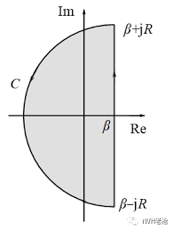

# 拉普拉斯变换

## 拉普拉斯变换导出

很多时候,我们想要对它进行操作的函数,其自变量往往是时间,也就是说,函数的定义域为$[0,+\infty]$.

然而,傅里叶变换的积分范围是$[-\infty,+\infty]$,并且要求被积函数在整个定义域上绝对可积,这是一个比较严格的要求,于是,我们就思考,能不能用一种只在$[0,+\infty]$上操作的积分变换去操作我们的函数,这就是拉普拉斯变换的由来.

考虑一个定义在实数域的函数$g(t)$,想要他满足傅里叶变换的绝对可积条件,首先,先乘上一个阶跃函数$u(t)$干掉其负数的部分,然后再乘上一个衰减因子$e^{-\beta t}$确保其在t较大的时候衰减到0,得到的新函数往往可以满足傅里叶变换:

$$
\int_{-\infty}^{+\infty}g(t)u(t)e^{-(\beta+i \omega)t}dt=\int_{0}^{+\infty}g(t)u(t)e^{-(\beta+i \omega)t}dt=\int_{0}^{+\infty}f(t)e^{-pt}dt
$$

这样我们就得到了拉普拉斯变换:

$$
F(p)=\mathcal{L}(f(t))=\int_{0}^{+\infty}f(t)e^{-pt}dt
$$

其中$F(p)$称为$f(t)$的象函数,他是一个复变函数

### LT存在定理

从上面绝对可积的导出可以看出,拉普拉斯变换存在的充分条件是:

1. $f(t)$分段连续
2. $|f(t)|<M\exp(\sigma_0 t)$

其中$\sigma_0$被称作$f(t)$的增长指数

证明:

$$
\int_0^\infty |f(t)e^{-st}|dt\le M\int_0^\infty e^{-(\sigma-\sigma_0) t}dt=\frac{M}{\sigma-\sigma_0}
$$

这里$\sigma$是象函数的变量的实部,即我们只需要取$Re(s)>\sigma_0$即可保证积分收敛,故拉普拉斯变换一定存在.

并且,LT变换的象函数一定是一个解析函数,首先我们考察下面的积分:

$$
\int_0^\infty \frac{d}{ds}[f(t)e^{-st}]dt=-\int_0^\infty tf(t)e^{-st}dt
$$

注意到:

$$
\int_0^\infty |tf(t)e^{-st}|dt\le M\int_0^\infty t e^{-(\sigma-\sigma_0) t}dt=\frac{M}{(\sigma-\sigma_0)^2}
$$

是有界的,所以上述积分绝对且一致收敛,所以积分和微分次序可以交换,得到:

$$
\frac{d}{ds}F(s)=-\int_0^\infty tf(t)e^{-st}dt=\mathcal{L}[-tf(t)]
$$

即象函数在$Re(s)>\sigma_0$上处处可导,即其具有解析性质,并且由于解析函数的唯一性,其定义域也可以延拓到左边来.

## 拉普拉斯变换的性质

下面我们默认函数是一个信号函数,不是数学上的函数,所以就不用乘一个单位阶跃函数了.

### 线性性质

$$
\mathcal{L}[af(t)+bg(t)]=aF(s)+bG(s)
$$

### 平移性质

$$
\mathcal{L}[f(t-a)]=e^{-as}F(s)
$$

这个性质可以比较方便的求解周期函数的LT,例如,某个周期函数可以看做是在周期内有取值,周期外取值为0的函数值的叠加,那么:

$$
\mathcal{L}[f(t)]=\mathcal{L}[f_1(t)]+\mathcal{L}[f_2(t)]+\cdots=\sum_{i=1}^\infty \mathcal{L}[f_i(t)]=\sum_{i=1}^\infty e^{-iTs}F(s)=\frac{F(s)}{1-e^{-Ts}}
$$

同理,还能导出另外一个平移性质:

$$
\mathcal{L}[e^{at}f(t)]=F(s-a)
$$

第一个性质被称作时移,第二个性质被称作频移.

### 微分性质

$$
\mathcal{L}[f'(t)]\equiv \int_0^\infty f'(t)e^{-st}dt=-f(0)+s\int_0^\infty f(t)e^{-st}dt=sF(s)-f(0)
$$

上式推广一下就得到:

$$
\mathcal{L}[f^{(n)}(t)]=s^nF(s)-s^{n-1}f(0)-s^{n-2}f'(0)-\cdots-f^{(n-1)}(0)
$$

如果在0处没有取值就取右极限.

对前面分析象函数解析性质的证明中,也得到了一个微分性质,将它推广一下得到:

$$
\mathcal{L}[(-t)^nf(t)]=F^{(n)}(s)
$$

### 积分性质

从上面的微分性质得到,对象原函数微分对应的象函数就是乘法,对象函数微分,对应的像原函数也是乘法,所以我们有理由相信,积分对应的是除法.

$$
\mathcal{L}[f(t)]=\mathcal{L}[\frac{d}{dt}\int_0^t f(\tau)d\tau]=s\mathcal{L}[\int_0^t f(\tau)d\tau]
$$

所以就得到:

$$
\mathcal{L}[\int_0^t f(\tau)d\tau]=\frac{F(s)}{s}
$$

多重积分就除以多个s

同理还有下面的性质:

$$
\mathcal{L}[\frac{f(t)}{t}]=\int_s^\infty F(s)ds
$$

积分路径只需要位于$Re(s)>\sigma_0$的右半平面即可.

熟练运用拉氏变换的积分性质和微分性质可以简化很多计算,特别的,还可以用来求解微分方程.

### 极限性质

#### 初值关系

注意到微分性质:

$$
\mathcal{L}[f'(t)]=sF(s)-f(0)
$$

令s趋于正无穷大,左边的积分收敛到0,那么也就得到:

$$
f(0^+)=\lim_{s \to \infty}sF(s)
$$

#### 终值关系

令s趋于0,得到:

$$
\mathcal{L}[f'(t)]=\int_0^\infty f'(t)e^{-st}dt=f(\infty)-f(0)
$$

所以:

$$
f(+\infty)=\lim_{s \to 0}sF(s)
$$

### 卷积

拉普拉斯变换中的卷积定义和傅里叶变换中的相同,但是由于拉普拉斯变换的特殊性,卷积可以进行一定程度的化简:

$$
f(t)*g(t)=\int_{-\infty}^{+\infty}f(\xi)g(t-\xi)d\xi=\int_{0}^{t}f(\xi)g(t-\xi)d\xi
$$

上面的化简应用了信号函数在t<0为0的性质.

#### 卷积定理

显然,LT也满足卷积定理:

$$
\begin{cases} \mathcal{L}(f(t)*g(t))=F(s)G(s), &  \\\mathcal{L^{-1}}(F(s)G(s))=f(t)*g(t) , &  \end{cases}
$$

可以使用卷积定理来求得像原函数.

## 拉普拉斯逆变换

如果复变函数满足LT存在定理的条件,则其像原函数可以有反演公式求得:

$$
f(t)=\frac{1}{2\pi i}\int_{\sigma-i\infty}^{\sigma+i\infty}F(s)e^{st}ds
$$

其中,积分路径是解析右半平面内的一条垂直于实轴的直线.

但是上述公式需要计算一个复积分,而计算复积分我们通常使用留数定理,考虑一个从$\sigma-iR$到$\sigma+iR$的积分路径,我们将R取的足够大以包含F(s)的全部奇点,然后在这片区域上应用留数定理,最后再令R趋于无穷大即可得到:

$$
f(t)=\sum_k Res[F(s)e^{st},s_k]
$$

