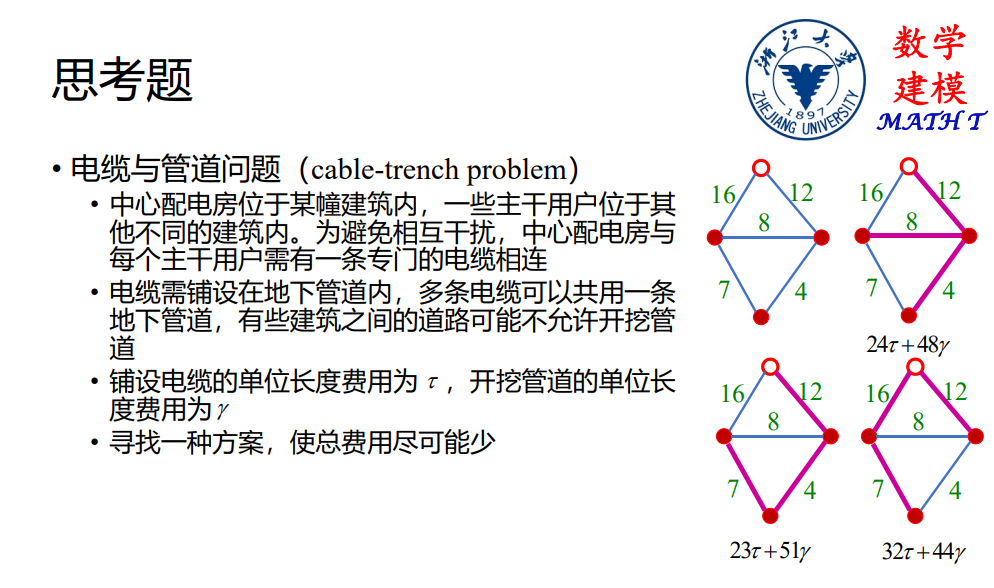

# 图论相关算法

## 关联矩阵,邻接矩阵

对于一个图$G=(V,E)$,我们不妨把点集和边集写成:

$$
\begin{aligned}
V=\{v_1,v_2, \ldots ,vn\} \\
E=\{e_1,e_2, \ldots ,e_m\}
\end{aligned}
$$

我们用关联矩阵来表示顶点和边是否相连:

关联矩阵$M$的元素为:

$$
m_{ij}=
\begin{cases} 1, &顶点v_i与边e_j相互关联  \\ 0, &others  \end{cases}
$$

如果是有向图,点和边存在相对位置关系,需要对上述元素做出一定的修改:

$$
m_{ij}=\begin{cases} 1, &v_i是弧a_j的起点  \\ -1, &v_i是弧a_j的终点\\0, &others  \end{cases}
$$

邻接矩阵是描述顶点之间关系的矩阵

无向非赋权图的邻接矩阵$W$的元素为:

$$
w_{ij}=\begin{cases} 1, &v_i和v_j相邻  \\ 0, &其他  \end{cases}
$$

有向非赋权图

$$
w_{ij}=\begin{cases} 1, &存在从v_i到v_j的弧  \\ 0, &其他  \end{cases}
$$

无向赋权图:

$$
w_{ij}=\begin{cases} 两个顶点之间的权(通常是边长), &v_i和v_j相邻  \\ 0或者\infty, & 两个顶点不相邻 \end{cases}
$$

## 最短路

对于一个连通的无向赋权图,找出从$u_0$到$v_0$的最短路径$d(u_0,v_0)$

### Dijkstra算法

Dijkstra算法的思想来源于这样一个事实：最短路上任意一个子段也是最短路。我们用$l(v)$代表从$u_0$到某个顶点$v$的最短路径长度，用$z(v)$记录路径中$v$的前驱顶点。

算法步骤：
1. **初始化**：
   - 设置所有顶点初始距离：$l(v) = \infty$
   - 起始点距离：$l(u_0) = 0$
   - 已确定顶点集合：$S_0 = \{ u_0 \}$

2. **迭代过程**：
   对于每个未被确定的顶点$v \in V \setminus S_i$：
   $$
   l(v) = \min_{u \in S_i} \{ l(u) + w(u,v) \}
   $$
   其中$w(u,v)$是顶点$u$到$v$的边权

3. **选择下一个顶点**：
   选出当前距离最小的顶点：
   $$
   u_{i+1} = \mathop{\arg\min}\limits_{v \in V \setminus S_i} l(v)
   $$
   更新集合：$S_{i+1} = S_i \cup \{ u_{i+1} \}$

4. **路径回溯**：
   当$v_0 \in S_i$或$i = |V|-1$时终止，通过前驱节点$z(v)$回溯路径

**算法特性**：
- 仅适用于非负权图
- 时间复杂度为$O(|V|^2)$（邻接矩阵实现）
- 每次迭代确定一个顶点的最短路径

在python中可以直接调用库实现Dijkstra算法

```python
import numpy as np
from scipy.sparse.csgraph import dijkstra

# 创建邻接矩阵，0表示无连接，其他值表示边权重
matrix = np.array([[0, 1, 4, 0],
                   [1, 0, 2, 5],
                   [4, 2, 0, 1],
                   [0, 5, 1, 0]])

# 使用Dijkstra算法计算从所有节点出发的最短路径
dist_matrix_dijkstra, predecessors_dijkstra = dijkstra(matrix, return_predecessors=True)

# 该函数有两个返回值

# dist_matrix_dijkstra返回的时最短路矩阵,其中的元素代表任意两个节点之间最短路的长度

# predecessors_dijkstra返回的是父顶点信息p[i,j]代表的是从i到j的最短路中,j的前驱结点的信息
# 根据图最短路的性质,i到j的前驱结点的最短路是i到j的最短路的子集,所以可以继续搜索前驱结点,然后一步步还原路径信息

print("Shortest path matrix using Dijkstra algorithm:")
print(dist_matrix_dijkstra)
print(predecessors_dijkstra)

```

### Floyd算法

floyed算法是一种基于动态规划的,只计算最短路的算法,通常给出的会是最短路矩阵.

他的思路很简单,点i和点j之间会存在大量的中间节点,看看经过一个中间节点会不会比不经过要来的短.

考虑一个邻接矩阵,如果两个点没有直接相连,元素就记做$\infty$

我们最短路矩阵的初始化就使用邻接矩阵,然后考虑经过中间节点k是不是会使得路径更短,假设第k次迭代的时候考虑第k个中间节点,第k次迭代的时候的距离矩阵记做$D$,考虑如下状态转移方程:

$$
d_k[i,j]=\min\{ d_{k-1}[i,j],d_{k-1}[i,k]+d_{k-1}[k,j] \}
$$

经过$k=1,2,\cdots,n$这样的迭代后,就可以得到距离矩阵,各个元素即为最短路的长度.

在python中用以下代码就能计算距离矩阵:

```python
dist_matrix_floyd = floyd_warshall(matrix)
```

### 整数规划模型

上述问题只需要引入一个决策变量,就能转化为一个整数规划问题

$$
x_{ij}=\begin{cases} 1, &从v_i到v_j的边在最短路中  \\ 0, &其他  \end{cases}
$$


其次,顶点不一定在最短路中:

$$
\begin{cases} \sum_{i=1}^n x_{ij}\le 1, &  \\\sum_{j=1}^n x_{ij}\le 1 , &  \end{cases}
$$

如果点i在最短路中,那么他一定存在连接i的点和i连接的点:

$$
\sum_{j=1}^n x_{ji}=\sum_{i=1}^n x_{ij},\quad i\neq 1,m
$$

起点一定在最短路中:

$$
\sum_{j=1}^n x_{1j}=1
$$

终点一定在最短路中:

$$
\sum_{i=1}^n x_{im}=1
$$

最短路不可能流入出发点:

$$
\sum_{i=1}^n x_{i1}=0
$$

不可能有从终点流出的最短路:

$$
\sum_{j=1}^n x_{mj}=0
$$

也就是说,数学模型为:

$$
\begin{aligned}
\min &\sum_{i=1}^n\sum_{j=1}^n w_{ij} x_{ij} \\
& \begin{cases} 
s.t.&\sum_{j=1}^n x_{ji}=\sum_{i=1}^n x_{ij}  ,\\  
&\sum_{i=1}^n x_{ij}\le 1,   \\
&\sum_{j=1}^n x_{ij}\le 1 ,\\
&\sum_{j=1}^n x_{1j}=1,\\
&\sum_{i=1}^n x_{im}=1,\\
&\sum_{i=1}^n x_{i1}=0,\\
&\sum_{j=1}^n x_{mj}=0\\
& x_{ij}\in \{ 0,1 \}
\end{cases}
\end{aligned}
$$


## 最小生成树

生成子图中.连通的无圈图称之为生成树,生成树中,边权和最小的树称之为最小生成树.

### Kruskal算法

1. **初始化**：
   - 将边集按权重升序排列：$E_{sorted} = \{e_1,e_2,...,e_m\}, w(e_1) \leq w(e_2) \leq \cdots \leq w(e_m)$
   - 初始化不相交集合：$\forall v \in V, \mathrm{make\_set}(v)$

2. **迭代加边**：
3. 
   ```plaintext
   T = ∅
   for e = (u, v) in E_sorted:
       if find_set(u) ≠ find_set(v):
           T = T ∪ {e}
           union(u, v)
       if |T| = |V| - 1:
           break
   ```

4. **算法特性**：
   - 时间复杂度：$O(|E|\log|E|)$，主要来自于边的排序
   - 空间复杂度：$O(|V| + |E|)$
   - 贪心策略：每次选择权重最小且不会形成环的边

5. **Python实现**：

```python
# Kruskal算法实现
def kruskal(graph):
    # 初始化边集和结果
    edges = []
    for u in range(len(graph)):
        for v in range(len(graph[0])):
            if graph[u][v] > 0:  # 存在边
                edges.append((u, v, graph[u][v]))
    
    # 按权重排序
    edges.sort(key=lambda x: x[2])
    
    # 初始化并查集
    parent = list(range(len(graph)))
    
    def find(x):
        if parent[x] != x:
            parent[x] = find(parent[x])
        return parent[x]
    
    def union(x, y):
        parent[find(x)] = find(y)
    
    # 构建最小生成树
    mst = []
    for u, v, w in edges:
        if find(u) != find(v):  # 不会形成环
            union(u, v)
            mst.append((u, v, w))
            if len(mst) == len(graph) - 1:
                break
    
    return mst
```

### Prim算法

和Kruskal算法比较类似,也是采用了贪婪思想去构造最小生成树.

### 规划模型

将我们开始生长树的第一个节点记做根节点,编号为1,定义下述决策变量:

$$
x_{ij}=\begin{cases} 1, &从v_i到v_j的边存在于最小生成树中  \\0 , &其他  \end{cases}
$$

首先,从根节点可以生长出至少一个树干:

$$
\sum_{j=1}^n x_{1j}\ge 1
$$

根节点没有入边:

$$
\sum_{i=1}^n x_{i1}=0
$$

树的生长是单向的,除了根以外,其他的节点都只有一条边流入(但是可以流出多条边):

$$
\sum_{i=1}^n x_{ij}=1
$$

MTZ约束,确保图中不出现子圈:

定义一个变量$u$:$u_1=0,1\le u_i\le n-1,i=2,3, \ldots ,n$

$$
u_i-u_j+nx_{ij}\le n-1
$$

所以最小生成树的规划模型为:

$$
\begin{aligned}
\min &\sum_{i=1}^n\sum_{j=1}^n w_{ij} x_{ij} \\
& \begin{cases} 
s.t.&\sum_{j=1}^n x_{1j}\ge 1  ,\\  
&\sum_{i=1}^n x_{i1}=0,\\
&\sum_{i=1}^n x_{ij}=1\\
&u_1=0,1\le u_i\le n-1,i=2,3, \ldots ,n,\\
&u_i-u_j+nx_{ij}\le n-1,\\
& x_{ij}\in \{ 0,1 \}
\end{cases}
\end{aligned}
$$

## 最大流

网络流问题来源于实际生活,有比较强的应用性,最大流问题就抽象自最大现金流或者最大物流等实际问题.

定义一个有向图$D=(V,A)$,在点集中存在源和汇,只会发出弧和接受弧,每一条弧存在一定的容量限制$c(v_i,v_j)$,是设计弧上的流量,使得总流量最大:

流入等于流出:

$$
\sum_{v_i,v_j \in A} f_{ij}=\sum_{v_k,v_i \in A}f_{ki}
$$

容量约束:

$$
0\le f_{ij}\le c_{ij}
$$

所以最大流问题描述为:

$$
\begin{aligned}
&\max v \\
&s.t. \begin{cases} \sum_{v_i,v_j \in A} f_{ij}=\sum_{v_k,v_i \in A}f_{ki}, i \neq s,t  \\ 0\le f_{ij}\le c_{ij},   \\
\sum_{v_s,v_j \in A}f_{sj}=v\\
\sum_{v_k,v_t \in A}f_{kt}=v
\end{cases}
\end{aligned}
$$

## 最小费用流

运输过程中,除了考虑流量,也要考虑流量带来的费用问题,修改一下目标函数就是最小费用流问题:

$$
\begin{aligned}
&\min \sum_{v_i,v_j \in A}b_{ij}f_{ij} \\
&s.t. \begin{cases} \sum_{v_i,v_j \in A} f_{ij}=\sum_{v_k,v_i \in A}f_{ki}, i \neq s,t  \\ 0\le f_{ij}\le c_{ij},   \\
\sum_{v_s,v_j \in A}f_{sj}=v\\
\sum_{v_k,v_t \in A}f_{kt}=v
\end{cases}
\end{aligned}
$$

如果此时的v恰好就是最大流$v_{max}$,那么就是最大流最小费用流问题,v再大一点问题就无解了.


## 电缆与管道问题



如果说,管道的费用$\gamma$远大于铺设电缆的费用,那么,问题就退化为一个以中心配电房为根节点的最小生成树问题,反之,如果电缆的费用$\gamma$远大于开挖管道的费用,那么,中央配电房会倾向于直接挖一条管道与各个用户直接相连,所以,不同的费用会造成不同的结果,不能直接使用图论的算法,尝试写出规划.

不妨设中央配电房的编号为0,有$m$个用户处于图的不同顶点,不难想象,电缆依托于管道存在,所以铺设一定是树状的:

定义决策变量:

$$
x_{ij}=\begin{cases} 1, &存在从i到j的弧  \\ 0, &其他  \end{cases}
$$

树的约束:

根节点不允许有弧进入,并且出度至少大于等于1:

$$
\sum_{j=1}^m x_{0j}\ge 1
$$

$$
\sum_{i=1}^m x_{i0}=0
$$

树的每个节点只允许一条弧进入:

$$
\sum_{i=0}^m x_{ij}=1,\forall j=1,2,\cdots,m
$$

MTZ约束:不允许出现子圈

$$
\begin{aligned}
&u_0=0 \\
&u_{i}-u_j+nx_{ij}\le n-1 \quad i\neq j \quad \forall i=1,2,\cdots,m
\end{aligned}
$$

开挖管道则必定存在电缆,定义决策变量$w_{ij}$为从$v_i$到$v_j$的弧上电缆的数量,显然,在每个枝节点处,树干的电缆数量等于树支的电缆数量之和,在每个叶节点处,电缆的数目等于1:

$$
w_{ij}=\begin{cases} \sum_{k=1}^m w_{jk}, & \sum_{k=1}^m x_{jk}\ge 1  \\ x_{ij}, &  \sum_{k=1}^m x_{jk}=0  \end{cases}
$$

将上述约束线性化:

为此要引进新的0-1决策变量$z_j$:

$$
z_j=\begin{cases} 1, &\sum_{k=1}^m x_{jk}\ge 1  \\ 0, &\sum_{k=1}^m x_{jk}=0  \end{cases}
$$

先线性化这个约束:

$$
\begin{cases} \sum_{k=1}^m x_{jk}\ge  z_j, &  \\ \sum_{k=1}^m x_{jk}\le Mz_j, &  \end{cases}
$$

然后写出$z_j$和$w_{ij}$的关系:

$$
\begin{cases} 
w_{ij}\le \sum_{k=1}^m w_{jk}+M(1-z_j), &  \\
w_{ij}\ge \sum_{k=1}^m w_{jk}-M(1-z_j) , &  \\
w_{ij}\le x_{ij}+Mz_j\\
w_{ij}\ge x_{ij}-Mz_j
\end{cases}
$$

在开挖管道的前提下才能铺设电缆,当管道铺设的时候,至少铺设一条电缆

$$
w_{ij}\le Mx_{ij}
$$

$$
w_{ij}\ge x_{ij}
$$

所有的用户都要被服务到,所以总电缆数等于用户数:

$$
\sum_{j=1}^m w_{0j}=m
$$

因此总结,可以写出规划问题:

$$
\begin{aligned}
\min &\gamma\sum_{i=0}^m \sum_{j=0}^m x_{ij}+\tau\sum_{i=0}^m\sum_{j=0}^m w_{ij} \\
s.t.&
\begin{cases}
   &\sum_{j=1}^m x_{0j}\ge 1\\
   &\sum_{i=1}^m x_{i0}=0\\
   &\sum_{i=0}^m x_{ij}=1\\
   &u_0=0 \\
   &u_{i}-u_j+nx_{ij}\le n-1 \quad i\neq j \quad \forall i=1,2,\cdots,m\\
   &\sum_{k=1}^m x_{jk}\ge  z_j, \\ 
   &\sum_{k=1}^m x_{jk}\le Mz_j,\\
   &w_{ij}\le \sum_{k=1}^m w_{jk}+M(1-z_j), \\
   &w_{ij}\ge \sum_{k=1}^m w_{jk}-M(1-z_j) ,  \\
   &w_{ij}\le x_{ij}+Mz_j\\
   &w_{ij}\ge x_{ij}-Mz_j\\
   &w_{ij}\le Mx_{ij}\\
   &w_{ij}\ge x_{ij}\\
   &\sum_{j=1}^m w_{0j}=m
\end{cases}
\end{aligned}
$$