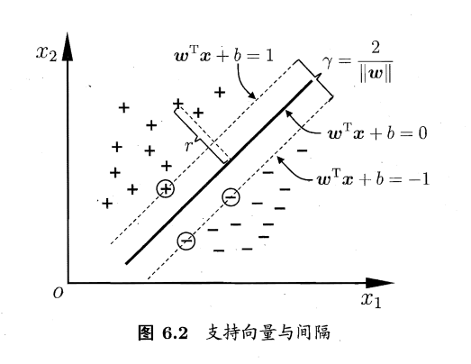
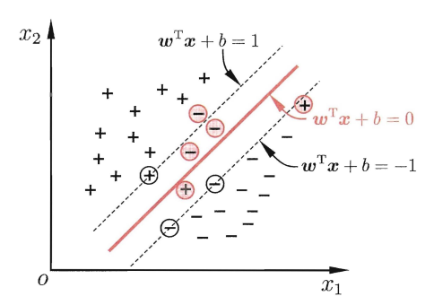
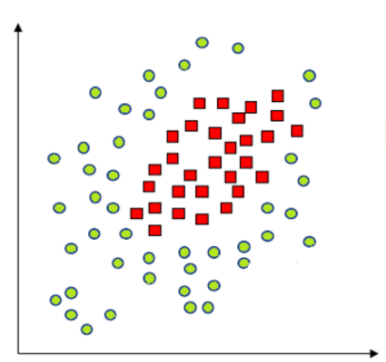
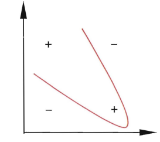
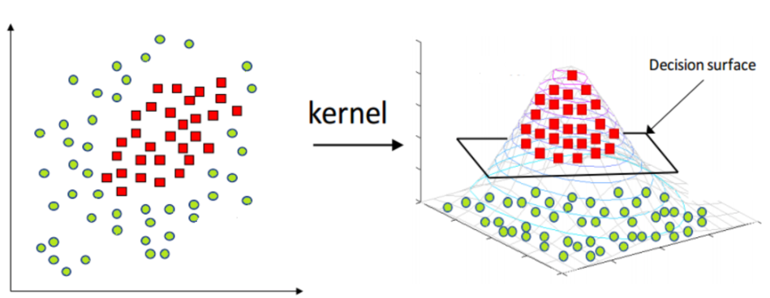
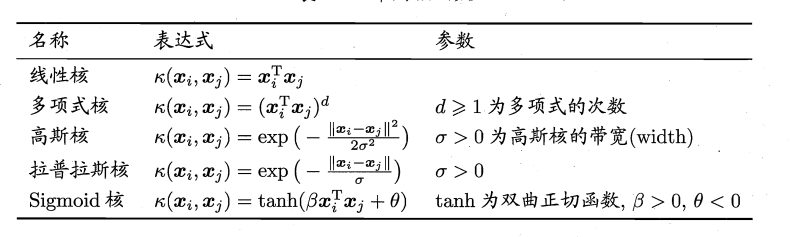

# 支持向量机

## 数学规划

支持向量机解决的是这样一个问题,在一个线性可分的特征空间中,寻找一个判别效果最好的超平面,将数据集分为两个部分.

线性可分就是一个数据集可以被一个超平面分为两个部分,显然,只要存在一个这样的平面,就会有无数个这样的平面,SVM的任务就是寻找最好的这样一个平面.

如何评判平面的分离效果, Vapnik是这样做的,将平面向数据集方向平移,直到首次碰到某一个特征向量就停止,这些特征向量被称作支持向量(support vector),然后,用这两个平面之间的距离来判定超平面的分离效果,该超平面应该尽可能处于间隔的中央,来代表分类的客观性.

这个距离可以表述成为数据集中离平面最近的点(支持向量)到超平面距离的两倍:

$$
 \min_{x} d=\frac{2|w^Tx+b|}{\left\| w \right\|}
$$

我们对平面的系数进行缩放(不会影响平面的表述),使得$|w^Tx_0+b|=1$,其中$x_0$是支持向量,那么距离就可以描述为:

$$
d=\frac{2}{\left\| w \right\|}
$$

支持向量机就是要最大化这个距离,同时我们知道,对于非支持向量,他们到超平面的距离比支持向量到超平面的距离要远的多,同时我们给他贴上标签

$$
\begin{cases} w^Tx_i+b\ge 1, &y_i=1  \\ w^Tx_i+b\le -1, &y_i=-1  \end{cases}
$$

所以我们可以写出规划问题:

$$
\begin{aligned}
\min &\frac{1}{2}\left\| w \right\|^2\\
s.t.\quad &y_i(w^Tx_i+b)\ge 1,\quad i=1,2, \ldots ,N
\end{aligned}
$$

最小化模的倒数和最大化模的平方是一致的

这是一个凸优化问题,存在全局最优解,我们可以比较容易找到他

## 非线性可分

如果说,数据集是非线性可分的,那么上述的规划的约束条件就不能被满足

如图所示,两种特征向量交叉在一起,不能找到一个平面把他们完全分开,但是,可以找到一个看起来还凑合的平面将大部分的不同的特征向量分开.

为了描述这样的分类问题,我们引入一个松弛变量$\mathbf{\xi}$,它有N个分量,对于任何一个特征向量,如果$\xi_i$是一个比较大的正数,那么他一定满足:

$$
y_i(w^Tx_i+b)\ge 1-\xi_i
$$

这样就将约束条件进行了一定的松弛,同时这个松弛变量又不能太大,这样约束条件就不能起作用,所以,需要在目标函数中加入这个变量的正则项来惩罚一下这个变量,让他不要太大:

原规划问题就变为:

$$
\begin{aligned}
\min &\frac{1}{2}\left\| w \right\|^2+C\sum_{i=1}^N \xi_i\\
s.t.\quad &y_i(w^Tx_i+b)\ge 1-\xi_i,\quad i=1,2, \ldots ,N\\
&\xi_i\ge 0
\end{aligned}
$$

## 低维到高维

很多时候,一些问题完全不能使用特征空间中的平面进行分类,即使引入松弛变量,分类的效果也很差,这是因为决策边界完全不能用线性形式表示:

我们当然可以使用一些别的决策边界,例如在logistic回归中可以使用一些多项式函数构造椭圆或者圆形边界,但是这样就不能继续使用我们的支持向量机了,Vapnik提出了一种完全不同的思路,他认为,在低维的特征空间中不能线性可分的数据集在高维空间中可以变得线性可分.并且,维数越高,线性可分分可能性越大,最好是存在一个函数$\varphi(x)$,能够将特征向量映射到无穷维的特征空间中.

以一个简单的异或问题为例,不存在一个超平面将四个数据点正确划分:

但是,如果我们找到一种映射方式,提高特征向量的维度,就可以在高维空间将他们分开,例如:

$$
\mathbf{x}=
\begin{bmatrix}
    a\\
    b
\end{bmatrix}
$$

$$
\varphi(\mathbf{x})=
\begin{bmatrix}
    a^2\\
    b^2\\
    a\\
    b\\
    ab
\end{bmatrix}
$$

那么异或数据集上的四个点就变成:

$$
\begin{aligned}
\varphi(x_1)=[0,0,0,0,0]^T \\
\varphi(x_2)=[1,1,1,1,1]^T\\
\varphi(x_3)=[1,0,1,0,0]^T\\
\varphi(x_4)=[0,1,0,1,0]^T
\end{aligned}
$$

只需要取随便一个正的b,以及类似具有如下形式的w,就能把数据集分开:

$$
w=
\begin{bmatrix}
    -1\\
    -1\\
    -1\\
    -1\\
    6
\end{bmatrix}
$$

w的前几个维度是负的,最后一个是个比较大的正数,经过计算,完全可以将数据集分为正负两类.

有了高维映射,就可以解决决策边界复杂的分类问题,同时我们修改数学规划的形式为:

$$
\begin{aligned}
\min &\frac{1}{2}\left\| w \right\|^2+C\sum_{i=1}^N \xi_i\\
s.t.\quad &y_i(w^T\varphi(x_i)+b)\ge 1-\xi_i,\quad i=1,2, \ldots ,N\\
&\xi_i\ge 0
\end{aligned}
$$

对于无穷维度的映射,数据集一定线性可分,所以规划问题为:

$$
\begin{aligned}
\min &\frac{1}{2}\left\| w \right\|^2\\
s.t.\quad &y_i(w^T\varphi(x_i)+b)\ge 1,\quad i=1,2, \ldots ,N
\end{aligned}
$$

## 核函数

引入了无限维映射后,由于无限维映射本身难以表述,所以优化问题将变得不可解,但是,优化理论告诉我们,使用无限维映射并不需要知道该映射本身的具体形式,我们也可以求解这个优化问题,只需要知道一个被称作核函数的东西.

核函数的定义如下,对于任意两个特征向量和某个无限维映射,存在某个有限维函数,使得:

$$
K(x_1,x_2)=\varphi(x_1)^T\varphi(x_2)
$$

这个函数被称为核函数.

常见的核函数有以下几种形式:

## 对偶问题

为了使用核函数去求解原优化问题,我们需要凸优化的相关知识,其中一个就是对偶问题.对于一个优化问题,其一般形式可以写成:

$$
\begin{aligned}
\min& f(w) \\
s.t.& g_i(w)\le 0\\
&h_i(w)=0
\end{aligned}
$$

首先,定义拉格朗日函数为:

$$
L(w,\alpha,\beta)=f(w)+\sum_{i=1}^N \alpha_ig_{i}(w)+\sum_{i=1}^M \beta_i h_i(w)
$$

其对偶问题的目标函数定义为:

$$
\theta(\alpha,\beta)=\inf_{w}\{ L(w,\alpha,\beta) \}
$$

对偶问题为:

$$
\begin{aligned}
\min \quad &\theta(\alpha,\beta)=\inf_{w}\{ L(w,\alpha,\beta) \} \\
s.t. & \alpha_i\ge 0
\end{aligned}
$$

则存在以下定理:

**定理**:如果说,$w^*$是原问题的解,同时$\alpha^*,\beta^*$是对偶问题的解,则有:

$$
\theta(\alpha^*,\beta^*)\le f(w^*)
$$

!!! info "证明"

    $$
    \theta(\alpha^*,\beta^*)\le L(w^*,\alpha^*,\beta^*)=f(w^*)+\sum_{i=1}^N \alpha_i^*g_{i}(w^*)+\sum_{i=1}^M \beta_i^* h_i(w^*)
    $$

    同时,注意到,$w^*$是原问题的解,所以要满足限制条件:

    $$
    \begin{aligned}
    & g_i(w^*)\le 0\\
    &h_i(w^*)=0 \\
    \end{aligned}
    $$

    同时$\alpha^*$满足对偶问题的限制条件:$\alpha^*\ge 0$

    结合这些条件对不等式进一步缩放即可证明

定义原问题与对偶问题的距离为:

$$
G=f(w^*)-\theta(\beta^*,\alpha^*)\ge 0
$$

那么强对偶定理告诉我们,如果$f(w)$是凸函数,并且约束均为线性约束,则上述的距离变为0,等号会严格成立,于是就能导出KKT条件

## KKT条件

对于一个凸优化问题,如果其约束均为线性约束,则其可行解与其对偶问题的可行解满足:

$$
\begin{aligned}
\alpha_i^*=0 \quad or\quad g_i(w^*)=0 \quad \forall i=1,2, \ldots ,N  \\
\end{aligned}
$$

## 求解原问题

首先,修改一下数学规划的形式,让他和一般的规划样子长得差不多:

$$
\begin{aligned}
\min &\frac{1}{2}\left\| w \right\|^2-C\sum_{i=1}^N \xi_i\\
s.t.\quad &1+\xi_i-y_i(w^T\varphi(x_i)+b)\le 0,\quad i=1,2, \ldots ,N\\
&\xi_i\le 0
\end{aligned}
$$

然后,构造拉格朗日函数:

$$
L(w,b,\xi,\alpha^{(1)},\alpha^{(2)})=\frac{1}{2}\left\| w \right\|^2-C\sum_{i=1}^N \xi_i+\sum_{i=1}^N\alpha^{(1)}_i(1+\xi_i-y_i(w^T\varphi(x_i)+b))+\sum_{i=1}^N \alpha^{(2)}_i\xi_i
$$

极值条件,各个偏导为0:

$$
\begin{aligned}
\frac{\partial L}{\partial w}=w-\sum_{i=1}^N \alpha_i^{(1)}y_i\varphi(x_i)=0 \\
\frac{\partial L}{\partial \xi}=\alpha^{(1)}_i+\alpha^{(2)}_i-C=0\\
\frac{\partial L}{\partial b}=-\sum_{i=1}^N \alpha_i^{(1)}y_i=0
\end{aligned}
$$

同时满足KKT条件:

要么$\alpha_i^{(1)}=0$,要么$1+\xi_i-y_i(w^T\varphi(x_i)+b)=0$

要么$\alpha_i^{(2)}=0$,要么$\xi_i=0$

由于原问题存在无限维映射,难以求解,我们将它转化为对偶问题,代入上面的恒等式化简可以得到:

$$
\theta(\alpha^{(1)},\alpha^{(2)})=\sum_{i=1}^N \alpha^{(1)}_i-\frac{1}{2}\sum_{i=1}^N\sum_{j=1}^N \alpha_i^{(1)}\alpha_j^{(1)} y_iy_jK(x_i,x_j)
$$

限制条件是所有的$\alpha\ge 0$,注意到$\alpha_i^{(1)}+\alpha_i^{(2)}=C$

所以限制条件实际上是:

$$
0\le \alpha^{(1)}_i\le C
$$

所以,极值时候的对偶问题就为:

$$
\begin{aligned}
\max\quad&\theta(\alpha^{(1)})=\sum_{i=1}^N \alpha^{(1)}_i-\frac{1}{2}\sum_{i=1}^N\sum_{j=1}^N \alpha_i^{(1)}\alpha_j^{(1)} y_iy_jK(x_i,x_j) \\
s.t. \quad &0\le \alpha_i^{(1)}\le C\\
&\sum_{i=1}^N \alpha_i^{(1)}y_i=0
\end{aligned}
$$

这个问题是一个有限维的凸优化问题,可以使用SMO算法求解,得到最优的w和b对应的$\alpha^{(1)}$和$\alpha^{(2)}$,然后根据这两个拉格朗日系数求解w和b,但是w的求解中依然涉及到无限维映射,所以,求解w并不是一个明智的选择,我们可以使用表达式直接进行分类:

$$
w^T\varphi(x)+b=\sum_{i=1}^N \alpha_i^{(1)}y_i\varphi(x_i)^T\varphi(x)+b=\sum_{i=1}^N \alpha_i^{(1)}y_iK(x_i,x)+b
$$

分类依据为

$$
\begin{cases} \sum_{i=1}^N \alpha_i^{(1)}y_iK(x_i,x)+b\ge 1, &y=1  \\ \sum_{i=1}^N \alpha_i^{(1)}y_iK(x_i,x)+b\le -1, &y=-1  \end{cases}
$$

b是可以直接求解的,寻找一个不为0的$\alpha_i^{(1)}$,则根据约束关系,此时$\alpha^{(2)}_i\neq 0$,此时$\xi_i=0$:

$$
b=\frac{1-\sum_{j=1}^N \alpha_j^{(1)}y_jK(x_i,x_j)}{y_i}
$$

通常情况下,不为0的$\alpha^{(1)}_i$不止一个,他们求出的b可能会略有不同,为了稳妥起见,可以求多个b然后取平均.

## 算法流程总结

1. 给定数据集$(x_i,y_i)$,在其中划分训练集和测试集

2. 找一个核函数,求解极值对偶问题:

$$
\begin{aligned}
\max\quad&\theta(\alpha^{(1)})=\sum_{i=1}^N \alpha^{(1)}_i-\frac{1}{2}\sum_{i=1}^N\sum_{j=1}^N \alpha_i^{(1)}\alpha_j^{(1)} y_iy_jK(x_i,x_j) \\
s.t. \quad &0\le \alpha_i^{(1)}\le C\\
&\sum_{i=1}^N \alpha_i^{(1)}y_i=0
\end{aligned}
$$

1. 根据求解得到的拉格朗日参数去求解b:

   $$
   b=\frac{1-\sum_{j=1}^N \alpha_j^{(1)}y_jK(x_i,x_j)}{y_i}
   $$

2. 得到支持向量机模型,根据下面的判断式子在测试集中测试效果:
   
$$
\begin{cases} 
\sum_{i=1}^N \alpha_i^{(1)}y_iK(x_i,x)+b\ge 1, &y=1  \\ 
\sum_{i=1}^N \alpha_i^{(1)}y_iK(x_i,x)+b\le -1, &y=-1  
\end{cases}
$$
   
## 多分类

用上述的支持向量机,我们可以在小样本中得到较为不错的分类效果,那如果要执行多分类,该怎么办?

一个朴素的想法是我们训练多个支持向量机,然后让他们投票,认为他该属于哪一类:

例如一个三分类问题$C_1,C_2,C_3$,可以用两种方式执行多分类问题:

第一种:

$$
\begin{aligned}
C_1C_2 \quad C_3 \\
C_2C_3 \quad C_1\\
C_1C_3 \quad C_2
\end{aligned}
$$

可以通过三个支持向量机的输出来判别样本属于哪一类,如果出现无法判断的时候,根据样本离超平面距离较远的那个SVM判断的结果来决定.

第二种:

$$
\begin{aligned}
C_1 \quad C_2 \\
C_1\quad C_3\\
C_2\quad C_3
\end{aligned}
$$

最后的结果根据每个支持向量机投票来选定.

只根据数据集中的部分样本构建不同的局部判别SVM,这种的效果会比上一种好,但是,需要构建$\frac{n(n-1)}{2}$个支持向量机,当样本量大的时候,所需要的模型的个数远多于第一个.

