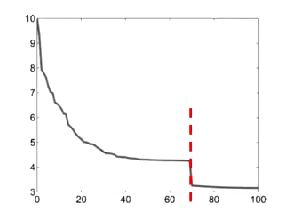
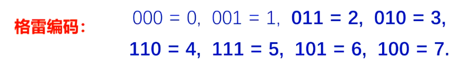
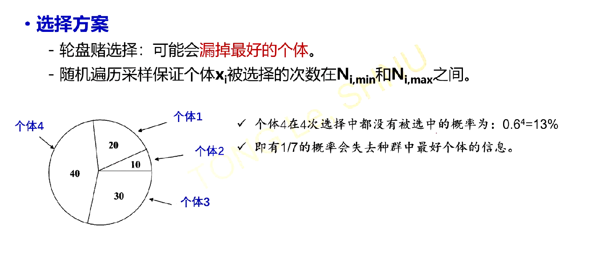
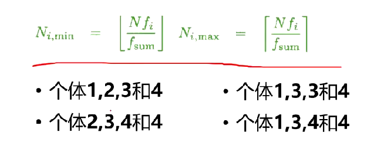
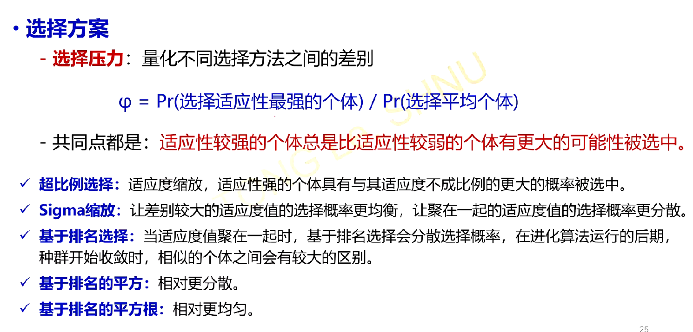
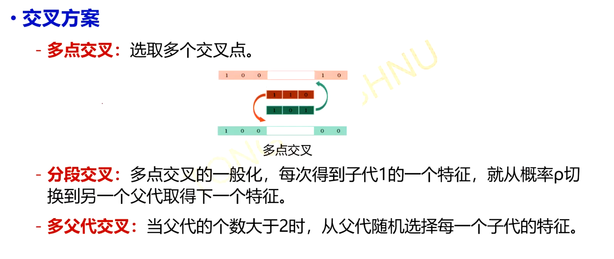

# 启发式算法

## 改进的遗传算法

### 种群初始化
1.初始化的时候生成更多的个体,例如我维持的种群规模是N,那么一开始就生成5N个个体,只留下最好的N个

2.对初始生成的每个个体做梯度下降优化(这个怎么做到,随机交换两个基因然后梯度下降?)

3.定向初始化:结合问题的信息进行初始化

### 收敛准则

1.固定代数

2.在得到的解足够好的时候就停止优化算法

3.在种群不再改进的时候停止优化(平均适应度没有明显改进,最好的个体的适应度没有明显的改变)

有的时候在代数进一步提升的时候,性能有断崖式的增长,但是消耗的计算资源明显增多,得不偿失



### 编码方式

可以将不同的解统一编成二进制编码,作为遗传算法的基因型,但是采用二进制编码会有明显的缺点就是,两个相隔比较远的数可能只有一位不同,而两个相近的数的编码反倒会有可能大不相同,例如011加一个1就是100,他们三位编码全不相同,为了消除汉明距离,可以采用一种叫做格雷编码的编码方式:



### 选择方案



为了防止漏掉最好的个体,需要限制每个个体最少被选择到的次数和最多被选择到的次数



### 选择压力



### 交叉方案



### 精英策略


## 粒子群优化

粒子群优化是效仿鸟类觅食的一种优化算法,一个鸟群在觅食过程中,他会参考自己之前找到食物的方向以及种群中找到最多食物的鸟的方向,长此以往,所有的鸟都会在食物最多的地点汇合.

写成数学的形式就是:

设当下的鸟的速度是$v^{(i)}$,位置是$x^{(i)}$,那么他的速度更新的表达式为:

$$
\begin{aligned}
v^{(i+1)}=\omega v^{(i)}+c_1p_1(pbest^{(i)}-x^{(i)})+c_2p_2(gbest^{(i)}-x^{(i)})\\
\end{aligned}
$$

符号说明:

1. $\omega$被称作惯性因子,惯性因子较大,则算法全局寻优能力强,反之,则局部寻优能力强,一般从0.5取到1.5

2. $c_1$被称作个体学习因子,代表从过去的经验中学习到的方向,一般取2

3. $c_2$被称作社会学习因子,即从种群最优个体中学习的方向,一般取2

4. $x^{(i)},v^{(i)}$代表当前的位置和速度
   
5. $pbest^{(i)}$代表这一时刻及其过去这个个体到达的最好的地点
   
6. $gbest^{(i)}$代表这一时刻的全局最优个体所在的位置
   
位置更新的表达式为:

$$
x^{(i+1)}=x^{(i)}+v^{(i)}
$$

每一步的运动时间取做1

在较大的时间容许范围内,鸟群总可以通过这种方式找到食物最多的地方(目标函数全局最优)


这个算法我感觉相当好用,特别是涉及到一些连续空间的优化问题,很难描述可行解的变化过程,这个时候粒子群算法就给出了一种可行解的变化方式.

## 调库代码

### 粒子群优化

具体的代价函数,维度,粒子个数,因子系数根据实际问题设定

```python
# 导入必要的库
import numpy as np
import matplotlib.pyplot as plt
from pyswarms.single import GlobalBestPSO
from pyswarms.utils.plotters import plot_cost_history

# 1. 定义目标函数
def rosenbrock(x):
    """
    Rosenbrock函数（目标函数）定义。
    输入: x, 形状为 (n_particles, dimensions) 的 numpy 数组
    输出: 返回每个粒子的目标函数值，形状为 (n_particles,)
    """
    return .....

# 2. 设置PSO参数
options = {
    'c1': 0.5,  # 认知参数（个人学习因子）
    'c2': 0.3,  # 社会参数（群体学习因子）
    'w': 0.9    # 惯性权重（控制粒子速度）
}

# 3. 初始化粒子群优化器
dimensions = 2  # 粒子的维度（例如，2维优化问题）
bounds = (-5 * np.ones(dimensions), 5 * np.ones(dimensions))  # 位置的边界
optimizer = GlobalBestPSO(n_particles=30, dimensions=dimensions, options=options, bounds=bounds)

# 4. 运行优化器
cost, pos = optimizer.optimize(rosenbrock, iters=100)

# 5. 输出结果
print(f"最佳解的位置: {pos}")
print(f"最小化的目标函数值: {cost}")

# 6. 可视化优化过程
plot_cost_history(cost_history=optimizer.cost_history)
plt.title('粒子群优化的目标函数值变化曲线')
plt.xlabel('迭代次数')
plt.ylabel('目标函数值')
plt.show()


```

### 遗传算法

```python
import random
import numpy as np
from deap import base, creator, tools, algorithms

# 1. 定义目标函数（适应度函数）
def rastrigin(individual):
    """
    Rastrigin函数：测试优化算法的非线性函数
    输入: individual, 一个代表解的列表（个体）
    输出: 适应度值（Rastrigin函数值的负值，因为DEAP默认求最大值）
    """
    A = 10
    n = len(individual)
    return A * n + sum([(x**2 - A * np.cos(2 * np.pi * x)) for x in individual]),

# 2. 设置遗传算法参数

# 定义最大化适应度为目标的单目标优化问题
creator.create("FitnessMin", base.Fitness, weights=(-1.0,))
creator.create("Individual", list, fitness=creator.FitnessMin)

# 初始化工具箱
toolbox = base.Toolbox()
toolbox.register("attribute", random.uniform, -5.12, 5.12)  # 个体特征的初始化范围
toolbox.register("individual", tools.initRepeat, creator.Individual, toolbox.attribute, n=2)  # 个体初始化
toolbox.register("population", tools.initRepeat, list, toolbox.individual)  # 种群初始化

toolbox.register("mate", tools.cxBlend, alpha=0.5)  # 交叉操作
toolbox.register("mutate", tools.mutGaussian, mu=0, sigma=1, indpb=0.2)  # 变异操作
toolbox.register("select", tools.selTournament, tournsize=3)  # 选择操作
toolbox.register("evaluate", rastrigin)  # 评估函数

# 3. 运行遗传算法
def main():
    # 设置随机数种子
    random.seed(42)

    # 初始化种群
    population = toolbox.population(n=100)  # 种群数量

    # 记录统计信息
    stats = tools.Statistics(lambda ind: ind.fitness.values)
    stats.register("avg", np.mean)
    stats.register("std", np.std)
    stats.register("min", np.min)
    stats.register("max", np.max)

    # 运行遗传算法
    population, logbook = algorithms.eaSimple(
        population, toolbox, cxpb=0.5, mutpb=0.2, ngen=50, stats=stats, verbose=True
    )

    # 输出最佳解
    best_individual = tools.selBest(population, 1)[0]
    print(f"最佳个体: {best_individual}, 最佳适应度值: {best_individual.fitness.values[0]}")

    # 返回日志记录和最佳个体
    return logbook, best_individual

# 4. 执行主函数
if __name__ == "__main__":
    logbook, best_individual = main()

# 5. 可视化优化过程
import matplotlib.pyplot as plt

gen = logbook.select("gen")
fit_min = logbook.select("min")

plt.plot(gen, fit_min, label="最小适应度值")
plt.xlabel("世代数")
plt.ylabel("适应度值")
plt.title("遗传算法优化过程")
plt.legend()
plt.grid()
plt.show()

```

### 模拟退火算法

```python
import numpy as np
import matplotlib.pyplot as plt
from scipy.optimize import basinhopping

# 定义目标函数
def rastrigin(x):
    A = 10
    return A * len(x) + sum([(xi**2 - A * np.cos(2 * np.pi * xi)) for xi in x])

# 初始解
x0 = np.array([5.0, 5.0])  # 任意初始点

# 定义模拟退火的“跳跃”步长
minimizer_kwargs = {"method": "L-BFGS-B"}

# 运行模拟退火算法
result = basinhopping(rastrigin, x0, minimizer_kwargs=minimizer_kwargs, niter=200)

# 输出结果
print("最佳解的位置:", result.x)
print("最小化的目标函数值:", result.fun)

# 绘制目标函数和最佳解
x = np.linspace(-5.12, 5.12, 400)
y = np.linspace(-5.12, 5.12, 400)
X, Y = np.meshgrid(x, y)
Z = rastrigin([X, Y])

plt.figure(figsize=(8, 6))
plt.contour(X, Y, Z, levels=np.logspace(0, 5, 35), cmap='viridis')
plt.plot(result.x[0], result.x[1], 'r*', markersize=15)
plt.title("Rastrigin Function with Simulated Annealing Solution")
plt.colorbar()
plt.show()

```

### 贝叶斯优化

机器学习中超参数调优使用的一种算法,运行速度快,特别高效.

```python
import optuna
import numpy as np

# 定义目标函数（Rosenbrock函数）
def objective(trial):
    # 定义超参数的搜索空间
    x = trial.suggest_uniform('x', -5.0, 5.0)  # 定义变量x的搜索范围
    y = trial.suggest_uniform('y', -5.0, 5.0)  # 定义变量y的搜索范围
    
    # 计算目标函数值（Rosenbrock函数）
    return ...

# 创建一个优化器（study），默认使用TPE算法（贝叶斯优化的一种）
study = optuna.create_study(direction='minimize')  # 指定最小化目标
study.optimize(objective, n_trials=50)  # 进行优化，指定最大迭代次数为50

# 输出最佳结果
print(f"最佳解的位置: {study.best_params}")
print(f"最小化的目标函数值: {study.best_value}")

# 可视化优化历史
optuna.visualization.plot_optimization_history(study).show()

# 可视化参数重要性（需要安装 optuna[plotly] 才能使用）
optuna.visualization.plot_param_importances(study).show()

```