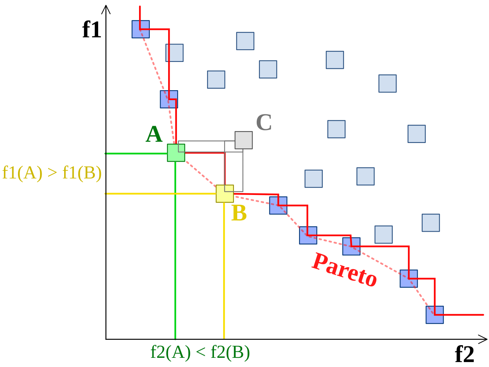

# 多目标规划

现实生活中存在制约决策的多种因素,而人们常常是既要又要的,即总希望规划问题的多个目标函数同时达到最优,然而,很遗憾,这通常是难以做到的,只有极少数的情况可以存在绝对最优解使得多个目标函数达到最小值,这就需要我们在可行解中做出一定的权衡,完成资源配置.

多目标规划的完整形式为:

$$
\begin{aligned}
\min & \mathbf{f(x)}=[f_1(\mathbf{x}),f_2(\mathbf{x}), \ldots ,f_m(\mathbf{x})] \\
s.t.&\begin{cases} g_i(\mathbf{x})\le 0, &i=1,2,\cdots,p  \\ h_j(\mathbf{x})=0, &j=1,2,\cdots,q  \end{cases}
\end{aligned}
$$

能够同时满足所有目标函数达到最小值的解为绝对最优解,满足:

$$
f_i(\mathbf{\bar{x}})\le f_i(\mathbf{x})\quad \forall \mathbf{x} \in \Omega,\forall i=1,2,\cdots,n
$$

## 有效解和满意解

Pareto最优是经济学上的一个概念,他指的是,当国家的资源完成配置后,没有办法在不损害他人的利益的情况下改善一个人的生活.

在数学上指的是,对于一个解,不存在可行解,使得可行解的所有目标函数都要优于这个解

即对于解$\bar{\mathbf{x}}$,和任意一个解$\mathbf{x}$,不能使得所有目标函数值都满足:

$$
f_i(\mathbf{x})\le f_i(\mathbf{\bar{x}}),\forall i=1,2,\cdots,n
$$

但是可以存在某一个目标函数值比他要好:

$$
f_j(\mathbf{x})< f_j(\mathbf{\bar{x}})
$$

这个解就被称作pareto最优解也叫有效解.

从上面的定义来看,有效解是不能被任何一个可行解所改进的,他已经达到了限制条件下的一种最优配置,并且比非有效解的可行解都要好.

所有的pareto最优解构成的前沿叫做pareto前沿,如下图所示:

有的时候,决策者也会知难而退,他认为,目标函数只要低于一定的阈值他就可以接受,于是他给出了m个阈值$\alpha_i$,只要满足:

$$
f_i(\mathbf{x})\le\alpha_i,\forall i=1,2,\cdots,n 
$$

他就满意了,接受了这个解,这样的解叫做满意解

所以,多目标规划实际上是在多个pareto最优解之间进行权衡,不同方法的参数设置会带来不同的有效解,具体根据使用者的需求来确定.

## 线性加权法

将所有的目标函数加权平均,转化为单目标规划问题:

$$
\min \sum_{i=1}^n w_if_i(\mathbf{x})
$$

$$
\sum_{i=1}^n w_i=1
$$

可以根据任务的重要程度设定各个目标函数的权重

## $\varepsilon$约束法

根据设计者的偏好,优先满足某一个目标函数,其他的只要低于一定值就可以了:

$$
\begin{aligned}
\min &f_k(\mathbf{x}) \\
s.t.&f_i(\mathbf{x})\le \varepsilon_i\quad\forall i=1,2,\cdots,n,i\neq k 
\end{aligned}
$$

## 理想点法

衡量目标函数向量和最优值目标函数向量之间的距离.我们吧目标函数的最优值组成的向量叫做最优值目标函数向量,也称理想点:

$$
\min \sum_{i=1}^n w_i(f_i(\mathbf{x})-f_i^*)^2
$$

权重可以自行设置,也可以将权重全部设置相同,这种办法的缺点就是要解n个优化问题,耗费的计算资源比较大.

## 优先级法

类似于贪婪算法,优先满足我们认为比较重要的目标函数的最小值:

将函数按照重要度排序,先计算:$ f_1^*=\min_{\mathbf{x}\in\Omega} f_1(\mathbf{x})$

然后计算优化问题:

$$
\begin{aligned}
\min f_2(\mathbf{x}) \\
s.t.f_1(\mathbf{x})=f_1^*
\end{aligned}
$$

以此类推,直到计算:

$$
\begin{aligned}
\min &f_n(\mathbf{x}) \\
s.t.&f_1(\mathbf{x})=f_1^*\\
&f_1(\mathbf{x})=f_1^*\\
&\vdots\\
&f_{n-1}(\mathbf{x})=f_{n-1}^*
\end{aligned}
$$

得到所有的目标函数值

