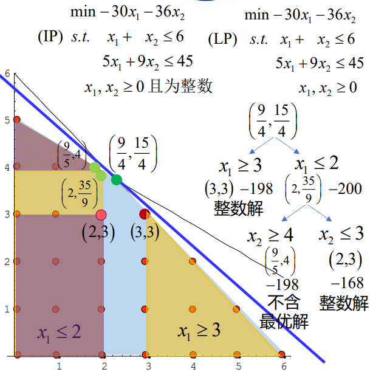

# 数学规划

数学规划有许多分支，按照函数性质大致可以分为下面几类

!!! 按照函数性质分类

    * 数学规划
    - 线性规划（linear programming）
        - 目标函数为线性函数，约束条件为线性等式或不等式
    - 非线性规划（nonlinear programming）
        - 目标函数为非线性函数，或至少有一个约束条件为非线性等式或不等式
            - 二次规划（Quadratic Programming, QP）：目标函数为二次函数，约束条件为线性等式或不等式
            - 带二次约束的二次规划（Quadratically Constrained Quadratic Program， QCQP）：目标函数为二次函数，约束条件为线性或二次等式或不等式
            - 线性分式规划（linear fractional programming）：目标函数为两个线性函数的商，约束条件为线性等式或不等式
  
## 经典数学规划问题

### 食谱问题

仓库里面有$n$种不同的事物,第$j$种食物的售价是$c_j$,包含第$i$种营养成分的含量是$a_{ij}$,每个人一天内至少需要摄入第$i$种营养成分$b_i$个单位,人体必须的营养成分有$m$种,但是这个人囊中羞涩,同时不太追求享受,所以他想要最为经济的配食方案.

我们定义一个决策变量$x_j$代表他摄入$j$号食物的数量

不难看出,目标函数就是:

$$
\min \sum_{j=1}^n c_jx_j
$$

同时约束条件是:

$$
\sum_{j=1}^na_{ij} \ge b_i , i=0,1\cdots m
$$

$$
x_j\ge 0 ,j=0,1, \ldots n
$$

### 运输问题

现在有$m$个产地和$n$个销售地,产地i的生产能力是$a_i$,销售地$j$的销售能力是$b_j$,从产地$i$运往销售地$j$所需要的单位重量的运费是$c_{ij}$,那么,如何调运货物,使得所有商品恰好卖出,并且运输费用最小?

1. 产销平衡

$$
\sum_{i=1}^ma_i=\sum_{j=1}^nb_j
$$

1. 定义决策变量$x_{ij}$为从$i$运往$j$的货物数量
   所以会有:
   
$$
\begin{aligned}
&0\le x_{ij}\le \min(a_i,b_j) \\
&\sum_{i=1}^m x_{ij}=b_j\\
&\sum_{j=1}^n x_{ij}=a_i
\end{aligned}
$$

1. 目标函数 
   
$$
\min\sum_{i=1}^m\sum_{j=1}^n c_{ij}x_{ij}
$$

### 下料问题

现在有总长为$W$的钢管$m$根($m$足够大),要制造一件物品,需要长度为$w_j$的钢管$b_j$根,问,如何去截取钢管,使得被截取的钢管根数最少?

构造两个决策变量

$$
\begin{aligned}
x_{ij}=第i根钢管被截取j类短管的数目\\
y_i=\begin{cases} 1,第i根钢管被截取 &  \\0 ,第i根钢管没有被截取 &  \end{cases}
\end{aligned}
$$

所以会有以下约束条件:

1. 每根钢管被截取的总长度不超过允许被截长度:

$$
\sum_{j=1}^{n}x_{ij}w_j \le Wy_i
$$

2. 每类管子的根数要够数
   
$$
\sum_{i=1}^m x_{ij}\ge b_j
$$

3. 非负约束

$$
x_{ij}\ge 0
$$

目标函数,这里要需要的管子根数最少:

$$
\min \sum_{i=1}^m y_i
$$

### 选址问题

平面上有$n$个点,坐标已知,现在,要找到一个面积最小的圆,使得这$n$个点都落在圆内.

显然,这个问题的决策变量有两个,一个是圆心坐标$(x_0,y_0)$,另一个是圆的半径$r$,可以比较轻松地写出规划:

$$
\begin{aligned}
\min &r^2 \\
s.t.&(x_i-x_0)^2+(y_i-y_0)^2\le r^2,\quad i=1,2\cdots n
\end{aligned}
$$

但是这样子的话就是二次约束,规划是二次规划,稍微修改一下决策变量,令$\lambda=r^{2}+x_0^2+y_0^2$,于是规划可以改写为线性规划:

$$
\begin{aligned}
\min &\lambda+x_0^2+y_0^2 \\
s.t. &\lambda\ge x_i^2-2x_ix_0+y_i^2-2x_ix_0
\end{aligned}
$$

### 时间分配问题

假如你是一个大学牲,现在已经临近期末了,你有$T$天的时间用于复习$n$门课程,你的效率有限,一天只能复习一门课程,而且不太聪明,由于害怕挂科,一门课程至少需要复习一天,用$t$天的时间去复习第$j$门课程可以提高$p_{tj}$分,那么,你要如何分配复习时间,可以使得提升的总分最大?

定义决策变量:

$$
x_{tj}=\begin{cases} 1,第j门课程复习t天 &  \\ 0, others&  \end{cases}
$$

那么该问题就可以描述为:

$$
\begin{aligned}
\min&\sum_{t=1}^T\sum_{j=1}^N p_{tj}x_{tj} \\
s.t.&\sum_{t=1}^Tx_{tj}=1\\
&\sum_{j=1}^n \sum_{t=1}^T tx_{tj}\le T
\end{aligned}
$$

### 投资组合

投资组合问题本质上是一个双目标优化的问题

金融市场上有$n$种证券,其中,证券$j$的收益率为随机变量$r_j$,

记$\mathbf{r}=(r_1,r_2, \ldots r_n)^T$,其期望向量记做$\boldsymbol{\mu}$,协方差矩阵为$\mathbf{V}$

问,我该如何分配我的投资份额,使得我的收益最大,风险最小呢?

记$\mathbf{x}=(x_1,x_2, \ldots x_n)^T$为我的份额向量,这个问题实际上是在问,如何选择我的份额向量,使得收益$E(\mathbf{x}^Tr)=\mathbf{x}^T\boldsymbol{\mu}$最大,同时方差$Var(\mathbf{x}^Tr)=\mathbf{x}^TV\mathbf{x}$最小.

这是一个双目标函数的规划,比较困难,我们做如下的简化,先固定其中一个变量,让这个人赚到一定的钱就能够满意,在到达给定收益$\mu$的情况下,使得风险最小,于是,就可以描述为以下单目标函数规划问题:

$$
\begin{equation*}
\begin{aligned}
& \text{min} \quad \mathbf{x}^T \mathbf{V} \mathbf{x} \\
& \text{s.t.} \quad \mathbf{x}^T \boldsymbol{\mu} = \mu \\
& \quad \quad \quad \mathbf{x}^T \mathbf{e} = 1
\end{aligned}
\end{equation*}
$$

构造拉格朗日函数:

$$
L(\mathbf{x},\lambda_1,\lambda_2)=\mathbf{x}^T \mathbf{V} \mathbf{x}+\lambda_1(\mathbf{x}^T \boldsymbol{\mu}-\mu)+\lambda_2(\mathbf{x}^T \mathbf{e}-1)
$$

得到如下偏微分方程组:

$$
\begin{cases}
\frac{\partial \mathcal{L}(\mathbf{x}, \lambda_1, \lambda_2)}{\partial \mathbf{x}} = 2V\mathbf{x} - \lambda_1 \bm{\mu} - \lambda_2 \mathbf{e} = 0 \\
\frac{\partial \mathcal{L}(\mathbf{x}, \lambda_1, \lambda_2)}{\partial \lambda_1} = -(\mathbf{x}^\top \bm{\mu} - \mu) = 0 \\
\frac{\partial \mathcal{L}(\mathbf{x}, \lambda_1, \lambda_2)}{\partial \lambda_2} = -(\mathbf{x}^\top \mathbf{e} - 1) = 0
\end{cases}
$$

把(1)得到的$\mathbf{x}$代入到(2)(3)中去,会有:

$$
\begin{pmatrix}
\bm{\mu}^\top \\
\mathbf{e}^\top
\end{pmatrix}
\mathbf{x} =
\begin{pmatrix}
\mathbf{\mu} \\
1
\end{pmatrix}
\Rightarrow
\frac{1}{2}
\begin{pmatrix}
\bm{\mu}^\top \\
\mathbf{e}^\top
\end{pmatrix}
\mathbf{V}^{-1}
\begin{pmatrix}
\bm{\mu} & \mathbf{e}
\end{pmatrix}
\begin{pmatrix}
\lambda_1 \\
\lambda_2
\end{pmatrix}=
\begin{pmatrix}
\mathbf{\mu} \\
1
\end{pmatrix}
$$

于是就可以解出拉格朗日算子:

$$
\begin{pmatrix}
\lambda_1 \\
\lambda_2
\end{pmatrix}
= 2\mathbf{A}^{-1}
\begin{pmatrix}
\mu \\
1
\end{pmatrix}
$$

其中:

$$
\begin{aligned}
&\mathbf{A} = 
\begin{pmatrix}
\bm{\mu}^\top \\
\mathbf{e}^\top
\end{pmatrix}
\mathbf{V}^{-1}
\begin{pmatrix}
\bm{\mu} & \mathbf{e}
\end{pmatrix}=
\begin{pmatrix}
\bm{\mu}^\top \mathbf{V}^{-1} \bm{\mu} & \bm{\mu}^\top \mathbf{V}^{-1} \mathbf{e} \\
\mathbf{e}^\top \mathbf{V}^{-1} \bm{\mu} & \mathbf{e}^\top \mathbf{V}^{-1} \mathbf{e}
\end{pmatrix}=
\begin{pmatrix}
a & b \\
b & c
\end{pmatrix}\\
&\textbf{A} 为二阶正定矩阵,
\mathbf{A}^{-1} = \frac{1}{ac - b^2}
\begin{pmatrix}
c & -b \\
-b & a
\end{pmatrix}
\end{aligned}
$$

所以得到最优解:

\[
\mathbf{x}^*(\mu) = \mathbf{V}^{-1} 
\begin{pmatrix}
\bm{\mu} & \mathbf{e}
\end{pmatrix}
\mathbf{A}^{-1}
\begin{pmatrix}
\mu \\
1
\end{pmatrix}
\Rightarrow
\mathbf{x}^*(\mu) = \frac{1}{ac - b^2} \mathbf{V}^{-1}
\begin{pmatrix}
\bm{\mu} & \mathbf{e}
\end{pmatrix}
\begin{pmatrix}
c & -b \\
-b & a
\end{pmatrix}
\begin{pmatrix}
\mu \\
1
\end{pmatrix}
\]

以及此时对应的风险(方差):

\[
\begin{aligned}
&\sigma^*(\mu)^2 = \mathbf{x}^*(\mu)^\top \mathbf{V} \mathbf{x}^*(\mu) = (\mu \quad 1) \mathbf{A}^{-1} 
\begin{pmatrix}
\mu \\
1
\end{pmatrix}
= (\mu \quad 1) \mathbf{A}^{-1} 
\begin{pmatrix}
\mu \\
1
\end{pmatrix} \\
&= \frac{1}{ac - b^2} (\mu \quad 1)
\begin{pmatrix}
c & -b \\
-b & a
\end{pmatrix}
\begin{pmatrix}
\mu \\
1
\end{pmatrix}
= \frac{a - 2b\mu + c\mu^2}{ac - b^2}
\end{aligned}
\]

这个结果其实代表风险和收益构成双曲线的一支:

$$
\frac{\sigma^*(\mu)^2}{\frac{1}{c}} - \frac{\left({\mu - \frac{b}{c}}\right)^2}{\frac{{{ac - b^2}}}{c^2}} = 1
$$

其中,收益随着风险的增大而增大的那一部分我们称之为有效前沿,反之,则称之为无效前沿:


### 支持向量机

想要把一个数据集$S$分为$C_1,C_2$两类,每个数据有$n$个特征,可以用$n$维实向量来表示.

现在,在数据集当中划分出训练集$S^{'} \subseteq S$,其中,训练集的数据的划分都是已知的

记:

$$
y_i=\begin{cases}1 ,x_i \in C_1 &  \\ -1,x_i \in C_2 &  \end{cases}
$$

假设训练集可以线性分离,试求一张判别效果最好的超平面$z=\vec{w}\cdot\vec{x}+b$,使得:

$$
z=\begin{cases} \overrightarrow{w}\cdot\overrightarrow{x_i}+b>0, &x_i \in C_1  \\\overrightarrow{w}\cdot\overrightarrow{x_i}+b<0, &x_i \in C_2  \end{cases}
$$

也可以写成:

$$
y_i(\overrightarrow{w}\cdot\overrightarrow{x_i}+b)>0
$$

!!! info "超平面的定义"
      

那么,怎么样认为这张超平面的判别效果比较好呢,超平面是用来分类的,只要让所有点到超平面距离的最小值尽可能的大,这样被划分的两个区域离得就尽可能远,我们就认为超平面的判别效果越好:


于是支持向量机(SVM)就可以写成多目标规划:

$$
\begin{aligned}
\max \min \quad&|\overrightarrow{w}\cdot\overrightarrow{x_i}+b| \\
s.t.\quad & y_i(\overrightarrow{w}\cdot\overrightarrow{x_i}+b)>0\\
&\overrightarrow{w}\cdot\overrightarrow{w}=1
\end{aligned}
$$

这个其实不太美妙,因为目标函数存在绝对值,并且约束条件是二次约束,很难直接求解,不难看出,如果上面的规划问题有解,那么他就与下面的形式等价:

$$
\begin{aligned}
\max \min \quad&y_i(\overrightarrow{w}\cdot\overrightarrow{x_i}+b) \\
s.t.\quad 
&\overrightarrow{w}\cdot\overrightarrow{w}=1
\end{aligned} \tag{1}
$$

现在变成了含二次约束的线性目标函数,事实上,还存在另一种含线性约束的二次目标函数的规划:

$$
\begin{aligned}
\min \quad &\overrightarrow{w}\cdot\overrightarrow{w} \\
s.t.\quad &y_i(\overrightarrow{w}\cdot\overrightarrow{x_i}+b)\ge 1
\end{aligned}\tag{2}
$$

$(2)$ 和 $(1)$ 的解存在如下关系:

若$(\vec{w_0},b_0)$是$(2)$的最优解,那么$(\frac{\overrightarrow{w_0}}{\sqrt{\Vert w_0\Vert}},\frac{b_0}{\sqrt{\Vert w_0\Vert}})$则是$(2)$的最优解.


!!! tip "证明"
    设$(\overrightarrow{w^*},b^*)$是$(2)$的最优解,那么就会有最小的最优值:
    
    $$
      \gamma^*=\min y_i(\overrightarrow{w^*}\cdot\overrightarrow{x_{i}}+b^*)
    $$

      所以对于任意的$i=1,2, \ldots n$,始终会有:

    $$
      y_i(\overrightarrow{w^*}\cdot\overrightarrow{x_{i}}+b^*)\ge \gamma^*
    $$

      于是就得到:

    $$
      y_i(\overrightarrow{w^*}/\gamma^*\cdot\overrightarrow{x_{i}}+b^*/\gamma^*)\ge 1
    $$

      所以 $(\overrightarrow{w^*}/\gamma^*,b^*/\gamma^*)$ 是$(2)$的一个可行解,又因为$(\overrightarrow{w_0},b_0)$是$(2)$的最优解,所以:

    $$
      \overrightarrow{w^*}/\gamma^*\cdot\overrightarrow{w^*}/\gamma^*=\frac{1}{(\gamma^*)^2}\ge  \overrightarrow{w_0}\cdot \overrightarrow{w_0}
    $$

      所以:

    $$
      y_i(\frac{\overrightarrow{w_0}}{\sqrt{\Vert w_0\Vert}}\cdot \overrightarrow{x_i}+\frac{b_0}{\sqrt{\Vert w_0\Vert}})\ge \gamma^*y_i(\overrightarrow{w_0}\cdot\overrightarrow{x_i}+b_0)\ge \gamma^*
    $$

      所以解 $(\frac{\overrightarrow{w_0}}{\sqrt{\Vert w_0\Vert}},\frac{b_0}{\sqrt{\Vert w_0\Vert}})$ 的目标值不会小于最小的最优值,所以它也是最优解.

### 大规模仓网优化问题

在激烈的商业变革中，为了满足消费者对供应时效性的需求，生鲜电商企业愈发注重在预算成本区间内不断提高自身的物流速度以及履约能力。为解决传统的仓网系统所带来的爆仓、供应时效低、物流成本浪费等一系列问题，决定优化目前的仓网规划方案，构建智能仓网规划系统，真正实现智慧仓储、一体化供应链管理。

以生鲜水果的仓网规划为例，该生鲜电商供货的线下门店分布在全国一百多个不同城市中，针对国产水果和进口水果，分别设立直供采摘基地和港口进货点，并分别设立不同的CDC[(Central Distribution Center)为中央配送中心（总仓），一般为仓储网络的第一层，负责从水果直供采摘基地或港口进货点提货并供应次级仓库或者门店。] 和 RDC[RDC (Regional Distribution Center)为区域配送中心（分仓），在仓储网络中属于CDC 的下一级，负责从 CDC 提货并供应门店。] 仓库。以进口水果为例，其仓网结构如下图所示：


该仓网规划的目标是在满足门店需求量、仓库时效性、调拨要求、出入库处置量等约束条件下，最小化仓网系统的总物流成本，运用数据科学方法和运筹优化技术，实现最优仓库选址策略（包括选取所开设的仓库数量与位置）以及运输调拨方案（各级仓库之间、仓库到门店之间）

基于附件 5：点位之间距离时效信息表、附件 6 ：订单需求量表、附件 7 ：仓储数据表，针对以上问题描述，构建数学优化模型，在满足上述约束条件的前提下，构建最小化总物流成本的最优仓网布局方案和物流调拨案。

不妨设有m个CDC,有n个DC,有N个城市,定义一个i,j,k

注意看这句话:

**==一个门店的进口水果订单需求仅能由港口CDC 或者是一个 RDC 服务；一个门店的国产水果订单需求仅能由内陆 CDC 或者是一个RDC 服务==**


i从1-m,j从1-n,k从1到N,定义一个决策变量:

我们应该考虑把决策变量分开,因为一个城市可以由不同库供应,只要他们不供应同一种东西,不分开的话难以满足上面那句话

我们用上标a代表供应国产水果,用上标b代表供应进口水果

定义调度变量,t_{什么,什么},代表从什么往什么的调度:

$$
\begin{aligned}
t_{ij}^{(a)},i号CDC往j号DC的调拨量 \\
t_{ik}^{(a)},i号CDC往k号城市的调拨量\\
t_{jk}^{(a)},j号DC往k号城市的调拨量\\
\end{aligned}
$$

定义决策变量,代表是否存在这条通路:

$$
x_{ik}^{(a)}=
\begin{cases} 1, &从i号CDC调拨往k号城市  \\ 0,& others \end{cases}
$$

$$
x_{jk}^{(a)}=
\begin{cases} 1, &从j号DC调拨往k号城市  \\ 0,& others \end{cases}
$$

然后看黄色的那句话,也就是要满足:

$$
\begin{aligned}
\sum_{i=1}^mx_{ik}^{(a)}+\sum_{j=1}^nx_{jk}^{(a)}=1 \\
\sum_{i=1}^mx_{ik}^{(b)}+\sum_{j=1}^nx_{jk}^{(b)}=1 
\end{aligned}
$$

对于DC站,他可以选择开设或者不开设,所以要定义决策变量:

$$
z_j=
\begin{cases} 1,j仓库开设 &  \\ 0,j仓库不开设 &  \end{cases}
$$

需要满足供求关系,所以有以下约束

每个城市的需求量需要被满足:

$$
\sum_{i=1}^m t_{ik}^{(a)}+\sum_{j=1}^n t_{jk}^{(a)}=a_k
$$

$$
\sum_{i=1}^m t_{ik}^{(b)}+\sum_{j=1}^n t_{jk}^{(b)}=b_k
$$


下一步的约束就是把t,x,z联系起来,形成变量之间的约束:

首先,考虑单个仓库运输的量肯定等于需求的量,因为单种水果只有一个供货仓库:

对于任意的k有:

$$
\begin{aligned}
t_{jk}^{(a)}= a_k x_{jk}^{(a)} \\
t_{jk}^{(b)}= b_k x_{jk}^{(b)} \\
t_{ik}^{(a)}= a_k x_{ik}^{(a)} \\
t_{ik}^{(b)}= b_k x_{ik}^{(b)} 
\end{aligned}
$$

满足产销平衡

$$
\sum_{k=1}^{N}t_{jk}^{(a)}= \sum_{i=1}^m t_{ij}^{(a)} z_{j}
$$

$$
\sum_{k=1}^{N}t_{jk}^{(b)}= \sum_{i=1}^m t_{ij}^{(b)} z_{j}
$$

再者,运输到城市需要在仓库开设的前提下进行:

对于任意的j,k有

$$
\begin{aligned}
 x_{jk}^{(a)}\le z_j\\
 x_{jk}^{(b)}\le z_j
\end{aligned}
$$

$capCPC_i$代表i号CDC的处理能力,$capDC_j$代表j号DC的处理能力:

$$
\sum_{j=1}^n (t^{(a)}_{ij}+t^{(b)}_{ij})+\sum_{k=1}^N (t^{(a)}_{ik}+t^{(b)}_{ik})\le capCDC_i 
$$

$$
\sum_{k=1}^N (t^{(a)}_{jk}+t^{(b)}_{jk})\le capDC_j 
$$

来分析一下一共有什么成本:

1.运输成本

2.处理成本

3.开设成本

4.是否购买智能调度,其购买成本和减小的成本


1.运输成本的度量:

CDC到DC时0.6元单价,DC到城市是1.25的单价,所以运输成本为:

用$d(i,j)$代表i号CDC和j号DC之间的距离

$$
cost_1=\frac{1}{10000}(\sum_{i=1}^m\sum_{j=1}^n (t_{ij}^{(a)}+t_{ij}^{(b)})*0.6\times d(i,j)+\sum_{j=1}^n \sum_{k=1}^N (t_{jk}^{(a)}+t^{(b)}_{jk})*1.25\times d(j,k)+\sum_{i=1}^m \sum_{k=1}^N (t_{ik}^{(a)}+t_{ik}^{(b)})*1.25\times d(i,k))
$$

2.处理成本

每个仓库有不同的处理成本,proCPC和proDC

$$
\begin{aligned}
cost_{20}=\sum_{i=1}^m\left(\sum_{j=1}^n (t^{(a)}_{ij}+t^{(b)}_{ij})+\sum_{k=1}^N(t^{(a)}_{ik}+t^{(b)}_{ik})\right)proCDC_i+\sum_{j=1}^n\sum_{k=1}^N (t_{jk}^{(a)}+t^{(b)}_{jk})*proDC_j \\
=cost_{2i}+cost_{2j}
\end{aligned}
$$

如果买了智能调度系统,那么这个处理费用要减半

定义判断函数为:

$$
Jd_i=1-\frac{y_i}{2}
$$

$$
cost_2=Jd_i\times cost_{2i}+Jd_j\times cost_{2j}
$$


3.开设成本

开设成本为:

$$
cost_3=25\times\sum_{j=1}^n z_j
$$


4.智能调度成本

定义决策变量:

$$
y_{i,j}=
\begin{cases} 1, &买  \\ 0, &不买  \end{cases}
$$

$$
cost_4=(\sum_{i=1}^m y_i+\sum_{j=1}^N y_j)\times 1
$$

这个决策变量没有什么约束.


所以可以写出规划问题:

$$
\begin{cases}
\min &\displaystyle \sum_{i=1}^4 cost_i\\
\text{s.t.}&\sum_{i=1}^mx_{ik}^{(a)}+\sum_{j=1}^nx_{jk}^{(a)}=1 \\
&\sum_{i=1}^mx_{ik}^{(b)}+\sum_{j=1}^nx_{jk}^{(b)}=1 ,\forall k\\
&\sum_{i=1}^m t_{ik}^{(a)}+\sum_{j=1}^n t_{jk}^{(a)}=a_k\\
&\sum_{i=1}^m t_{ik}^{(b)}+\sum_{j=1}^n t_{jk}^{(b)}=b_k,\forall j\\
&t_{jk}^{(a)}= a_k x_{jk}^{(a)} \\
&t_{jk}^{(b)}= b_k x_{jk}^{(b)} ,\forall j,k\\
&t_{ik}^{(a)}= a_k x_{ik}^{(a)} \\
&t_{ik}^{(b)}= b_k x_{ik}^{(b)} ,\forall i,k\\
&\sum_{k=1}^{N}t_{jk}^{(a)}= \sum_{i=1}^m t_{ij}^{(a)} z_{j}\\
&\sum_{k=1}^{N}t_{jk}^{(b)}= \sum_{i=1}^m t_{ij}^{(b)} z_{j},\forall j\\
&x_{jk}^{(a)}\le z_j\\
&x_{jk}^{(b)}\le z_j,\forall j,k\\
&\sum_{j=1}^n (t^{(a)}_{ij}+t^{(b)}_{ij})+\sum_{k=1}^N (t^{(a)}_{ik}+t^{(b)}_{ik})\le capCDC_i ,\forall i\\ 
&\sum_{k=1}^N (t^{(a)}_{jk}+t^{(b)}_{jk})\le capDC_j,\forall j\\
&t_{ij}\ge 0 ,\forall i,j\\
&t_{jk}\ge 0\forall j,k\\
&x_{jk},x_{ik},z_j,y_i,y_j \in \{ 0,1 \},\forall i,j,k
\end{cases}
$$

这个题的约束非常复杂,我用了一些线性化的手段后,调用了pulp库进行求解,得到了相对满意的结果.


## 数学规划求解

### 线性规划求解

#### 线性规划的标准形式

为了对所有线性规划统一求解标准，我们要把线性规划化作相应的标准形式：

$$
\begin{aligned}
&\min \mathbf{C^{T} x} \\
& s.t.\mathbf{Ax=b}\\
& \mathbf{x}\ge 0
\end{aligned}
$$

其中$A$是$m\times n$行满秩矩阵，$m<n$

如果是要求目标函数的最大值，给他加个负号就变成了求最小值，若某个约束条件不是等式约束，而是不等式约束，例如：

$$
a_1x_1+a_2x_2+ \cdots +a_nx_n\ge 0
$$

则可以增加一个新的变量$y\ge 0$,上面的式子就变成了：

$$
a_1x_1+a_2x_2+ \cdots +a_nx_n-y= 0
$$

反之，如果是小于等于的约束，只需要加上$y$就可以了

对于没有约束的自由变量$x_j$,可以做如下操作：

$$
\begin{aligned}
x_j=x_j^++x_j^- \\
x_j^+,x_j^-\ge 0
\end{aligned}
$$

这样，就转变成为有约束的两个变量。


#### 单纯形法

在介绍单纯形法之前，我们要先给出基本解和基本可行解的基本概念，注意到，由于$A$是行满秩矩阵,且$m<n$,所以在$n$列当中一定额可以挑选出线性无关的$m$列,将矩阵$A$重排,把这线性无关的$m$列放在最前面,于是我们就得到了$A$的$m$阶可逆子矩阵$B$

$$
A=\left(B,N\right)
$$

同时我们把$x$也进行分块:

$$
x=
\begin{pmatrix}
    x_B \\
    x_N
\end{pmatrix}
$$

其中$B$被称作基矩阵,而$x_B$被称作基变量,$x_N$被称作非基变量,令$x_N=0$,去求解约束条件,就能得到一个基本解:

$$
\begin{pmatrix}
    x_B\\
    0
\end{pmatrix}=
\begin{pmatrix}
    B^{-1}b\\
    0
\end{pmatrix}
$$

如果说,这个基本解还满足非负约束$B^{-1}b\ge 0$,那么就把他叫做基本可行解,基本可行解的数目有限,受限于系数矩阵,他最多只有$C_n^m$个.

那么,得到了这个所谓的基本可行解,对我们求解最优解有什么帮助呢?

!!! info "线性规划基本定理"

    * 线性规划基本定理
    - 若线性规划有可行解,则必定有基本可行解
    - 若线性规划有最优解,则必定有最优基本可行解
        - 线性规划的最优解只需要在有限个基本可行解当中去寻找

    

这就是为什么把线性规划当做离散优化的模型，因为线性规划本质上是一个连续型优化问题，但是现在只需要在有限个基本可行解中就能找到最优解，相应的寻找最优解的算法也应该具有离散优化的特征。

单纯形法的思想就是不断迭代基本可行解，直到找到最优的基本可行解

具体的步骤如下

* 先取一个初始的可行基$B$,然后根据高斯消去法求出基本可行解$x^{0}$
* 判断$x^{0}$是不是最优解,如果是,则输出$x^{0}$,迭代终止,否则进行下一步
* 对换$B$和$N$中的一列,得到新的可行基$B$,重复(1)操作
  
那么,如何判别最优解呢

!!! info "最优性判别定理"

    对于任意的一个可行解,我们都可以通过对换系数矩阵列和解向量行的方式得到:

    $$
    \begin{aligned}
    &A=(B,N) \\
    &x=
    \begin{pmatrix}
        x_B\\
        x_N
    \end{pmatrix}
    \end{aligned}
    $$

    这样的话,任意一组可行解都可以对应到一个基本可行解:

    对应的基本可行解记做:

    $$
    x^{0}=
    \begin{pmatrix}
        B^{-1}b\\
        0
    \end{pmatrix}
    $$

    将可行解代入约束方程中可以得到:

    $$
    x_B=B^{-1}b-B^{-1}Nx_{N}
    $$

    将这个结果带入到目标函数中得到:

    $$
    \begin{aligned}
     Z=C^Tx=(C_B^T,C_N^T)
    \begin{pmatrix}
        x_B\\
        x_N
    \end{pmatrix}=C_B^Tx_B+C_N^{T}x_{N}=\\
    C_B^TB^{-1}b+(C^T_N-C^T_BB^{-1}N)x_N\\
    =C^Tx^{0}+(C^T_N-C^T_BB^{-1}N)x_N
    \end{aligned}
    $$

    定义$r_N=C^T_N-C^T_BB^{-1}N$为检验向量

    如果说$r_N\ge 0$,那么由于非负约束,有$x_N\ge 0$,所以得到,对于任意的可行解,都会有:

    $$
    C^Tx-C^Tx^{0}=r_Nx_N\ge 0
    $$

    故$x^0$是最优解.

    反之,如果$r_N<0$,那么$x^0$一定不是最优可行解.

### 整数规划求解

整数规划根据其变量的要求分为纯整数规划,混合整数规划以及0-1规划

!!! info "整数规划分类"

    * 纯整数规划:所有的规划变量全部取整数值
    * 混合整数规划:部分的规划变量取整数值
    * 0-1规划:规划变量只能取0或者1

其一般形式为:

$$
\begin{aligned}
\min z=C^T x \\
s.t.A_{eq} x =b\\
x_j\ge 0,且x_j \in N
\end{aligned}
$$

显然整数规划的最优解一定是线性规划的可行解,但是其最优解一定不会优于远线性规划.

#### 分支定界法

分支定界法是整数规划的最常用的算法,其核心思想可以用于其他的问题求解上.

分支定界法的核心步骤在于,不断地松弛,求解,面对难以求解的整数规划问题,我们通常先求它的实数近似解,然后将可行域不断地按照最靠近实数最优解的两个点进行划分(分支),对每个分支,再独立的进行松弛,然后求解相应的实数近似最优解,直到实数近似最优解等于整数,迭代终止.

考察下面一个整数规划问题

$$
\begin{equation*}
\begin{aligned}
& \text{min} \quad -30x_1 - 36x_2 \\
& \text{(IP)}\quad {s.t.} \quad x_1 + x_2 \leq 6 \\
& \quad \quad \quad 5x_1 + 9x_2 \leq 45 \\
& \quad \quad \quad x_1, x_2 \geq 0 \quad \text{且为整数}
\end{aligned}
\end{equation*}
$$

直接求解显得比较困难,因为规划变量都是整数,但是,如果他们都是实数,那就比较方便求解了,所以分支定界法的第一步就是松弛,把整数规划先变成普通规划:

$$
IP \to LP
$$

于是得到下列的普通规划:

$$
\begin{equation*}
\begin{aligned}
& \text{min} \quad -30x_1 - 36x_2 \\
& (\text{LP}) \quad \text{s.t.} \quad x_1 + x_2 \leq 6 \\
& \quad \quad \quad 5x_1 + 9x_2 \leq 45 \\
& \quad \quad \quad x_1, x_2 \geq 0
\end{aligned}
\end{equation*}
$$

这个规划的最优解是$(x_1,x_2)=(\frac{9}{4},\frac{15}{4})$

现在单独考虑一个变量$x_1$,现在我们就可以对整数规划的可行域进行一个划分了,考虑最接近$\frac{9}{4}$的两个整数,进行分支

$$
x_1\ge 3,x_1\le 2
$$

第二步,定界

这一步主要是为了确定最优值的上界和某一分支的下界

根据我们刚刚得到的分支,一个整数规划问题可以转变为两个整数规划问题:

$$
\begin{equation*}
\begin{aligned}
& \text{min} \quad -30x_1 - 36x_2 \\
& \text{(IP)}\quad {s.t.} \quad x_1 + x_2 \leq 6 \\
& \quad \quad \quad 5x_1 + 9x_2 \leq 45 \\
& \quad \quad \quad x_1\ge 3, x_2 \geq 0 \quad \text{且为整数}
\end{aligned}
\end{equation*}
$$

以及:

$$
\begin{equation*}
\begin{aligned}
& \text{min} \quad -30x_1 - 36x_2 \\
& \text{(IP)}\quad {s.t.} \quad x_1 + x_2 \leq 6 \\
& \quad \quad \quad 5x_1 + 9x_2 \leq 45 \\
& \quad \quad \quad x_1\le 2, x_2 \geq 0 \quad \text{且为整数}
\end{aligned}
\end{equation*}
$$

对于两个支分别进行松弛求解,得到,第一个支的最优解为$(x_1,x_2)=(3,3)$,目标函数值为-198,是一个整数解,并且是他这个支内的最优解,所以这个支停止迭代,得到整数规划最优解的一个上界-198.

对于第二个支,其最优解为:$(x_1,x_2)=(2,\frac{35}{9})$,并且它的目标函数值为-200,这个值比-198还要小,所以有继续做下去的必要,反之就可以直接输出第一个支得到的最优值了.

对$x_2$进行分支得到$x_2\ge 4和x_2\le 3$,又得到两个整数规划问题:

$$
\begin{equation*}
\begin{aligned}
& \text{min} \quad -30x_1 - 36x_2 \\
& \text{(IP)}\quad {s.t.} \quad x_1 + x_2 \leq 6 \\
& \quad \quad \quad 5x_1 + 9x_2 \leq 45 \\
& \quad \quad \quad x_1\le 2, x_2 \geq 4 \quad \text{且为整数}
\end{aligned}
\end{equation*}
$$

 
$$
\begin{equation*}
\begin{aligned}
& \text{min} \quad -30x_1 - 36x_2 \\
& \text{(IP)}\quad {s.t.} \quad x_1 + x_2 \leq 6 \\
& \quad \quad \quad 5x_1 + 9x_2 \leq 45 \\
& \quad \quad \quad x_1\le 2, x_2 \leq 3 \quad \text{且为整数}
\end{aligned}
\end{equation*}
$$

对他们进行松弛,求解得到:

分支1的最优解$(x_1,x_2)=(\frac{9}{4},4)$,目标函数值为-198

分支2的最优解为$(x_1,x_2)=(2,3)$,目标函数值为-168

第一个分支由于其目标函数的下界恰好等于最优值的上界,所以被剪去(剪枝)

第二个分支由于其得到了整数解,停止迭代,得到最优值的另一个上界$-168$

将所有最优值的上界进行比较,得到了这个整数规划的最优解:

$$
(x_1,x_2)=(3,3),
目标函数值:-198
$$

!!! info "该整数规划的图示"

    

尝试写一个求解流程:

!!! 求解流程

    $$
    \begin{aligned}
    &给定一个整数规划问题 \\
    &\downarrow\\
    &松弛求解,得到最优解  \\
    &\downarrow\\
    &判断最优解是否是整数,如果是,停止迭代,同时比较他与变量best的大小,如果比他小,就存入best,如果否,执行下一步操作\\
    &\downarrow\\
    &判断最优解的目标函数值是否大于best,如果大于,该分支停止操作,如果小于,执行下一步操作.\\
    &\downarrow\\
    &随便找一个不是整数的最优解的分量,考虑两个最接近他的整数,进行分支,变成两个新的整数规划问题,回到步骤1
    \end{aligned}
    $$


下面尝试编写代码实现分支定界法的流程,具体问题为:

\[
\begin{aligned}
\text{max} \quad & 5x_1 + 4x_2 \\
\text{s.t.} \quad & 3x_1 + 2x_2 \leq 17 \\
                     & 2x_1 + x_2 \leq 10 \\
                     & x_1, x_2 \geq 0 \\
                     & x_1, x_2 \in \mathbb{Z}
\end{aligned}
\]

主要思路叙述如下,定义一个best数组,先求解整数规划的松弛问题,然后根据非整数解进行分支定界,对两个分支再分别进行松弛求解,如果出现整数解,该分支终止,同时存入最优解和最优值,如果某分支的最优值大于best数组中最小的最优值,则该分支也终止.最后输出best数组中蕴含最小最优值的最优解.

整个求解需要用到递归的操作,所以我决定使用函数去实现分支定界算法.

注意,不断分支的过程可能导致某一个枝内存在互斥的约束条件,分支内没有可行解,所以要先检查分支的LP求解的有效性,再进行赋值之类的操作.

上述问题需要做一点变形.

\[
\begin{aligned}
\text{min} \quad & -5x_1 -4x_2 \\
\text{s.t.} \quad & 3x_1 + 2x_2 \leq 17 \\
                     & 2x_1 + x_2 \leq 10 \\
                     & x_1, x_2 \geq 0 \\
                     & x_1, x_2 \in \mathbb{Z}
\end{aligned}
\]

运行代码如下:

```python
import numpy as np

from scipy.optimize import linprog

# 定义最优解数组

best=[((999999999,99999999999),9999999999)]

#定义系数向量和系数矩阵

c=np.array([-5,-4])

A=np.array([[3,2],
            [2,1]])

b=np.array([17,10])

#上下界

bounds=[(0,None),(0,None)]


def f(bounds: list, depth=0):
    global best
    res = linprog(c=c, A_ub=A, b_ub=b, bounds=bounds, method='highs')
    
    # 检查 res 是否有效
    if res.success:
        (x1, x2) = res.x
        value = res.fun
        if x1 == int(x1) and x2 == int(x2):
            best.append(((x1, x2), value))
        else:
            if value > min([best[i][1] for i in range(len(best))]):
                return
            if x1 != int(x1):
                f([(0, int(x1)), bounds[1]], depth+1)
                f([(int(x1)+1, None), bounds[1]], depth+1)
            if x2 != int(x2):
                f([bounds[0], (0, int(x2))], depth+1)
                f([bounds[0], (int(x2)+1, None)], depth+1)

f(bounds)

best_value=min([best[i][1] for i in range(len(best))])

for i in range(len(best)):
    if best[i][1]==best_value:
        optimize=best[i][0]

optimize=[float(i) for i in optimize]

print(f'最优解:{optimize:}')
print(f'最优值:{-best_value:}')


```
运行结果如下:

```
最优解:[1.0, 7.0]
最优值:33.0
```

#### 0-1规划

大量的组合优化问题会用到0-1规划,比较朴素实用的算法是过滤隐枚举法.


##### 过滤隐枚举法

隐枚举法实际上是对全部枚举法的略微改进,也不太适用于求解变量过多的情况,考虑n个变量,就要求解$2^n$个目标值,并且要一一检验他们是否满足约束条件,隐枚举法改进的点在于,他会从一个初始可行解出发,确定最优值的下界,然后对所有枚举的解情况,优先考虑大于下界这一条判断准则,如果满足,再判断其他约束条件是否满足约束,并且,如果全部满足,更新下界和最优解,直到遍历所有的解.

以下面的例子为例:

$$
\begin{aligned}
\max &z=3x_1-2x_2+5x_3 \\
s,t. \quad& x_1+2x_2-x_3\le 2\\
&x_1+4x_2+x_3\le 4\\
& x_1+x_2\le 3\\
& 4x_1+x_3\le 6\\
& x_1,x_2,x_3\in \{ 0,1 \}
\end{aligned}
$$

使用瞪眼法,一眼看出一个初始可行解$x=(1,0,0)$,那对应的目标函数值就是3,所以可以添加门槛约束条件:

$$
3x_1-2x_2+5x_3\ge 3
$$

以此类推,不断更新这个门槛约束.

```python
import numpy as np

# 定义初始可行解

x=np.array([1,0,0])

#定义系数矩阵,目标函数等等

f= lambda x: 3*x[0]-2*x[1]+5*x[2]

A=np.array([[1,2,-1],
            [1,4,1],
            [1,1,0],
            [4,0,1]])
b=[2,4,3,6]

for i in range(0,2):
    for j in range(0,2):
        for k in range(0,2):
            t=np.array([i,j,k])
            if f(t) >= f(x):
                if np.all(np.dot(A,t)<b):
                    x=t

print(f'最优解:{x:}')
print(f'最优值:{f(x):}')
```

运行结果:

```
最优解:[1 0 1]
最优值:8
```

##### 指派问题

现在有甲乙丙丁四个员工,以及ABCD四个任务,他们完成这些任务的时间分别由下表给出,问,应该怎么样把这4个任务分配给这四名员工呢?


设$c_{ij}$为效率矩阵的元素,代表$i$人完成$j$任务的元素,定义$x_{ij}$为0-1变量,只有当$i$人完成$j$目标时,其才为1,于是,规划问题就可以写成:

$$
\begin{aligned}
\min z=\sum_{i=1}^4\sum_{j=1}^4 c_{ij}x_{ij} \\
s.t. \sum_{i=1}^4 x_{ij}=1\\
\sum_{j=1}^4x_{ij}=1
\end{aligned}
$$

我们先尝试用隐枚举法求解,然后再给出匈牙利算法

定义

$$
X=
\begin{pmatrix}
    x_{11},x_{12},x_{13},x_{14}\\
    x_{21},x_{22},x_{23},x_{24}\\
    x_{31},x_{32},x_{33},x_{34}\\
    x_{41},x_{42},x_{43},x_{44}
\end{pmatrix}
$$

不难看出一个初始可行解为:


$$
X=
\begin{pmatrix}
    1,0,0,0\\
    0,1,0,0\\
    0,0,1,0\\
    0,0,0,1
\end{pmatrix}
$$

定义效率矩阵为:

$$
C=
\begin{pmatrix}
    6,7,11,2\\
    4,5,9,8\\
    3,1,10,4\\
    5,9,8,2
\end{pmatrix}
$$

目标函数就为:

$$
z=trace(CX^T)
$$

```python
import numpy as np
import itertools
import random as rd

# 定义初始可行解

x=np.array([[1,0,0,0],[0,1,0,0],[0,0,1,0],[0,0,0,1]])


# 定义目标函数

c=np.array([[6,7,11,2],[4,5,9,8],[3,1,10,4],[5,9,8,2]])

f=np.trace(np.dot(c,x))


# 生成所有可能的矩阵的行
all = list(itertools.product([0, 1], repeat=4))

n=0


#选择四个行,把他们组装成矩阵
for x_1 in all:
    for x_2 in all:
        for x_3 in all:
            for x_4 in all:
                x_0=np.array([x_1,x_2,x_3,x_4])
                f_0=np.trace(np.dot(c,np.transpose(x_0)))
                f=np.trace(np.dot(c,np.transpose(x)))
                if f_0 < f:
                    flag=0
                    for i in range(4):
                        if sum([x_0[i][j] for j in range(4)])!=1 or sum([x_0[j][i] for j in range(4)])!=1:
                            flag=1
                    
                    if flag==0:
                        x=x_0
    


print(f'最优解:{x:}')
print(f'最优值:{np.trace(np.dot(c,np.transpose(x))):}')

```

运行结果为:

```
最优解:[[0 0 0 1]
 [1 0 0 0]
 [0 1 0 0]
 [0 0 1 0]]
最优值:15
```

确实可以解决问题,但是一旦变量数目增多,矩阵的维度上升,遍历将变得困难,此时枚举不是一个很好的选择,它需要的计算资源会大大提升.

###### 匈牙利算法

对于系数矩阵:

$$
C=
\begin{pmatrix}
    6,7,11,2\\
    4,5,9,8\\
    3,1,10,4\\
    5,9,8,2
\end{pmatrix}
$$

1. 我们先对每行进行操作,每行都减去其最小的元素,这样每行都会出现0
2. 再对每一列做同样的操作,得到更多的0元素
3. 从只有第一个0元素的行开始,给该行内的0元素画圈,然后划去这一列中的其他0元素,对每一行都执行这样的操作
4. 从只有1个0的列开始,给列内的0画圈,划去这一行的其他0元素
5. 判断0元素的个数是否等于指派人数,如果是,则终止操作,如果不是,执行下面的操作
6. 对没有圆圈标记的行打钩
7. 对打钩的行中含有划去0元素的列打钩
8. 对打钩的列中含有圆圈标记的行打钩
9. 对没有打钩的行画横线,对打钩的列画纵线
10. 没有被直线通过的所有元素减去这些元素的最小值,直线交点处的元素加上这个最小值.回到第三步进行试指派,直到得到最优解为止.

这个算法比较麻烦,我编不出程序来,但是他复杂度低,是多项式时间算法,遇到大规模指派问题的时候可以考虑手算匈牙利算法.


