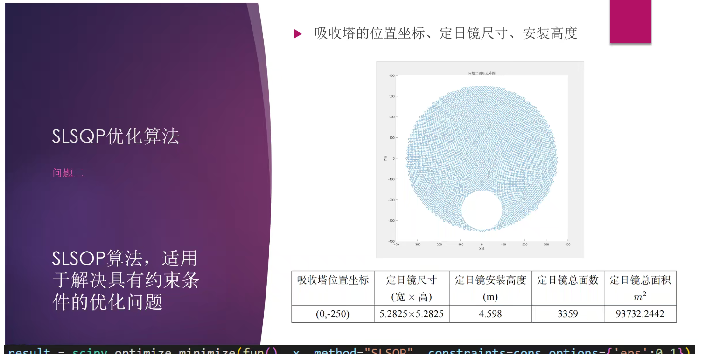
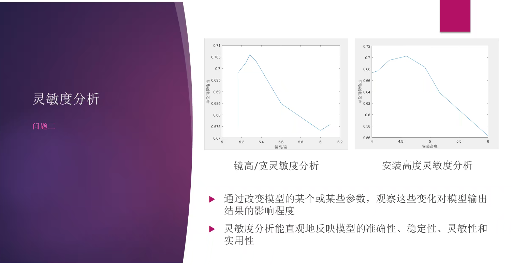
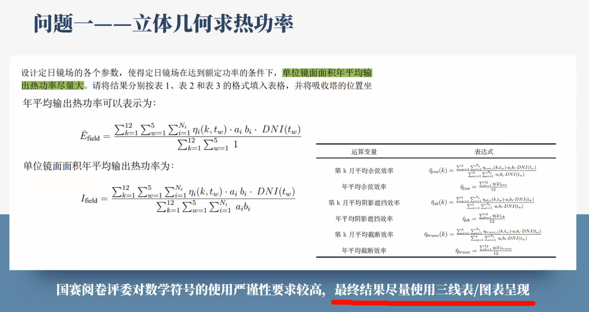
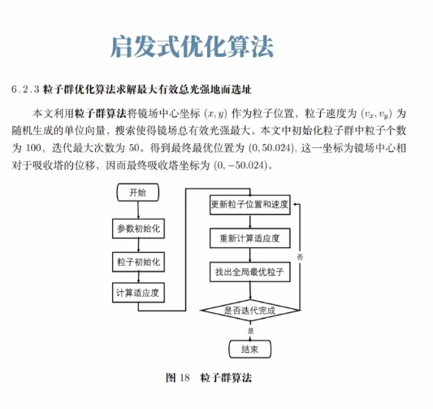

# 学习任务
* python
  - [ ] py的基础语法
  - [ ] py的库的使用,如numpy,sumpy等等
- latex的使用
  - [ ] latex的基础语法,可以尝试用latex写一些内容
  - [ ] 找一个latex的框架,或者自己先写一个,到时候就不用再写了
- markdown
  - [ ] markdown的基础语法,这个可以当做我们的协作文档
  - [ ] git的使用,我也不太会反正照着网上的教材传个文档没什么问题
  - [ ] 注册一个github账号,写完传上去
- 可视化工具
  - [ ] 我也不知道有什么可视化工具比较好,只知道可以用matplotlib画图
- 数学建模部分的学习
  - [ ] 把我发的课件先看一遍吧
  - [ ] 常见的算法和模型,等下我找个图

