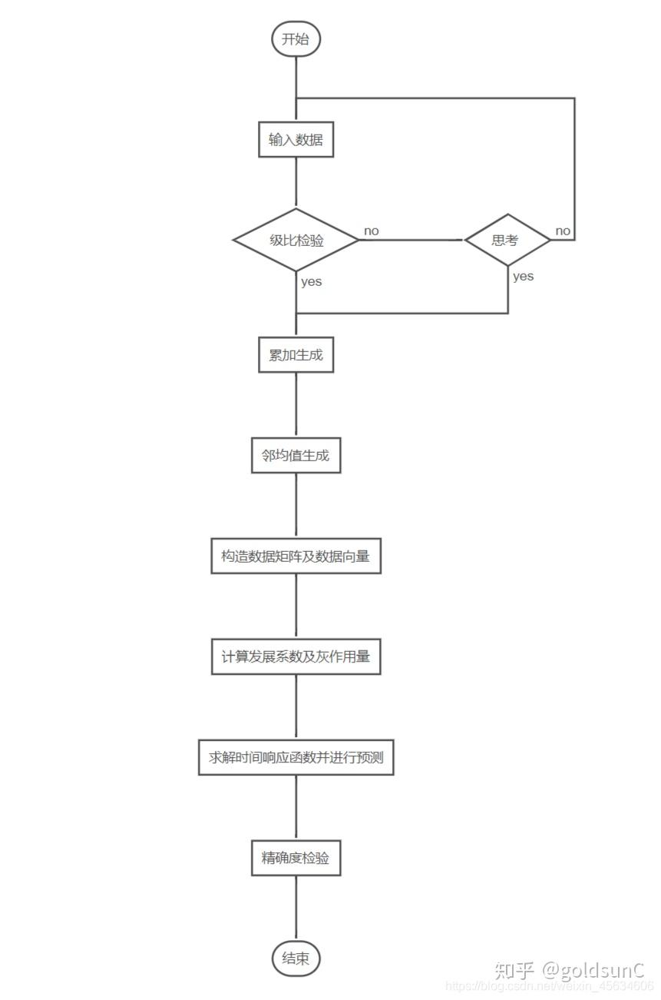

# 灰色预测模型
灰色预测基于人们对系统演化不确定性特征的认识，运用序列算子对原始数据进行生成、处理，挖掘系统演化规律，建立灰色系统模型，对系统的未来状态作出科学的定量预测。

灰色预测的类型有以下几种：
1. 时间序列预测
2. 灾变预测
3. 波形预测
4. 系统预测 

我们以时间序列预测为主，通过例子进行探讨

## 1.1GM(1,1)模型
G：grey 灰色；

M：模型

(1,1)表示只含有一个变量的一阶微分方程模型

实例：根据给定表中数据预测未来10年的长江污水量

|年份|污水量|
|----|----|
|1995|174|
|1996|179|
|1997|183|
|1998|189|
|1999|207|
|2000|234|
|2001|220.5|
|2002|256|
|2003|270|
|2004|285|

### 1.1.1原理以及求解

数据处理方法：

1. 累加生成：原始序列为$X(x=1\quad2\quad3\quad...)$，生成序列为$Y(y=1\quad2\quad3\quad...)$，则有：

$$
\begin{cases}
Y(1)=X(1)\\
Y(2)=Y(1)+X(2)\\
Y(3)=Y(2)+X(3)\\
...
\end{cases}
$$

**所谓累加生成，是将同一序列中的数据逐次相加以生成新的数据的一种手段，累加前的数列称为原始数列。累加后的数列成为生成数列。累加生成是使灰色系统变白的一种方法，它在灰色系统理论中占有极其重要的地位。通过累加生成可以看出灰量累积过程的发展态势，使杂乱无章的原始数据中蕴含的积分特性或规律加以显化。**

2. 累减生成：原始序列为$X(x=1\quad2\quad3\quad...)$
生成序列为$Y(y=1\quad2\quad3\quad...)$，则有：
  
$$
\begin{cases}
Y(1)=X(1)\\
Y(2)=X(2)-X(1)\\
Y(3)=X(3)-X(2)\\
...
\end{cases}
$$

**累减生成是在获取增量信息时常用的生成，多数情况下累减生成对累加生成起还原作用，即累减生成是累加生成的逆运算。**

PS：此处我们可以通过累加和累减算法相加，得到$Y(i)=X(i)$

3. 均值生成：原始序列为$X(x=1\quad2\quad3\quad...)$生成序列为$Y(y=1\quad2\quad3\quad...)$，则有：
  
$$
\begin{cases}
Y(1)=X(1)\\
Y(2)=X(2)-X(1)\\
Y(3)=X(3)-X(2)\\
...
\end{cases}
$$

**在收集数据的时候，由于一些不易克服的困难导致数据序列出现空缺或无法使用的异常数据，需要在数据预处理中解决。均值生成是常用的构造新数据、填补老数据空穴、生成新数列的方法。**

求解步骤框图如下：

流程图：

求解步骤：

1. 首先建立时间序列如下：
* 
  $$
  X=(x(1),x(2),\dotsx(n))
  $$

* 求级比:
   
   $$
   L(k)=\frac{x(k-1)}{x(k)}
   $$

* 当所有的$L(k)$落在$(exp(\frac{-2}{n+1}),exp(\frac{2}{n+1}))$区间之内，认为是比较满意的（并不是说有的数据没落入区间之内就不能建模，只是落在区间之内建模效果比较好）
  
2. 将原始数据时间序列进行累加生成
* 设累加生成之后的序列为$X'$
  
3. 对累加生成之后的序列进行邻均值生成。
邻均值生成是对等时距数列，用相邻数据的平均值构造生成新的数据。

设新生成的邻均值序列为$Z$，则：

$$ 
Z(k)=\frac{(X'(k)+X'(K+1))}{2},k=1,2,\dots n
$$

4. 构造数据矩阵B以及数据向量Y

$$
\begin{bmatrix}
-\frac{1}{2}(z^{(1)}(1)+z^{(1)}(2))&1\\
-\frac{1}{2}(z^{(2)}(1)+z^{(1)}(3))&1\\
\vdots&\vdots\\
-\frac{1}{2}(z^{(n-1)}(1)+z^{(1)}(n))&1
\end{bmatrix}
$$

5. 计算发展系数a及灰作用量b

计算方法如下：

$$
\begin{bmatrix}
a\\b
\end{bmatrix}=(B^T*B)^{-1}B^TY
$$

6. 建立模型求解时间响应函数并进行求解

* GM(1,1)模型$X(k)+aZ(k)=b$的白化方程
  
  $$
  \frac{dx^{(1)}}{dt}+ax^{(1)}=b
  $$

  的时间响应函数为：

  $$
  x^{(1)}(k+1)=(x^{(1)}-\frac{b}{a})e^{-ak}+\frac{b}{a},k=1,2,\dots n
  $$

7. 精确度检验
   * 相对残差检验：
   设实际数据序列为X(k)，模拟数据序列为X'(k)，则残差为：

   $$
   \&(k)=X(k)-X'(k)
   $$

   相对误差$*k=\frac{|\&(k)|}{X(k)}$
   
   * 方差比检验法：
   设残差序列为$\&(k)$,其序列标准差为A；原始序列为$X(k)$,其序列标准差为B，则其方差比$C=\frac{A}{B}$  

   * 小误差概率检验法：
   设小误差概率为$p$，残差序列平均值为$\&:P={|\&(k)-\&|<0.6745B}$，则$p=\frac{P}{原始序列长度}$

