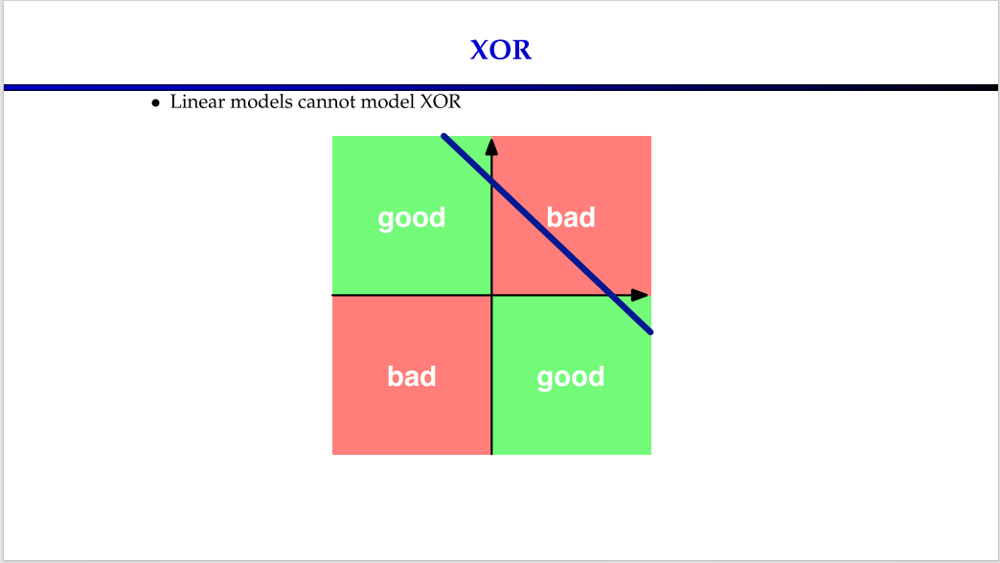
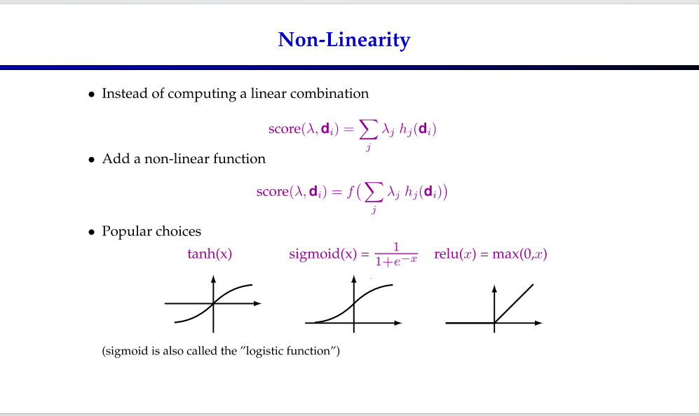
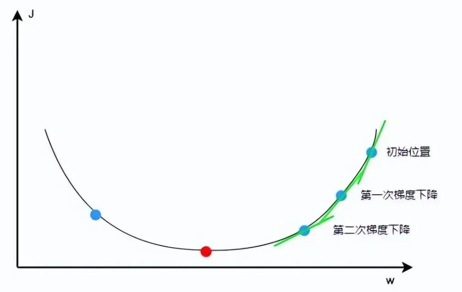
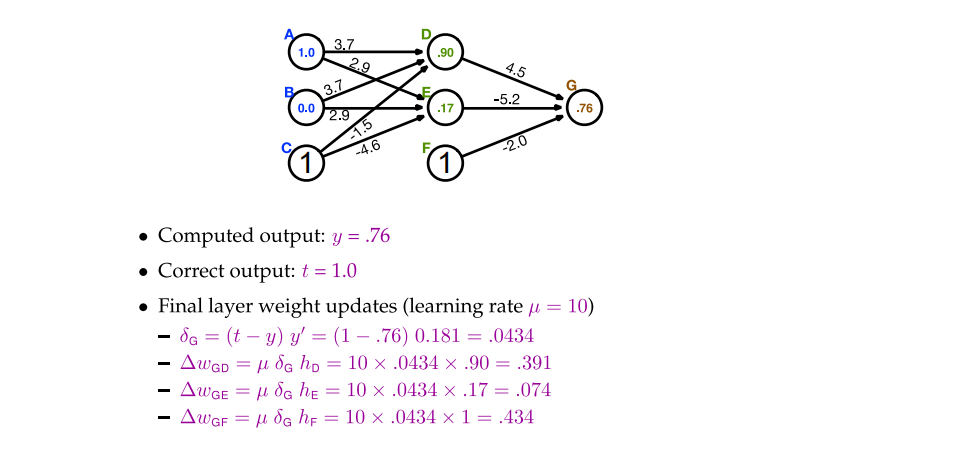

# 1.神经网络预测
事实上与神经网络预测相关的内容可以参考人工智能与物联网的课程课件
## 1.1什么是神经网络
人工智能尝试效仿人脑的思考过程，创造出的一种模仿人脑神经元之间相互连接的计算模型
## 1.2神经网络如何进行计算
图像输入处理和文本输入处理（当然这些都不是关键）
## 1.3神经网络预测模型
### 1.3.1神经网络模型训练
通过1.2中神经网络的计算，将数据输入到神经网络当中对神经网络进行训练
### 1.3.2神经网络模型预测
我们的预测基于一个相对简单的线性变换公式

$$
z=dot(\omega,x)+b
$$

其中：x表示的是输入数据的特征向量，而$\omega$是特征向量对应的权重，用于表示每个输入特征的重要程度。

式中b表示阈值，主要与预测结果有关。

dot函数则表示将$\omega$与x进行向量内积。
#### 1.3.2.1如何对此公式进理解：
我们可以根据当下情况对我们事件结果的影响对特征进行设立特征值，如：

决定是否去划船有三个因素：天气是否晴朗温暖、地点是否远近适中、同行玩伴是否合心意。实际情况是出行那天天气为阴且偶有阵风、地点在 20km 外的偏远郊区、同行玩伴是心仪已久的大美女。这三个因素即为输入数据的特征向量

$$
x=\begin{bmatrix}x_1,&x_2,&x_3\end{bmatrix}
$$

不妨将天气为阴、地点在20km外的偏远郊区设置为-1，有美女设置为1，即:

$$
x=\begin{bmatrix}-1,&-1,&1\end{bmatrix}
$$

接下来，需要根据你的偏好来设置三个特征的权重，也就是每个因素对你最终决策的影响程度。如果你是个懒狗，那你可能会设置权重为

$$
\omega=\begin{bmatrix}2,&6,&3\end{bmatrix}
$$

我们考虑此时的阈值b=1，且当计算出的z<0时不前往划船，则：

$$
z=x_1\omega_1+x_2\omega_2+x_3\omega_3+b=-4
$$

所以我们的结论即预测是不前往。
### 1.3.2.2非线性映射函数回归处理
其实上面使用的公式本质上是一种逻辑回归，是将输入的数据映射到一种二分类的概率输出。而当我们使用纯粹的线性公式进行二分法时，可能会存在分类不明确或者是不好分类的情况

所以我们更多的考虑使用一种非线性的二分法映射变换。
#### 1.3.2.2.1Sigmoid函数
函数公式如下：

$$
\sigma(z)=\frac{1}{1+e^{-z}}
$$

他可以将线性变换的结果通过非线性的映射转换为0-1之间的概率值，且大于0.5的概率值被视为上述情况的正类，小于0.5的概率值被视为上述情况的负类

而事实上，这里可以用一些其他的函数，但需要和Sigmoid函数有着相同的目的和近似结果。函数选择参考图片：

#### 1.3.2.2.2神经网络学习——损失函数模型
神经网络学习的目的，就是通过调整模型的参数使得损失函数达到最小值，从而改善模型的预测性能。即通过一定的算法（梯度下降算法）找到合适的$\omega$和b

如图所示的。损失函数的形状类似二次函数（开口向上），我们希望通过公式

$$
\omega^,=\omega-r*d\omega
$$

这其中r表示的是学习率，用于控制$\omega$的变化速度，$d\omega$是$\omega$关于损失函数的偏导数。则当损失函数达到如图极小值时，我们找到我们的$\omega$。
#### 1.3.2.2.3具体运算
根据人工智能与物联网的课程课件对神经网络预测部分进行相应的补充——即如何通过损失函数对$\omega$与b进行修改（主要是$\omega$）

在此处，我们定义几个变量，并固定b=0；

变量定义如下：

$$
s=dot(\omega,x)
$$

此处我们不妨修改前面的定义，将$\omega$中的每一个元素给一个顺序k，将x向量改写为h向量（每一处的值）并给顺序k

那么事实上，有

$$
s=\displaystyle\sum_k\omega_kh_k
$$

另：

$$
y=sigmoid(s)
$$

$$
t=correct output
$$

$$
E=\frac{1}{2}(t-y)^2
$$

则同样的，我们考虑损失函数E关于$\omega$的导数：

$$
\frac{\mathrm{d}E} {\mathrm{d}\omega_k}
$$

由导数的链式法则我们不难知道：

$$
\frac{\mathrm{d}E} {\mathrm{d}\omega_k}=\frac{\mathrm{d}E} {\mathrm{d}y}\frac{\mathrm{d}y} {\mathrm{d}s}\frac{\mathrm{d}s} {\mathrm{d}\omega_k}
$$

而根据变量的定义：

$$
\frac{\mathrm{d}E} {\mathrm{d}y}=\frac{\mathrm{d}} {\mathrm{d}y}\frac{1}{2}(t-y)^2=-(t-y)
$$

$$
\frac{\mathrm{d}y} {\mathrm{d}s}=\frac{\mathrm{d}sigmoid(s)} {\mathrm{d}s}=sigmoid(s)(1-sigmoid(s))=y(1-y)
$$

$$
\frac{\mathrm{d}s} {\mathrm{d}\omega_k}=\frac{\mathrm{d}} {\mathrm{d}\omega_k}\displaystyle\sum_k\omega_kh_k=h_k
$$

所以综上所述：

$$
\frac{\mathrm{d}E} {\mathrm{d}\omega_k}=-(t-y)y(1-y)h_k
$$

记：

$$
y^,=y(1-y)
$$

我们可以得到：

$$
\Delta\omega_k=\mu(t-y)y^,h_k
$$

其中$\mu$被称为学习率（learning rate）

重新回到转移模型：对$\Delta\omega_{j\leftarrow k}$,我们考虑

$$
E=\displaystyle\sum_j\frac{1}{2}(t_j-y_j)^2
$$

从而我们可以得到:

$$
\Delta\omega_{j\leftarrow k}=\mu(t_j-y_j)y_j^,h_k
$$        

我们考虑

$$
\delta_j=(t_j-y_j)y_j^,
$$

则可将$\Delta\omega_{j\leftarrow k}$转化为$\mu\delta_jh_k$
而由$\delta_j$的转移概率性质，我们可以得到其的另一个计算方式：

$$
\delta_j=(\displaystyle\sum_j\omega_{j\leftarrow i}\delta_j)y_i^,
$$

具体算例如下：

同理也可以通过不断的迭代调整前面过程的权重
#### 1.3.2.2.4运算的加速
我们将不同次数迭代后的结果运用进迭代的过程已加速迭代找到最优解
不妨将第n次的结果记为：

$$
\Delta\omega_{j\leftarrow k}(n-1)
$$

则我们考虑将原公式

$$
\Delta\omega_{j\leftarrow k}=\mu\delta_jh_k
$$

转化为

$$
\Delta\omega_{j\leftarrow k}(n)=\rho\Delta\omega_{j\leftarrow k}(n-1)+\mu\delta_jh_k
$$

从而可以通过控制$\rho$的大小，利用前一次迭代的结果，进行迭代的加速