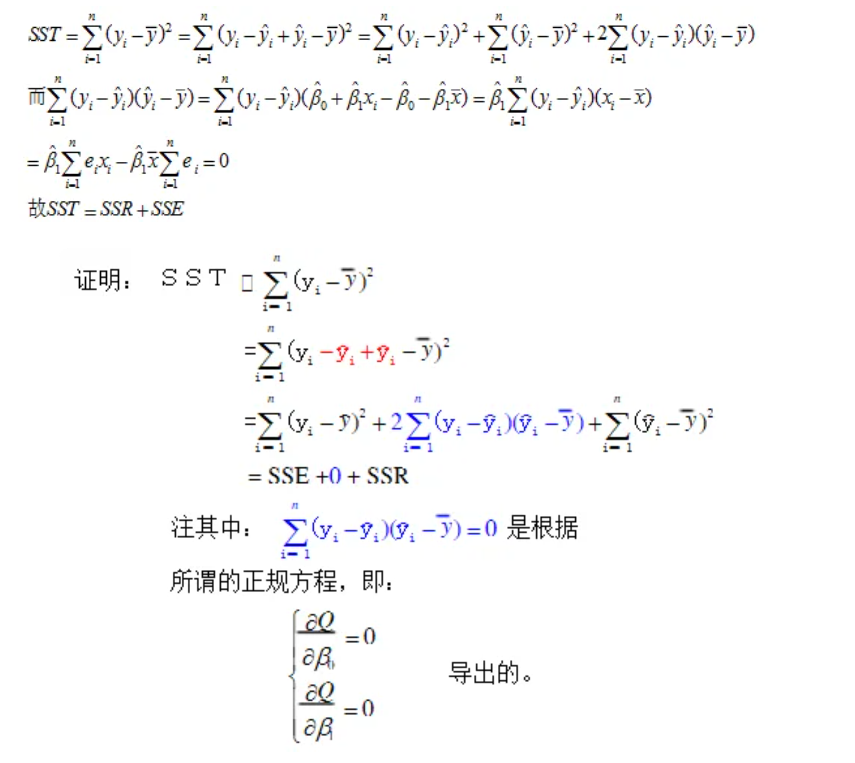

# 非线性回归
实际例子当中变量之间的关系并不会如线性回归当中的那么简单，基本是非线性的，这个时候我们就要考虑非线性的回归方式。

## 1.1可化为线性回归的曲线回归
对于部分非线性回归，如果我们对它进行还原，它就又会变成线性关系，如下：

$$
y=\beta_0+\beta_1e^x+\epsilon
$$

其元素$e^x$是非线性的项，但是我们只需要将其进行$z=e^x$的还原，即可将此非线性模型转换为一个关于$z$的线性模型

但有一个点要注意，非线性回归可不只是自变量非线性，其误差可能也是非线性的。如下方程：

$$
\begin{cases}
y=ae^{bx}e^\epsilon\\
y=ae^{bx}+\epsilon
\end{cases}
$$

上面方程组当中，第一个式子带的误差项我们叫做乘性误差项，第二个式子择交加性误差项。

如果我们不考虑带来误差的$\epsilon$项，那么其实上面的两个式子其实是有的。

而我们的线性模型在处理误差项是，遇到的均是加性误差项。所以当我们想要从一个乘性误差项得到加性误差项时，我们就需要取对数。即对第一个式子，我们有：

$$
lny=lna+bx+\epsilon
$$

而相对应的第二个式子我们只需要进行前述的换元操作

我们需要注意的是，当误差项不同时，如：当我们的误差项是$e^\epsilon$时，我们已经默认了数据$lny$是等方差；当我们的误差项是$\epsilon$时，我们已经默认了数据$y$是等方差的，因此乘性误差项拟合的结果一定程度上会淡化因变量值较大的数据的作用，而会对因变量值较小的数据作用加强。
（这里我们误差项不同对应的条件我们称作G-M条件）

但是在一般情况下，我们是不会写出误差项的——所以除非是特别制定，我们无需考虑误差项，按照正常方法换元即可。

还有一个比较常见的函数——从曲函数，即：

$$
y=\frac{x}{ax+b}
$$

对于此函数，可以通过两边取倒数，得到：

$$
\frac{1}{y}=a+b\frac{1}{x}
$$

类似的，我们还可以将S形曲线$y=\frac{1}{a+be^{-x}}$换元，使其变为线性函数

还有一种比较常见的非线性回归——多项式回归。其回归模型是一个多项式（是允许有交叉项的）。比方说二次项$x^2$，我们换元为$x_2$即可。

要注意的是，在实际情况下，由于三次以上的方程在解释性上就会出现很大的困难，所以我们不会再采用三次以上的多项式回归模型。
## 1.2一般非线性模型
其实非线性模型与线性模型相近：

$$
y_i=f(x_i,\theta)+\epsilon_i，i=1,2,\dots,n
$$

其中的残差满足G-M条件。$\displaystyle\left\{x_i\right\}$并非是随机向量。而其中的$\theta$就是我们要估计的未知参数向量。注意在一般的非线性模型中，参数的书目和自变量的书目没有一定的对应关系

如果我们依旧用最小二乘法进行估计，那么我们需要求解的方程即位：

$$
\frac{\partial{Q(\theta)}}{\partial{\theta_j}}=-2\displaystyle\sum^n_{i=1}[y_i-f(x_i,\theta)]\frac{\partial{f}}{\partial{\theta_j}}=0
$$

但是此表达式并不一定有解析解，所以需要使用一些计算方法的知识

事实上，非线性模型只能做一些概述，因为理论的完备性性和线性模型相比要差很多。比方说：平方和分解式$SST =SSR+SSE$不再成立。但是我们还是定义非线性回归的相关指数（也就是线性回归中的复决定系数）为：

$$
R^2=1-\frac{SSE}{SST}
$$

其中：
* SST表示的是总平方和，为$\displaystyle\sum_{i=0}^n(y_i-\bar{y})^2$
* SSR表示的是回归平方和，为$\displaystyle\sum_{i=0}^n(\hat{y_i}-\bar{y})^2$
* SSE表示的是误差平方和，为$\displaystyle\sum_{i=0}^n(y_i-\hat{y_i})^2$

上述等式的证明如下图：

## 1.3最小二乘法的缺陷
最小二乘法的优化函数一般都是一个二次函数，但是它并不是完美的。最突出的就是它的不稳定性。之前也说过，如果出现了一个异常值，那么回归直线就会发生很大的变化。

不过现代统计中也是有很多其余的替代方案。比方说设置目标函数形式为：

$$
Q(\theta)=\displaystyle\sum_{i=1}^n|y_i-f(x_i,\theta)|
$$

这个函数就没那么容易求极值点了，只能通过数值方法来做。当然了，还可以使用诸如最小绝对值法等更加稳健的方法来做。我们不再涉及更多的细节。

## 1.4计量经济学中常用的三大非线性模型
此处的三大回归函数都是与对数有关的函数。把它们用对数形式拟合之后，回归系数就会有不同的解释含义，很多时候在经济研究中会带来方便。

1. ==线性对数模型==：$Y=\beta_0+\beta_1lnX$

我们考虑其两边各加微元。则：$Y+\Delta Y=\beta_0+\beta_1ln(X+\Delta X)$

此式与上式做减法，并运用常见的估计式$ln(x+1)\approx x$我们就可以得到：$\Delta Y\approx\beta_1\frac{\Delta X}{X}$

我们注意到这里$\frac{\Delta X}{X}$是量的比例变化。从而我们可以得到自变量与因变量的近似变化关系

2. ==对数线性模型==：$lnY=\beta_0+\beta_1X$

同样的给两边进行加微元的处理，我们可以得到同理的估计式：

$$
\frac{\Delta Y}{Y}\approx \beta_1\Delta X
$$

这也同样刻画了自变量和因变量之间的关系
3. 对数对数模型，即：$lnY=\beta_0+\beta_1lnX$。

我们用同样的微元处理可以得到

$$
\frac{\Delta Y}{Y}\approx \beta_1\frac{\Delta X}{X}
$$

从而我们依旧可以得到因变量和自变量之间的变化关系

## 1.4含有定性变量的回归模型
定性变量定义：根据分类取值的变量

### 1.4.1几个常见的定性变量例子

我们通过各种例子来说明它的处理方法。我们比方说研究粮食产量和施肥量之间的关系，那么气候问题自然是一个影响因素，应该被视为一个自变量。但是气候的这个自变量并不是一个连续变量，它只有两种类别：正常，干旱。那么这个时候如果要数量化，就是定性变量，因为它只有两个值0或1。

这里我们假设$D_1$是此定性变量，并假设$D_1=1$表示气候干旱，$D_1=0$表示气候正常，并且假设粮食产量的回归模型为：

$$
y=\beta_0+\beta_1x_1+\beta_2D_1+\epsilon
$$

这个时候我们只需要对$D_1$进行分类讨论，就可以进行研究，并不需要带入$D_1$进行相应的参数估计，而是在两种情况下分别对两种数据进行回归，然后用这个模型的形式去拟合。

我们不难发现两种情况的差别正好是$\beta_2$因此两种数据得到的两种模型的截距项的差，就可以理解为这个定性变量的量化影响。

这是一个定性变量的问题，如果问题再复杂一些，比方说时尚衣物的销售额一般会受季节影响，那么这个时候肯定在每一个季节对应的影响不一样。那么这个时候对应四个季节，就可以给定四个0-1变量。比方说是夏季，那么你就设置夏季的定性变量值为1，其余的为0就行。数学上来说就是下面的设置。

$$
\begin{cases}
x_1=1&spring\\
x_1=0&others
\end{cases}\\
\begin{cases}
x_2=1&summer\\
x_2=0&others
\end{cases}\\
\begin{cases}
x_3=1&autumn\\
x_3=0&others
\end{cases}\\
\begin{cases}
x_4=1&winter\\
x_4=0&others
\end{cases}
$$

但是这个模型会产生新的问题，就是你不能四个变量都引入模型。因为一年的每一天都必定属于某一个季节，所以一定会有$x_1+x_2+x_3+x_4=1$,这样就会出现完全多重共线性。

所以对于这个例子，你要去掉一个自变量，保留3个。比方说我去掉“春天”这个变量，那么当剩下的三个自变量都是取0的情况下，就代表了春天的情况。

同样的，用上面的一样的方法，你也可以明白每一个回归系数对应的含义，这里不再赘述。

还是上面那个销售量的问题，数据处理中，如果我们发现数据量基本上是一个线性关系，但是在生产量$x=500$时，直线的斜率发生了巨大的变化，那如何拟合模型呢？

直观上，如果斜率发生了变化，应该说明，在$x=500$时，有一种不明的力量使得回归模型发生了变化，因此我们应该用一个0-1定性变量来描述这种“不明的力量”。具体来说，模型应该写成：

$$
y=\beta_0+\beta_1x_1+\beta+2(x_1-500)D1+\epsilon
$$

这个$\beta_2$就相当于是描述了这种不明力量的影响程度

类似的，根据定性变量的定义，我们可以把上面的式子理解为下面这个

$$
\begin{cases}
E(y)=\beta_0+\beta_1x_1(x_1\leq500)\\
E(y)=(\beta_0-500\beta_2)+(\beta_1+\beta_2)x_1(x_1>500)
\end{cases}
$$

然后分两组拟合模型并得出各个系数再进行解释

### 1.4.2回归系数相等检验（例子说明）
我们引入一个研究家庭年收入和储蓄增加额关系的例子。这个例子中需要有一个定性变量就是学历。学历的高低显然会影响家庭的年收入，进而影响储蓄增加额，就像知乎人均985，知乎人均30W一样。那么这个时候，如果你想检验学历的高低是否会使得单位家庭年收入对储蓄增加额的影响发现显著的变化（直观感觉，高学历的人应该更会理财，因此储蓄量应该会高一些），应该怎么办呢？

我们考虑之前的模型：

$$
y=\beta_0+\beta_1x_1+\beta_2D_1+\epsilon
$$

考虑用$D_1$来表示学历。但是事实上并非是如此的。

在我们的公式当中$D_1$的变化影响的仅仅是截距项而并非是系数，这与实际的学历影响情况是不符的。所以我们需要让$D_1$在家庭年收入$x_1$之前出现——从而引出含有交互效应的回归模型：

$$
y=\beta_0+\beta_1x_1+\beta_2D_1+\beta_3D_1x_1+\epsilon
$$

这个时候$D_1$取1，就可以使得$x_1$的斜率多了一个$\beta_3$，因此如果要观察它对家庭年收入截距的影响，就检测$\beta_3$即可，然后就回到了我们之前的内容。

### 1.4.3因变量是定性变量的回归模型
考虑如下模型：

$$
y=\beta_0+\beta_1x_1+\epsilon
$$

其中$y$是定性变量。这个时候用这个模型直接做最小二乘回归就会出现巨大的问题。首先右边的变量是连续型的话，左右根本就不可能相等。其次右边这个是一个线性函数，那么在定义域是全体实数域的情况下，这个函数的值域也是实数域，根本就没办法限制在$[0,1]$之内。

我们考虑这个模型的期望：

$$
E(y)=\beta_0+\beta_1x_1
$$

既然$y$是一个定性随机变量，这就说明它服从一个伯努利分布。那么我们设

$$P(y=1)=\pi,P(y=0)=1-\pi
$$

这样我们就得到了$E(y)=\pi$

这就说明了如果$y$衡量了一个伯努利事件，那么这个回归模型的右端实际上就衡量了这个事件成功的概率。因此它的意义就明显了。

虽然回归的意义明显，但是要做回归，需要满足三大假设——但此时的误差项明显不再是连续变量了

而我们注意到：

$$
D(\epsilon_i)=D(y_i)=\pi_i(1-\pi_i)=(\beta_0+\beta_1x_i)(1-\beta_0-\beta_1x_i)
$$

这与$x_i$是有关系的，从而无法满足同方差性

PS回归模型的三大假设：

* 零均值假定：随机扰动的误差项的期望或是均值为0
* 同方差性：随机扰动误差项互不相关且服从正态分布，且其方差应该是一个常数，且不随观测值的变化而变化
* 随机扰动的误差项与解释变量互不相关，且各解释变量之间相互独立 
