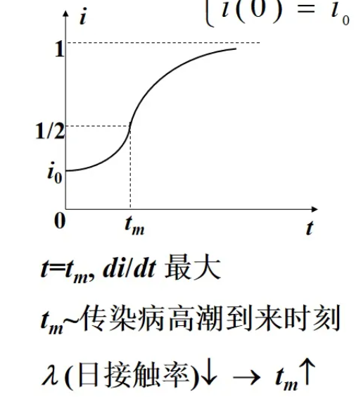
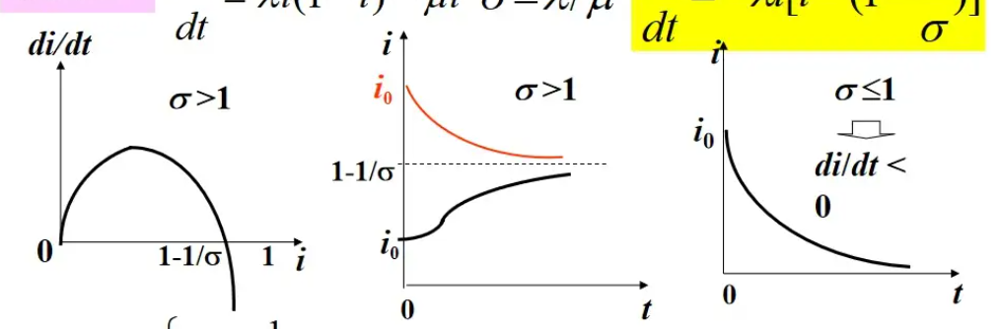

# 微分方程预测模型
往往微分方程的应用大多是物理或是几何方面的典型问题；而在数学建模当中，微分方程模型主要是非物理领域的实际问题，要分析具体情况或进行类比，才能给出假设条件，作出不同的假设就得到不同的方程；这一类的方程事先并没有答案，求解结果需要通过现实现象来检验。

其应用原理如下：
* 根据函数及其变化率之间的关系来确定函数
* 根据建模目的和问题分析作出简化假设
* 按照内在规律或用类比法建立微分方程

有一个最典型的例子就是通过微分方程模型来研究封闭系统下的传染病传播问题。下文通过这样一个例子进行进一步的展开。

## 1.1传染病模型举例
有以下几点要求：
* 描述传染病传播过程
* 分析受感染人数的变化规律
* 预报传染病高潮到来的时刻
* 预防传染病蔓延的手段
* 按照传播过程的一般规律用机理分析的方法建立模型

### 1.1.1模型1
假设已经感染的病人人数为$i(t)$，每个病人每天有效接触（足以使人致病得）人数为$\lambda$，则有：

$$
i(t+\Delta t)-i(t)=\lambda i(t)\Delta t
$$

从而可以得到：

$$
\begin{cases}
\frac{di}{dt}=\lambda i\\
i(0)=i_0     
\end{cases}
$$

于是我们可以简单的得到模型：

$$
i(t)=i_0e^{\lambda t}\\
t\rightarrow \infty\Rightarrow i\rightarrow \infty
$$

而我们注意到，当有效接触的也是病人时，我们不能使得感染人数增加，所以我们必须区分已感染者和未感染者。

从而：

### 1.1.2模型2
区分已感染者和未感染者：

我们假设：
1. 总人数N不变，病人和健康人的比例分别为$i(t),s(t)$(这里的假设是一个SI模型)

2. 每个病人每天有效接触人数为$\lambda$，且使接触的健康人致病（注意，这里有效接触的人当中既包含了感染者也包含未感染者，是通过假设1当中的比例计算的）
   
从而我们可以进行建模：

$$
\begin{cases}
N[i(t+\Delta t)-i(t)]=[\lambda s(t)]Ni(t)\Delta t\\
\frac{di}{dt}=\lambda si\quad (可结合上式，由导数定义得到)\\
s(t)+i(t)=1
\end{cases}
$$

从而我们可以推得模型2：

$$
\begin{cases}
\frac{di}{dt}=\lambda i(1-i)\\
i(0)=i_0
\end{cases}
$$

上述模型事实上就是我们所知道的logistic模型，我们得到具体的函数式：

$$
\begin{cases}
  i(t)=\frac{1}{1+(\frac{1}{i_0}-1)e^{-\lambda t}}\\
  t_m=\lambda^{-1}ln(\frac{1}{i_0}-1)\quad(此时的导数最大) 
\end{cases}
$$

函数图像如下：

而此时我们发现：$t\rightarrow\infty\Rightarrow i\rightarrow1$,这就说明时间越久病人占比越大。那么难道病人是不可以治愈的吗？难道人类要就此灭亡？这显然是不可能的。

从而我们开始考虑模型3：

### 1.1.3模型3
传染病无免疫性——病人可以治愈为健康人，健康人可以再次被感染——即SIS模型

我们增加假设：
* 病人每天被治愈的比例为$\mu$（日治愈率）

从而可以得到模型：

$$
N[i(t+\Delta t)-i(t)]=\lambda s(t)Ni(t)\Delta t-\mu Ni(t)\Delta t
$$

从而我们可以得到：

$$
\begin{cases}
    \frac{di}{dt}=\lambda i(1-i)-\mu i\\
    i(0)=i_0\\
    \sigma=\frac{\lambda}{\mu},一个感染期内每个病人的有效接触人数，称为接触数\\
    \lambda\quad日接触率\\
    \frac{1}{\mu}\quad 感染期
\end{cases}
$$

从而通过$\sigma$我们的模型可以转换为：

$$
\frac{di}{dt}=-\lambda i[i-(1-\frac{1}{\sigma})]
$$

$$
i(\infty)=\begin{cases}
    1-\frac{1}{\sigma},\quad \sigma >1 \\
    0,\quad \sigma \leq 1
\end{cases}
$$

我们也可以得到相应的模型曲线：

结合图像，我们可以看出：

1. $\sigma$>1，$i_0$小，则$i(t)$按照S形曲线增长
2. $\sigma\leq1\Rightarrow i(t)\downarrow$,此时感染期内有效接触感染的健康者人数不超过病人数

### 1.1.4模型4
与模型3相区分的，我们考虑在病人治愈之后即移出感染系统的情况——即治愈后不再患病——建立相应的SIR模型

我们假设：
1. 总人数N不变，病人、健康人和移出者的比例分别为$i(t),s(t),r(t)$
2. 病人的日接触率为$\lambda$,日治愈率为$\mu$，接触数为$\sigma=   \frac{\lambda}{\mu}$

从而我们可以建立模型：

$$
s(t)+i(t)+r(t)=1
$$

需要我们建立$s(t),i(t),r(t)d的两个方程，即：

$$
\begin{cases}
    N[s(t+\Delta t)-s(t)]=-\lambda s(t)Ni(t)\Delta t\\
    \frac{di}{dt}=\lambda si-\mu i\\
    \frac{ds}{dt}=-\lambda si\\
    i(0)=i_0,s_0=s_0
\end{cases}
$$

此模型当中通常$r(0)=r_0$很小,$i_0+s_0\approx1$.而上述方程组往往无法求出几个函数对应的解析解，我们通常可以考虑利用Matlab进行数值解的求解。