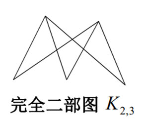
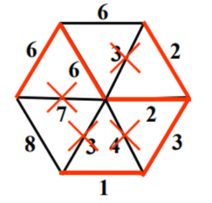
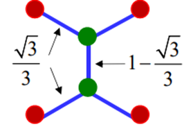
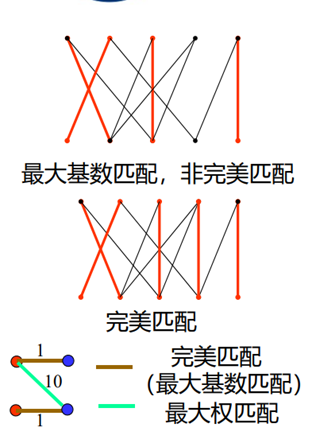
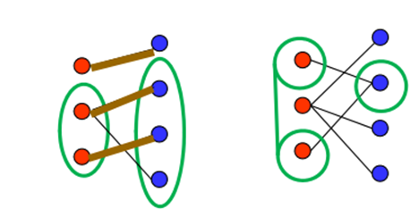
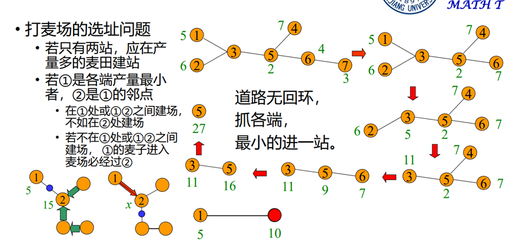
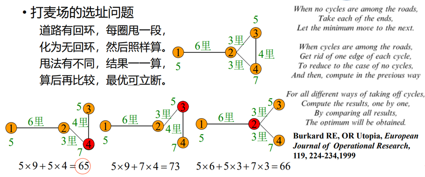
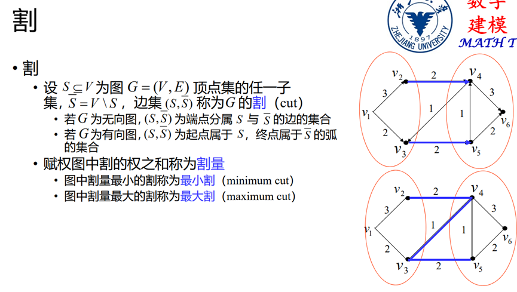

# 图论基础知识

一个图（graph）可以用一个有序二元组$G=\left(V,E\right)$来表示
其中$V$代表图当中的所有顶点，$E$代表了所有的边，边的权重叫做它的长度
如果顶点$V$有序，那么图就被称之为有向图，反之则称之为无向图

## 度：
与点$v$相关联的边的数目记做$deg_G\left(v\right)$
每一条边在定点的遍历过程中被重复计数两次，所以有握手定理：

$$
\sum{deg_G\left(v\right)}=2\left|E\right|
$$

## 简单图，完全图，二部图，连通图：

### 简单图
没有环也没有平行边的图

### 完全图

任意两个不同的顶点之间都有边相连的简单图，也就是说两个顶点之间只有一条边，边的个数：

$$
\left|E\right|=C_n^2=\frac{n\left(n-1\right)}{2}
$$

显然，完全图是边数最多的简单图，简单图的边数的上界就是$n\left(n-1\right)/2$,越接近这个上界的简单图被称之为稠密图，反之则被称之为稀疏图。

### 二部图
$G$的顶点$V$可以划分成两个非空的集合$X,Y$，其中，图的任意一条边的两个顶点分别属于这两个集合，则称该图为二部图：

$$
V=X\cup Y
$$

$X$，$Y$中的元素并不是完全不重合，可以存在相同的元素：

### 连通图

顶点$u，v$之间有路连接，则称$u，v$连通，对于无向图，任意两个顶点均连通的图称之为连通图

## 途径，路，迹，圈

### 途径
图中存在序列$v_{i0}e_{i1}v_{i1}\ldots e_{ik}v_{ik}$
则称这个序列为连接顶点$v_{i0}$和顶点$v_{ik}$的途径

### 迹
对于图中全部的途径，如果他们经过的边互不相同，那么这些途径称之为迹

### 路
对于图中全部的途径，经过顶点互不相同的途径则称之为路

### 圈
当路的起点和终点相同时，这个途径被称之为圈。
路中所有边权之和称之为路的长度。

## 生成子图与导出子图

### 生成子图
如果对于图$G=\left(V,E\right)$，存在$V^\prime\subseteq V,E^\prime\subseteq E$,
那么则称为图$G$的一个子图，如果顶点集与原顶点集相等，那么称子图为$G$的生成子图。

### 导出子图
导出子图：分为顶点导出子图和边导出子图

顶点导出子图包含G的顶点的一个子集$V^{'}$和原图$G$中两端点均在$V_{'}$中的所有边

边导出子图包含$G$的一个边子集$E^{'}$以及$E^{'}$中每条边所带的两个端点。

连通的无圈图称之为树，图$G$中为树的生成子图称之为$G$的生成树。
最小生成树：对于一个连通图，它的所有生成树中总权和最少的生成树称之为最小生成树.

!!! question "如何寻找最小生成树?"

    ## Kruskal算法

    

    对于一个如图所示的连通图，我们把它所有的边按照升序（非降序，可能存在相等）排列，记做$\{ e_1,e_2,e_3, \ldots  \}$

    初始化一个空集合$F$

    然后按照排序好的边集合一个个执行添加判断操作：

    如果图$T=(V,F\cup e_j)$不含圈，则:

    $$
    F=F\cup e_j
    $$

    终止条件：

    $$
    \left|F\right|=\left|V\right|-1
    $$

    如果遍历了所有边仍然不满足条件，那么需要返回上一步，并入其他的可能不会导致圈生成的边，一步步执行操作，直到得到最小生成树。

## 最短路
从一个顶点到另一个顶点的途径中，长度最短的称之为最短路
最短路存在以下几个算法：（以后再看）

1. Bellman-Ford算法
2. Dijkstra算法
3. Floyd-Warshall算法

## 最小Steiner树：
对于欧式平面上的$n$个点，如何用总长度最短的若干条线段将他们连接起来，解决方法：最小生成树。
如果此时允许添加多个Steiner点，那就是最小Steiner树问题

## 特殊顶点集：
### 1.顶点覆盖：
$G$中的每一条边至少有一个端点在$S$中
### 2.独立集：
$S$中任意两个顶点在$G$中互不相邻，是顶点覆盖关于$V$的补集
### 3.支配集：
$S$中的任意顶点均和$V/S$中任意一个顶点相关联。
### 4.团：
$G$中任意的两个顶点在S中均相邻

## 匹配
$G$的边集$E$的一个非空子集$M$称之为$G$的一个匹配，若$G$中任一顶点至与一条$M$中的边相关联。也就是说，一个$G$中的点只会对应或者压根不对应$M$中的一条边。

如果说$G$中的所有顶点都与$M$中的某一条边关联，则称$M$为完美匹配。

无权图（应该是边长都一样）中边数最多的匹配称为最大基数匹配

赋权图中权最大的匹配称之为最大权匹配。

如果存在完美匹配，权最大的完美匹配称之为最大权完美匹配

于是有以下定理：

## Hall定理：
设$G=\left(X\cup Y,E\right)$是一个二部图，如果存在一个匹配$M$，使得$M$中的所有元素都与$X$中的元素相对应，那么它的充要条件是：存在$X$的子集$S$，以及与$S$相邻的顶点集（$S$和$N_G(S)$之间的每一个元素都通过边相连），并且有：

$$
\left|S\right|\le\left|N_G\left(S\right)\right|
$$

## Frobenius定理：
上述的$G$中存在完美匹配的充要条件是：

$$
\left|X\right|=\left|Y\right|
$$

并且对于X或者Y的子集S，有：

$$
\left|S\right|\le\left|N_G\left(S\right)\right|
$$

## 打麦场的选址问题：
在道路的一些地方存在着一些打麦场，现在要设立一个收集麦子的仓库，把各个打麦场的麦子运往这个仓库，每个打麦场的生产能力不同，运输的距离不同，问怎么样设置一个仓库，可以使得运输最为经济：

这个背口诀就可以了

## 割的概念

