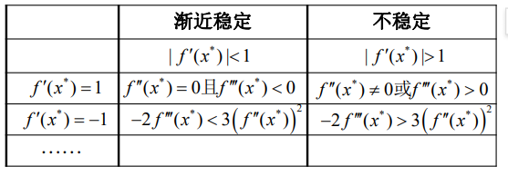

# 差分方程

## 基本概念

定义差分为:

$$
\Delta x_n=x_{n+1}-x_n
$$

同理也可以定义二阶差分为:

$$
\Delta^2 x_n=\Delta x_{n+1}-\Delta x_{n}=x_{n+2}-x_{n+1}-x_{n+1}+x_{n}=x_{n+2}+x_{n}-2x_{n+1}
$$

按照这样的递推关系定义n阶差分:

$$
\Delta^k x_n =\Delta(\Delta^{k-1} x_{n})
$$

定义$\Delta$为差分算子,$E$为平移算子,$I$为不变算子:

$$
\Delta x_n=x_{n+1}-x_n=Ex_{n}-Ix_n
$$

所以会有所谓的算子关系:

$$
\Delta=E-I
$$

!!! info "差分算子的若干性质"

    - $$
    \Delta(\alpha x_n+\beta y_n)=\alpha\Delta x_n+\beta\Delta y_n
    $$

    - $$
    \Delta \displaystyle \frac{x_n}{y_n}=\displaystyle \frac{x_{n+1}}{y_{n+1}}-\frac{x_n}{y_n}=\frac{1}{y_ny_{n+1}}(y_nx_{n+1}-y_{n+1}x_n-y_nx_n+x_ny_n)=\frac{1}{y_ny_{n+1}}(y_n\Delta x_n-x_n\Delta y_n)
    $$

    - $$
    \Delta(x_ny_n)=y_{n+1}x_{n+1}-x_{n}y_{n}-y_{n+1}x_{n}+y_{n+1}x_n=y_{n+1}\Delta x_n+x_n\Delta y_n
    $$

    - $$
    \displaystyle \sum_{k=a}^b y_{k+1}\Delta x_k = \sum_{k=a}^b y_{k+1}x_{k+1}-y_{k+1}x_k+y_{k}x_{k}-y_{k}x_{k}=x_{b+1}y_{b+1}-x_{a}y_{a}-\sum_{k=a}^b x_k\Delta y_k
    $$

    - $$
    x_n=E^n x_0=(\Delta+I)^n x_0=\sum_{i=0}^n C_n^i \Delta^i x_0
    $$

这个关系可以帮助我们更好的推导$n$阶差分的表达式:

$$
\Delta^k x_n=(E-I)^kx_n=\sum_{i=0}^k C_k^i(-1)^{k-i} E^i x_n=\sum_{i=0}^k C^i_k (-1)^{k-i}x_{n+i}
$$

这说明$k$阶差分可以由$x_n,x_{n+1}, \ldots ,x_{n+k}$来确定,

$$
\begin{cases} 
 \Delta^k x_n=f_k(x_n,x_{n+1}, \ldots ,x_{n+k}), &  \\
 \Delta^{k-1} x_{n}=f_{k-1}(x_{n}, \ldots ,x_{n+k-1}), & \\
 \vdots\\
 \Delta x_n=f_1(x_n,x_{n+1})
 \end{cases}
$$

据此我们也可以反解出$x_{n+i}$

$$
 x_{n+i}=f'(\Delta^i x_n, \ldots ,\Delta x_n)=F(x_{n+i-1},x_{n+i-2}, \ldots ,x_n,n)
$$

类比于微分方程的稳定点,差分方程也有所谓的稳定点,如果存在常数数列:

$$
x_n=\bar{x}
$$

满足:

$$
\bar{x}=F(n,\bar{x}, \ldots ,\bar{x})
$$

则称这个解为平衡解

如果$x_n-\bar{x}$既不是最终正的,也不是最终负的,那么这个解就被称作振动解.

如果满足某个解$x_n$满足:

$$
\lim_{n \to \infty}x_n=\bar{x}
$$

则称$x_n$为稳定解

## Z变换

### 基本性质

Z变换是一种离散的变换方式,在这里我们使用它来求解差分方程.

对于一个复变函数$X(z)$,我们可以把它展开成为洛朗级数:

$$
X(z)=\sum_{n=0}^\infty \frac{x[n]}{z^n}=Z(x[n])
$$

也可以认为是对某个数列做Z变换得到一个复变函数

一下是一些常见的Z变换例子:

1. 冲激函数

$$
\delta[n]=
\begin{cases} 1, &n=0  \\ 0, &\text{otherwise}  \end{cases}
$$

其Z变换为:

$$
Z(\delta[n])=\sum_{k=0}^\infty \delta[k]z^{-k}=1
$$

2. 阶跃函数
   
$$
u(n)=
\begin{cases} 1, &n\ge 0  \\ 0, &\text{otherwise}  \end{cases}
$$

$$
Z(u(n))=\sum_{k=0}^\infty u(k)z^{-k}=\frac{z}{z-1}
$$

3. 指数函数

$$
f(n)=a^n
$$

$$
Z(f(n))=\sum_{k=0}^\infty (\frac{a}{z})^k=\frac{z}{z-a}
$$

4. 阶乘的倒数

$$
f(n)=\frac{1}{n!}
$$

$$
Z(f(n))=\sum_{k=0}^\infty \frac{1}{k!}z^{-k}=e^{\frac{1}{z}}
$$

### 求解差分方程

首先注意到Z变换具有线性性,下一步给出Z变换的平移性

注意到:

$$
Z(x[n+k])=\sum_{n=0}^\infty x[n+k] z^{-(n+k)}z^k=z^k(\sum_{t=k}^\infty x[t]z^{-t})=z^k(X(z)-\sum_{t=0}^{k-1} x^t z^{-t})
$$

这就是Z变换的平移性

对于一个常系数的线性差分方程,应用上述Z变换即可求解:

$$
x_{n+2}+3x_{n+1}+2x_n=0
$$

对式子左右两边应用Z变换:

$$
z^2(X(z)-x_0-\frac{x_1}{z})+3z(X(z)-x_0)+2X(z)=0
$$

得到传递函数:

$$
X(z)=\frac{z}{z^2+3z+2}=\frac{1}{1+\frac{1}{z}}-\frac{1}{1+\frac{2}{z}}=\sum_{k=0}^\infty (-1)^k (1-2^k)z^{-k}
$$

所以得到通项公式:

$$
x_n=(-1)^n-(-2)^n
$$

## 常系数线性差分方程

### 特征方程

$$
a_0x_{n+k}+a_1x_{n+k-1}+ \cdots +a_kx_n=b(n)
$$

为k阶常系数线性差分方程,如果右边的那个$b(n)=0$,则为对应的齐次方程,有对应的特征方程的解法:

$$
a_0\lambda^k+a_1\lambda^{k-1}+ \cdots +a_{k-1}\lambda+a_k=0
$$

现在对解展开讨论,如果存在实根$\lambda_i$,那么通解中存在$c_i\lambda_i^n$,如果这实根是m重根,那么通解中存在:

$$
(c_{i_1}+c_{i_2}n+ \cdots +c_{im}n^{m-1})\lambda_i^n
$$

如果存在共轭复根$\lambda_j=\alpha+\beta i=\rho e^{i\phi}$,那么通解中就会存在:

$$
c_{j1}\rho^n \cos \phi n+c_{j2}\rho^n \sin \phi n
$$

如果是m重共轭复根,就会存在:

$$
(c_{i_1}+c_{i_2}n+ \cdots +c_{im}n^{m-1})\rho^n \cos{\phi n}+(c_{j_1}+c_{j_2}n+ \cdots +c_{jm}n^{m-1})\rho^n \sin {\phi n}
$$

综上所述,齐次方程都可以根据上面的规律求出通解,面对非齐次方程,需要使用瞪眼法求出一个特解,然后加上齐次方程的通解,就是总的通解了:

$$
x_n=\bar{x}_n+x_n^*
$$

### 稳定性

1. k阶常系数线性差分方程的解的稳定的充分必要条件是所有的特征根都满足:

$$
|\lambda_i|<1,\quad i=1,2, \ldots ,k
$$

2. 对于一阶非线性差分方程的解,他满足以下规律:
   

