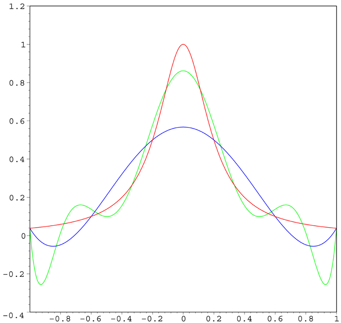
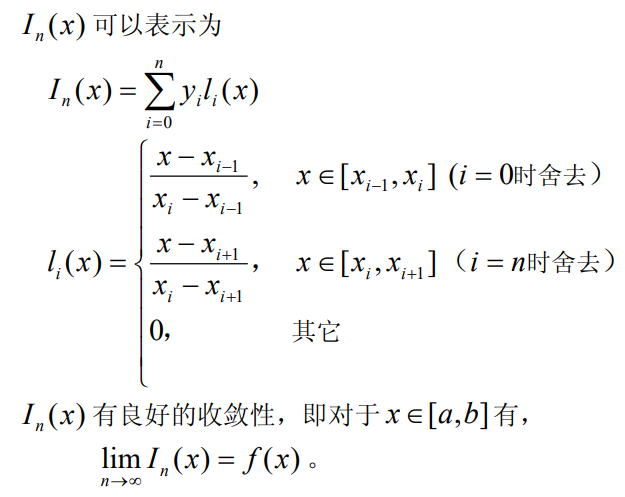

# 插值

在区间[a,b]内,存在n+1个端点,并且这些点的函数值已知:

$$
f(x_i)=y_i ,i=0,1,\cdots,n
$$

我们的任务是找一个函数$\phi(x)$,使其满足:

$$
\phi(x_i)=y_i,i=0,1,\cdots,n
$$

并且,使用这个函数的函数值来估计原函数的函数值:

$$
\phi(\hat{x})\approx f(\hat{x})
$$

这样的任务就被称作插值

## 一维插值

### 待定系数法

最常见的插值函数是多项式函数,得益于泰勒级数的理论基础,我们知道多项式函数理论上可以逼近所有函数,所以,n+1个点可以确定一个不超过n阶的多项式:

$$
P_n(x)=a_nx^n+a_{n-1}x^{n-1}+ \cdots +a_1x+a_0
$$

可以得到如下方程组:

$$
\begin{cases}
a_nx_0^n+ \cdots +a_1x_0+a_0=y_0\\
a_nx_1^n+ \cdots +a_1x_1+a_0=y_1\\
\vdots\\
a_nx_n^n+ \cdots +a_1x_n+a_0=y_n\\
\end{cases}
$$

该方程的系数矩阵的行列式是范德蒙德行列式,因为n+1个插值点互不相同,所以行列式不为0,根据克莱姆法则,上式有且只有一个解.即多项式存在且唯一.

记截断误差为:

$$
R_n(x)=f(x)-P_n(x)=\frac{f^{(n+1)}(\xi)}{(n+1)!}\omega_{n+1}(x)
$$

其中:

$$
\omega_{n+1}(x)=\prod_{j=0}^{n}(x-x_j) 
$$

### 拉格朗日插值

通常不会解上面这个方程进而得到一系列系数,而是用一种取巧的办法:

定义基函数:

$$
l_i(x)=\prod_{j=0,j\neq i}^{n} \frac{x-x_j}{x_i-x_j}
$$

于是就得到插值函数的形式:

$$
L_n(x)=\sum_{i=0}^n y_i l_i(x)=\sum_{i=0}^n y_i\prod_{j=0,j\neq i}^{n} \frac{x-x_j}{x_i-x_j}
$$

### 牛顿插值

定义差商:

$$
f[x_i,x_j]=\frac{f(x_i)-f(x_j)}{x_i-x_j}
$$

同理有二阶差商:

$$
f[x_i,x_j,x_k]=\frac{f[x_i,x_j]-f[x_j,x_k]}{x_i-x_k}
$$

由此可以定义n阶差商.

根据差商的定义得到:

$$
\begin{align*}
f(x) &= f(x_0) + (x - x_0) f[x, x_0] \\
f[x, x_0] &= f[x_0, x_1] + (x - x_1) f[x, x_0, x_1] \\
f[x, x_0, x_1] &= f[x_0, x_1, x_2] + (x - x_2) f[x, x_0, x_1, x_2] \\
&\ \vdots \\
f[x, x_0, \cdots, x_{n-1}] &= f[x_0, x_1, \cdots, x_n] + (x - x_n) f[x, x_0, \cdots, x_n]
\end{align*}
$$

所以得到牛顿插值多项式以及其余项:

$$
\begin{align*}
N_n(x) &= f(x_0) + (x - x_0) f[x_0, x_1] + \cdots \\
&\quad + (x - x_0)(x - x_1) \cdots (x - x_{n-1}) f[x_0, x_1, \cdots, x_n] \\
R_n(x) &= (x - x_0)(x - x_1) \cdots (x - x_n) f[x, x_0, x_1, \cdots, x_n] \\
&= \omega_{n+1}(x) f[x, x_0, x_1, \cdots, x_n]
\end{align*}
$$

### 龙格振荡

上述的两种插值方法精度不够,随着插值节点的增多,其插值结果往往不理想,反倒会更加偏离原先的函数值:



这个就是龙格振荡现象

### 分段线性插值

一个朴素的办法就是把小区间内的端点用直线连接起来,当点足够多的时候,完全可以满足精度.



### 三次样条插值

分段线性插值是比较准确,但是其插值函数在插值节点处不连续,面对某些工程场景可能不符合要求,这个时候就需要使用样条插值

1. 样条曲线分段光滑,在每个区间内是k-1阶多项式
2. 在指定区间内有k-1阶连续导数,这个只要节点处处处可导.

```python
from scipy.interpolate import CubicSpline

# 构造三次样条插值
cs = CubicSpline(x, y)
```

在python中调库可以轻松实现三次样条插值


## 二维插值

- 网格节点插值法
  
  插值的节点分布均匀,间隔一致,可以采用双线性插值或者双三次样条插值

- 散乱数据插值法
  
  数据点很分散,没有规律