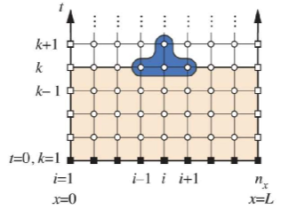
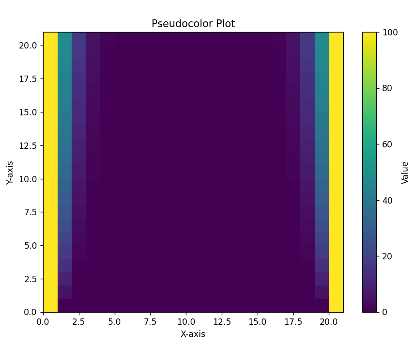

# 有限差分法

这里的有限差分法特指对偏微分方程的数值解法,关于常微分方程的数值解法,我们已经讨论过了.

与常微分方程的有限差分法不同的是,偏微分方程存在许多个微分变量,所以不仅仅要在一维数轴上做划分,而是要在二维甚至高维空间上做划分,并且迭代的变量也会增多.

不妨设我们要求的微分方程的解为$u(x,t)$

在x轴上做划分,在$x_j$处进行泰勒展开:

$$
u(x_{j+1})=u(x_j)+(\frac{\partial u}{\partial x})_j\Delta x+\frac{1}{2}(\frac{\partial^2 u}{\partial x^2})_j\Delta x^2+O(\Delta x^2)
$$

略去截断误差,并且将函数值改为估计值,就得到向前差分的近似表达式:

$$
(\frac{\partial u}{\partial x})_j=\frac{u_{j+1}-u_j}{\Delta x}
$$

以此类推,还有向后差分形式:

$$
(\frac{\partial u}{\partial x})_j=\frac{u_{j}-u_{j-1}}{\Delta x}
$$

以及一阶中心差分:

$$
(\frac{\partial u}{\partial x})_j=\frac{u_{j+1}-u_{j-1}}{2\Delta x}
$$

## 一维对流方程

以一维对流方程为例:

$$
\frac{\partial \phi}{\partial t}+\alpha \frac{\partial \phi}{\partial x}=0
$$

初值条件为:

$$
\phi(x,0)=\varphi(x)
$$

首先要将空间进行离散化,以便于我们的有限差分的进行:



对x方向和t方向我们采用不同的差分手段,在x方向上采用一阶中心差分,在t方向上采用向前差分:

首先要在区域上进行网格划分:

$$
\begin{aligned}
x_i=x_0+i\Delta x \\
t_n=n\Delta t
\end{aligned}
$$

所以相应的差分形式为:

$$
(\frac{\partial \phi}{\partial t})^n_i=\frac{\phi_i^{n+1}-\phi^n_i}{\Delta t}
$$

$$
(\frac{\partial \phi}{\partial x})_i^n=\frac{\phi^n_{i+1}-\phi^n_{i-1}}{2\Delta x}
$$

带入到偏微分方程中得到差分方程:

$$
\begin{cases}
    \displaystyle \frac{\phi_i^{n+1}-\phi^n_i}{\Delta t}+\alpha \frac{\phi^n_{i+1}-\phi^n_{i-1}}{2\Delta x}=0\\
    \phi^0_j=\varphi(x_j),\quad i,j,n=1,2, \ldots ,N
\end{cases}
$$

## 一维热传导

考虑一根一维的铁棒,两端温度维持100℃,在t=0时刻开始向中间进行热传导,试求不同时间下铁棒的温度分布:

一维热传导方程为:

$$
\frac{\partial T}{\partial t}-\beta\frac{\partial^2 T}{\partial x^2}=0
$$

初值条件:

$$
\begin{aligned}
T(x,0)=0 \\
T(0,t)=100\\
T(l,T)=100
\end{aligned}
$$

对于二阶导数,我们考虑一阶向后差分为:

$$
\left(\frac{\partial T}{\partial x}\right)^n_i=\frac{T^n_i-T^n_{i-1}}{\Delta x}
$$

所以二阶中心差分为:

$$
\left(\frac{\partial^2 T}{\partial x^2}\right)^n_i=\frac{\left(\frac{\partial T}{\partial x}\right)^n_{i+1}-\left(\frac{\partial T}{\partial x}\right)^n_i}{\Delta x}=\frac{T^n_{i+1}+T^n_{i-1}-2T_{i}^n}{\Delta x^2}
$$

对时间维度,采用一阶向前差分:

$$
\left(\frac{\partial T}{\partial t}\right)_i^n=\frac{T^{n+1}_i-T^n_i}{\Delta t}
$$

所以得到递推关系:

$$
\frac{T^{n+1}_i-T^n_i}{\Delta t}-\beta \frac{T^n_{i+1}+T^n_{i-1}-2T_{i}^n}{\Delta x^2}=0
$$

整理一下就是:

$$
\begin{cases}
    T_i^{n+1}=T^n_i+\beta \frac{\Delta t}{\Delta x^2}(T^n_{i+1}+T^n_{i-1}-2T_{i}^n)\\
    T^0_j=0\\
    T^n_0=100\\
    T^n_N=100
\end{cases}
$$

编写程序来实现这个问题,首先把x和y的取值抽象成为一个个整数,简化问题,例如,t的范围是[0,2.5],x的范围是[0,10],那么就取一个矩阵,大小是25×100.下面我们简化问题,采用20×20的矩阵,并且可以观察不同的导热参数下热传导的变化情况:

```python
import numpy as np
import matplotlib.pyplot as plt


#热传导参数

b=0.5

# 确定步长:

N=20


# 定义一个二维数组,代表函数值

data=np.zeros((N+1,N+1))

for i in range(N+1):
    data[i][N]=100
    data[i][0]=100

for j in range(1,N):
    data[0][j]=0


for n in range(1,N+1):
    for i in range(1,N):
        data[n][i]=data[n-1][i]+b*(data[n-1][i+1]+data[n-1][i-1]-2*data[n-1][i])


# 创建伪彩色图
plt.figure(figsize=(8, 6))
plt.pcolormesh(data, cmap='viridis',shading='auto')
plt.colorbar(label='Value')
plt.title('Pseudocolor Plot')
plt.xlabel('X-axis')
plt.ylabel('Y-axis')
plt.show()

```



$$图1.\beta=0.05$$


$$图2.\beta=0.3$$


$$图3.\beta=0.5$$

从这几个图可以清晰看到β越大,传热越快,温度梯度的形成更加明显.