# 2022国赛A题

这是一个波浪能吸收装置的问题,主要考察的是列微分方程

## 问题1

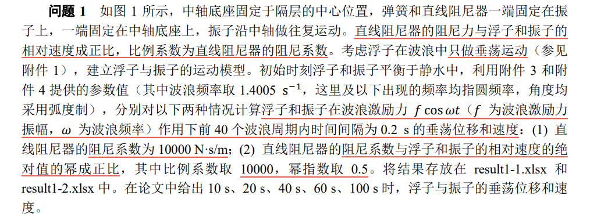


这个题主要就是列微分方程然后求解微分方程,我们找到一个合理的情况然后进行受力分析即可:

令向上为正方向,考察外壳和振子一起上升的情况,这个时候外壳速度大于振子,弹簧被压缩,对两者展开受力分析:

由于初态浮子和振子均处于平衡状态,所以在接下来的受力分析中不用考虑重力的影响.

首先,对振子进行受力分析:

$$
m\ddot{x_1}=f_1+f_2
$$

$f_1,f_2$分别是弹簧和阻尼器提供的力

对外壳进行受力分析,由于海水附加惯性力矩的存在,外壳会有一个附加质量$M'$,外壳收到向上的波浪激励力作用,同时受到一系列阻尼力,例如静水回复力,兴波阻尼力,弹簧和阻尼器的作用力等等:

其中,静水回复力由浮力变化产生,设外壳中心向上位移了$x_2$,那么就会减少一定体积的浮力,得到静水回复力为:

$$
f_{water}=-\rho g S x_2
$$

设兴波阻尼系数为$k_3$,所以兴波阻尼力为:

$$
f_{wave}=-k_3\dot{x_2}
$$

最终得到外壳的运动方程:

$$
(M+M') \ddot{x_2}=f\cos \omega t-\rho g S x_2-k_3\dot{x_2}-f_1-f_2
$$

其中弹簧回复力由二者的相对位移决定,阻尼器的阻尼力由二者的相对速度决定:

$$
\begin{aligned}
f_1=k_1 (x_2-x_1) \\
f_2=k_2(\dot{x_2}- \dot{x_1})
\end{aligned}
$$

所以,可以列出动力学方程组:

$$
\begin{cases} m\ddot{x_1}=k_1 (x_2-x_1)+k_2(\dot{x_2}- \dot{x_1}), &  \\ (M+M') \ddot{x_2}=f\cos \omega t-\rho g S x_2-k_3\dot{x_2}-k_1 (x_2-x_1)-k_2(\dot{x_2}- \dot{x_1}), &  \end{cases}
$$

整理之后可以得到:

$$
\begin{cases} \displaystyle \ddot{x_1}=-\frac{k_2}{m} \dot{x_1}+\frac{k_2}{m} \dot{x_2} -\frac{k_1}{m}x_1+\frac{k_1}{m}x_2, &  \\ \displaystyle \dot{x_2}=\frac{k_2}{M+M'}\dot{x_1}-\frac{k_2+k_3}{M+M'}\dot{x_2}+\frac{k_1}{M+M'}x_1-\frac{k_1+\rho gS}{M+M'}x_2+\frac{f\cos \omega t}{M+M'} , &  \end{cases}
$$

写成更加一般的形式就是:

$$
\begin{cases} 
\displaystyle \frac{d^2x_1}{dt^2}=a_1 \frac{dx_1}{dt}+a_2 \frac{dx_2}{dt}+a_3x_1+a_4x_2, &  \\ \displaystyle \frac{d^2x_2}{dt^2}=b_1 \frac{dx_1}{dt}+b_2 \frac{dx_2}{dt}+b_3x_1+b_4x_2+b_5 \cos \omega t, &  
\end{cases}
$$

这个题完全可以使用拉普拉斯变换求解精确解,我比较喜欢偷懒,下面就直接用数值解做了,如果是写论文,应该是解析解做一个小块,数值解做一个小块.

初值条件:

初始状态的时候,外壳和振子的重心应该重合:

$$
\begin{cases} x_1(0)=0, &  \\ x_2(0)=0, &  \end{cases}
$$

进行变量代换,将上述方程组转化为一元一阶的微分方程

首先，定义新变量：

\[
\begin{aligned}
y_1 &= x_1, & \frac{dy_1}{dt} &= y_3, \\
y_2 &= x_2, & \frac{dy_2}{dt} &= y_4, \\
y_3 &= \frac{dx_1}{dt}, & \frac{dy_3}{dt} &= a_1 y_3 + a_2 y_4 + a_3 y_1 + a_4 y_2 , \\
y_4 &= \frac{dx_2}{dt}, & \frac{dy_4}{dt} &= b_1 y_3 + b_2 y_4 + b_3 y_1 + b_4 y_2 + b_5 \cos \omega t.
\end{aligned}
\]


令

$$
Y=\begin{pmatrix} y_1 \\ y_2 \\ y_3 \\ y_4 \end{pmatrix}
$$

以及:

$$
F(Y,t)=\begin{pmatrix} y_3 \\ y_4 \\ a_1 y_3 + a_2 y_4 + a_3 y_1 + a_4 y_2  \\ b_1 y_3 + b_2 y_4 + b_3 y_1 + b_4 y_2 + b_5 \cos \omega t \end{pmatrix}.
$$

这个系统就变为:

$$
\frac{dY}{dt}=F(Y,t)
$$


可以尝试使用四阶龙格库塔方法求上述微分方程数值解:

$$
\begin{align*}
\begin{cases}
Y_{n+1} = Y_n + h (\lambda_1 k_1 + \lambda_2 k_2 + \lambda_3 k_3 + \lambda_4 k_4) \\
k_1 = f(t, Y_n) \\
k_2 = f(t + \alpha_1 h, Y_n + \beta_1 h k_1) \\
k_3 = f(t + \alpha_2 h, Y_n + \beta_2 h k_1 + \beta_3 h k_2) \\
k_4 = f(t + \alpha_3 h, Y_n + \beta_4 h k_1 + \beta_5 h k_2 + \beta_6 h k_3)
\end{cases}
\end{align*}
$$

求解结果如下图所示:

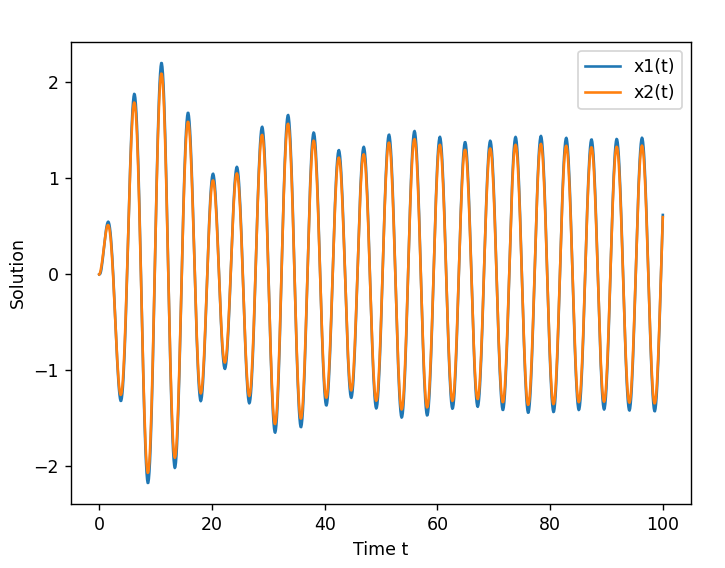

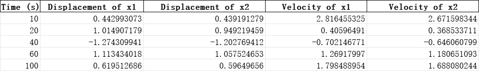

可以看到两条曲线略有差异但是差异不大,我这里采取了简化策略,一个是令弹簧原长为0,另一个则是默认二者初态的时候重心是重叠的,比赛的时候会考虑更多的因素,对结果进行一定的修正.


### 更加复杂的阻尼系数

阻尼系数与相对速度的绝对值的0.5次方成正比:

$$
k_2=10000 |\dot{x_2}-\dot{x_1}|^{0.5}
$$

仿照之前的操作:

定义以下新变量：

\[
\begin{aligned}
y_1 &= x_1, & \frac{dy_1}{dt} &= y_3, \\
y_2 &= x_2, & \frac{dy_2}{dt} &= y_4, \\
y_3 &= \frac{dx_1}{dt}, & \frac{dy_3}{dt} &= -\frac{k_2}{m} y_3 + \frac{k_2}{m} y_4 - \frac{k_1}{m} y_1 + \frac{k_1}{m} y_2 , \\
y_4 &= \frac{dx_2}{dt}, & \frac{dy_4}{dt} &= \frac{k_2}{M+M'} y_3 - \frac{k_2+k_3}{M+M'} y_4 + \frac{k_1}{M+M'} y_1 - \frac{k_1 + \rho g S}{M+M'} y_2 + \frac{f \cos \omega t}{M+M'}.
\end{aligned}
\]

其中，\( k_2 = 10000 |\dot{x_2} - \dot{x_1}|^{0.5} = 10000 |y_4 - y_3|^{0.5} \)。

求解结果为:
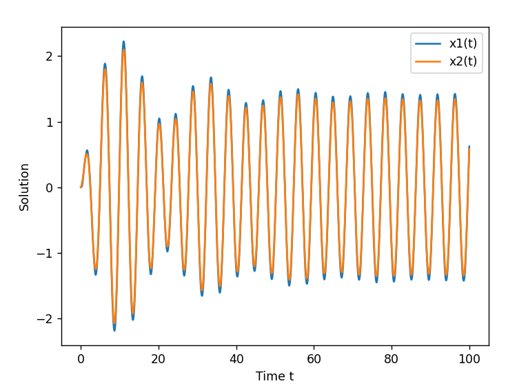

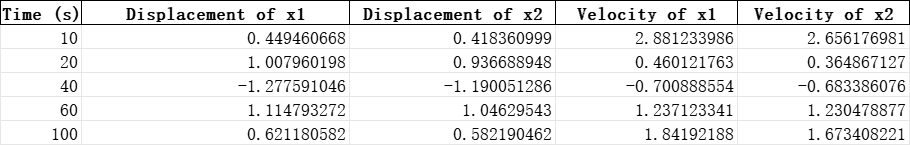


求解结果和第一种阻尼系数的结果只有细微的不同.

## 问题2

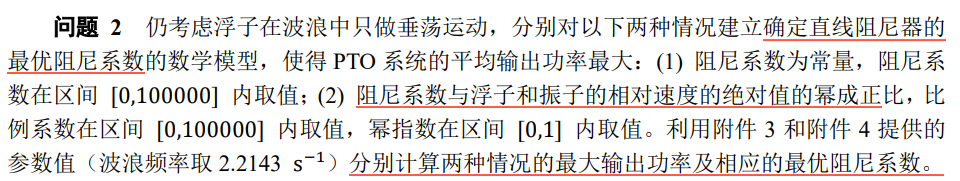

由于阻尼力始终趋向于使得二者之间的相对速度尽可能的小,所以其功率可以表示为:

$$
P=k_2(\dot{x_2}-\dot{x_1})^2
$$

由于不清楚其周期性,最好的办法就是在一个较大的时间区间内求其平均功率:

$$
\overline{P}=\frac{\displaystyle \int_{t_1}^{t_2}k_2(\dot{x_2}-\dot{x_1})^2dt}{t_2-t_1}
$$

从图像中可以发现,当$t\ge 60$之后,图像的周期性变得较为明显,所以我们取区间[60,160]作为我们平均功率的计算区间.

通过第一题得到的解,我们可以绘制速度-时间曲线,然后再进行数值积分后计算平均功率,总的来说,只要给定一个$k_2$就能返回一个平均功率,我们将整个过程抽象为一个函数:

$$
\overline{P}=g(k_2)
$$

我们的任务就是求这个函数的最大值以及其对应的阻尼系数

### $k_2$是常数

考虑使用粒子群优化算法求函数最大值:

随机生成10个粒子的坐标信息和速度信息,按照下式进行迭代:

$$
\begin{aligned}
&v^{(n+1)}_i=\omega v^{(n)}_i+c_1p_1(pbest^{(n)}_i-k^{(n)}_{2i})+c_2p_2(best^{(n)}_i-k_{2i}^{(n)}) \\
&k^{(n+1)}_{2i}=k^{(n)}_{2i}+v^{(n)}_i
\end{aligned}
$$

其中$(v_i^{(n)},k_{2i}^{(n)})$是第i个粒子在第n次迭代时候的速度和坐标.当算法迭代一定次数后我们输出结果

注意第二题数据换了,明早起来再跑一遍.

代价函数曲线如图所示:

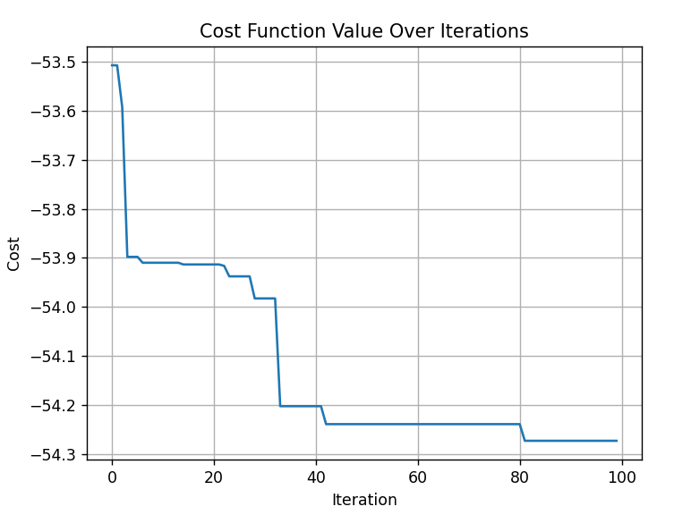

运行结果为:

```
最优的k2值: 35289.91636218471
P_mean的最大值: 54.27328432683444
```


### 更复杂的$k_2$

此时$k_2$的形式为:

$$
k_2=a|\dot{x_2}-\dot{x_1}|^b 
$$

所以定义坐标向量为:

$$
\mathbf{x}^{(n)}_i=
\begin{bmatrix}
    a^{(n)}_i\\
    b^{(n)}_i
\end{bmatrix}
$$

所以算法迭代更新的式子为:

$$
\begin{aligned}
&v^{(n+1)}_i=\omega v^{(n)}_i+c_1p_1(pbest^{(n)}_i-\mathbf{x}^{(n)}_{i})+c_2p_2(best^{(n)}_i-\mathbf{x}_{i}^{(n)}) \\
&\mathbf{x}_{i}^{(n+1)}=\mathbf{x}_{i}^{(n)}+v^{(n)}_i
\end{aligned}
$$

算法的代价函数曲线为:

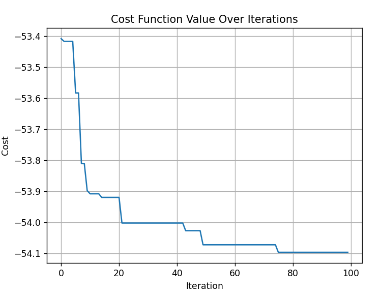

求得的平均功率为:

```
最优的a值: 42792.982434753125
最优的b值: 0.07400432676831373
P_mean的最大值: 54.09678573182077
```

## 问题3

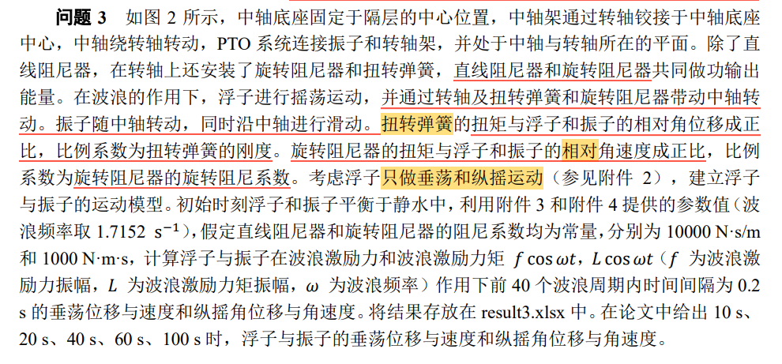

这个浮子现在不仅仅收到纵向的垂荡作用,还受到横向的纵摇作用力

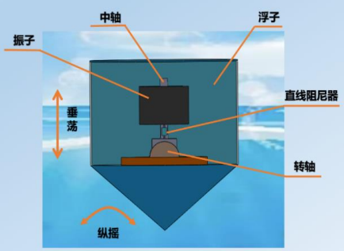

首先,什么是垂荡位移,题目没讲清楚,那我就按照自己的理解做了,垂荡位移即为物体与平衡原点连线的位移,不妨设t时刻振子和转子壳偏离平衡位置的角位移分别为$\theta_1$和$\theta_2$

由于这个转子的运动比较复杂,平衡位置是有速度和加速度的,但是,我们可以合理猜测这个平衡位置处的加速度应该很小,由此建立的平动参考系下的惯性力也很小,可以忽略不计,尝试在此参考系下求解方程:

### 径向动力学分析

先考察振子:

由于此时不在竖直方向振动,所以摇考虑重力的影响:

$$
F=f_2+f_1+mg(1-\cos\theta_1)
$$

根据加速度分析我们得到:

$$
\vec{a}=(\ddot{r}-r \dot{\theta}^2)\hat{r}+(2 \dot{r}\dot{\theta}+r \ddot{\theta})\hat{\theta}
$$

所以:

$$
m(\ddot{x_1}-x_1 \dot{\theta_1}^2)=f_2+f_1+mg(1-\cos\theta_1)
$$

再考察转子:

首先,经过证明,静水回复力大小不变,依旧为:

$$
f_r=-\rho g S x_2 
$$

但是其在径向方向上的分量会发生变化,同理可得转子的运动方程:

$$
(M+M')(\ddot{x}_{2}-x_2 \dot{\theta_2}^2)=f\cos\omega t\cos\theta_2-(f_1+f_2)\cos(\theta_2-\theta_1)+Mg(1-\cos\theta_2)-\rho g Sx_2\cos\theta_2-k_3 \dot{x_2}
$$

弹簧和阻尼器的作用力分别由相对位移和相对速度决定:

由于其表达式过于复杂,我们这里引入假设,角度$\theta_1,\theta_2$是一个较小的量,那么弹簧作用力和阻尼作用力可以视作与只有垂荡时候的情况一致:

$$
\begin{cases} f_1=k_1(x_2-x_1), &  \\ f_2=k_2(\dot{x_2}-\dot{x_1}), &  \end{cases}
$$

所以总的径向运动动力学方程为:

$$
\begin{cases} 
m(\ddot{x_1}-x_1 \dot{\theta_1}^2)=f_2+f_1+mg(1-\cos\theta_1), &  \\
(M+M')(\ddot{x}_{2}-x_2 \dot{\theta_2}^2)=f\cos\omega t\cos\theta_2-(f_1+f_2)\cos(\theta_2-\theta_1)+Mg(1-\cos\theta_2)-\rho g Sx_2\cos\theta_2 -k_3 \dot{x_2}, &  \\
f_1=k_1(x_2-x_1), &  \\ f_2=k_2(\dot{x_2}-\dot{x_1}), & 
\end{cases}
$$

### 法向动力学分析

这个分析主要是针对角度展开的分析,设两个转子的转动惯量分别是$I_1,I_2$

静水回复力矩为:

$$
M_{water}=-k_4\theta_2
$$

所以可以列出法向动力学方程:

$$
\begin{cases} 
I_1\ddot{\theta_1}=k_1'(\theta_2-\theta_1)+k_2'(\dot{\theta_2}-\dot{\theta_1}), &  \\ 
(I_2+I_2') \ddot{\theta_2}=L\cos\omega t-k_1'(\theta_2-\theta_1)-k_2'(\dot{\theta_2}-\dot{\theta_1})-k_3'\dot{\theta_2}-k_4\theta_2, &  
\end{cases}
$$

综上可得总动力学方程组为:

$$
\begin{cases} 
m(\ddot{x_1}-x_1 \dot{\theta_1}^2)=f_2+f_1+mg(1-\cos\theta_1), &  \\
(M+M')(\ddot{x}_{2}-x_2 \dot{\theta_2}^2)=f\cos\omega t\cos\theta_2-(f_1+f_2)\cos(\theta_2-\theta_1)+Mg(1-\cos\theta_2)-\rho g Sx_2\cos\theta_2 -k_3 \dot{x_2}, &  \\
f_1=k_1(x_2-x_1), &  \\ f_2=k_2(\dot{x_2}-\dot{x_1}), & \\
I_1\ddot{\theta_1}=k_1'(\theta_2-\theta_1)+k_2'(\dot{\theta_2}-\dot{\theta_1}), &  \\ 
(I_2+I_2') \ddot{\theta_2}=L\cos\omega t-k_1'(\theta_2-\theta_1)-k_2'(\dot{\theta_2}-\dot{\theta_1})-k_3'\dot{\theta_2}-k_4\theta_2, &  
\end{cases}
$$

将上述方程通过变量代换的方式变成一阶微分方程组:

$$
\begin{cases} 
\dot{x_1} = v_1, &  \\
\dot{x_2} = v_2, &  \\
\dot{\theta_1} = \omega_1, & \\
\dot{\theta_2} = \omega_2, & \\
m(\dot{v_1}-x_1 \omega_1^2) = f_2 + f_1 + mg(1 - \cos\theta_1), &  \\
(M + M')(\dot{v_2} - x_2 \omega_2^2) = f \cos\omega t \cos\theta_2 - (f_1 + f_2) \cos(\theta_2 - \theta_1) + Mg(1 - \cos\theta_2) - \rho g S x_2 \cos\theta_2 - k_3 v_2, &  \\
f_1 = k_1(x_2 - x_1), &  \\ 
f_2 = k_2(v_2 - v_1), & \\
I_1 \dot{\omega_1} = k_1'(\theta_2 - \theta_1) + k_2'(\omega_2 - \omega_1), &  \\ 
(I_2 + I_2') \dot{\omega_2} = L \cos\omega t - k_1'(\theta_2 - \theta_1) - k_2'(\omega_2 - \omega_1) - k_3' \omega_2 - k_4 \theta_2, &  
\end{cases}
$$

引入向量将上式转化为一元一阶微分方程:


\[
\mathbf{Y} =  \begin{pmatrix}
x_1 \\
x_2 \\
\theta_1 \\
\theta_2 \\
v_1 \\
v_2 \\
\omega_1 \\
\omega_2
\end{pmatrix}
\]

得到一阶向量微分方程:

\[
\dot{\mathbf{Y}} = \mathbf{F}(\mathbf{Y}, t)
\]

具体形式为:

\[
\dot{\mathbf{Y}} = \begin{pmatrix}
\dot{x_1} \\
\dot{x_2} \\
\dot{\theta_1} \\
\dot{\theta_2} \\
\dot{v_1} \\
\dot{v_2} \\
\dot{\omega_1} \\
\dot{\omega_2}
\end{pmatrix} = \begin{pmatrix}
v_1 \\
v_2 \\
\omega_1 \\
\omega_2 \\
\frac{1}{m} \left( f_2 + f_1 + mg(1 - \cos\theta_1) + x_1 \omega_1^2 \right) \\
\frac{1}{M + M'} \left( f \cos\omega t \cos\theta_2 - (f_1 + f_2) \cos(\theta_2 - \theta_1) + Mg(1 - \cos\theta_2) - \rho g S x_2 \cos\theta_2 - k_3 v_2 + x_2 \omega_2^2 \right) \\
\frac{1}{I_1} \left( k_1'(\theta_2 - \theta_1) + k_2'(\omega_2 - \omega_1) \right) \\
\frac{1}{I_2 + I_2'} \left( L \cos\omega t - k_1'(\theta_2 - \theta_1) - k_2'(\omega_2 - \omega_1) - k_3' \omega_2 - k_4 \theta_2 \right)
\end{pmatrix}
\]

然后可以使用龙格库塔方法求其数值解

转动惯量我没有算,直接估计$I_1=1500 N \cdot m^2,I_2=8000N \cdot m^2$

然后求出一个解的结果:

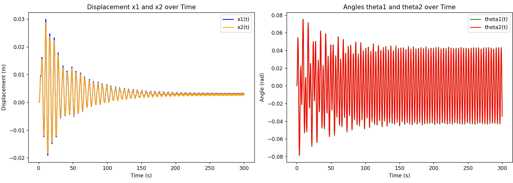

可以看到角度最大只有0.08rad左右,坐实了我们的小角度猜想.

## 问题4

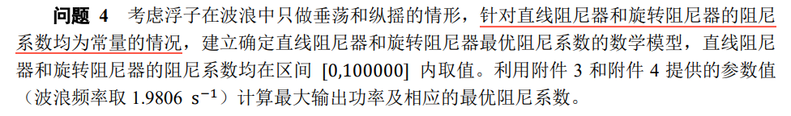

沿用第二题胡乱猜测的转动惯量,这个题也是老样子的优化问题,但是输出功率由两部分组成:

$$
P=P_1+P_2=k_2|\dot{x_2}-\dot{x_1}|^2+k_2'|\dot{\theta_2}-\dot{\theta_1}|^2
$$

求解微分方程后采用数值积分计算平均功率:

$$
\overline{P}=\frac{\displaystyle \int_{t_1}^{t_2}k_2|\dot{x_2}-\dot{x_1}|^2+k_2'|\dot{\theta_2}-\dot{\theta_1}|^2dt}{t_2-t_1}
$$

然后使用粒子群优化求最大值.思路很清晰,后面就不写了.

## 总结

这里在做这道题的时候用了很多的近似处理,甚至我都不知道对不对,以及忽略了一些细节,例如重心是否重叠,弹簧有原长之类的,后面甚至随便写了两个转动惯量,但是可以看见,这个结果还是一定程度上符合预期,符合物理实际的,实际比赛的时候就需要花时间去打磨,但是可以先尝试乱做一下看看方案可不可行.