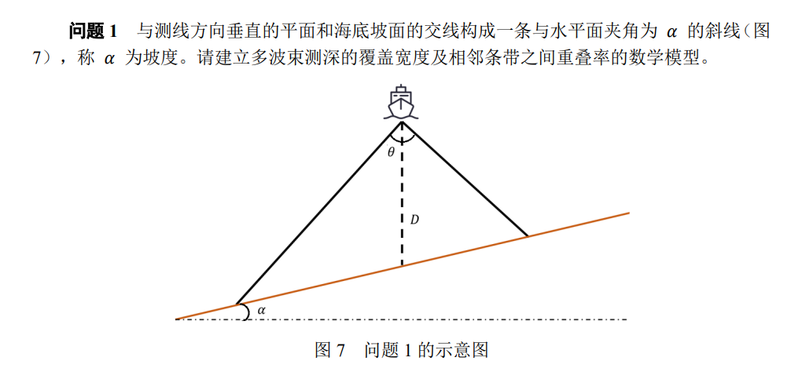
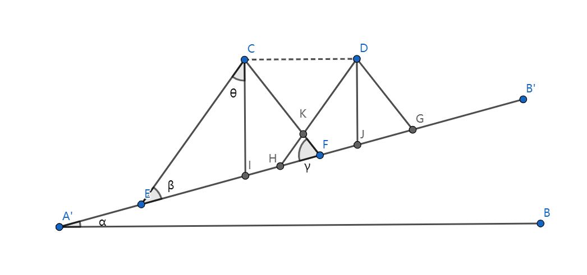
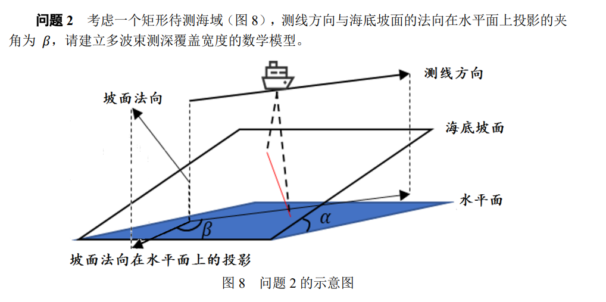
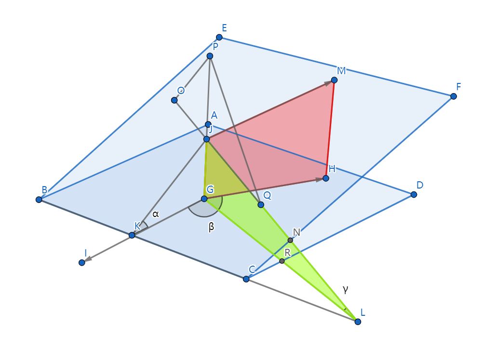
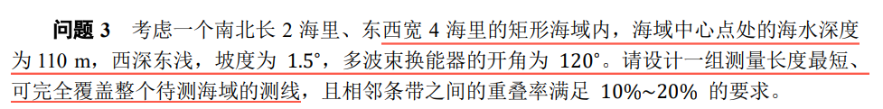
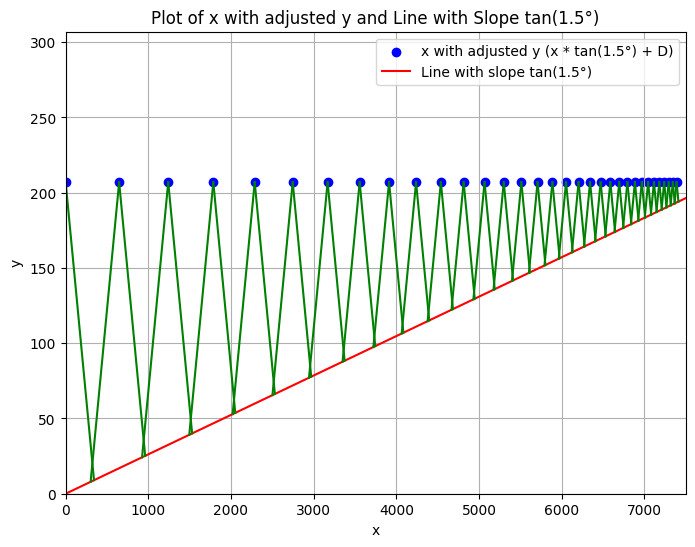
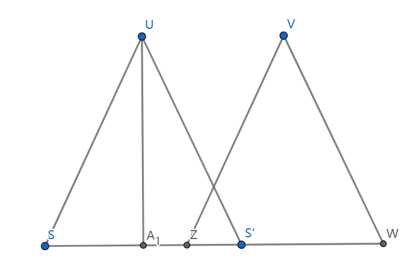
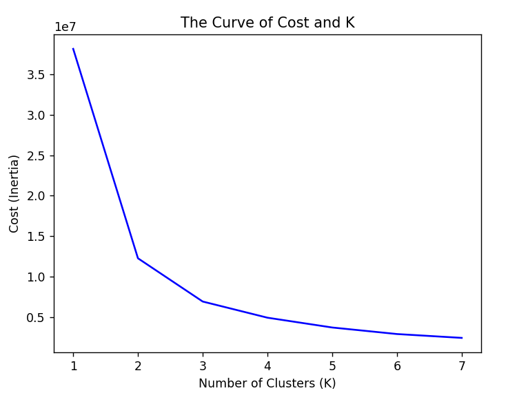
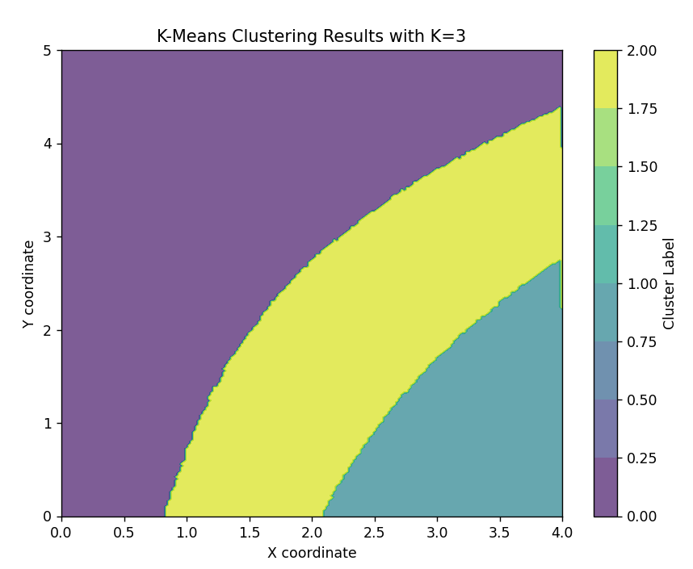
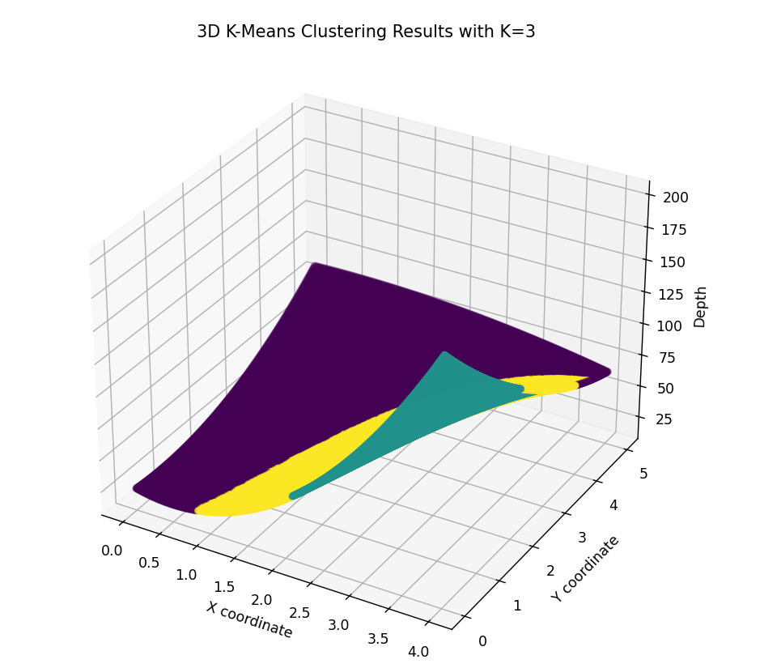

# 2023国赛B题

本体是一个多波束测深的优化问题,在前两问要求给出在不同的坡度和测线方向时的数学模型,后两问则是测线的设计,一个是简单的坡面的测线设计,另一个则是海底凹凸不平的坡面的设计.

突然发现重叠率好像要自己算,不是按照题目里面的公式代入计算重叠率,完蛋,这样后面做出来全有误差,但是角度只有1.5度,误差也应该不大,第三题优秀论文做出来是34条,我这里算出来33条,应该就是这个原因导致的.就这样吧不想改了.

## 第一题

已知重叠率的定义为:

$$
\eta=1-\frac{d}{W}=1-\frac{d}{EF}
$$

画出完整的两个多波束的重叠图像:

已知条件为:

$$
\begin{cases}
&CI=D(某个船处的海水深度),\\
&半开角度\theta,(题目里换能角是\theta,这里为了计算方便直接取半角为\theta)\\
&CD=d(测线间距)\\
\end{cases}
$$

要求的量:

$$
\begin{aligned}
覆盖宽度W即EF的长度 \\
相邻测线对应的海水深度:DJ
\end{aligned}
$$

先给出相邻测线海水的深度,延长CD交A'B'于某一点S,根据相似三角形可以得到

$$
\frac{D'}{D}=\frac{CS-d}{CS}=\frac{D-d\tan\alpha}{D}
$$

即:

$$
D'=D-d\tan\alpha
$$

EF可以根据D比较容易的求得:

首先根据几何关系得知角度关系
$$
\begin{cases}
\beta=\frac{\pi}{2}-\theta-\alpha\\
\gamma=\frac{\pi}{2}+\alpha-\theta
\end{cases}
$$

根据正弦定理计算CF:

$$
\frac{D}{\sin\gamma}=\frac{CF}{\sin(\theta+\beta)}
$$

再根据正弦定理计算EF:

$$
\frac{EF}{\sin2\theta}=\frac{CF}{\sin\beta}
$$

$$
EF=D \frac{sin(\theta+\beta)}{\sin\gamma}\frac{\sin2\theta}{\sin\beta}=D \frac{\cos\alpha\sin 2\theta}{\cos(\theta-\alpha)\cos(\theta+\alpha)}
$$

所以重叠率为:

$$
\eta=1-\frac{d}{D}\frac{\cos(\theta-\alpha)\cos(\theta+\alpha)}{\cos\alpha\sin2\theta}
$$

综上所述,我们得到斜坡上多波束测深的数学模型:

$$
\begin{cases} D'=D\pm d\tan\alpha, &相邻测线处的海水深度 \\ 
\displaystyle W=D \frac{\cos\alpha\sin 2\theta}{\cos(\theta-\alpha)\cos(\theta+\alpha)},&当前测线的覆盖宽度\\
\displaystyle \eta=1-\frac{d}{D}\frac{\cos(\theta-\alpha)\cos(\theta+\alpha)}{\cos\alpha\sin2\theta}, &当前测线的重叠率  \end{cases}
$$

## 第二题

因为波束测深只在一个平面中进行,该探测平面与坡面交线的线线角即为这个平面的等效坡度角,就能把问题转化为问题1:

新平面的坡度角根据几何关系容易求得:

$$
\tan\alpha=\frac{JG}{KG}
$$

$$
\tan\gamma=\frac{JG}{GL}
$$

$$
\frac{KG}{GL}=\cos(\beta-\frac{\pi}{2})
$$

$$
\gamma=\arctan[\tan\alpha\sin\beta]
$$

然后使用问题1的平面模型求解即可.

## 第三题

根据对称性,不难发现测线的排布应该是东西朝向或者南北朝向的,这可以从以下角度说明:

每一条测线需要单独的一艘船只进行测量或者一艘船只进行多次测量,而非平行布线会导致每次的任务量差距很大,经济效益不够好.

其次,非平行布线并不能完全贴合海域的形状,很容易存在漏测或者需要多测的情况,增大了工作量和工作难度

所以我们只需要考虑东西走向和南北走向两种情况:

假设我们有n条测线,第i条测线在对应方向的法向上的坐标记做$x_i$,他与下一条测线之间的间距记做$d_i$,于是满足:

$$
x_{i+1}=x_i+d_i
$$

待确定的有:

$$
\begin{cases} 测线个数n, &  \\ 每根测线的坐标x_i, i=1,2,\cdots,n\\两根测线之间的距离d_i,\forall i=1,2,\cdots,n-1  \end{cases}
$$

测线的总长度=测线根数×单独测线的长度,其中后者是静态参数,不能修改,所以我们希望测线根数尽可能少.

约束条件为:

1. 左右边界海域要被完全覆盖

2. 每根测线与上一根测线的重叠率$\eta_i,i=1,2,\cdots,n-1$要在10%-20%之间
   
重叠率由海水的深度$D_i$以及与上一根测线的距离$d_i$共同决定,而海水深度又由东西方向的坐标决定:

### 南北走向排布

一组符合要求的测线,他需要满足如下条件:

$$
\begin{aligned}
&\begin{cases} 0\le x_i\le 7408,i=1,2,\cdots,n &  \\ x_{i+1}=x_i+d_i,i=1,2,\cdots,n-1 & \\
0.1 \le \eta_i\le 0.2,i=1,2,\cdots,n-1\\
两侧边界完全被覆盖\\
\end{cases}
\end{aligned}
$$

我们的目标就是求满足这些约束的最小的n,对于一个n,如果他可行,可能对应很多的铺线方案,我们取覆盖总宽度最大的那个方案作为我们的方案,这样可以留有一定的余量面对突发情况,所以我们定义一个目标函数为覆盖总宽度.

下一步,尝试写出目标函数

还是看这个图,每个$x_i$会对应一个$D_i$,那么,每个船的覆盖宽度为:

$$
W_i=D_i \frac{\cos\alpha\sin 2\theta}{\cos(\theta-\alpha)\cos(\theta+\alpha)}
$$

注意到x=2时候的海水深度为110m,所以可以写出x和海水深度D之间的关系

$$
D=110-(x-3704)\tan1.5°
$$

每个测线距离会对应一个重叠宽度:

$$
\frac{CK}{sin(\frac{\pi}{2}-\theta)}=\frac{d_i}{sin(2\theta)}
$$

$$
KF=CF-CK
$$

$$
\frac{HF}{\sin 2\theta}=\frac{KF}{\sin \beta}
$$

$$
CF=D_i \frac{sin(\theta+\beta)}{\sin \gamma}
$$

联立以上四个方程解得:

$$
s_i=HF=D_i \frac{\cos \alpha \sin 2\theta}{\cos (\theta+\alpha)\cos (\theta -\alpha)}-d_i \frac{\cos\theta}{\cos(\theta+\alpha)}
$$

所以总测线宽度为:

$$
l=\sum_{i=1}^n W_i-\sum_{i=1}^{n-1} s_i=W_n+\sum_{i=1}^{n-1}d_i \frac{\cos\theta}{\cos(\theta+\alpha)}=W_n+\frac{\cos\theta}{\cos(\theta+\alpha)}(x_n-x_1)
$$

不难发现,测线的总覆盖长度只取决于初始坐标和终止坐标,中途坐标的约束体现在重叠率中:

$$
0.1\le 1-\frac{d_i}{D_i}\frac{\cos(\theta-\alpha)\cos(\theta+\alpha)}{\cos\alpha\sin2\theta}\le 0.2\quad\forall i=1,2,\cdots,n-1
$$

其次,两端海域要求被覆盖到,所以要求解有这样的性质,不断提高n,直到他能够满足下列要求:

$$
x_1\le \frac{D_1\cos\alpha\sin\theta}{\cos(\alpha+\theta)}
$$

$$
x_n\ge 7408-\frac{D_n \cos \alpha \sin \theta}{\cos(\theta-\alpha)}
$$

于是,可以写出规划问题:

给定一个n

$$
\begin{aligned}
\max &W_n+\frac{\cos\theta}{\cos(\theta+\alpha)}(x_n-x_1) \\
s,t.
&\begin{cases}
 0\le x_i\le 7408,i=1,2,\cdots,n &  \\ 
 x_{i+1}=x_i+d_i,i=1,2,\cdots,n-1 & \\
0.1 \le 1-\frac{d_i}{D_i}\frac{\cos(\theta-\alpha)\cos(\theta+\alpha)}{\cos\alpha\sin2\theta}\le 0.2,i=1,2,\cdots,n-1\\ 
D_i=110-(x_i-3704)\tan1.5°\\
W_n=D_n \frac{\cos\alpha\sin 2\theta}{\cos(\theta-\alpha)\cos(\theta+\alpha)}\\
x_1\le \frac{D_1\cos\alpha\sin\theta}{\cos(\alpha+\theta)}\\
x_n\ge 7408-\frac{D_n \cos \alpha \sin \theta}{\cos(\theta-\alpha)}
\end{cases}
\end{aligned}
$$

如果规划无解,那就意味这对于这个n,不存在这样的排布可以合理覆盖海域,所以只需要找到最小的n,使得上面的规划问题有解即可,经过求解器求解得到最少能使上面规划有解的$n=33$

其中一个最优排布经过可视化绘制后如下图所示

测线的总长度为:

$$
total=33\times 2\times 1852=122232m
$$

### 东西走向排布

由于在南北方向上深度都是一样的,所以测线的间距应该都是相同的,不妨统一设置为$d$,于是,只要保证在最浅的地方覆盖率>=10%,在最深的地方覆盖率<=20%,并且满足在海水最浅的地方最大面积覆盖可以覆盖整个海域,这就是一个合理的排布,最优排布即测线最小的排布.

几何关系如图所示:

$$
\begin{aligned}
W=2D\tan\theta \\
\eta=1-\frac{d}{2D\tan\theta}\\
s=2D\tan\theta-d
\end{aligned}
$$

写出约束:

$$
\begin{aligned}
&s.t.
\begin{cases}
    1-\frac{d}{2D_{\min}\tan\theta}\ge 0.1\\
    1-\frac{d}{2D_{\max}\tan\theta}\le 0.2\\
    x_1\le D_{\min}\tan\theta\\
    x_n\ge 9260-D_{\min}\tan\theta\\
    x_{i+1}=x_{i}+d \quad i=1,2,\cdots,n-1
\end{cases}
\end{aligned}
$$

所以得到:

$$
1+\frac{9260-2D_{min}\tan\theta}{1.8D_{\min}\tan\theta}\le n\le 1+\frac{9260-2D_{min}\tan\theta}{1.6D_{\min}\tan\theta}
$$

得到n至少要大于等于257,所以测线总长度至少为:

$$
total=257\times 4\times 1852=1.9\times 10^{6}
$$

所需测线总长度远远大于南北排布所需测线的总长度.

综上所述,测线应该为南北走向,测线的根数为33根,总长度为122232m,测线的坐标和间隔由数学规划给出,这里我懒得写了.

## 第四题

初步想法是,根据坐标和梯度进行K-means聚类,将类簇中的所有数据点做一个平面拟合,这样凹凸不平的海底就变成了一个个平面.

点的梯度可以根据一阶向前差分来近似计算(对边界的点用向后差分来计算):

$$
\begin{cases} (\frac{\partial f}{\partial x})_n=\frac{f(x_{n+1})-f(x_n)}{\Delta x}, &  \\(\frac{\partial f}{\partial y})_n=\frac{f(y_{n+1})-f(y_n)}{\Delta y}, &  \end{cases}
$$

所以,每个点的梯度可以描述为:

$$
\nabla f_n=(\frac{f(x_{n+1})-f(x_n)}{\Delta x},\frac{f(y_{n+1})-f(y_n)}{\Delta y})
$$

构造向量:

$$
\vec{A}_i=(x_i,y_i,\nabla_x f_i,\nabla_y f_i)
$$

执行聚类操作:

$$
\min \sum_{i=1}^n \left\| \vec{A_i}-\vec{\mu}_{c_i} \right\|
$$

对不同的聚类个数$K=1,2, \ldots $,绘制出代价函数曲线,找到肘点,得到最佳聚类个数.

将每个类簇中的点的梯度取平均,得到近似平面梯度,这样凹凸不平的海底就变成了一个个平面,下一步就是要在这些平面上规划一系列测线

我用python跑了一下代价函数曲线:

可以看到,肘点为K=3或者K=2,再增加分类的个数代价函数下降就不太明显了,所以比较好的分类方法是将整个海底分为3大块,每一块都近似成为平面.

聚类结果如下所示:

这个是平面分布:

这个是三维空间中的聚类分布:

然后下一步就是确定测线的根数,每根测线的航行方向都垂直于梯度方向,这里我还没有什么很好的思路.

因为题目没要求测线是连续的,所以我个人倾向于测线对每个近似平面单独布置.