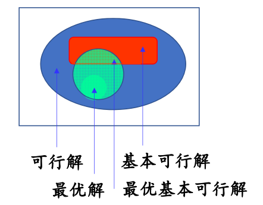
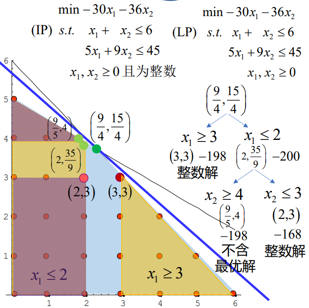

# 数学规划

数学规划有许多分支，按照函数性质大致可以分为下面几类

!!! 按照函数性质分类

    * 数学规划
    - 线性规划（linear programming）
        - 目标函数为线性函数，约束条件为线性等式或不等式
    - 非线性规划（nonlinear programming）
        - 目标函数为非线性函数，或至少有一个约束条件为非线性等式或不等式
            - 二次规划（Quadratic Programming, QP）：目标函数为二次函数，约束条件为线性等式或不等式
            - 带二次约束的二次规划（Quadratically Constrained Quadratic Program， QCQP）：目标函数为二次函数，约束条件为线性或二次等式或不等式
            - 线性分式规划（linear fractional programming）：目标函数为两个线性函数的商，约束条件为线性等式或不等式
  
## 经典数学规划问题

### 食谱问题

仓库里面有$n$种不同的事物,第$j$种食物的售价是$c_j$,包含第$i$种营养成分的含量是$a_{ij}$,每个人一天内至少需要摄入第$i$种营养成分$b_i$个单位,人体必须的营养成分有$m$种,但是这个人囊中羞涩,同时不太追求享受,所以他想要最为经济的配食方案.

我们定义一个决策变量$x_j$代表他摄入$j$号食物的数量

不难看出,目标函数就是:

$$
\min \sum_{j=1}^n c_jx_j
$$

同时约束条件是:

$$
\sum_{j=1}^na_{ij} \ge b_i , i=0,1\cdots m
$$

$$
x_j\ge 0 ,j=0,1, \ldots n
$$

### 运输问题

现在有$m$个产地和$n$个销售地,产地i的生产能力是$a_i$,销售地$j$的销售能力是$b_j$,从产地$i$运往销售地$j$所需要的单位重量的运费是$c_{ij}$,那么,如何调运货物,使得所有商品恰好卖出,并且运输费用最小?

1. 产销平衡

   $$
   \sum_{i=1}^ma_i=\sum_{j=1}^nb_j
   $$

2. 定义决策变量$x_{ij}$为从$i$运往$j$的货物数量
   所以会有:
   
   $$
   \begin{aligned}
   &0\le x_{ij}\le \min(a_i,b_j) \\
   &\sum_{i=1}^m x_{ij}=b_j\\
   &\sum_{j=1}^n x_{ij}=a_i
   \end{aligned}
   $$

3. 目标函数 
   
   $$
   \min\sum_{i=1}^m\sum_{j=1}^n c_{ij}x_{ij}
   $$

### 下料问题

### 选址问题

### 时间分配问题

### 投资组合

### 赛制编程

### 支持向量机

## 数学规划求解

### 线性规划求解

#### 线性规划的标准形式

为了对所有线性规划统一求解标准，我们要把线性规划化作相应的标准形式：

$$
\begin{aligned}
&\min \mathbf{C^Tx} \\
& s.t.\mathbf{Ax=b}\\
& \mathbf{x}\ge 0
\end{aligned}
$$

其中$A$是$m\times n$行满秩矩阵，$m<n$

如果是要求目标函数的最大值，给他加个负号就变成了求最小值，若某个约束条件不是等式约束，而是不等式约束，例如：

$$
a_1x_1+a_2x_2+ \cdots +a_nx_n\ge 0
$$

则可以增加一个新的变量$y\ge 0$,上面的式子就变成了：

$$
a_1x_1+a_2x_2+ \cdots +a_nx_n-y= 0
$$

反之，如果是小于等于的约束，只需要加上$y$就可以了

对于没有约束的自由变量$x_j$,可以做如下操作：

$$
\begin{aligned}
x_j=x_j^++x_j^- \\
x_j^+,x_j^-\ge 0
\end{aligned}
$$

这样，就转变成为有约束的两个变量。

#### 单纯形法

在介绍单纯形法之前，我们要先给出基本解和基本可行解的基本概念，注意到，由于$A$是行满秩矩阵,且$m<n$,所以在$n$列当中一定额可以挑选出线性无关的$m$列,将矩阵$A$重排,把这线性无关的$m$列放在最前面,于是我们就得到了$A$的$m$阶可逆子矩阵$B$

$$
A=\left(B,N\right)
$$

同时我们把$x$也进行分块:

$$
x=
\begin{pmatrix}
    x_B \\
    x_N
\end{pmatrix}
$$

其中$B$被称作基矩阵,而$x_B$被称作基变量,$x_N$被称作非基变量,令$x_N=0$,去求解约束条件,就能得到一个基本解:

$$
\begin{pmatrix}
    x_B\\
    0
\end{pmatrix}=
\begin{pmatrix}
    B^{-1}b\\
    0
\end{pmatrix}
$$

如果说,这个基本解还满足非负约束$B^{-1}b\ge 0$,那么就把他叫做基本可行解,基本可行解的数目有限,受限于系数矩阵,他最多只有$C_n^m$个.

那么,得到了这个所谓的基本可行解,对我们求解最优解有什么帮助呢?

!!! info "线性规划基本定理"

    * 线性规划基本定理
    - 若线性规划有可行解,则必定有基本可行解
    - 若线性规划有最优解,则必定有最优基本可行解
        - 线性规划的最优解只需要在有限个基本可行解当中去寻找

    

这就是为什么把线性规划当做离散优化的模型，因为线性规划本质上是一个连续型优化问题，但是现在只需要在有限个基本可行解中就能找到最优解，相应的寻找最优解的算法也应该具有离散优化的特征。

单纯形法的思想就是不断迭代基本可行解，直到找到最优的基本可行解

具体的步骤如下

* 先取一个初始的可行基$B$,然后根据高斯消去法求出基本可行解$x^{0}$
* 判断$x^{0}$是不是最优解,如果是,则输出$x^{0}$,迭代终止,否则进行下一步
* 对换$B$和$N$中的一列,得到新的可行基$B$,重复(1)操作
  
那么,如何判别最优解呢

!!! info "最优性判别定理"

    对于任意的一个可行解,我们都可以通过对换系数矩阵列和解向量行的方式得到:

    $$
    \begin{aligned}
    &A=(B,N) \\
    &x=
    \begin{pmatrix}
        x_B\\
        x_N
    \end{pmatrix}
    \end{aligned}
    $$

    这样的话,任意一组可行解都可以对应到一个基本可行解:

    对应的基本可行解记做:

    $$
    x^{0}=
    \begin{pmatrix}
        B^{-1}b\\
        0
    \end{pmatrix}
    $$

    将可行解代入约束方程中可以得到:

    $$
    x_B=B^{-1}b-B^{-1}Nx_{N}
    $$

    将这个结果带入到目标函数中得到:

    $$
    \begin{aligned}
     Z=C^Tx=(C_B^T,C_N^T)
    \begin{pmatrix}
        x_B\\
        x_N
    \end{pmatrix}=C_B^Tx_B+C_N^{T}x_{N}=\\
    C_B^TB^{-1}b+(C^T_N-C^T_BB^{-1}N)x_N\\
    =C^Tx^{0}+(C^T_N-C^T_BB^{-1}N)x_N
    \end{aligned}
    $$

    定义$r_N=C^T_N-C^T_BB^{-1}N$为检验向量

    如果说$r_N\ge 0$,那么由于非负约束,有$x_N\ge 0$,所以得到,对于任意的可行解,都会有:

    $$
    C^Tx-C^Tx^{0}=r_Nx_N\ge 0
    $$

    故$x^0$是最优解.

    反之,如果$r_N<0$,那么$x^0$一定不是最优可行解.

### 整数规划求解

#### 分支定界法

分支定界法是整数规划的最常用的算法,其核心思想可以用于其他的问题求解上.

分支定界法的核心步骤在于,不断地松弛,求解,面对难以求解的整数规划问题,我们通常先求它的实数近似解,然后将可行域不断地按照最靠近实数最优解的两个点进行划分(分支),对每个分支,再独立的进行松弛,然后求解相应的实数近似最优解,直到实数近似最优解等于整数,迭代终止.

考察下面一个整数规划问题

$$
\begin{equation*}
\begin{aligned}
& \text{min} \quad -30x_1 - 36x_2 \\
& \text{(IP)\quad s.t.} \quad x_1 + x_2 \leq 6 \\
& \quad \quad \quad 5x_1 + 9x_2 \leq 45 \\
& \quad \quad \quad x_1, x_2 \geq 0 \quad \text{且为整数}
\end{aligned}
\end{equation*}
$$

直接求解显得比较困难,因为规划变量都是整数,但是,如果他们都是实数,那就比较方便求解了,所以分支定界法的第一步就是松弛,把整数规划先变成普通规划:

$$
IP \to LP
$$

于是得到下列的普通规划:

$$
\begin{equation*}
\begin{aligned}
& \text{min} \quad -30x_1 - 36x_2 \\
& (\text{LP}) \quad \text{s.t.} \quad x_1 + x_2 \leq 6 \\
& \quad \quad \quad 5x_1 + 9x_2 \leq 45 \\
& \quad \quad \quad x_1, x_2 \geq 0
\end{aligned}
\end{equation*}
$$

这个规划的最优解是$(x_1,x_2)=(\frac{9}{4},\frac{15}{4})$

现在单独考虑一个变量$x_1$,现在我们就可以对整数规划的可行域进行一个划分了,考虑最接近$\frac{9}{4}$的两个整数,进行分支

$$
x_1\ge 3,x_1\le 2
$$

第二步,定界

这一步主要是为了确定最优值的上界和某一分支的下界

根据我们刚刚得到的分支,一个整数规划问题可以转变为两个整数规划问题:

$$
\begin{equation*}
\begin{aligned}
& \text{min} \quad -30x_1 - 36x_2 \\
& \text{(IP)\quad s.t.} \quad x_1 + x_2 \leq 6 \\
& \quad \quad \quad 5x_1 + 9x_2 \leq 45 \\
& \quad \quad \quad x_1\ge 3, x_2 \geq 0 \quad \text{且为整数}
\end{aligned}
\end{equation*}
$$

以及:

$$
\begin{equation*}
\begin{aligned}
& \text{min} \quad -30x_1 - 36x_2 \\
& \text{(IP)\quad s.t.} \quad x_1 + x_2 \leq 6 \\
& \quad \quad \quad 5x_1 + 9x_2 \leq 45 \\
& \quad \quad \quad x_1\le 2, x_2 \geq 0 \quad \text{且为整数}
\end{aligned}
\end{equation*}
$$

对于两个支分别进行松弛求解,得到,第一个支的最优解为$(x_1,x_2)=(3,3)$,目标函数值为-198,是一个整数解,并且是他这个支内的最优解,所以这个支停止迭代,得到整数规划最优解的一个上界-198.

对于第二个支,其最优解为:$(x_1,x_2)=(2,\frac{35}{9})$,并且它的目标函数值为-200,这个值比-198还要小,所以有继续做下去的必要,反之就可以直接输出第一个支得到的最优值了.

对$x_2$进行分支得到$x_2\ge 4和x_2\le 3$,又得到两个整数规划问题:

$$
\begin{equation*}
\begin{aligned}
& \text{min} \quad -30x_1 - 36x_2 \\
& \text{(IP)\quad s.t.} \quad x_1 + x_2 \leq 6 \\
& \quad \quad \quad 5x_1 + 9x_2 \leq 45 \\
& \quad \quad \quad x_1\le 2, x_2 \geq 4 \quad \text{且为整数}
\end{aligned}
\end{equation*}
$$

 
$$
\begin{equation*}
\begin{aligned}
& \text{min} \quad -30x_1 - 36x_2 \\
& \text{(IP)\quad s.t.} \quad x_1 + x_2 \leq 6 \\
& \quad \quad \quad 5x_1 + 9x_2 \leq 45 \\
& \quad \quad \quad x_1\le 2, x_2 \leq 3 \quad \text{且为整数}
\end{aligned}
\end{equation*}
$$

对他们进行松弛,求解得到:

分支1的最优解$(x_1,x_2)=(\frac{9}{4},4)$,目标函数值为-198

分支2的最优解为$(x_1,x_2)=(2,3)$,目标函数值为-168

第一个分支由于其目标函数的下界恰好等于最优值的上界,所以被剪去(剪枝)

第二个分支由于其得到了整数解,停止迭代,得到最优值的另一个上界$-168$

将所有最优值的上界进行比较,得到了这个整数规划的最优解:

$$
(x_1,x_2)=(3,3),
目标函数值:-198
$$

!!! info "该整数规划的图示"

    

尝试写一个求解流程:

!!! 求解流程

    $$
    \begin{aligned}
    &给定一个整数规划问题 \\
    &\downarrow\\
    &松弛求解,得到最优解  \\
    &\downarrow\\
    &判断最优解是否是整数,如果是,停止迭代,同时比较他与变量best的大小,如果比他小,就存入best,如果否,执行下一步操作\\
    &\downarrow\\
    &判断最优解的目标函数值是否大于best,如果大于,该分支停止操作,如果小于,执行下一步操作.\\
    &\downarrow\\
    &随便找一个不是整数的最优解的分量,考虑两个最接近他的整数,进行分支,变成两个新的整数规划问题,回到步骤1
    \end{aligned}
    $$

