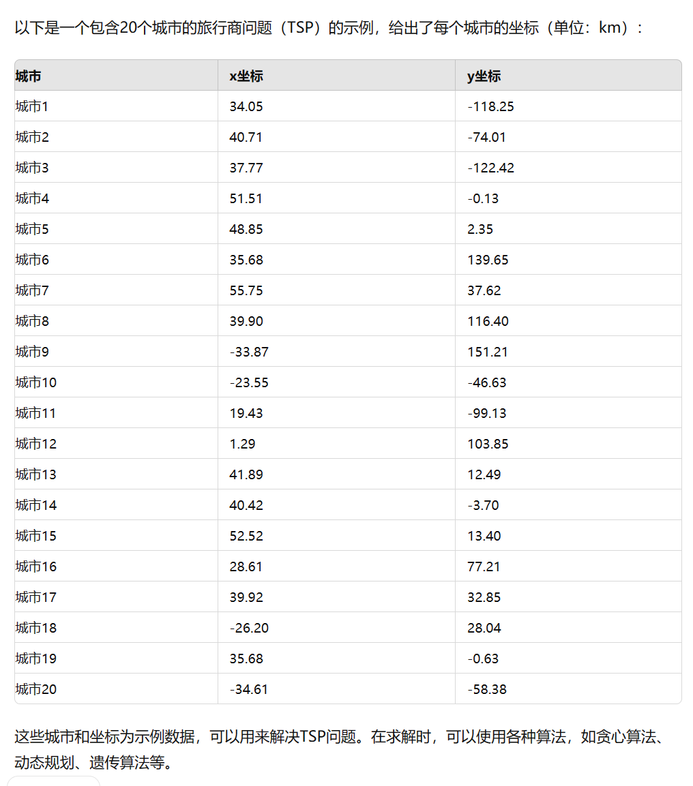

# 禁忌搜索算法实例

## TSP问题

### 邻域变换

首先我们考虑邻域变换的形式，对于任意的一个路径：

$$
j_1,j_2, \ldots ,j_i, \ldots ,j_k, \ldots ,j_n 
$$

任选其中的两个元素$j_i$和$j_k$，将他们互换顺序，得到：

$$
j_1,j_2, \ldots ,j_k, \ldots ,j_i, \ldots ,j_n 
$$

这样，最少会得到$n(n+1)/2$个邻居（因为有可能有重复的），当城市数目比较多的时候，所得到的邻域会非常大，所以我们在里面挑选50个作为我们的候选集合

### 禁忌表和禁忌期限

禁忌表的长度通常按照城市数目的25%左右来确定，禁忌期限通常选用：

$$
t=[\sqrt{\frac{N(N+1)}{2}}]
$$

为邻居数目的开根号。同时，我们对以上禁忌期限进行一定的改进，让禁忌期限在迭代次数较小的时候比较小，这样能有利于扩大搜索空间，在迭代次数较大的时候比较大，这样能有利于他收敛到全局最优解：

$$
t=[\sqrt{\frac{N(N+1)}{2}}\exp(a\frac{n}{n_{\max}})]
$$

其中a是参数，可以根据效果进行调整

### 特设准则

关于特赦准则，我们采取简化的策略，当禁忌表满了的时候，把最早加入禁忌表的元素踢出去，然后在禁忌表的末尾加入元素。

下面让GPT生成一个问题，准备开始写代码吧



```python
import random as rd
from math import sqrt,exp

import matplotlib.pyplot as plt

# 城市坐标列表
zuobiao = [
    (34.05, -118.25),
    (40.71, -74.01),
    (37.77, -122.42),
    (51.51, -0.13),
    (48.85, 2.35),
    (35.68, 139.65),
    (55.75, 37.62),
    (39.90, 116.40),
    (-33.87, 151.21),
    (-23.55, -46.63),
    (19.43, -99.13),
    (1.29, 103.85),
    (41.89, 12.49),
    (40.42, -3.70),
    (52.52, 13.40),
    (28.61, 77.21),
    (39.92, 32.85),
    (-26.20, 28.04),
    (35.68, -0.63),
    (-34.61, -58.38)
]

#定义一个距离函数
def distance(i,j):
    dis=sqrt((zuobiao[i][0]-zuobiao[j][0])**2+(zuobiao[i][1]-zuobiao[j][1])**2)
    return dis

#定义一个总长函数
def length(ele):
    l=0
    for i in range(len(ele)-1):
        l += distance(ele[i],ele[i+1])
    l += distance(ele[len(ele)-1],0)
    return l

#定义一个禁忌表table

table=[]

table_time=[]

#产生一个可行解，这里采用每次的局部最小，现在啥也没有，就是按照顺序的解

best_path=[i for i in range(20)]
best=length(best_path)

#定义迭代次数
n=0

max_n=1000

#定义禁忌期限

time=int(sqrt(19*(19-1)/2)*exp(n/max_n)/100)


while(n<max_n):

    #定义候选集合和候选字典

    houxuan=[]
    
    houxuan_dict={}

    #使用邻域变换生产候选集合

    value=[]


    while len(houxuan)<50:
        i=rd.randint(1,19)
        j=rd.randint(1,19)

        if i!=j and (i,j) not in table and (i,j) not in list(houxuan_dict.values()):

            ele=best_path[:]

            ele[i],ele[j]=ele[j],ele[i]

            houxuan.append(ele)

            value.append(length(ele))

            houxuan_dict[length(ele)]=(i,j)

    
        
        else:
            continue
        
    if(min(value)<best):

        best=min(value)

        best_path=houxuan[value.index(min(value))]

    #在禁忌表中添加元素

    if len(table) <= 9:
        table.append(houxuan_dict[min(value)][:])
        table_time.append(time)
    else:
        #特赦准则，如果禁忌表已经满了，就把最前面的那个踢出去
        table_time.pop(0)
        table.pop(0)
        table.append(houxuan_dict[min(value)][:])
        table_time.append(time)

    #减小禁忌时间
    # 使用索引倒序删除元素以避免遍历和删除冲突
    for i in range(len(table_time) - 1, -1, -1):
        table_time[i] -= 1
        if table_time[i] == 0:
            table_time.pop(i)
            table.pop(i)
            
    
    n=n+1

print(f'best{best:}')

print(f'best_path{best_path:}')

plt.figure(1)

x=[zuobiao[i][0] for i in range(20)]
y=[zuobiao[i][1] for i in range(20)]

plt.scatter(x,y)

for i in range(19):
    plt.plot(
        [zuobiao[best_path[i]][0], zuobiao[best_path[i+1]][0]],  # X 坐标
        [zuobiao[best_path[i]][1], zuobiao[best_path[i+1]][1]]   # Y 坐标
    )
    
# 最后一条线段，从最后一个城市回到第一个城市
plt.plot(
    [zuobiao[best_path[19]][0], zuobiao[best_path[0]][0]],  # X 坐标
    [zuobiao[best_path[19]][1], zuobiao[best_path[0]][1]]   # Y 坐标
)

plt.show()


```

运行效果不是很理想，可能我设计的也不是很好，导致每一次的输出都不太稳定，下面这个比较优的运行结果已经是多次运行后一个较好的结果了：


