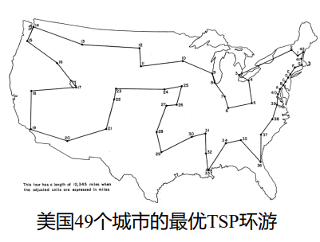
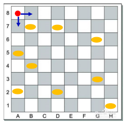

# 组合优化

应用于离散对象的优化叫做组合优化,从多个可行解中找出目标函数进而实现最优化,与组合优化相对应的是连续优化,应用于连续的对象.相较于连续优化来说,组合优化的最优解的性质不太好,求解较为困难,下面,我将给出组合优化的一些例子以及一些他们的求解方案

## 背包问题

### 连续背包问题

现在,存在$n$件物品,物品$j$的价值为$p_j$,大小为$w_j$,现在,我要把这些物品放入到容量为C的背包当中,使得我能够携带的物品的价值最大,如果此时物品可以切割,就称之为连续背包问题.

解决这个问题很自然的思路是优先装价值体积比较大的物品,由于物品可以切割,这样获得的利益一定是最大的.

我们不妨按照单位体积的价值进行降序排序,对于$n$个物品有:

$$
\frac{p_1}{w_1}\ge \frac{p_2}{w_2}\ge \cdots\ge \frac{p_n}{w_n}
$$

对于$j=1,2, \ldots ,l-1$,有$x_j=1$

对于$j=l$,有

$$
x_l=\frac{1}{w_l}(C-\sum_{j=1}^{l-1}x_j)
$$

对于$j=l+1, \ldots ,n$,有$x_j=0$

这样,背包问题的解就可以描述为,存在上述$x_j$,使得:

$$
\begin{aligned}
\min \sum_{j=1}^n x_jp_j\\
\sum_{j=1}^{n}w_jx_j=C
\end{aligned}
$$

### 离散背包问题

将上述条件中的物品可分割改为物品不可分割

在离散问题中,采取贪心的策略得到的不一定是最优的解,因为有可能到最后背包没有装满,该问题可以描述为:

$$
\begin{aligned}
\min \sum_{j=1}^n x_jp_j \\
\sum_{j=1}^{n}w_jx_j\le C
\end{aligned}
$$

其中:

$$
x_j=\begin{cases} 1,该物品被装入 &  \\0 ,该物品没有被装入 &  \end{cases}
$$

## 旅行商问题-TSP

一个旅行商从某个城市出发,经过地图上的所有城市后回到他出发的那个城市,问,旅行商该如何规划他的路径,使得他走过的总路程最短.解决这个问题的算法很多,不一一列举,这里给出它的数学形式:

设总共有$n$座城市,他们的标志分别为$\pi_1,\pi_2\cdots\pi_n$

要找到一种排列方式$\{ \pi_{j_{1}},\pi_{j_{2}}, \ldots ,\pi_{j_{n}} \}$

使得:

$$
\min \sum_{k=1}^{n-1}\Vert\pi_{j_{k}}\pi_{j_{k+1}}\Vert+\Vert\pi_{j_{1}}\pi_{j_{n}}\Vert
$$

可以写成规划的形式,定义$x_{ij}={0,1}$,当旅行商选择从$i$出发前往$j$时,$x_{ij}=1$,反之则为0

定义$V$为所有目标地点下标的集合,$d_{ij}$代表$i,j$两地之间的直线距离.

$$
\begin{align}
\min & \quad \sum_{i \in V} \sum_{j \in V} d_{ij} x_{ij} \\
\text{subject to} & \quad \sum_{j \in V} x_{ij} = 1, \quad \forall i \in V, i \ne j \\
& \quad \sum_{i \in V} x_{ij} = 1, \quad \forall j \in V, i \ne j \\
& \quad \sum_{\substack{i,j \in S \\ i \ne j}} x_{ij} \le |S| - 1, \quad 2 \le |S| \le N - 1, S \subset V \\
& \quad x_{ij} \in \{0,1\}, \quad \forall i, j \in V
\end{align}
$$

## 车辆路径问题-VRP

### 无额外约束

可以看做是TSP问题的推广,设总共有$n$个顾客,顾客$i$位于地点$i$处,从地点$i$前往地点$j$所需要的成本是$c_{ij}$(可以理解成距离),现在,有$m$辆运输车前往这$n$个地点为客户服务,怎么样分配任务使得总路程最短.

定义变量$x_{ijk}=0,1$

当车辆$k$服务完$i$之后向着$j$运动,那么$x_{ijk}=1$,反之就为0

于是目标函数就为

$$
\min \sum_{i=0}^n\sum_{j=0}^n\sum_{k=1}^mc_{ij}x_{ijk}
$$

为什么$i,j$从0开始,因为车从车库出发,出发点加上客户总共$n+1$个点

约束条件:

$$
\sum_{j=1}^n\sum_{k=1}^mx_{ijk}=1
$$

对于任意的$i$都要成立,这确保每个客户只被服务一次

环游约束:每一辆车都要从0处出发,最后回到0处.

$$
\sum_{j=1}^{n}x_{0jk}=1
$$

这代表对任意一辆车$k$,他有且只有一个出发点(服务的第一个客户)

$$
\sum_{i=1}^n x_{i0k}=1
$$

这代表第$k$辆车有且只有一个回归点

### 有容量约束
有$m$辆运输车,容量均为$Q$,$i$个地点已知,把这$n$个顾客分别分配给$m$辆车,使得每辆车所需要满足的需求都不超过车的容量.

只需要添加两个约束条件:

车容量限制:

$$
\sum_{j=1}^{n} q_j x_{ijk}\le Q
$$

$$
\sum_{k=1}^{m}\sum_{j=1}^{n} q_j x_{ijk}=\sum_{j=1}^{n}q_j
$$

### 时间窗口约束

每个客户有一个指定的时间窗口，在这个时间窗口内才能接受货物。

## 指派问题

现在有$n$个人,$n$个任务,人员$i$完成任务$j$的时间是$c_{ij}$,现在给每个人都指派任务,如何指派可以使得总时间最小?

定义:

$$
x_{ij}=\begin{cases} 1,第i个人被指派了j号任务 &  \\0 ,其他 &  \end{cases}
$$

所以问题可以描述为:

$$
\min \sum_{i=1}^{n}\sum_{j=1}^{n}x_{ij}c_{ij}
$$

$$
\begin{aligned}
s.t.\quad \sum_{i=1}^{n}x_{ij}=1 \\
\sum_{j=1}^{n}x_{ij}=1
\end{aligned}
$$

## 排序问题

研究如何利用有限资源，在给定的限制条件下将一批任务安排在某些时间段内完成，并使效益最大，

* 早期研究的排序问题背景源自工业生产，习惯上把可用的资源称为机器(machine)，需要完成的任务称为工件(job)
* 对部分排序问题，可行解由工件加工的顺序决定，这类问题最早也被称作sequencing·

### 广义排序(调度)问题
课程表、时刻表、排班表、赛程等

## 贪心

在每一次决策时,选定当时对自己最有利且可行的策略

### 场馆安排问题

某场馆收到$n$项借用申请，第$i$项申请的活动开始时间为$s_i$ ，结束时间为$t_i$ ，持续时间为$d_i=t_i-s_i$

• 场馆在同一时刻只能进行一项活动，一项活动开始后必须连续进行直至结束
• 希望选择接受部分申请，使得场馆能开展的活动数量尽可能多

一个显著的贪心思想就是把所有活动的结束时间按照从小到大的顺序排列起来,然后依次考虑是否接受,如果某次决策时,该活动的开始时间落在上一次已接收活动的时间范围内,则不接受该活动,反之则接受该活动.

下面我们来证明这个贪婪思想的最优性,设存在最优解$\sigma$,满足贪婪策略,不妨将某一次接受场馆安排的时刻设为时间$t=0$,此时最早结束的活动的终止时间为$i_0$

反证法,如果这个时候选择$i_0$不是最优解,那么有以下两种情况:

1. 在时间段$i_0$内,不安排任何活动,这显然与最优解的要求不符合,因为,安排这个活动会比不安排这个活动的活动个数多一个.
2. 安排一个终止时间更大的活动$i>i_0$,如果说这个也是最优解$\sigma_1$,那么我把$i$替换成$i_0$,对$i$后面的活动没有任何影响,并且活动数不变,所以$\sigma$还是最优解,与假设矛盾.

综上所述,采取终止时间最早的贪婪策略获得的是最优解.

## 动态规划

动态规划是一种数学方法,不是一种算法,其核心思想在于将问题按照时空划分为阶段动态过程,把多阶段决策过程变成相互联系的单阶段最优决策问题.

### 背包问题的动态规划

连续背包问题在上面已经解决了,这里考虑的是离散背包问题

设背包内前 $k\le n $ 个物品和容量为 $w\le C$ 的背包组成的实例为$I(k,w)$,背包所能装上价值的最大值(最优解)为$V(k,w)$

!!! tip "动态规划"
      现在,对第$k$件物品展开讨论

      1. 在背包中不装入这件物品,那么装进来的只有在前$k-1$件物品中选:
         
         $$
         V(k,w)=V(k-1,w)
         $$

      2. 在背包中装入这件物品,那么背包的容量会相应减少成$w-w_k$
         
         $$
         V(k,w)=p_k+V(k-1,w-w_k)
         $$

         当$w_k>w$时,无法装入这件物品:

         $$
         V(k,w)=V(k-1,w)
         $$

综上所述,可以写出递推关系:

$$
V(k,w)=\max\{ V(k-1,w),p_k+V(k-1,w-w_k) \}
$$

按照获利最大进行每一步决策,层层递进,初始条件为:

$$
V(0,w)=0
$$

我们要求解的最大价值即为$V(n,C)$

### 麦子收集问题

一个$n$行$m$列的棋盘,棋盘上某些格子内放有麦子,麦子的坐标已知,现在,一个机器人从$(0,0)$这个格子出发,他只能向右或者向下移动,问,机器人该怎么样规划自己的路径,使得他收集到的麦子尽可能的多?

很自然的一个想法,假设说$t$时刻机器人位于$(i,j)$这个位置,那么他能从哪里来?他只能从他的左边或者他的上边来,即前一个时刻他的位置为:$(i-1,j)$或者$(i,j-1)$

我们再定义一个变量$c(i,j)$

$$
c(i,j)=\begin{cases}1 ,(i,j)处有麦子 &  \\ 0, 其他&  \end{cases}
$$

所以,机器人在坐标$(i,j)$处所能够获得的最大的麦子个数$P(i,j)$为:

$$
P(i,j)=\max\{ P(i-1,j),P(i,j-1) \}+c(i,j)
$$

每一步决策都使得$P(i,j)$达到最大,从而规划出最优路径

初值条件:

$$
P(0,0)=0
$$

要求的是$P(n,m)$

## 启发式算法

借助一些直观想法和假定,依靠物理,化学,生物领域中的一些原理设计的算法,通常比较精妙也比较复杂

### 模拟退火算法

这个算法起源于统计热力学,在高温下,粒子的运动较为剧烈,微观状态数比较多,容易发生重新排列组合,随着降温的不断进行,粒子运动逐渐减弱,物体被冷却,当物体被完全冷却的时候,晶体成型,系统处于定态之中.

模拟退火可以看做是对梯度下降算法的改进,因为梯度下降容易陷入到局部最小值当中去,然而,模拟退火算法由于高温下粒子的活泼性,有一定几率跳出局部最小值继续迭代,随着温度的逐渐降低,这几率越来越小,直到收敛到全局最小值.

迭代的操作在于扰动,每一次扰动后,系统的能量就会从$E_i$变化成为$E_j$

如果$E_j<E_i$,那么系统趋于稳定接受新状态

但是当$E_i>E_j$的时候,系统能量升高,但是由于系统处于高温状态比较不稳定,仍会以一定的概率接受这个新状态.

我们知道,系统的状态在统计力学中满足玻尔兹曼分布:

!!! tip "玻尔兹曼分布"
    $$
      P(x=i)=\frac{e^{- \frac{E_i}{RT}}}{\displaystyle\sum_{k=1}^{\infty}e^{-\frac{E_k}{RT}}}
    $$

分母是配分函数,可以认为只和温度有关,所以:

$$
\frac{P(x=j)}{P(x=i)}= e^{-\frac{E_j-E_i}{RT}}=e^{-\frac{\Delta E}{RT}}
$$

于是定义状态转移概率:

$$
P(i \to j)=e^{-\frac{\Delta E}{RT}}
$$

系统有一定概率抵达能量升高的新状态,并且这个状态随着温度的降低趋于0.但是温度的变化一定是一个比较缓慢的过程,确保每一时刻都抵达热平衡.

这里的能量函数可以替换成我们的目标函数$f(x)$,通过设定一个较高的初始温度并且缓慢降温,使得目标函数逐渐收敛到全局最小值.

!!! info "模拟退火算法"

      0.设定一个较高的初始温度$T_0$

      1.扰动获得目标函数的新的值,与原函数值作差得$\Delta f(x)$

      2.接受概率为

      $$
      P=\begin{cases} 1,\Delta f(x)>0 &  \\ e^{\frac{\Delta f(x)}{RT}}, \Delta f(x)<0&  \end{cases}
      $$

      3.降温:

      $$
      T=\alpha T,\alpha<1
      $$

      4.重复上述操作,迭代终止条件为:

      $$
      T<\varepsilon
      $$

### 遗传算法

### 禁忌搜索算法

### 蚁群算法

### 粒子群优化算法