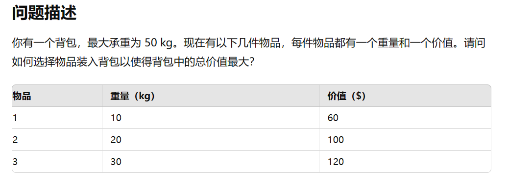
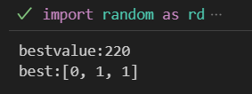
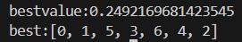

# 遗传算法实例

本文档尝试将遗传算法应用于经典的优化问题，以提高笔者的熟练度。

## 背包问题

让GPT生成了一个例子，我们现在尝试用遗传算法来求解这个问题,虽然有点高射炮打蚊子，但是可以练练手。



```python

import random as rd

#先定义种群规模
N=100

#定义进化代数
n=0

zhongqun=[]

best_value=0
best=[]

for i in range(N):
    t=[]
    for i in range(3):
        t.append(rd.randint(0,1))
    zhongqun.append(t)

while True:
    #评价适应度
    #定义一个适应度数组
    value=[i for i in range(N)]
    for i in range(N):
        u=10*zhongqun[i][0]+20*zhongqun[i][1]+30*zhongqun[i][2]
        v=60*zhongqun[i][0]+100*zhongqun[i][1]+120*zhongqun[i][2]
        

        #淘汰掉生成的不合理个体
        if(u>50):
            value[i]=0
        else:
            value[i]=v
    

    #选择适应度最高的进行存储：
    best_value=max(value)
    best=zhongqun[value.index(best_value)]

    #设定概率：
    p=[value[i]/sum(value) for i in range(N)]

    #定义交配空间J
    J=[]


    i=0
    while True:
        if rd.random()<p[i]:
            J.append(zhongqun[i])
        if len(J)==N:
            break
        i += 1
        if i==N:
            i=0
    
    #设定交配概率
    p_0=0.85
    #定义一个交配数组J_0
    J_0=[]
    yubeizhongqun=[]

    for i in range(N):
        if rd.random()<p_0:
            J_0.append(J[i])
        else:
            yubeizhongqun.append(J[i])
    
    #然后再配对
    if len(J_0)==1 or len(J_0)==0:
        yubeizhongqun=J
    else:
        
        #单点配对交配
        i=0
        while(i<len(J_0)-1):
            k=rd.randint(0,2)
            J_0[i],J_0[i+1]=J_0[i][0:k]+J_0[i+1][k:],J_0[i+1][0:k]+J_0[i][k:]
            i=i+2
        
        yubeizhongqun +=J_0

        #变异，定义变异概率

        p_b=0.1

        for ele in yubeizhongqun:
            if rd.random()<p_b:
                k=rd.randint(0,2)
                ele[k]=1-ele[k]
        
        zhongqun=yubeizhongqun
        n=n+1

        if n>=100:
            break

print(f'bestvalue:{best_value:}')
print(f'best:{best:}')
        
            
        
```

运行结果为：



与预期结果一致，在运算过程中也发现，如果种群数目太少，可能迭代很多次都还没有收敛，如果种群数目太大，那么占据的计算资源过多，导致运算缓慢

下面是一个稍微复杂一点的例子：


我们只需要稍微修改一下代码：

```python

import random as rd

#先定义种群规模
N=100

#定义进化代数
n=0

zhongqun=[]

best_value=0
best=[]

weight=[4,3,1,5,2,1,3,2,4,3]
value_0=[300,200,150,500,200,100,250,300,350,400]

for i in range(N):
    t=[]
    for i in range(10):
        t.append(rd.randint(0,1))
    zhongqun.append(t)

while True:
    #评价适应度
    #定义一个适应度数组
    value=[i for i in range(N)]

    for i in range(N):
        u=sum([weight[j]*zhongqun[i][j] for j in range(10)])
        v=sum([value_0[j]*zhongqun[i][j] for j in range(10)])
        

        #淘汰掉生成的不合理个体
        if(u>10):
            value[i]=0
        else:
            value[i]=v
    

    #选择适应度最高的进行存储：
    best_value=max(value)
    best=zhongqun[value.index(best_value)]

    #设定概率：
    p=[value[i]/sum(value) for i in range(N)]

    #定义交配空间J
    J=[]


    i=0
    while True:
        if rd.random()<p[i]:
            J.append(zhongqun[i])
        if len(J)==N:
            break
        i += 1
        if i==N:
            i=0
    
    #设定交配概率
    p_0=0.85
    #定义一个交配数组J_0
    J_0=[]
    yubeizhongqun=[]

    for i in range(N):
        if rd.random()<p_0:
            J_0.append(J[i])
        else:
            yubeizhongqun.append(J[i])
    
    #然后再配对
    if len(J_0)==1 or len(J_0)==0:
        yubeizhongqun=J
    else:
        
        #单点配对交配
        i=0
        while(i<len(J_0)-1):
            k=rd.randint(0,9)
            J_0[i],J_0[i+1]=J_0[i][0:k]+J_0[i+1][k:],J_0[i+1][0:k]+J_0[i][k:]
            i=i+2
        
        yubeizhongqun +=J_0

        #变异，定义变异概率

        p_b=0.1

        for ele in yubeizhongqun:
            if rd.random()<p_b:
                k=rd.randint(0,9)
                ele[k]=1-ele[k]
        
        zhongqun=yubeizhongqun
        n=n+1

        if n>=100:
            break

print(f'bestvalue:{best_value:}')
print(f'best:{best:}')
        
            
 
```
得到的运行结果是：


完全正确！

## TSP问题

依旧是用GPT生成的题目


代码如下所示：

```python

import random as rd
from math import sqrt,exp

import matplotlib.pyplot as plt

#定义一个距离函数
def distance(i,j):
    dis=sqrt((zuobiao[i][0]-zuobiao[j][0])**2+(zuobiao[i][1]-zuobiao[j][1])**2)
    return dis

#先定义种群规模
N=500

#定义进化代数
n=0

zhongqun=[]

best_value=0
best=[]

#给定所有的城市坐标
zuobiao=[
    [0,0],[3,7],[5,1],[10,6],[7,2],[4,8],[9,3]
]

#生成种群
for i in range(N):
    t=[0]  #注意必须从0出发
    for i in range(6):
        t.append(rd.randint(1,6))
    zhongqun.append(t)

while True:
    #评价适应度
    #定义一个适应度数组,和种群规模一致
    value=[i for i in range(N)]

    for i in range(N):
        s=0
        for j in range(6):
            s=s+distance(zhongqun[i][j],zhongqun[i][j+1])
        s=s+distance(0,zhongqun[i][6])
        
    
        #评价函数需要修改，还要增加走过的城市数目,增加了一个修正项
        num=len(set(zhongqun[i]))
        value[i]=num/s


    #选择适应度最高的进行存储：
    best_value=max(value)
    best=zhongqun[value.index(best_value)]

    #设定概率：
    p=[value[i]/sum(value) for i in range(N)]

    #定义交配空间J
    J=[]


    i=0
    while True:
        if rd.random()<p[i]:
            J.append(zhongqun[i])
        if len(J)==N:
            break
        i += 1
        if i==N-1:
            i=0
    
    #设定交配概率
    p_0=0.9
    #定义一个交配数组J_0
    J_0=[]
    yubeizhongqun=[]

    for i in range(N):
        if rd.random()<p_0:
            J_0.append(J[i])
        else:
            yubeizhongqun.append(J[i])
    
    #然后再配对
    if len(J_0)==1 or len(J_0)==0:
        yubeizhongqun=J
    else:
        
        #单点配对交配
        i=0
        while(i<len(J_0)-1):
            k=rd.randint(1,6)
            J_0[i],J_0[i+1]=J_0[i][0:k]+J_0[i+1][k:],J_0[i+1][0:k]+J_0[i][k:]
            i=i+2
        
        yubeizhongqun +=J_0

        #变异，定义变异概率

        p_b=0.1

        for ele in yubeizhongqun:
            if rd.random()<p_b:
                k=rd.randint(1,6)
                ele[k]=rd.randint(1,6)
        
        zhongqun=yubeizhongqun
        n=n+1

        if n>=3000:
            break

print(f'bestvalue:{best_value:}')
print(f'best:{best:}')

plt.figure(1)

x=[zuobiao[i][0] for i in range(7)]
y=[zuobiao[i][1] for i in range(7)]

plt.scatter(x,y)

for i in range(6):
    plt.plot(
        [zuobiao[best[i]][0], zuobiao[best[i+1]][0]],  # X 坐标
        [zuobiao[best[i]][1], zuobiao[best[i+1]][1]]   # Y 坐标
    )
    
# 最后一条线段，从最后一个城市回到第一个城市
plt.plot(
    [zuobiao[best[6]][0], zuobiao[best[0]][0]],  # X 坐标
    [zuobiao[best[6]][1], zuobiao[best[0]][1]]   # Y 坐标
)

plt.show()
            
         
```

运行结果为：



航行轨迹为：


非常完美，美中不足的是算的太慢了。
