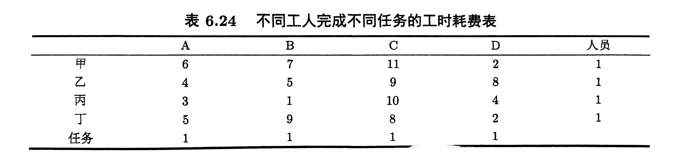

# 整数规划实例及其求解

整数规划根据其变量的要求分为纯整数规划,混合整数规划以及0-1规划

!!! info "整数规划分类"

    * 纯整数规划:所有的规划变量全部取整数值
    * 混合整数规划:部分的规划变量取整数值
    * 0-1规划:规划变量只能取0或者1

其一般形式为:

$$
\begin{aligned}
\min z=C^T x \\
s.t.A_{eq} x =b\\
x_j\ge 0,且x_j \in N
\end{aligned}
$$

显然整数规划的最优解一定是线性规划的可行解,但是其最优解一定不会优于远线性规划.

## 分支定界法

在数学规划中已经对分支定界法的详细流程做了赘述,这里我们直接尝试求解问题:

\[
\begin{aligned}
\text{max} \quad & 5x_1 + 4x_2 \\
\text{s.t.} \quad & 3x_1 + 2x_2 \leq 17 \\
                     & 2x_1 + x_2 \leq 10 \\
                     & x_1, x_2 \geq 0 \\
                     & x_1, x_2 \in \mathbb{Z}
\end{aligned}
\]

主要思路叙述如下,定义一个best数组,先求解整数规划的松弛问题,然后根据非整数解进行分支定界,对两个分支再分别进行松弛求解,如果出现整数解,该分支终止,同时存入最优解和最优值,如果某分支的最优值大于best数组中最小的最优值,则该分支也终止.最后输出best数组中蕴含最小最优值的最优解.

整个求解需要用到递归的操作,所以我决定使用函数去实现分支定界算法.

注意,不断分支的过程可能导致某一个枝内存在互斥的约束条件,分支内没有可行解,所以要先检查分支的LP求解的有效性,再进行赋值之类的操作.

上述问题需要做一点变形.

\[
\begin{aligned}
\text{min} \quad & -5x_1 -4x_2 \\
\text{s.t.} \quad & 3x_1 + 2x_2 \leq 17 \\
                     & 2x_1 + x_2 \leq 10 \\
                     & x_1, x_2 \geq 0 \\
                     & x_1, x_2 \in \mathbb{Z}
\end{aligned}
\]

运行代码如下:

```python
import numpy as np

from scipy.optimize import linprog

# 定义最优解数组

best=[((999999999,99999999999),9999999999)]

#定义系数向量和系数矩阵

c=np.array([-5,-4])

A=np.array([[3,2],
            [2,1]])

b=np.array([17,10])

#上下界

bounds=[(0,None),(0,None)]


def f(bounds: list, depth=0):
    global best
    res = linprog(c=c, A_ub=A, b_ub=b, bounds=bounds, method='highs')
    
    # 检查 res 是否有效
    if res.success:
        (x1, x2) = res.x
        value = res.fun
        if x1 == int(x1) and x2 == int(x2):
            best.append(((x1, x2), value))
        else:
            if value > min([best[i][1] for i in range(len(best))]):
                return
            if x1 != int(x1):
                f([(0, int(x1)), bounds[1]], depth+1)
                f([(int(x1)+1, None), bounds[1]], depth+1)
            if x2 != int(x2):
                f([bounds[0], (0, int(x2))], depth+1)
                f([bounds[0], (int(x2)+1, None)], depth+1)

f(bounds)

best_value=min([best[i][1] for i in range(len(best))])

for i in range(len(best)):
    if best[i][1]==best_value:
        optimize=best[i][0]

optimize=[float(i) for i in optimize]

print(f'最优解:{optimize:}')
print(f'最优值:{-best_value:}')


```
运行结果如下:

```
最优解:[1.0, 7.0]
最优值:33.0
```

## 0-1规划

大量的组合优化问题会用到0-1规划,比较朴素实用的算法是过滤隐枚举法.


### 过滤隐枚举法

隐枚举法实际上是对全部枚举法的略微改进,也不太适用于求解变量过多的情况,考虑n个变量,就要求解$2^n$个目标值,并且要一一检验他们是否满足约束条件,隐枚举法改进的点在于,他会从一个初始可行解出发,确定最优值的下界,然后对所有枚举的解情况,优先考虑大于下界这一条判断准则,如果满足,再判断其他约束条件是否满足约束,并且,如果全部满足,更新下界和最优解,直到遍历所有的解.

以下面的例子为例:

$$
\begin{aligned}
\max &z=3x_1-2x_2+5x_3 \\
s,t. \quad& x_1+2x_2-x_3\le 2\\
&x_1+4x_2+x_3\le 4\\
& x_1+x_2\le 3\\
& 4x_1+x_3\le 6\\
& x_1,x_2,x_3\in \{ 0,1 \}
\end{aligned}
$$

使用瞪眼法,一眼看出一个初始可行解$x=(1,0,0)$,那对应的目标函数值就是3,所以可以添加门槛约束条件:

$$
3x_1-2x_2+5x_3\ge 3
$$

以此类推,不断更新这个门槛约束.

```python
import numpy as np

# 定义初始可行解

x=np.array([1,0,0])

#定义系数矩阵,目标函数等等

f= lambda x: 3*x[0]-2*x[1]+5*x[2]

A=np.array([[1,2,-1],
            [1,4,1],
            [1,1,0],
            [4,0,1]])
b=[2,4,3,6]

for i in range(0,2):
    for j in range(0,2):
        for k in range(0,2):
            t=np.array([i,j,k])
            if f(t) >= f(x):
                if np.all(np.dot(A,t)<b):
                    x=t

print(f'最优解:{x:}')
print(f'最优值:{f(x):}')
```

运行结果:

```
最优解:[1 0 1]
最优值:8
```

### 指派问题

现在有甲乙丙丁四个员工,以及ABCD四个任务,他们完成这些任务的时间分别由下表给出,问,应该怎么样把这4个任务分配给这四名员工呢?



设$c_{ij}$为效率矩阵的元素,代表$i$人完成$j$任务的元素,定义$x_{ij}$为0-1变量,只有当$i$人完成$j$目标时,其才为1,于是,规划问题就可以写成:

$$
\begin{aligned}
\min z=\sum_{i=1}^4\sum_{j=1}^4 c_{ij}x_{ij} \\
s.t. \sum_{i=1}^4 x_{ij}=1\\
\sum_{j=1}^4x_{ij}=1
\end{aligned}
$$

我们先尝试用隐枚举法求解,然后再给出匈牙利算法

定义

$$
X=
\begin{pmatrix}
    x_{11},x_{12},x_{13},x_{14}\\
    x_{21},x_{22},x_{23},x_{24}\\
    x_{31},x_{32},x_{33},x_{34}\\
    x_{41},x_{42},x_{43},x_{44}
\end{pmatrix}
$$

不难看出一个初始可行解为:


$$
X=
\begin{pmatrix}
    1,0,0,0\\
    0,1,0,0\\
    0,0,1,0\\
    0,0,0,1
\end{pmatrix}
$$

定义效率矩阵为:

$$
C=
\begin{pmatrix}
    6,7,11,2\\
    4,5,9,8\\
    3,1,10,4\\
    5,9,8,2
\end{pmatrix}
$$

目标函数就为:

$$
z=trace(CX^T)
$$

```python
import numpy as np
import itertools
import random as rd

# 定义初始可行解

x=np.array([[1,0,0,0],[0,1,0,0],[0,0,1,0],[0,0,0,1]])


# 定义目标函数

c=np.array([[6,7,11,2],[4,5,9,8],[3,1,10,4],[5,9,8,2]])

f=np.trace(np.dot(c,x))


# 生成所有可能的矩阵的行
all = list(itertools.product([0, 1], repeat=4))

n=0


#选择四个行,把他们组装成矩阵
for x_1 in all:
    for x_2 in all:
        for x_3 in all:
            for x_4 in all:
                x_0=np.array([x_1,x_2,x_3,x_4])
                f_0=np.trace(np.dot(c,np.transpose(x_0)))
                f=np.trace(np.dot(c,np.transpose(x)))
                if f_0 < f:
                    flag=0
                    for i in range(4):
                        if sum([x_0[i][j] for j in range(4)])!=1 or sum([x_0[j][i] for j in range(4)])!=1:
                            flag=1
                    
                    if flag==0:
                        x=x_0
    


print(f'最优解:{x:}')
print(f'最优值:{np.trace(np.dot(c,np.transpose(x))):}')

```

运行结果为:

```
最优解:[[0 0 0 1]
 [1 0 0 0]
 [0 1 0 0]
 [0 0 1 0]]
最优值:15
```

确实可以解决问题,但是一旦变量数目增多,矩阵的维度上升,遍历将变得困难,此时枚举不是一个很好的选择,它需要的计算资源会大大提升.

#### 匈牙利算法

对于系数矩阵:

$$
C=
\begin{pmatrix}
    6,7,11,2\\
    4,5,9,8\\
    3,1,10,4\\
    5,9,8,2
\end{pmatrix}
$$

1. 我们先对每行进行操作,每行都减去其最小的元素,这样每行都会出现0
2. 再对每一列做同样的操作,得到更多的0元素
3. 从只有第一个0元素的行开始,给该行内的0元素画圈,然后划去这一列中的其他0元素,对每一行都执行这样的操作
4. 从只有1个0的列开始,给列内的0画圈,划去这一行的其他0元素
5. 判断0元素的个数是否等于指派人数,如果是,则终止操作,如果不是,执行下面的操作
6. 对没有圆圈标记的行打钩
7. 对打钩的行中含有划去0元素的列打钩
8. 对打钩的列中含有圆圈标记的行打钩
9. 对没有打钩的行画横线,对打钩的列画纵线
10. 没有被直线通过的所有元素减去这些元素的最小值,直线交点处的元素加上这个最小值.回到第三步进行试指派,直到得到最优解为止.

这个算法比较麻烦,我编不出程序来,但是他复杂度低,是多项式时间算法,遇到大规模指派问题的时候可以考虑手算匈牙利算法.


