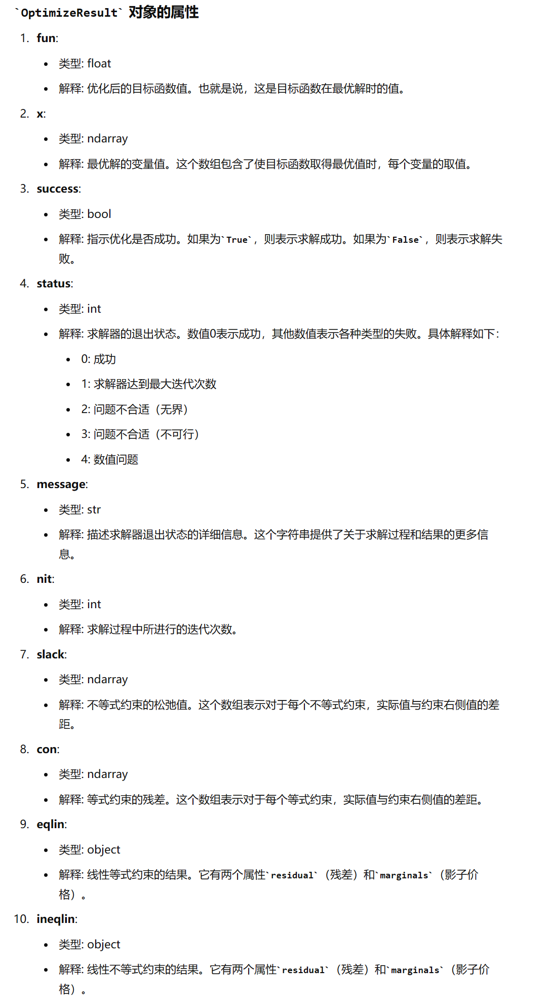
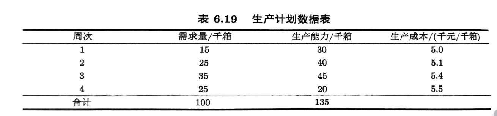

# 线性规划求解实例

## 基于Python的求解

在Python中,线性规划的标准形式是由目标函数,一个等式约束,一个不等式约束,以及决策变量的上下界约束构成的

$$
\begin{aligned}
\min c^T x \\
s.t. A_{ub}x\le b_{ub}\\
A_{eq}x=b_{eq}\\
l\le x\le u
\end{aligned}
$$

通常调用的是SciPy库中的linprog函数:

```python

from scipy.optimize import linprog

res=linprog(c, A_ub=A_ub, b_ub=b_ub, A_eq=A_eq, b_eq=b_eq, bounds=x_bounds, method='highs')
```
res返回的是一个optimize对象,他有如下属性:



最后一项的method表示求解的方式,这里我们使用highs方法，它是SciPy最新的推荐方法。

下面直接来看例子:

### 生产问题

某个生产商根据以前的生产情况预测了下一个月每个星期的需求量以及工厂的生产能力,工厂可以提前完成生产(即某一周生产部分下一周的产品),但是,如果生产出来的产品在当周没有卖完,那么就需要额外花费0.2千元的单价去储存商品,该生产商的商品在第四周必须要卖完,没有剩余,问,生产商要如何调配各个周的生产量?



每周的生产数目设为$x_1,x_2,x_3,x_4$,每周的生产剩余为$y_1,y_2,y_3,y_4$,根据条件$y_4=0$,x和y的关系是:

$$
\begin{aligned}
x_1-y_1=15 \\
x_2+y_1-y_2=25\\
x_3+y_2-y_3=35\\
x_4+y_3=25
\end{aligned}
$$

上下界约束为:

$$
\begin{aligned}
0\le x_1\le 30\\
0\le x_2\le 40 \\
0\le x_3\le 45\\
0\le x_4\le 20\\
y_1\ge 0\\
y_2\ge 0\\
y_3\ge 0
\end{aligned}
$$

目标函数为:

$$
\min z=5x_1+5.1x_2+5.4x_3+5.5x_4+0.2(y_1+y_2+y_3)
$$

```python
from scipy.optimize import linprog
import numpy as np

c=np.array([5,5.1,5.4,5.5,0.2,0.2,0.2])

A_eq=np.array([[1,0,0,0,-1,0,0],
               [0,1,0,0,1,-1,0],
               [0,0,1,0,0,1,-1],
               [0,0,0,1,0,0,1]])

b_eq=np.array([15,25,35,25])

#上下界约束,如果某一个没有就写None或者np.inf

x_bounds = [(0, 30), (0, 40), (0, 45), (0, 20), (0, None), (0, np.inf), (0, np.inf)]

res=linprog(c=c, A_eq=A_eq, b_eq=b_eq, bounds=x_bounds, method='highs')

if res.success:
    print('最优值',res.fun)
    print('最优解',res.x)
else:
    print('求解失败')

```

运行结果为:


最优值是正确的,但是最优解和书上不一样,也许不止一个最优解?

## 仓网优化问题


在激烈的商业变革中，为了满足消费者对供应时效性的需求，生鲜电商企业愈发注重在预算成本区间内不断提高自身的物流速度以及履约能力。为解决传统的仓网系统所带来的爆仓、供应时效低、物流成本浪费等一系列问题，决定优化目前的仓网规划方案，构建智能仓网规划系统，真正实现智慧仓储、一体化供应链管理。

以生鲜水果的仓网规划为例，该生鲜电商供货的线下门店分布在全国一百多个不同城市中，针对国产水果和进口水果，分别设立直供采摘基地和港口进货点，并分别设立不同的CDC[(Central Distribution Center)为中央配送中心（总仓），一般为仓储网络的第一层，负责从水果直供采摘基地或港口进货点提货并供应次级仓库或者门店。] 和 RDC[RDC (Regional Distribution Center)为区域配送中心（分仓），在仓储网络中属于CDC 的下一级，负责从 CDC 提货并供应门店。] 仓库。以进口水果为例，其仓网结构如下图所示：


该仓网规划的目标是在满足门店需求量、仓库时效性、调拨要求、出入库处置量等约束条件下，最小化仓网系统的总物流成本，运用数据科学方法和运筹优化技术，实现最优仓库选址策略（包括选取所开设的仓库数量与位置）以及运输调拨方案（各级仓库之间、仓库到门店之间）

基于附件 5：点位之间距离时效信息表、附件 6 ：订单需求量表、附件 7 ：仓储数据表，针对以上问题描述，构建数学优化模型，在满足上述约束条件的前提下，构建最小化总物流成本的最优仓网布局方案和物流调拨案。

不妨设有m个CDC,有n个DC,有N个城市,定义一个i,j,k

注意看这句话:

**==一个门店的进口水果订单需求仅能由港口CDC 或者是一个 RDC 服务；一个门店的国产水果订单需求仅能由内陆 CDC 或者是一个RDC 服务==**


i从1-m,j从1-n,k从1到N,定义一个决策变量:

我们应该考虑把决策变量分开,因为一个城市可以由不同库供应,只要他们不供应同一种东西,不分开的话难以满足上面那句话

我们用上标a代表供应国产水果,用上标b代表供应进口水果

定义调度变量,t_{什么,什么},代表从什么往什么的调度:

$$
\begin{aligned}
t_{ij}^{(a)},i号CDC往j号DC的调拨量 \\
t_{ik}^{(a)},i号CDC往k号城市的调拨量\\
t_{jk}^{(a)},j号DC往k号城市的调拨量\\
\end{aligned}
$$

定义决策变量,代表是否存在这条通路:

$$
x_{ik}^{(a)}=
\begin{cases} 1, &从i号CDC调拨往k号城市  \\ 0,& others \end{cases}
$$

$$
x_{jk}^{(a)}=
\begin{cases} 1, &从j号DC调拨往k号城市  \\ 0,& others \end{cases}
$$

然后看黄色的那句话,也就是要满足:

$$
\begin{aligned}
\sum_{i=1}^mx_{ik}^{(a)}+\sum_{j=1}^nx_{jk}^{(a)}=1 \\
\sum_{i=1}^mx_{ik}^{(b)}+\sum_{j=1}^nx_{jk}^{(b)}=1 
\end{aligned}
$$

对于DC站,他可以选择开设或者不开设,所以要定义决策变量:

$$
z_j=
\begin{cases} 1,j仓库开设 &  \\ 0,j仓库不开设 &  \end{cases}
$$

需要满足供求关系,所以有以下约束

每个城市的需求量需要被满足:

$$
\sum_{i=1}^m t_{ik}^{(a)}+\sum_{j=1}^n t_{jk}^{(a)}=a_k
$$

$$
\sum_{i=1}^m t_{ik}^{(b)}+\sum_{j=1}^n t_{jk}^{(b)}=b_k
$$


下一步的约束就是把t,x,z联系起来,形成变量之间的约束:

首先,考虑单个仓库运输的量肯定等于需求的量,因为单种水果只有一个供货仓库:

对于任意的k有:

$$
\begin{aligned}
t_{jk}^{(a)}= a_k x_{jk}^{(a)} \\
t_{jk}^{(b)}= b_k x_{jk}^{(b)} \\
t_{ik}^{(a)}= a_k x_{ik}^{(a)} \\
t_{ik}^{(b)}= b_k x_{ik}^{(b)} 
\end{aligned}
$$

满足产销平衡

$$
\sum_{k=1}^{N}t_{jk}^{(a)}= \sum_{i=1}^m t_{ij}^{(a)} z_{j}
$$

$$
\sum_{k=1}^{N}t_{jk}^{(b)}= \sum_{i=1}^m t_{ij}^{(b)} z_{j}
$$

再者,运输到城市需要在仓库开设的前提下进行:

对于任意的j,k有

$$
\begin{aligned}
 x_{jk}^{(a)}\le z_j\\
 x_{jk}^{(b)}\le z_j
\end{aligned}
$$

$capCPC_i$代表i号CDC的处理能力,$capDC_j$代表j号DC的处理能力:

$$
\sum_{j=1}^n (t^{(a)}_{ij}+t^{(b)}_{ij})+\sum_{k=1}^N (t^{(a)}_{ik}+t^{(b)}_{ik})\le capCDC_i 
$$

$$
\sum_{k=1}^N (t^{(a)}_{jk}+t^{(b)}_{jk})\le capDC_j 
$$

来分析一下一共有什么成本:

1.运输成本

2.处理成本

3.开设成本

4.是否购买智能调度,其购买成本和减小的成本


1.运输成本的度量:

CDC到DC时0.6元单价,DC到城市是1.25的单价,所以运输成本为:

用$d(i,j)$代表i号CDC和j号DC之间的距离

$$
cost_1=\frac{1}{10000}(\sum_{i=1}^m\sum_{j=1}^n (t_{ij}^{(a)}+t_{ij}^{(b)})*0.6\times d(i,j)+\sum_{j=1}^n \sum_{k=1}^N (t_{jk}^{(a)}+t^{(b)}_{jk})*1.25\times d(j,k)+\sum_{i=1}^m \sum_{k=1}^N (t_{ik}^{(a)}+t_{ik}^{(b)})*1.25\times d(i,k))
$$

2.处理成本

每个仓库有不同的处理成本,proCPC和proDC

$$
\begin{aligned}
cost_{20}=\sum_{i=1}^m\left(\sum_{j=1}^n (t^{(a)}_{ij}+t^{(b)}_{ij})+\sum_{k=1}^N(t^{(a)}_{ik}+t^{(b)}_{ik})\right)proCDC_i+\sum_{j=1}^n\sum_{k=1}^N (t_{jk}^{(a)}+t^{(b)}_{jk})*proDC_j \\
=cost_{2i}+cost_{2j}
\end{aligned}
$$

如果买了智能调度系统,那么这个处理费用要减半

定义判断函数为:

$$
Jd_i=1-\frac{y_i}{2}
$$

$$
cost_2=Jd_i\times cost_{2i}+Jd_j\times cost_{2j}
$$


3.开设成本

开设成本为:

$$
cost_3=25\times\sum_{j=1}^n z_j
$$


4.智能调度成本

定义决策变量:

$$
y_{i,j}=
\begin{cases} 1, &买  \\ 0, &不买  \end{cases}
$$

$$
cost_4=(\sum_{i=1}^m y_i+\sum_{j=1}^N y_j)\times 1
$$

这个决策变量没有什么约束.


所以可以写出规划问题:

$$
\begin{cases}
\min &\displaystyle \sum_{i=1}^4 cost_i\\
\text{s.t.}&\sum_{i=1}^mx_{ik}^{(a)}+\sum_{j=1}^nx_{jk}^{(a)}=1 \\
&\sum_{i=1}^mx_{ik}^{(b)}+\sum_{j=1}^nx_{jk}^{(b)}=1 ,\forall k\\
&\sum_{i=1}^m t_{ik}^{(a)}+\sum_{j=1}^n t_{jk}^{(a)}=a_k\\
&\sum_{i=1}^m t_{ik}^{(b)}+\sum_{j=1}^n t_{jk}^{(b)}=b_k,\forall j\\
&t_{jk}^{(a)}= a_k x_{jk}^{(a)} \\
&t_{jk}^{(b)}= b_k x_{jk}^{(b)} ,\forall j,k\\
&t_{ik}^{(a)}= a_k x_{ik}^{(a)} \\
&t_{ik}^{(b)}= b_k x_{ik}^{(b)} ,\forall i,k\\
&\sum_{k=1}^{N}t_{jk}^{(a)}= \sum_{i=1}^m t_{ij}^{(a)} z_{j}\\
&\sum_{k=1}^{N}t_{jk}^{(b)}= \sum_{i=1}^m t_{ij}^{(b)} z_{j},\forall j\\
&x_{jk}^{(a)}\le z_j\\
&x_{jk}^{(b)}\le z_j,\forall j,k\\
&\sum_{j=1}^n (t^{(a)}_{ij}+t^{(b)}_{ij})+\sum_{k=1}^N (t^{(a)}_{ik}+t^{(b)}_{ik})\le capCDC_i ,\forall i\\ 
&\sum_{k=1}^N (t^{(a)}_{jk}+t^{(b)}_{jk})\le capDC_j,\forall j\\
&t_{ij}\ge 0 ,\forall i,j\\
&t_{jk}\ge 0\forall j,k\\
&x_{jk},x_{ik},z_j,y_i,y_j \in \{ 0,1 \},\forall i,j,k
\end{cases}
$$

这个题的约束非常复杂,我用了一些线性化的手段后,调用了pulp库进行求解,得到了相对满意的结果.


