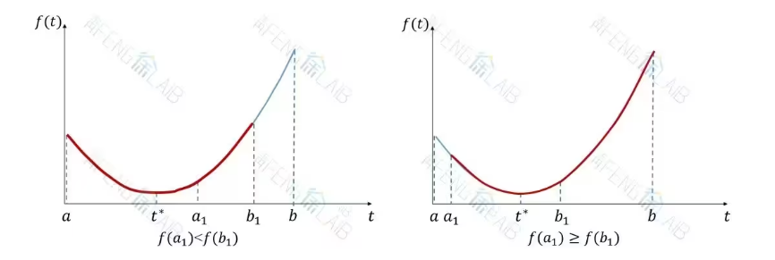
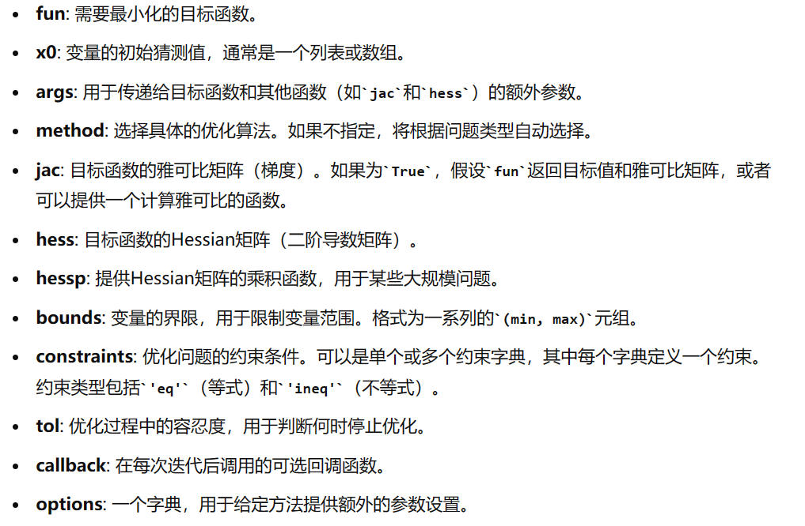
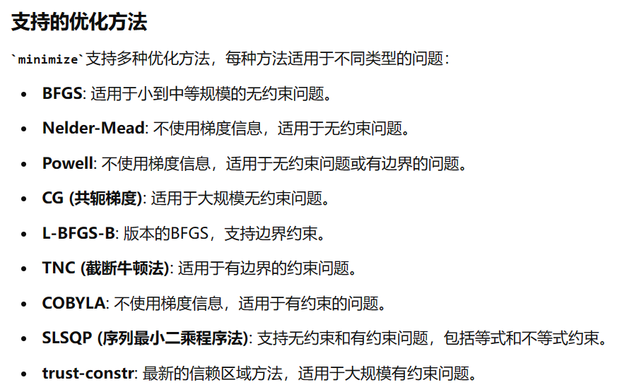

# 非线性规划求解算法及实例

非线性规划要么是约束条件不是线性约束,要么是目标函数不是线性函数,相较于线性规划,它的最小值更加难以求解,求解算法容易陷入到局部最小值当中去.

## 常见的非线性规划案例

### 投资决策问题

一个商人手里面有资金$A$元,他投资第$i$个项目花费需要$a_i$元,但是获利可以达到$b_i$元,总共有$n$个项目可供他投资,这个商人想要花最少的钱得到最多的收益,即收益成本比最大的方案:

定义一个0,1变量$x_i$,如果他投资了$i$项目,那就是1,反之就是0,于是这个规划问题可以描述为:

$$
\begin{aligned}
\max \quad &Q=\frac{\sum_{i=1}^n b_ix_i}{\sum_{i=1}^n a_ix_i} \\
s.t.\quad &\sum_{i=1}^n a_ix_i \le A\\
&x_i \in \{0,1\}
\end{aligned}
$$

### 火力分配最优问题

设总共有m种战斗兵器,向n个目标去进行设计,i种战斗兵器的数目为$N_i$种,第i种兵器的每个战斗单位对第j个目标的毁伤概率是$w_{ij}$,但是各个目标的重要程度不同,j号目标的重要程度是$c_j$,问怎么样分配兵器,使得毁伤目标的重要程度之和最大

定义一个变量$x_{ij}$为第i种兵器分配给j目标的数量,那么j目标被干掉的概率显然等于1-所有想要干掉j目标的兵器都干不掉j目标的概率:

$$
p_j=1-\prod_{i=1}^{m} (1-w_{ij})^{x_{ij}}
$$

所以规划可以写成:

$$
\begin{aligned}
\min\quad &\sum_{j=1}^n c_j\left[1-\prod_{i=1}^{m} (1-w_{ij})^{x_{ij}} \right] \\
s.t.\quad &\sum_{j=1}^n x_{ij}=N_i\\
& x_ij\ge 0
\end{aligned}
$$

## 常见的无约束非线性规划的算法

现在的规划求解器已经十分发达,只要能够把问题使用数学形式描述出来,求解器就能够快速高效的求解,但是,学习求解器内部工作的算法仍然是必要的,这能起到一定的启发作用和锻炼思维的效果.

如果目标函数是一个凸函数,那么极小值就是最小值,可以使用一些迭代算法不断搜索就能找到函数的最小值,固然面对无约束的目标函数,可以使用偏导数等于0来确定极值点,但是,解方程对计算机并不是一件那么容易的事情,所以我们通常采取迭代算法进行求解.

### 0.618法

0.618法和斐波那契法都是针对一维单峰函数的搜索算法,本质上是通过不断地找点来缩小极小值点所在的区间,但是好处是不要求函数在整个定义域上存在连续的一阶导数,设我们给定了一个极小值存在的初始区间$[a_0,b_0]$,然后下一步就是缩小这个区间:

$$
\begin{aligned}
a_1=a_0+\rho l \\
b_1=b_0-\rho l 
\end{aligned}
$$

其中,$l$是当前区间长度,$\rho$是待确定的小于0.5的参数,这样我们就在极值点的可疑区间内找到两个新的点,并且满足 $ a_1<b_1 $.

那么,如果说$f(a_1)<f(b_1)$,可以比较显然的得到,极值点位于区间$[a_0,b_1]$内

相反,如果说$f(a_1)\ge f(b_1)$,可以比较显然的得到,极值点位于区间$[a_1,b_0]$内

!!! info "图像"

    

这样我们就完成了区间的第一步缩小.那么,是否要继续再对两个新的区间上下限做上面的操作了呢,我们想办法减少迭代次数,以获得的新区间为$[a_0,b_1]$为例,如果对它进行两次迭代操作,得到的是$[a_2,b_2]$,我们可以把上一次运算淘汰掉的$a_1$拿来当做$b_2$,这样就能减少一次迭代操作,但是,为了保证结构的对称性,$a_1=b_1-\rho l^{'}$,这就对参数$\rho$提出了限制:

$$
a_0+\rho (b_0-a_0)=b_0-\rho(b_0-a_0)-\rho (b_1-a_0)=b_0-\rho(b_0-a_0)-\rho(b_0-a_0-\rho(b_0-a_0))
$$

把$(b_0-a_0)$除掉就会得到:

$$
\rho =1-\rho-\rho(1-\rho)
$$

即:

$$
\rho^2-3\rho+1=0
$$

所以就得到$\rho=\frac{3-\sqrt{5}}{2}=0.382$,所以区间的压缩率为$1-\rho=0.618$

随着迭代次数的增加,区间被越来越压缩,直到区间长度小于允许误差范围或者迭代次数达到最大次数限制.

拿最简单的$y=(x-1)^2$来举例子,我们尝试编写程序实现以上算法:

```Python
# 我们先给定一个很大的区间:

a,b=-999,999

n=0

# 定义一个匿名函数

f= lambda x: (x-1)**2

#给定一个允许容差
e=1e-9

while True:
    t_1=a+0.3819*(b-a)
    t_2=b-0.3819*(b-a)
    if f(t_1)<f(t_2):
        b=t_2
    else:
        a=t_1
    if (b-a)<e:
        print('最小值点:',a)
        print('最小值:',f(a))
        print('迭代次数:',n)
        break
    n=n+1
```

运行结果为:


```
最小值点: 0.999999999794338
最小值: 4.229687591092706e-20
迭代次数: 58
```

基本上满足要求

### 斐波那契法

考虑这个参数$\rho$可以动态调整,在每一次迭代的时候的值都不一样,考虑到$a_k$作为下一次迭代的$b_{k+2}$,会有:

$$
a_k=b_k+1-\rho_{k+1} l_{k+1}
$$

同时注意到:

$$
a_k=a_{k-1}+\rho_kl_k
$$

所以得到$\{ \rho_n \}$的递推关系式:

$$
\rho_{n+1}=1-\frac{\rho_n}{1-\rho_n}
$$

于是,迭代$N$次后区间的压缩率为:

$$
(1-\rho_1)(1-\rho_2)\cdots(1-\rho_N)
$$

不同的初值设定会产生不同的压缩率,这个参数的递推和斐波那契数列有一定的关系,尝试用斐波那契数列来代替参数$\rho$:

$$
\begin{aligned}
F_{N+1}=F_N+F_{N-1} \\
\Rightarrow\frac{ F_{N-1}}{F_N}\frac{F_N}{F_{N+1}}=1-\frac{F_N}{F_{N+1}}
\end{aligned}
$$

我们令一开始的压缩率比较小,后面的压缩率比较大,有利于算法收敛到最优解,于是:

$$
\begin{aligned}
\rho_n=1-\frac{F_N}{F_{N+1}} \\
\rho_{n+1}=1-\frac{F_{N-1}}{F_N}
\end{aligned}
$$

于是得到压缩率的一系列表达式(N为迭代次数):

$$
\begin{aligned}
\rho_1=1-\frac{F_{N}}{F_{N+1}} \\
\rho_2=1-\frac{F_{N-1}}{F_N}\\
\cdots\\
\rho_N=1-\frac{F_1}{F_2}
\end{aligned}
$$

但是,最后一项的压缩比为0.5,导致第N次迭代的时候不能有效比较,这一次迭代次数就作废了,只需要对最后一项的压缩比进行细微调整:

$$
\rho_N=0.5-\varepsilon
$$

减去一个很小的数就可以了.

```Python
# 先定义斐波那契数列
def Fib(n):
    if n==0 or n==1:
        return 1
    else:
        a,b=1,1
        for i in range((n-1)//2):
            a=a+b
            b=a+b
        if (n-1)%2==0:
            return b
        else:
            return a+b


#定义最大迭代次数

N=1000

#定义迭代次数
n=0

#定义一个很小的数
e=0.001

#定义允许容差
tolerance=1e-9

#给定初始搜索区间
a,b=-999,999

#定义匿名函数

f=lambda x:(x-1)**2

while(n <N-1):
    if n==N-1:
        r=1-Fib(N-n)/Fib(N-n+1)-e
    else:
        r=1-Fib(N-n)/Fib(N-n+1)
    t_1=a+r*(b-a)
    t_2=b-r*(b-a)
    if (f(t_1)<f(t_2)):
        b=t_2
    else:
        a=t_1
    
    if(b-a<tolerance):
        break

    n+=1


print('最优解x=',a)
print('最优值f(x)=',f(a))
print('迭代次数:',n)


```

运行结果为:

```
最优解x= 0.9999999996750049
最优值f(x)= 1.0562184226465399e-19
迭代次数: 58
```

### 二分法

这个算是比较熟悉的算法了,要求函数存在一阶导数,我们通过不断二分区间寻找一阶导数的零点来寻找极值点,这里不过多赘述.

### 梯度下降法

我们熟知的多元函数泰勒展开可以写成(以二元函数为例):

$$
f(x,y)=f(x_0,y_0)+f_x(x_0,y_0)(x-x_0)+f_y(x_0,y_0)(y-y_0)+\\\frac{1}{2!}(f_{x x }(x_0,y_0)(x-x_0)^2+f_{xy}(x_0,y_0)(x-x_0)(y-y_0)+f_{yx}(x_0,y_0)(y-y_0)(x-x_0)+f_{yy}(x_0,y_0)(y-y_0)^2+ \cdots 
$$

因为连续函数的二阶混合偏导通常是相等的,所以也可以写成:

$$
f(x,y)=f(x_0,y_0)+((x-x_0)\frac{\partial}{\partial x}+(y-y_0)\frac{\partial}{\partial y})f(x_0,y_0)+\frac{1}{2!}((x-x_0)\frac{\partial}{\partial x}+(y-y_0)\frac{\partial}{\partial y})^2f(x_0,y_0)+ \cdots 
$$

也可以写成矩阵的形式,定义黑塞矩阵:

\[
H(\mathbf{x}_k) = 
\begin{bmatrix}
\frac{\partial^2 f(\mathbf{x}_k)}{\partial x_1^2} & \frac{\partial^2 f(\mathbf{x}_k)}{\partial x_1 \partial x_2} & \cdots & \frac{\partial^2 f(\mathbf{x}_k)}{\partial x_1 \partial x_n} \\
\frac{\partial^2 f(\mathbf{x}_k)}{\partial x_2 \partial x_1} & \frac{\partial^2 f(\mathbf{x}_k)}{\partial x_2^2} & \cdots & \frac{\partial^2 f(\mathbf{x}_k)}{\partial x_2 \partial x_n} \\
\vdots & \vdots & \ddots & \vdots \\
\frac{\partial^2 f(\mathbf{x}_k)}{\partial x_n \partial x_1} & \frac{\partial^2 f(\mathbf{x}_k)}{\partial x_n \partial x_2} & \cdots & \frac{\partial^2 f(\mathbf{x}_k)}{\partial x_n^2}
\end{bmatrix}
\]

输入用向量来表示:

$$
\mathbf{x_k}=\begin{bmatrix} x_1 \\ x_2 \\ \vdots \\ x_n \end{bmatrix}
$$

于是,多元函数的泰勒展开就可以表示为:

$$
f(\mathbf{x})=f(\mathbf{x_k})+(\nabla f(\mathbf{x_k}))^T(\mathbf{x}-\mathbf{x_k})+\frac{1}{2!}(\mathbf{x}-\mathbf{x_k})^TH(\mathbf{x_k})(\mathbf{x}-\mathbf{x_k})+o([\mathbf{x}-\mathbf{x_k}]^2)
$$

现在,我们的目标是确定一个搜索方向,使得函数一直沿着这个方向搜索函数值一直会下降,从而达到我们收敛到极小值的要求.

令:

$$
\mathbf{x}-\mathbf{x_k}=t\mathbf{p_k}
$$

其中,$\mathbf{p_k}$是搜索方向向量,t被称作搜索步长,我们知道,梯度方向是函数上升最快的方向,那么负梯度方向就是函数下降最快的方向,所以取搜索向量为:

$$
\mathbf{p_k}=-\frac{\nabla f(\mathbf{x_k})}{\left\| \nabla f(\mathbf{x_k}) \right\|}
$$

所以,迭代式如下所示:

$$
f(\mathbf{x_{k+1}})=f(\mathbf{x_k})+t(\nabla f(\mathbf{x_k}))^T\mathbf{p_k}+o(t)
$$

那么,如何确定这个步长的近似最佳值呢,其实,t完全可以按照使用者的要求设计,可以使用一个比较小的值来达到精确搜索的目的.如果在精度范围内,t的选定肯定是让函数下降越快越好,考虑二阶近似:

$$
f(\mathbf{x_{k+1}})\approx f(\mathbf{x_k})+t\nabla f(\mathbf{x_k})^T\mathbf{p_k}+\frac{1}{2!}\mathbf{p_k}^TH(\mathbf{x_k})\mathbf{p_k}t^2
$$

对t求导让他等于0,对应意思是下一步的函数值尽可能的小,得到近似的最佳搜索步长:

$$
t=\frac{\nabla f(\mathbf{x_k})^T\mathbf{p_k}}{\mathbf{p_k}^TH(\mathbf{x_k})\mathbf{p_k}}
$$

迭代终止条件,当梯度的模长$\left\| \nabla f(\mathbf{x_k}) \right\|<\varepsilon$的时候,函数值基本收敛,终止迭代.

例如,尝试编写程序求解无约束规划问题

$$
\min f(x)=x_1^2+2x_2^2-2x_1x_2-2x_2
$$

要求选取初始迭代点$x_0=(2,2)$

```Python
import numpy as np

from jax import hessian

# 先定义函数

f=lambda x:x[0]**2+2*x[1]**2-2*x[0]*x[1]-2*x[1]

f_1=lambda x: 2*x[0]-2*x[1]

f_2=lambda x: 4*x[1]-2*x[0]-2

#初值
x=np.array([2,2])

while True:

    #定义梯度向量
    grd=np.array([f_1(x),f_2(x)])

    # 定义搜索向量,使用np.linalg.norm来计算模长
    p=grd/np.linalg.norm(grd)

    #定义黑塞矩阵,这里注意hessian的输入参数需要是float

    H=hessian(f)([float(i) for i in x])


    # 定义近似最佳步长:

    t=np.dot(np.transpose(grd),p)/(np.dot(np.dot(np.transpose(p),H),p))

    # 更新x
    x=x-t*p

    # 终止条件

    if np.linalg.norm(grd)<1e-9:
        break

print('极小值点:',x)
print('极小值:',f(x))

```

运行结果为:

```
极小值点: [1. 1.]
极小值: -1.0
```

完全正确!


### 牛顿法

梯度下降的步长t随着梯度大小的变化变化不大,所以在整个搜索过程中步长都是比较恒定的,这样就会导致一个后果,在快要搜索到局部最小值的时候,搜索点会在极值点附近来回震荡,影响搜索的精度,所以,我们换一种思路,尝试在搜索过程中引入变步长,在快要搜索到极值点的时候步长变得很小,这样就能保证搜索的精度.

考虑二次近似:

$$
f(\mathbf{x})\approx f(\mathbf{x_k})+(\nabla f(\mathbf{x_k}))^T(\mathbf{x}-\mathbf{x_k})+\frac{1}{2!}(\mathbf{x}-\mathbf{x_k})^TH(\mathbf{x_k})(\mathbf{x}-\mathbf{x_k})
$$

那么就得到:


$$
f(\mathbf{x_{k+1}})\approx f(\mathbf{x_k})+(\nabla f(\mathbf{x_k}))^T(\mathbf{x_{k+1}}-\mathbf{x_k})+\frac{1}{2!}(\mathbf{x_{k+1}}-\mathbf{x_k})^TH(\mathbf{x_k})(\mathbf{x_{k+1}}-\mathbf{x_k})
$$

在$\mathbf{x}=\mathbf{x_{k+1}}$处的梯度为:

$$
\nabla f(\mathbf{x_{k+1}})\approx \nabla f(\mathbf{x_{k}})+H(\mathbf{x_k})(\mathbf{x_{k+1}}-\mathbf{x_k})
$$

令他等于0,我们就能得到下降最快的最佳搜索步长:

$$
\mathbf{x_{k+1}}=\mathbf{x_{k}}-H(\mathbf{x_k})^{-1}\nabla f(\mathbf{x_{k}})
$$

显然,这是一个变步长的搜索方式.

来一个新的例子,如果用之前的二阶的例子,由于牛顿法本身就是二阶的近似的,所以那个只需要一轮就能得出结果,这个更加适用于高阶的例子,但是如果次数过高,牛顿法也会陷入到梯度无法收敛到0,搜索点来回震荡的情况

$$
\min f(x)=x_1^4+25x_2^4-x_1^2x_2^2
$$

要求选取初始迭代点$x_0=(2,2)$

```Python
import numpy as np

from jax import hessian,grad

# 定义函数

f=lambda x:x[0]**4+25*x[1]**4+x[0]**2*x[1]**2

# 初值
x=np.array([2,2])

n=0

while True:
    H=hessian(f)([float(i) for i in x])

    x=x-np.dot(np.linalg.inv(H),grad(f)([float(i) for i in x]))

    if np.linalg.norm(grad(f)([float(i) for i in x]))<1e-10:
        break
    
    n=n+1

print('极小值点:',x)
print('极小值:',f(x))
print('迭代次数',n)
```

运行结果为:

```
极小值点: [7.92042847e-05 7.92042702e-05]
极小值: 1.0625715104676322e-15
迭代次数 24
```


## 非线性规划的Python求解

Python库中的绝大多数求解函数都只能得到局部最优解,尤其是基于梯度的算法,会更快地陷入到局部最小值当中去,一个朴素的解决办法是,寻找尽可能多的不同的出发点,基于这些出发点去执行优化,然后比较不同的局部最小值.

还有一种能够得到全局最小值的办法就是启发式算法,启发式算法大多以跳出局部最小值为目标进行了精妙的设计,Py的一些库的某些函数就是基于启发式算法来帮助求解全局最小值的.

最常用的函数就是 SciPy库 的 minimize 函数,他允许接收非线性目标函数和非线性约束,并且支持多种求解方案.

其基本形式如下:

```Python
from scipy.optimize import minimize

result = minimize(fun, x0, args=(), method=None, jac=None, hess=None, hessp=None, bounds=None, constraints=(), tol=None, callback=None, options=None)
```

各个参数的说明如下:

!!! info "参数说明"

    

!!! info "求解方法"

    


