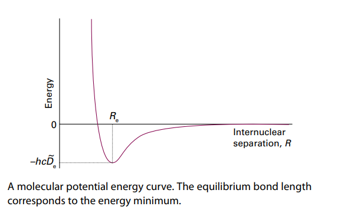
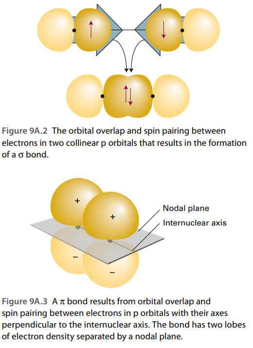
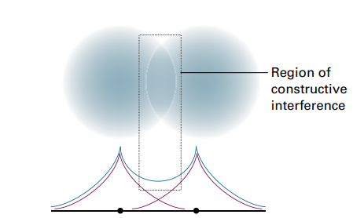
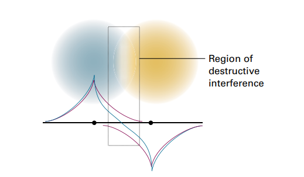
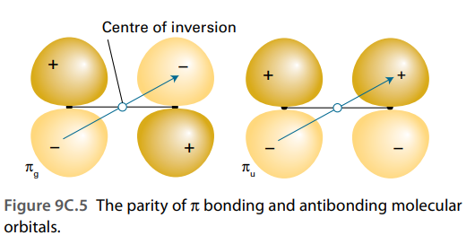
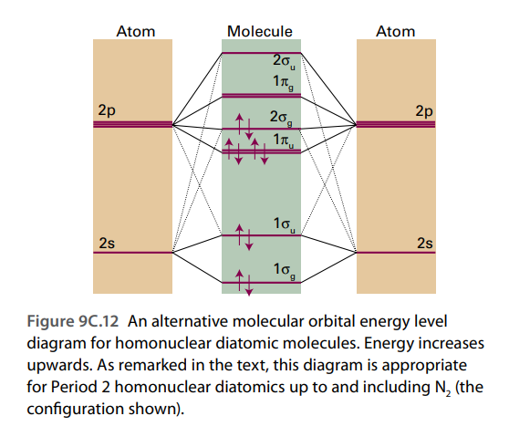
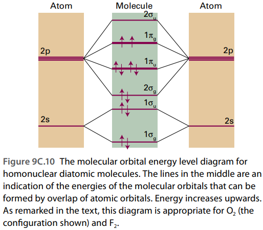

# 分子结构

## 波恩-奥本海默近似

由于分子的复杂性和多体性,对于任何一个分子,都不太可能去获得其薛定谔方程的精确解,这个时候就需要一点点小小的近似,对分子我们通常采用波恩奥本海默近似

对于原子,B-O近似认为,由于原子核比电子要重很多,移动相对比较缓慢,因此,当电子在原子核的场中运动的时候,原子核可以被视作静止处理,我们就可以假设原子核固定,然后去求解薛定谔方程

对于双原子分子,可以设定核间距为一个固定值,然后在静止的核势场下求解薛定谔方程并且计算能量,改变核间距,我们就可以得到分子能量随键长的变化规律,也就能得到分子势能曲线.

!!! info "分子势能曲线"

    

## 价键理论

### 双原子分子

考虑氢分子的两个电子,根据轨道近似,电子1和电子2的波函数可以分离变量,由因为二者的波函数重叠,不能分辨哪个是1哪个是2,所以通常表示成为线性组合的方式:

$$
\Psi(1,2)=\psi_A(1)\psi_B(2)\pm \psi_B(1)\psi_A(2)
$$

显然,加号的组合形式具有更大的概率密度,因而对应的状态能量最低,根据泡利规则,总波函数在互换1,2时需要变号,也就是说,加号的情形对应着电子自旋平行配对的情况.

于是,这样子的电子配对的情况在化学中就被称作成键,并且,波函数绕键轴对称分布这种情况形成的键就被称作$\sigma$键

以$N_2$为例,每个氮原子的价电子组态为:$2s^22p_x^12p_y^1 2p_z^1$,我们把z轴定义成为核间轴,两个价电子形成$\sigma$键,由于轨道的正交性,另外两个电子没有办法形成$\sigma$键,只能以肩并肩的形式形成自旋配对的电子结构,这个就被称作$\pi$键.

### 共振

我们知道,上面的波函数的描述实际上是说电子1有可能出现在B的轨道上,电子2有可能出现在A的轨道上,或者他们在各自的轨道上,但是不能描述两个电子在同一个原子的轨道上,也就是所谓的离子状态,以氯化氢为例:

$$
\Psi_{H^+Cl^-}=\psi_{Cl}(1)\psi_{Cl}(2)
$$

对于氯化氢分子来说,完全是有很大的可能性出现上述的离子状态的,所以我们就会有所谓的共振形式,将原来的没有偏移的波函数与离子状态的波函数进行叠加,来体现电子的偏向性:

$$
\Psi=\Psi_{H-Cl}+\lambda\Psi_{H^+Cl^-}
$$

这个式子被称作所谓的共振杂化式,是一种更加接近真实波函数的一种近似数学表示.

共振概念的引入使得电子具有更多可能的状态,也拥有更大的离域空间,能够通过共振来调整状态,降低能量,所以拥有较多共振态的分子,其结构也更加的稳定.

### 多原子分子

#### 杂化

价键理论的原始状态不能解释某些显示现象,例如,碳原子的未成键的价电子个数只有两个,而碳原子常常是呈现出四价的状态,也就是说,碳原子在成键的过程中发生了电子的激发,电子组态发生了改变,最后形成的产物的总势能反倒会降低:

$$
2s^2sp_x^{1}2p_y^1\to 2s^1 2p_x^1 2p_y^1 2p_z^1
$$

但是,这样形成的四个键的性质应该会有所差异,然而碳的四个价电子在成键的过程中四个键是没有任何区别的,为了解释这一种现象,人们提出了杂化理论,认为这四个轨道进行了重新的组合,形成了四个能量相同的杂化轨道

$$
h_1^1h_2^1h_3^1h_4^1
$$

注意,这只是一种理论上的表述,有没有这样的一个过程,存不存在这样一个电子组态都难说,这只是为了解释而创建出的一种理论

我们假设杂化轨道可以写成原子轨道的线性组合:

$$
h=as+b_xp_x+b_yp_y +b_zp_z 
$$

再根据四个轨道的两两正交性以及对称性可以得到所谓的$sp^3$杂化轨道的具体表现形式:

\[
\left|
\begin{array}{rl}
h_1 = s + p_x + p_y + p_z \quad & h_2 = s - p_x - p_y + p_z \\
h_3 = s - p_x + p_y - p_z \quad & h_4 = s + p_x - p_y - p_z \\
\end{array}
\right|
\]

类似的$sp^3$杂化也可以应用在水分子上,不过,由于占据另外两个杂化轨道的是孤电子对,所以分子并不具有完美的对称性,所以O-H之间的夹角是104.5度而不是109.5°

类似的,还有乙烯分子中的$sp^2$杂化,乙炔分子中的$sp^3$杂化,这里就不过多赘述了,相信大家已经很熟悉了.

## 分子轨道理论

上面的价键理论一看就很不成熟,因为他把电子的形态具象化,定域化了,沿用了所谓化学键的表示方式,是一种形而上学的表示方法.而分子轨道理论认为,电子不属于任何的键,他可以在整个分子周围运动,也就是运动在所谓的分子轨道上,该理论比之价键理论要更加的成熟,完善.

价键理论在追求所谓化学键的同时,就绑死了所谓电子自旋成对的的结果,但是这样的话$H_2^+,H_2^-$等物质就不在价键理论探讨的范围之内,但是运用分子轨道理论,我们可以很好的去处理这些物质.

### 氢分子离子

先从最简单的情况,也就是两个质子一个电子的情况开始讨论,哈密顿算子为:

$$
\hat{H}=\frac{-\hbar^2}{2m}\frac{d^2 \psi}{dx^2}+V
$$

其中的势能由两个核提供:

$$
V=\frac{-e^2}{4\pi\varepsilon_0}\left(\frac{1}{r_1}+\frac{1}{r_2}-\frac{1}{R}\right)
$$

求解本征方程得到的波函数就被称为分子轨道

虽然本征方程可以获得精确的解析解,但是,求解得到的本征函数通常比较复杂,我们采取一种较为简单的近似方法:

将分子轨道视作原子轨道的线性叠加:

$$
\Psi=N_{\pm}(\psi_A\pm \psi_B)
$$

这种由原子轨道线性组合形成的分子轨道被称作LCAO-MO,这样子形成的分子轨道和$\sigma$键有对称性上的共通之处,所以被称作$\sigma$轨道.

归一化系数:

$$
\int N^2 (\psi_A^*\pm \psi_B^*)(\psi_A\pm \psi_B)dx=2(1\pm S)N^2=1
$$

故:

$$
N_{\pm}=\sqrt{\frac{1}{2(1\pm S)}}
$$

其中S被称作重叠积分:

$$
S_{ij}=\int\psi_i^*\psi_j dx
$$

对于实数波函数(例如我们刚刚用的两个氢原子的1s轨道),ij和ji的重叠积分是一致的,复共轭就是它本身.

如果说,线性叠加是+的,那么对应的分子轨道就被称作成键轨道,记做$\sigma$,不难看出,两个波函数干涉相长,电子出现的概率更大,电子云密度增加,这会导致核间距的进一步收缩,成键轨道的能量会更低.

反之,如果线性叠加是-的,对应的电子出现的概率会减小,轨道的能量较高,这个轨道被称之为反键轨道.记做$\sigma^*$

考虑一个经典的问题,为什么没有氦分子,按照经典的价键理论,$\sigma$键为什么不能容纳四个电子?这是价键理论这一形而上学的理论所不能回答的问题,而分子轨道理论给出了相应的解释,如果$\sigma$键容纳四个电子,对应到分子轨道理论中就是$\sigma$轨道全部被填满,而反键轨道升高的能量会大于成键轨道降低的能量,这样,这个结构就是不稳定的.

#### 轨道符号

轨道符号根据对称性选定,具有中心对称性的波函数被称作具有偶态对称性的的波函数,用下标g来表示,例如$\sigma_g$,同理具有反中心对称性的波函数被称作具有奇态对称性,用下标u来表示,例如$\sigma$反键轨道:$\sigma_u$,但是这些反演对称性不能适用于异核双原子分子

### 同核双原子分子

!!! info "分子轨道的一般原理"

    所有对称性匹配的原子轨道都可以形成分子轨道

所以,$\sigma$轨道的一般形式可以表示成为:

$$
\psi=c_{A 2s}\psi_{A 2s}+c_{B 2s}\psi_{B 2s} +c_{A 2p_z} \psi_{A 2p_z}+c_{B 2p_z}\psi_{B 2p_z}
$$

由于这些线性组合存在能量差异,所以可以把这些线性组合分成两组,能量低的命名为$1\sigma$,能量较高的被命名为$2\sigma$,这样我们就得到了两个成键轨道和两个反键轨道.

$$
\begin{aligned}
\psi=c_{A 2s}\psi_{A 2s}+c_{B 2s}\psi_{B 2s} \\
\psi=c_{A 2p_z} \psi_{A 2p_z}+c_{B 2p_z}\psi_{B 2p_z}
\end{aligned}
$$

对于$2p_x$和$2p_y$轨道,他们在原子相互靠近的时候会以肩并肩的方式融合称为一个大轨道,分别形成$\pi_x$轨道和$\pi_y$轨道,$\pi_x$成键轨道和$\pi_y$成键轨道之间是简并的,同理,其反键轨道也是简并的,我们把两个$\pi$成键轨道合并成为$\pi_u$,注意到其刚好是反对称性的,可以容纳四个电子,同理也会有$\pi$反键轨道$\pi_g$,其符合中心对称性,能量更高.

至此,我们完成了分子轨道的初步构建,对于不同的原子,其轨道的能级大小次序也不尽相同,分子轨道能级顺序沿着第二周期变化:

下图的顺序适用于$N_2$分子以及在它之前的第二周期双原子分子:

对于$O_2$和$F_2$,适用下面的能级次序:

根据能级的次序,我们就可以往轨道里填充电子,从而得到任意的同核双原子分子的电子组态,例如$N_2$:

$$
1\sigma^2_g 1\sigma_u^{*2}1\pi_u^4 2\sigma_g^2
$$

双原子分子的净成键可以用键级度量:

$$
b=\frac{1}{2}(N-N^*)
$$

其中$N$代表成键轨道的电子个数,$N^*$代表反键轨道的分子数目

可以用键级是否为0来判断某个原子是否可以形成分子.

### 异核双原子分子

### 多原子分子