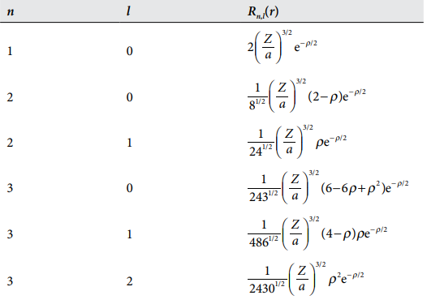

# 原子结构与原子光谱
## 类氢原子
现在,让我们把目光转向原子而不是局限于电子运动,最简单的原子是氢原子,由一个核外电子和原子核组成,那么,完整的哈密顿算符应该是:

$$
\hat{H}=-\frac{\hbar^2}{2m_e}\nabla^2_e+-\frac{\hbar^2}{2m_N}\nabla^2_N+\hat{V}(r)
$$

由电子和原子核的动能以及两者之间的相互作用能组成,根据柯尼希定理,质点系的总动能可以等价成质点绕质心的相对动能和质心速度导致的绝对动能,所以,哈密顿算符可以等价成:

$$
\hat{H}=-\frac{\hbar^2}{2\mu}\nabla^2+\hat{V}(r)
$$

其中$\mu$是原子核和电子的折合质量
所以,这样就成功把二体问题又转变成了单体问题,下面考虑如何解薛定谔方程:

$$
-\frac{\hbar^2}{2\mu}\nabla^2\psi+\hat{V}(r)\psi=E\psi
$$

根据分离变量的思想,我们默认波函数$\psi$可以由两部分组成,一个是径向波函数$R(r)$,另一个则是角度波函数$Y(\theta,\phi)$,于是波函数可以写成:

$$
\psi(\theta,\phi,r)=R(r)Y(\phi,\theta)
$$

拉普拉斯算子的球坐标表示为:

$$
\nabla^2=\frac{1}{r}\frac{\partial^2}{\partial r^2}r+\frac{1}{r^2}\Lambda^2
$$

根据以上的条件,我们可以分离出两个常微分方程

!!!tip
    $$
    ERY=-\frac{\hbar^2}{2\mu}\frac{1}{r}\frac{\partial^2}{\partial r^2}rR-\frac{\hbar^2}{2\mu}\frac{R}{r^2}\Lambda^2Y+VRY
    $$

    然后左右同除以RY,再乘以r^2得到:

    $$
    Er^2=-\frac{\hbar^2}{2\mu}\frac{r}{R}\frac{\partial^2}{\partial r^2}rR+Vr^2-\frac{1}{Y}\frac{\hbar^2}{2\mu}\Lambda^2 Y
    $$

    注意到,式子左边仅仅是与r有关的函数,式子右边被分离成了一个只与r有关的函数与只有角度有关的函数,于是,与角度有关的那一项就是一个常数,我们不妨记做$E_l$
    注意到,方程

    $$
    -\frac{1}{Y}\frac{\hbar^2}{2\mu}\Lambda^2 Y=E_l
    $$

    的解为球谐函数,$E_l$可以使用角量子数来表示:

    $$
    E_l=\frac{\hbar^2}{2\mu}l(l+1)
    $$

    把它代回到原式当中去,然后两边再除以$r^2$得到:

    $$
    -\frac{\hbar^2}{2\mu r^2}\frac{r}{R}\frac{\partial^2}{\partial r^2}(rR)+(V+\frac{\hbar^2}{2\mu r^2}l(l+1))=E
    $$

    现在式子两端全部与r有关了,这就是一个常微分方程
    注意到:

    $$
    \frac{\partial^2}{\partial r^2}(rR)=\frac{d}{dr}(\frac{d}{dr}(rR))=\frac{d}{dr}(R+r\frac{dR}{dr})=2\frac{dR}{dr}+r\frac{d^2R}{dr^2}
    $$

    原式左右两边同乘以R,再代入这个结果得到:

    $$
    -\frac{\hbar^2}{2\mu}(\frac{d^2R}{dr^2}+\frac{2}{r}\frac{dR}{dr})+V_{eff}R=ER
    $$

    其中$V_{eff}$被称之为有效势能

    $$
    V_{eff}=-\frac{Ze}{4\pi\varepsilon_0r^2}+\frac{\hbar^2}{2\mu r^2}l(l+1)
    $$

    这样,一个二元的偏微分方程就化简为两个常微分方程

考察径向微分方程,当电子离原子核很近的时候,离心势能占据主导地位,电子被极巨排斥,波函数应该趋向于0,当电子远离核的时候,库伦势能占据主导地位,在这里找到粒子的概率也很小,波函数也要趋于0,由于平方反比的库伦势能,波函数在远离核的时候衰减应该较为缓慢,根据以上定性分析,不难猜出一个合格的波函数的形式应该如下所示:

$$
R(r)=Nr^lL(r)e^{-r}
$$

可以看到,径向波函数分别由归一化系数,近核决定项,桥联多项式以及远核决定项决定,引入如下记号:

$$
\rho = \frac{2Zr}{na}\quad
a = \frac{m_e}{\mu} a_0\quad
a_0 = \frac{4 \pi \epsilon_0 \hbar^2}{m_e e^2}
$$

就能表示径向方程的一系列特解,他们分别主量子数n和角量子数l共同控制:

!!!径向波函数
    

球谐函数受角量子数和磁量子数控制,所以波函数可以写成:

$$
\psi_{n,l,m_l}(r,\theta,\phi) = R_{n,l}(r) Y_{l,m_l}(\theta,\phi)
$$

