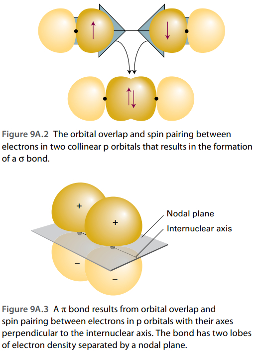
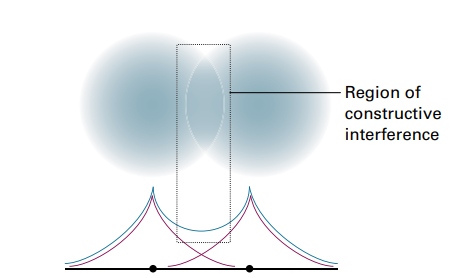
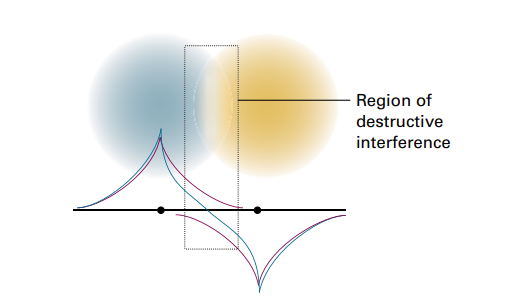
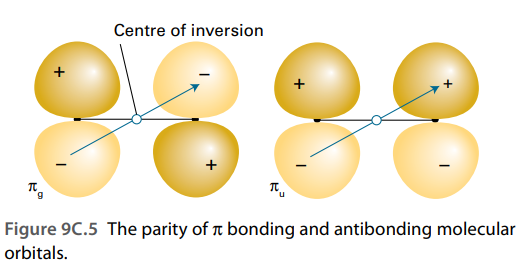
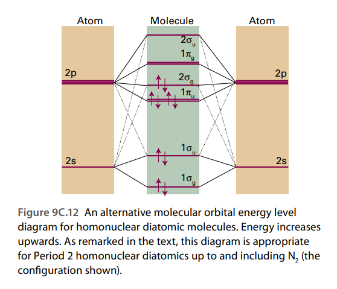
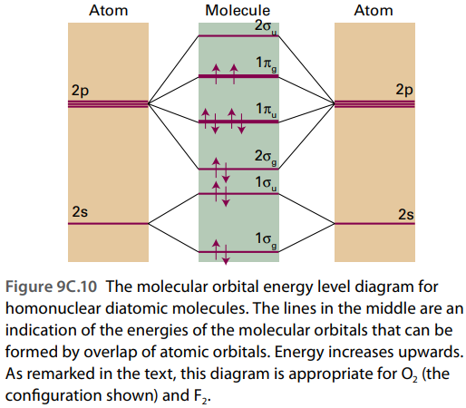

# 分子结构

## 波恩-奥本海默近似

由于分子的复杂性和多体性,对于任何一个分子,都不太可能去获得其薛定谔方程的精确解,这个时候就需要一点点小小的近似,对分子我们通常采用波恩奥本海默近似

对于原子,B-O近似认为,由于原子核比电子要重很多,移动相对比较缓慢,因此,当电子在原子核的场中运动的时候,原子核可以被视作静止处理,我们就可以假设原子核固定,然后去求解薛定谔方程

对于双原子分子,可以设定核间距为一个固定值,然后在静止的核势场下求解薛定谔方程并且计算能量,改变核间距,我们就可以得到分子能量随键长的变化规律,也就能得到分子势能曲线.

!!! info "分子势能曲线"

    

## 价键理论

### 双原子分子

考虑氢分子的两个电子,根据轨道近似,电子1和电子2的波函数可以分离变量,由因为二者的波函数重叠,不能分辨哪个是1哪个是2,所以通常表示成为线性组合的方式:

$$
\Psi(1,2)=\psi_A(1)\psi_B(2)\pm \psi_B(1)\psi_A(2)
$$

显然,加号的组合形式具有更大的概率密度,因而对应的状态能量最低,根据泡利规则,总波函数在互换1,2时需要变号,也就是说,加号的情形对应着电子自旋平行配对的情况.

于是,这样子的电子配对的情况在化学中就被称作成键,并且,波函数绕键轴对称分布这种情况形成的键就被称作$\sigma$键

以$N_2$为例,每个氮原子的价电子组态为:$2s^22p_x^12p_y^1 2p_z^1$,我们把z轴定义成为核间轴,两个价电子形成$\sigma$键,由于轨道的正交性,另外两个电子没有办法形成$\sigma$键,只能以肩并肩的形式形成自旋配对的电子结构,这个就被称作$\pi$键.

### 共振

我们知道,上面的波函数的描述实际上是说电子1有可能出现在B的轨道上,电子2有可能出现在A的轨道上,或者他们在各自的轨道上,但是不能描述两个电子在同一个原子的轨道上,也就是所谓的离子状态,以氯化氢为例:

$$
\Psi_{H^+Cl^-}=\psi_{Cl}(1)\psi_{Cl}(2)
$$

对于氯化氢分子来说,完全是有很大的可能性出现上述的离子状态的,所以我们就会有所谓的共振形式,将原来的没有偏移的波函数与离子状态的波函数进行叠加,来体现电子的偏向性:

$$
\Psi=\Psi_{H-Cl}+\lambda\Psi_{H^+Cl^-}
$$

这个式子被称作所谓的共振杂化式,是一种更加接近真实波函数的一种近似数学表示.

共振概念的引入使得电子具有更多可能的状态,也拥有更大的离域空间,能够通过共振来调整状态,降低能量,所以拥有较多共振态的分子,其结构也更加的稳定.

### 多原子分子

#### 杂化

价键理论的原始状态不能解释某些显示现象,例如,碳原子的未成键的价电子个数只有两个,而碳原子常常是呈现出四价的状态,也就是说,碳原子在成键的过程中发生了电子的激发,电子组态发生了改变,最后形成的产物的总势能反倒会降低:

$$
2s^2sp_x^{1}2p_y^1\to 2s^1 2p_x^1 2p_y^1 2p_z^1
$$

但是,这样形成的四个键的性质应该会有所差异,然而碳的四个价电子在成键的过程中四个键是没有任何区别的,为了解释这一种现象,人们提出了杂化理论,认为这四个轨道进行了重新的组合,形成了四个能量相同的杂化轨道

$$
h_1^1h_2^1h_3^1h_4^1
$$

注意,这只是一种理论上的表述,有没有这样的一个过程,存不存在这样一个电子组态都难说,这只是为了解释而创建出的一种理论

我们假设杂化轨道可以写成原子轨道的线性组合:

$$
h=as+b_xp_x+b_yp_y +b_zp_z 
$$

再根据四个轨道的两两正交性以及对称性可以得到所谓的$sp^3$杂化轨道的具体表现形式:

\[
\left|
\begin{array}{rl}
h_1 = s + p_x + p_y + p_z \quad & h_2 = s - p_x - p_y + p_z \\
h_3 = s - p_x + p_y - p_z \quad & h_4 = s + p_x - p_y - p_z \\
\end{array}
\right|
\]

类似的$sp^3$杂化也可以应用在水分子上,不过,由于占据另外两个杂化轨道的是孤电子对,所以分子并不具有完美的对称性,所以O-H之间的夹角是104.5度而不是109.5°

类似的,还有乙烯分子中的$sp^2$杂化,乙炔分子中的$sp^3$杂化,这里就不过多赘述了,相信大家已经很熟悉了.

## 分子轨道理论

上面的价键理论一看就很不成熟,因为他把电子的形态具象化,定域化了,沿用了所谓化学键的表示方式,是一种形而上学的表示方法.而分子轨道理论认为,电子不属于任何的键,他可以在整个分子周围运动,也就是运动在所谓的分子轨道上,该理论比之价键理论要更加的成熟,完善.

价键理论在追求所谓化学键的同时,就绑死了所谓电子自旋成对的的结果,但是这样的话$H_2^+,H_2^-$等物质就不在价键理论探讨的范围之内,但是运用分子轨道理论,我们可以很好的去处理这些物质.

### 氢分子离子

先从最简单的情况,也就是两个质子一个电子的情况开始讨论,哈密顿算子为:

$$
\hat{H}=\frac{-\hbar^2}{2m}\frac{d^2 \psi}{dx^2}+V
$$

其中的势能由两个核提供:

$$
V=\frac{-e^2}{4\pi\varepsilon_0}\left(\frac{1}{r_1}+\frac{1}{r_2}-\frac{1}{R}\right)
$$

求解本征方程得到的波函数就被称为分子轨道

虽然本征方程可以获得精确的解析解,但是,求解得到的本征函数通常比较复杂,我们采取一种较为简单的近似方法:

将分子轨道视作原子轨道的线性叠加:

$$
\Psi=N_{\pm}(\psi_A\pm \psi_B)
$$

这种由原子轨道线性组合形成的分子轨道被称作LCAO-MO,这样子形成的分子轨道和$\sigma$键有对称性上的共通之处,所以被称作$\sigma$轨道.

归一化系数:

$$
\int N^2 (\psi_A^*\pm \psi_B^*)(\psi_A\pm \psi_B)dx=2(1\pm S)N^2=1
$$

故:

$$
N_{\pm}=\sqrt{\frac{1}{2(1\pm S)}}
$$

其中S被称作重叠积分:

$$
S_{ij}=\int\psi_i^*\psi_j dx
$$

对于实数波函数(例如我们刚刚用的两个氢原子的1s轨道),ij和ji的重叠积分是一致的,复共轭就是它本身.

如果说,线性叠加是+的,那么对应的分子轨道就被称作成键轨道,记做$\sigma$,不难看出,两个波函数干涉相长,电子出现的概率更大,电子云密度增加,这会导致核间距的进一步收缩,成键轨道的能量会更低.

反之,如果线性叠加是-的,对应的电子出现的概率会减小,轨道的能量较高,这个轨道被称之为反键轨道.记做$\sigma^*$

考虑一个经典的问题,为什么没有氦分子,按照经典的价键理论,$\sigma$键为什么不能容纳四个电子?这是价键理论这一形而上学的理论所不能回答的问题,而分子轨道理论给出了相应的解释,如果$\sigma$键容纳四个电子,对应到分子轨道理论中就是$\sigma$轨道全部被填满,而反键轨道升高的能量会大于成键轨道降低的能量,这样,这个结构就是不稳定的.

#### 轨道符号

轨道符号根据对称性选定,具有中心对称性的波函数被称作具有偶态对称性的的波函数,用下标g来表示,例如$\sigma_g$,同理具有反中心对称性的波函数被称作具有奇态对称性,用下标u来表示,例如$\sigma$反键轨道:$\sigma_u$,但是这些反演对称性不能适用于异核双原子分子

### 同核双原子分子

!!! info "分子轨道的一般原理"

    所有对称性匹配的原子轨道都可以形成分子轨道

所以,$\sigma$轨道的一般形式可以表示成为:

$$
\psi=c_{A 2s}\psi_{A 2s}+c_{B 2s}\psi_{B 2s} +c_{A 2p_z} \psi_{A 2p_z}+c_{B 2p_z}\psi_{B 2p_z}
$$

由于这些线性组合存在能量差异,所以可以把这些线性组合分成两组,能量低的命名为$1\sigma$,能量较高的被命名为$2\sigma$,这样我们就得到了两个成键轨道和两个反键轨道.

$$
\begin{aligned}
\psi=c_{A 2s}\psi_{A 2s}+c_{B 2s}\psi_{B 2s} \\
\psi=c_{A 2p_z} \psi_{A 2p_z}+c_{B 2p_z}\psi_{B 2p_z}
\end{aligned}
$$

对于$2p_x$和$2p_y$轨道,他们在原子相互靠近的时候会以肩并肩的方式融合称为一个大轨道,分别形成$\pi_x$轨道和$\pi_y$轨道,$\pi_x$成键轨道和$\pi_y$成键轨道之间是简并的,同理,其反键轨道也是简并的,我们把两个$\pi$成键轨道合并成为$\pi_u$,注意到其刚好是反对称性的,可以容纳四个电子,同理也会有$\pi$反键轨道$\pi_g$,其符合中心对称性,能量更高.

至此,我们完成了分子轨道的初步构建,对于不同的原子,其轨道的能级大小次序也不尽相同,分子轨道能级顺序沿着第二周期变化:

下图的顺序适用于$N_2$分子以及在它之前的第二周期双原子分子:

对于$O_2$和$F_2$,适用下面的能级次序:

根据能级的次序,我们就可以往轨道里填充电子,从而得到任意的同核双原子分子的电子组态,例如$N_2$:

$$
1\sigma^2_g 1\sigma_u^{*2}1\pi_u^4 2\sigma_g^2
$$

双原子分子的净成键可以用键级度量:

$$
b=\frac{1}{2}(N-N^*)
$$

其中$N$代表成键轨道的电子个数,$N^*$代表反键轨道的分子数目

可以用键级是否为0来判断某个原子是否可以形成分子.

### 异核双原子分子

对于同核双原子分子,由于对称性,叠加系数都是相同的,我们可以很容易确定总波函数的形式,但是,对于异核双原子分子,存在着所谓的极性键,由于两种核对电子的吸引能力不同,会导致电子云出现一定程度的扭曲,这体现在波函数上,就是叠加系数的不同:

$$
\Psi=c_A\psi_A+c_B\psi_B
$$

#### 电负性

为了描述这种偏向性,化学家们提出了一个所谓电负性的衡量指标,这只是一个工具,不是什么本质上的东西,电负性代表了核吸引电子的能力的强弱,主要有两种描述指标,一种是所谓的Pauling电负性,其定义如下:

$$
|\chi_A-\chi_B|=\sqrt{hc\tilde{D_0}(AB)-\frac{1}{2}(hc\tilde{D_0}(AA)+hc\tilde{D_0}(BB))}/eV
$$

即AB键的解离能减去AA和BB键的解离能的算术平均开根号,这个公式能够给出两种原子电负性的相对度量.

还有一种电负性标度被称作所谓的Mulliken电负性标度,Mulliken认为,如果一个原子,他比较不容易失去电子,并且比较容易得到电子,那么他的电负性会大,也就是所谓的具有较高的电离能和较大的电子亲和势能

所以Mulliken电负性指标就定义成电离能和电子亲和势能的算术平均值:

$$
\chi=\frac{1}{2}(I+E_{ea})/eV
$$

#### 变分原理

如何计算波函数的叠加系数仍然是一个亟待解决的问题,量子力学中给出了一种叫做变分原理的方法来求解薛定谔方程的近似解:

变分原理认为,任意给出的波函数在某个哈密顿算子下的能量期望值会永远大于等于这个哈密顿算子对应的基态能量值.

这个几乎是很显然的一条结论,因为任意给出的波函数总能描述成本征函数的线性叠加,而基态是所有本征态中能量最低的状态,因而这个波函数的能量期望值总会大于等于基态.

于是,这就给我们启发,设置一个合理的多参数的猜测波函数,通过调整参数使得波函数的能量取到最小值,我们用这个最小值的能量去估计基态能量,从而得以描述真实的基态能量

不难发现,上面的应用前提是,分子或者原子,他们的能量总是处于当前总哈密顿算子下的基态能量,所以这个对基态能量的估计就是对真实能量的估计.

最常见的变分参数的设置就是线性变分,也就是用叠加系数当做变分参数:

(这里做一个简化,考虑简单的轨道波函数,他们都是实数波函数)

$$
\langle E\rangle=\frac{\int (c_1\psi_1+c_2\psi_2)\hat{H}(c_1\psi_1+c_2\psi_2) dx}{\int (c_1\psi_1+c_2\psi_2)^2dx}
$$

使用重叠积分记号,并且用一些其他记号进行化简:

$$
\begin{aligned}
H_{11}=\int \psi_1 \hat{H}\psi_1 dx \\
H_{22}=\int \psi_2 \hat{H}\psi_2 dx \\
H_{12}=H_{21}=\int \psi_1 \hat{H}\psi_2 dx=\int \psi_2 \hat{H}\psi_1 dx\\
S_{ij}=\int \psi_1\psi_2 dx
\end{aligned}
$$

其中$H_{12},H_{21}$在$\pi$轨道中被称之为共振积分

根据量子化学相关知识,我们知道,满足极小值条件实际上就是满足久期方程:

$$
HC=SC\mathbf{E}
$$

按照列展开就是一个个本征方程:

$$
HC=E_nSC
$$

其中:

$$
H=
\begin{pmatrix}
  H_{11},H_{12}\\
  H_{21},H_{22}  
\end{pmatrix}
$$

$$
C=
\begin{pmatrix}
    c_1\\
    c_2
\end{pmatrix}
$$

$$
S=
\begin{pmatrix}
  S_{11},S_{12}\\
  S_{21},S_{22}  
\end{pmatrix}
$$

特征方程为:

$$
|H-EI|=0
$$

我们要求的系数就是这个特征方程的特征向量,对应的基态能量就是特征值

注意到这是一个二次方程,有两个根,能量的高低分别对应成键轨道和反键轨道.

### 多原子分子

对于多原子分子,我们继续采用所谓的叠加近似的方法,即将分子轨道近似认为是原子轨道的线性叠加:

$$
\Psi=\sum_{i} c_i \psi_i
$$

通过变分原理,建立久期方程,依旧可以得到分子轨道的基态解,现在已经有非常成熟的软件求解来进行上述过程.

#### 休克尔近似

固然,分子轨道可以认为是一个整体,由各个部分叠加组成的一个大整体,但是,不同的叠加部分存在明显的能级差,所以轨道被分为所谓的$\sigma,\pi$等等轨道:

$$
\Psi_i=\sum_{j} c_{ij}\psi_j
$$

1931年,休克尔提出了一种用于计算分子$\pi$轨道的近似方法,被称作休克尔近似:

- 所有的重叠积分的值都设置为0
- 所有不相邻原子之间的共振积分都设定为0
- 所有不为零的共振积分均设定为相等

以乙烯为例,其$\pi$轨道的本征方程为:

$$
\begin{pmatrix}
    H_{11}-E,H_{12}\\
    H_{21},H_{22}-E
\end{pmatrix}
\begin{pmatrix}
    c_1\\
    c_2
\end{pmatrix}=0
$$

得到的两个本征值为:

$$
E=H_{11}\pm H_{12}
$$

非常粗略的得到了成键轨道和反键轨道.同理,我们还能够计算出乙烯的一些其他的分子轨道.

乙烯的最高占据分子轨道(HOMO)和最低未占据分子轨道(LUMO)共同组成了分子的前线轨道,这决定了他的诸多光谱性质和化学性质.

从上面的例子中我们可以发现,休克尔近似在不直接计算共振积分,重叠积分等参数的数值的情况下,可以直接给出本征向量,这就是休克尔近似的方便之处

在研究只有碳原子组成的$\pi$分子轨道时,休克尔近似告诉我们,哈密顿矩阵中永远只有两个参数,一个是碳原子轨道的能量期望值$H_{ii}$,我们记做$\alpha$,另一个是交叉项的共振积分$H_{ij}$,我们记做$\beta$,所以哈密顿矩阵总可以分离变量:

以丁二烯为例:

$$
\begin{pmatrix}
    \alpha,\beta,0,0\\
    \beta,\alpha,\beta,0\\
    0,\beta,\alpha,\beta\\
    0,0,\beta,\alpha
\end{pmatrix}=
\alpha \mathbf{I}+\beta
\begin{pmatrix}
    0,1,0,0\\
    1,0,1,0\\
    0,1,0,1\\
    0,0,1,0
\end{pmatrix}
$$

未对角化的只有右边那一个部分

注意到本征矩阵E:

$$
\mathbf{E}=C^{-1}HC=\alpha I+\beta
C^{-1}
\begin{pmatrix}
    0,1,0,0\\
    1,0,1,0\\
    0,1,0,1\\
    0,0,1,0
\end{pmatrix}
C
$$

所以,要求得所有的本征值,只需要对角化一个已知的实数矩阵就可以了,在对角化的过程中,也把相应的系数矩阵C也求出来了.

至于能量,还是要求解相应的参数的值.由此可见,休克尔近似大大简化了只有碳原子构成的$\pi$轨道体系的求解.

由此得到丁二烯分子的四个LCAO-MO轨道的能量为:

$$
E=\alpha\pm 1.62\beta,\alpha\pm 0.62\beta
$$

我们定义$\pi$电子结合能为所有被占据的$\pi$轨道的能量之和($\beta<0$):

所以丁二烯的$\pi$电子结合能为:

$$
E_{\pi}=2(\alpha+1.62\beta)+2(\alpha+0.62\beta)=4\alpha+4.48\beta
$$

而乙烯的$\pi$电子结合能为:

$$
E_{\pi}=2\alpha+2\beta
$$

据此可以发现,共轭体系的丁二烯的π轨道的能量居然小于两个乙烯的π轨道的能量,这部分降低的能量就被称作π电子的 **离域能**.

另一个相关的指标就是所谓的$\pi$键形成能,即分子轨道相对于单独的原子轨道降低了多少能量:

$$
E_{bf}=E_{\pi}-N_C \alpha
$$

