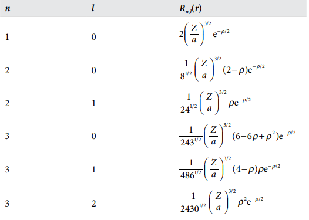
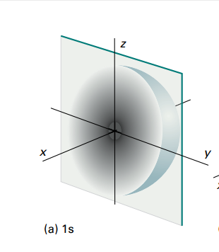
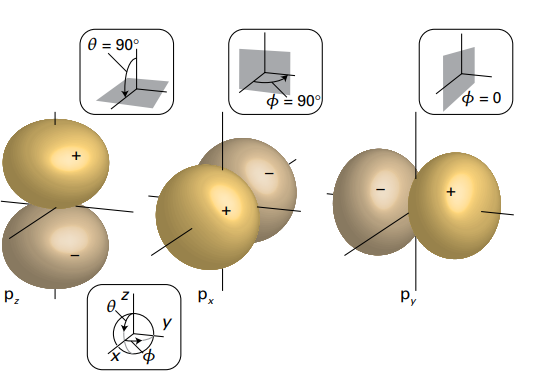
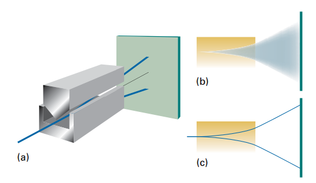

# 原子结构
## 类氢原子

对于一些和氢原子比较类似,即只有一个核外电子的原子,我们把它叫做类氢原子.

### 类氢原子的波函数
现在,让我们把目光转向原子而不是局限于电子运动,最简单的原子是氢原子,由一个核外电子和原子核组成,那么,完整的哈密顿算符应该是:

$$
\hat{H}=-\frac{\hbar^2}{2m_e}\nabla^2_e+-\frac{\hbar^2}{2m_N}\nabla^2_N+\hat{V}(r)
$$

由电子和原子核的动能以及两者之间的相互作用能组成,根据柯尼希定理,质点系的总动能可以等价成质点绕质心的相对动能和质心速度导致的绝对动能,所以,哈密顿算符可以等价成:

$$
\hat{H}=-\frac{\hbar^2}{2\mu}\nabla^2+\hat{V}(r)
$$

其中$\mu$是原子核和电子的折合质量
所以,这样就成功把二体问题又转变成了单体问题,下面考虑如何解薛定谔方程:

$$
-\frac{\hbar^2}{2\mu}\nabla^2\psi+\hat{V}(r)\psi=E\psi
$$

根据分离变量的思想,我们默认波函数$\psi$可以由两部分组成,一个是径向波函数$R(r)$,另一个则是角度波函数$Y(\theta,\phi)$,于是波函数可以写成:

$$
\psi(\theta,\phi,r)=R(r)Y(\phi,\theta)
$$

拉普拉斯算子的球坐标表示为:

$$
\nabla^2=\frac{1}{r}\frac{\partial^2}{\partial r^2}r+\frac{1}{r^2}\Lambda^2
$$

根据以上的条件,我们可以分离出两个常微分方程

!!!tip
    $$
    ERY=-\frac{\hbar^2}{2\mu}\frac{1}{r}\frac{\partial^2}{\partial r^2}rR-\frac{\hbar^2}{2\mu}\frac{R}{r^2}\Lambda^2Y+VRY
    $$

    然后左右同除以RY,再乘以r^2得到:

    $$
    Er^2=-\frac{\hbar^2}{2\mu}\frac{r}{R}\frac{\partial^2}{\partial r^2}rR+Vr^2-\frac{1}{Y}\frac{\hbar^2}{2\mu}\Lambda^2 Y
    $$

    注意到,式子左边仅仅是与r有关的函数,式子右边被分离成了一个只与r有关的函数与只有角度有关的函数,于是,与角度有关的那一项就是一个常数,我们不妨记做$E_l$
    注意到,方程

    $$
    -\frac{1}{Y}\frac{\hbar^2}{2\mu}\Lambda^2 Y=E_l
    $$

    的解为球谐函数,$E_l$可以使用角量子数来表示:

    $$
    E_l=\frac{\hbar^2}{2\mu}l(l+1)
    $$

    把它代回到原式当中去,然后两边再除以$r^2$得到:

    $$
    -\frac{\hbar^2}{2\mu r^2}\frac{r}{R}\frac{\partial^2}{\partial r^2}(rR)+(V+\frac{\hbar^2}{2\mu r^2}l(l+1))=E
    $$

    现在式子两端全部与r有关了,这就是一个常微分方程
    注意到:

    $$
    \frac{\partial^2}{\partial r^2}(rR)=\frac{d}{dr}(\frac{d}{dr}(rR))=\frac{d}{dr}(R+r\frac{dR}{dr})=2\frac{dR}{dr}+r\frac{d^2R}{dr^2}
    $$

    原式左右两边同乘以R,再代入这个结果得到:

    $$
    -\frac{\hbar^2}{2\mu}(\frac{d^2R}{dr^2}+\frac{2}{r}\frac{dR}{dr})+V_{eff}R=ER
    $$

    其中$V_{eff}$被称之为有效势能

    $$
    V_{eff}=-\frac{Ze}{4\pi\varepsilon_0r^2}+\frac{\hbar^2}{2\mu r^2}l(l+1)
    $$

    这样,一个二元的偏微分方程就化简为两个常微分方程

考察径向微分方程,当电子离原子核很近的时候,离心势能占据主导地位,电子被极巨排斥,波函数应该趋向于0,当电子远离核的时候,库伦势能占据主导地位,在这里找到粒子的概率也很小,波函数也要趋于0,由于平方反比的库伦势能,波函数在远离核的时候衰减应该较为缓慢,根据以上定性分析,不难猜出一个合格的波函数的形式应该如下所示:

$$
R(r)=Nr^lL(r)e^{-r}
$$

可以看到,径向波函数分别由归一化系数,近核决定项,桥联多项式以及远核决定项决定,引入如下记号:

$$
\rho = \frac{2Zr}{na}\quad
a = \frac{m_e}{\mu} a_0\quad
a_0 = \frac{4 \pi \epsilon_0 \hbar^2}{m_e e^2}
$$

就能表示径向方程的一系列特解,他们分别主量子数n和角量子数l共同控制:

!!!径向波函数
    

球谐函数受角量子数和磁量子数控制,所以波函数可以写成:

$$
\psi_{n,l,m_l}(r,\theta,\phi) = R_{n,l}(r) Y_{l,m_l}(\theta,\phi)
$$

### 原子轨道

根据薛定谔方程解的限制条件,我们知道了轨道的能级由三个参数控制,分别是主量子数$n$,角量子数$l$,以及磁量子数$m_l$,这些能量为负值的解对应于原子的不同的束缚态.

对于所有的$n$,这些轨道都属于原子的单壳层,用连续的字母来表示,$n=1,2,3,4 \ldots $分别对应$K,L,M,N$这些字母.

对于具有相同的$n$,但是$l$不同的轨道,他们会构成给定壳层的亚层:

$$
l=0,1,2,3,4,5,6\cdots
$$

分别对应$s,p,d,f,g,h,i$这些电子亚层.

至于磁量子数,他代表着角动量的空间量子化,对能量基本上没有影响,所以不会产生能级.

#### s轨道

当角量子数$l=0$时,此时的轨道被称为$s$轨道,这个时候磁量子数只能被限定为0,所以此时的球谐函数为常数$\sqrt{\frac{1}{4\pi}}$,角动量为0,不难想象物体具有对称性,波函数的图像也必然具有一定的对称性:

$$
\psi_s=\sqrt{\frac{1}{4\pi}}R_{n,l}(r)
$$

对氢原子的1s轨道来说,会有:

$$
\psi_s=\frac{1}{\sqrt{\pi a_0^3}}\exp(-\frac{r}{a_0})
$$

这是1s轨道的对应图像:

对于别的壳层的s轨道,无非就是多几个波函数的节点,但是中心对称性没有任何改变.

一般以能够捕获电子的概率为90%来划分这个球面

其径向分布函数为:

$$
P(r)=4\pi r^2|\psi(r)|^2=r^2R^2(r)
$$

#### p轨道

对应$l=1$的轨道,我们以2p轨道为例:

$$
\begin{aligned}
\psi_{2,1,0}= R_{2,1}(r)Y_{1,0}(\theta,\phi)=r\cos\theta f(r)\\
\psi_{2,1,1}=R_{2,1}(r)Y_{1,1}(\theta,\phi)=-\frac{1}{\sqrt{2}}r\sin\theta e^{-i\phi}f(r)\\
\psi_{2,1,-1}=R_{2,1}(r)Y_{1,-1}(\theta,\phi)=\frac{1}{\sqrt{2}}r\sin\theta e^{i\phi}f(r)
\end{aligned}
$$

其中第一个实数波函数可以写成($z=rcos\theta$):

$$
\psi_{2,1,0}=zf(r)
$$

被称为$p_z$轨道

为了在实空间中绘制$p_x$和$p_y$轨道,我们将磁量子数为$\pm 1$的两个波函数进行线性组合再归一化,就能得到:

$$
\begin{align*}
\psi_{2P_x} &= \frac{1}{\sqrt{2}} (\psi_{2,1,+1} - \psi_{2,1,-1}) = r \sin \theta \cos \phi f(r) = x f(r)  \\
\psi_{2P_y} &= \frac{i}{\sqrt{2}} (\psi_{2,1,+1} + \psi_{2,1,-1}) = r \sin \theta \sin \phi f(r) = y f(r) \\
\end{align*}
$$

!!! info "图像"

    

## 多原子电子

### 轨道近似
如果说原子核外不仅仅只存在一个电子,如果忽略电子间的相互作用,进行所谓的轨道近似,就可以极大地简化问题.

假设核外有$m$个电子,那么总哈密顿算子为:

$$
\hat{H}=\sum_{i=1}^m \hat{H_i}+\sum_{i \neq j}\frac{e^2}{4\pi\varepsilon_0r_{ij}}
$$

轨道近似就是忽略最后一项,让总哈密段算子成为各个哈密顿算子的线性组合.于是,波函数就可以分离变量:

$$
\varPsi(\mathbf{r_1},\mathbf{r_2}, \ldots ,\mathbf{r_m})=\psi(\mathbf{r_1})\psi(\mathbf{r_2})\cdots\psi(\mathbf{r_m})
$$

### 泡利不相容原理

电子自旋是电子的固有属性,之所以取这个名字,是因为电子的某些性质就好像它在绕着一根轴进行自转一样,所以取这个名字,关于自旋的成因,目前没有较为清晰的说法.

1921年,Stern和Gerlach想要通过实验去验证电子角动量的空间量子化,他们设计了一个非匀强磁场,并且使用了银原子穿过这个磁场,观察他们分裂出的条带.

为什么使用银原子呢,银原子的最外层只有一个电子,对于所有的内层电子来说,他们全部都是满排布的,角动量在空间中的取向相互抵消,所以,整个原子的磁矩仅仅只有最外层的电子贡献,对于每一个银原子,最外层电子角动量的空间取向有可能会不同,所以Stern等人也确实观测到了离散的条带,但是,出乎他们意料的是,他们在实验中观测到了两条带.

然而,对于任意一个角动量$l$,其角动量的取向有$2l+1$个,仅仅只有当$l=0.5$的时候才会出现这样一个情况,所以,他们观察到的不是电子的轨道磁矩,而是某种更加深邃的东西---电子的自旋磁矩也就是自旋角动量.

电子的自旋性质并不意味着电子确实是在绕着某条轴旋转,否则,根据计算,电子表面旋转的线速度将会超过光速,这显然是荒谬的,所以,我们把自旋当做电子的内禀属性来处理,就像质量,电荷一样.

自旋角动量的大小可以用自旋量子数$s$来表示,对应的自旋角动量大小为:

$$
\sqrt{s(s+1)}\hbar
$$

一个自旋量子数$s$还对应有$2s+1$个自旋磁量子数$m_s$,代表自旋角动量的空间量子化.

基本粒子基本上都会有特征自旋,,例如,质子和中子的自旋为$-\frac{1}{2}$,这代表$s=\frac{1}{2}$,一些介子的自旋为$-1,s=1$

- 我们把具有半整数自旋的粒子称之为费米子
- 把具有整数自旋的粒子称之为玻色子

!!! info "泡利原理"

    任意两个相同的费米子的标号互换,总波函数要变号,任意两个玻色子的标号互换,总波函数的符号不变

考虑两个占据相同轨道的电子1和2,根据轨道近似,总波函数可以写成:

$$
\Psi(1,2)=\psi(1)\psi(2)
$$

互换上面的1,2是不变号的,所以要对总波函数进行修正,总波函数应该等于电子波函数与自旋波函数的乘积,自旋波函数为:

$$
\begin{aligned}
&\alpha(1)\alpha(2) \\
&\beta(1)\beta(2)\\
&\sigma_+(1,2)=\frac{1}{\sqrt{2}}[\alpha(1)\beta(2)+\beta(1)\alpha(2)]\\
&\sigma_-(1,2)=\frac{1}{\sqrt{2}}[\alpha(1)\beta(2)-\beta(1)\alpha(2)]
\end{aligned}
$$

总共分为这四种情况,前两种是明晰了自旋方向的,后两种由于无法确定分辨哪个是1电子哪个是2电子,所以把自旋写成线性组合的形式.

根据泡利原理,互换1,2需要变号,所以只有$\sigma_-(1,2)$符合要求,所以总波函数为:

$$
\Psi(1,2)=\frac{1}{\sqrt{2}}\psi(1)\psi(2)[\alpha(1)\beta(2)-\beta(1)\alpha(2)]
$$

这就是泡利不相容原理,只有自旋相反的两个电子才能占据同一轨道.

!!! info "洪特规则"
    电子在双重占据同一轨道之前,先占据给定亚层的不同轨道,并且,这些电子的自旋平行.

考虑占据不同轨道的两个电子,由于无法分辨哪个是哪个,总波函数为:

$$
\Psi_\pm(r_1,r_2)=\frac{1}{\sqrt{2}}[\psi_a(r_1)\psi_b(r_2)\pm \psi_b(r_1)\psi_a(r_2)]
$$

这两种不同的波函数对应两种不同的自旋组态,对于$\Psi_+$,互换1,2之后,总波函数不变号,所以需要乘上一对自旋相反的波函数$\sigma_-(1,2)$,与之不同的是$\Psi_-$本身在1,2互换后就已经变号,所以只需要乘上一个互换1,2不变号的自旋波函数,即上面四种中除了$\sigma_-(1,2)$外的任意一个,这代表了波函数的自旋平行.显然,$\Psi_-$的能量要低于$\Psi_+$,即电子更趋向于以自旋平行的方式占据不同的轨道.

但是,当$r_1$趋向于$r_2$的时候,$\Psi_-$会趋向于0,这也就验证了占据同一轨道的两个电子只能以自旋平行的方式存在.

### HF-SCF

Hartree-Fork自洽场轨道方法是一种经典的计算机方法,我们上面计算和考虑波函数都是忽略了电子间的相互作用,在精确计算中并不能正确的描述波函数,HF-SCF方法考虑了如下的一个迭代过程:

选定一个待计算轨道波函数,估计其他所有电子的轨道波函数的近似形式,然后再解该轨道的薛定谔方程,保存得到的解,对所有其他的轨道重复这样的操作,保存所有解.

进入下一次迭代,这次的波函数使用上一轮得到的解,重复上一轮的操作

当轨道能量与上一轮没有明显差异的时候,终止迭代.