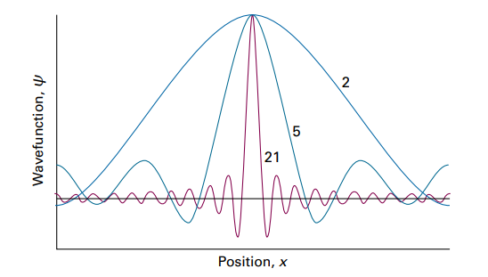
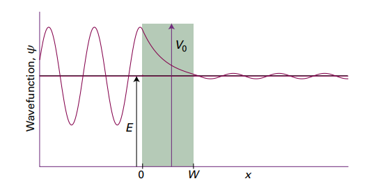
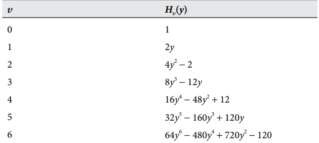
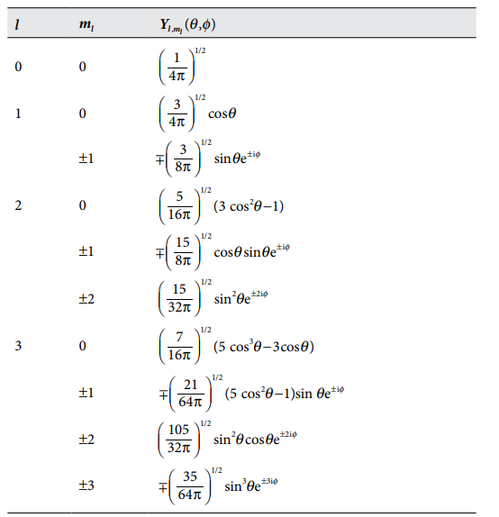

# 量子理论初步
## 波函数
物理化学书中主要讨论的是定态不含时的薛定谔方程,薛定谔方程的解被称之为波函数,他具有和波一样的偏微分方程以及解的结构,通过波函数,我们可以得到原子或者电子的全部信息,例如能量,动量,角动量,位置之类的,受限于海森堡不确定性原理,有一些信息是无法被精确知道的,例如一个被精确限制在某一位置的粒子我们不能得到它的动量信息,一个自由运动的粒子我们不能得到它的位置信息,这可以通过算符体现出来.

**波函数的物理意义**

!!!波恩解释
      最广为人所接受的是波恩解释,也就是概率密度解释,波恩认为,波函数本书是一个概率振幅函数,他的模的平方是粒子在空间中出现的概率密度函数,也就是说,在某个空间内发现这个粒子的概率会正比于波函数模的平方:
      
      $$
      P_V=\int_V|\psi|^2d\tau
      $$

      其中$d\tau=dxdydz$是体积微元,V代表空间范围,$P_V$表示在该空间内发现这个粒子的概率

如果$\psi$是薛定谔方程的解,那么$a\psi$也是这个方程的解,但是波恩解释消除了这个顾虑,因为概率密度函数总是要归一化的,不妨设我们要求的概率密度函数是$a\psi$,那么根据归一化要求有:

$$a^2\int_{\infty}|\psi|^2d\tau=1$$

这样就能唯一确定这个a
同时,我们知道,一个偏微分方程可能同时会有多个解,如何选择合适的波函数,他要满足以下要求:

!!!约束条件
      * 不允许出现无穷大或者无穷小的值,必须是有限的
      * 必须是单值函数,不然空间中一个点会出现多个概率,这显然是荒谬的
      * 必须是连续函数,否则,在某一点的动量会出现两个值
      * 一阶导数必须连续,否则薛定谔方程无意义

一维定态不含时的薛定谔方程:

!!!薛定谔方程

    $$
     -\frac{\hbar^2}{2m}{\frac{d^2\psi}{dx^2}}+V(x)\psi=E\psi
    $$

     可以简化成用算符表示的式子:

     $$
     \hat{H}\psi=E\psi
     $$

     其中$\hat{H}$被称之为哈密顿算符,表达式为:

    $$
     \hat{H}=-\frac{\hbar^2}{2m}{\frac{d^2}{dx^2}}+V(x)
    $$

## 算符
算符就相当于一个运算法则,和加减乘除一样,除了哈密顿算符外,还有诸如梯度算符,勒让德算符,拉普拉斯算符之类的算符,在量子力学中,算符可以等价为对这个粒子进行观测,具体的形式由本征方程来描述

!!!本征方程

     $$
     算符(函数)=观测值(函数)
     $$

     如果观测值是一个定值,那么此刻的方程被称之为本征方程,对应此时的函数被称之为本征函数

除了哈密顿算符外,量子力学中还构建了如下的算符,至于为什么这些算符对应的观测值就是相应的物理量,我目前还不清楚:

* 动量算符
  
  $$
  \hat{p}_x=\frac{\hbar}{i}\frac{d}{dx}
  $$

* 位置算符
  
  $$
  \hat{x}=x
  $$

* 动能算符

$$
  \hat{E}_k=\frac{\hat{p}_x^2}{2m}=-\frac{\hbar^2}{2m}{\frac{d^2}{dx^2}}
$$

* 势能算符
  
  $$
  \hat{V}(x)=V(x)
  $$

所有的这些量子力学算符都是厄米的,并且他们的本征值都是实数:

!!!厄米性

    $$
    \int\psi_i^*\hat{\Omega}\psi_j d\tau=\left\{\int\psi_j^*\hat{\Omega}\psi_id\tau\right\}^*
    $$

其中*是代表共轭的意思

!!!证明动量算符是厄米性的

    $$
    \begin{aligned}
    \int\psi_i^*\hat{p}_x\psi_j dx
    &=\int\psi_i^*\frac{\hbar}{i}\frac{d}{dx}\psi_j dx
    =\frac{\hbar}{i}\int\psi_i^*d\psi_jdx\\
    &=\frac{\hbar}{i}(\psi_i^*\psi_j|_{-\infty}^{+\infty}-\int\psi_j d\psi_i^*dx)\\
    &=-\frac{\hbar}{i}\int\psi_j\frac{d\psi_i^*}{dx}dx=\left\{\int\psi_j^*\hat{p}_x\psi_idx\right\}^*
    \end{aligned}
    $$

!!!证明厄米算符的本征值是实数
    如果该算符存在本征值和本征函数,那么有$\hat{\Omega}\psi=\omega\psi$,其中$\omega$是它的本征值,同时令$\psi_j=\psi_i$
    根据算符的厄米性,有:

    $$
    \int\psi_i^*\hat{\Omega}\psi_j d\tau=\left\{\int\psi_j^*\hat{\Omega}\psi_id\tau\right\}^*
    $$

    $$
    \int\psi^*\hat{\Omega}\psi d\tau=\int\psi^*\omega\psi d\tau=\omega\int\psi^*\psi d\tau
    $$

    $$
    \left\{\int\psi^*\hat{\Omega}\psi d\tau\right\}^*=\omega^{*}\int\psi\psi^*d\tau
    $$

    所以会有$\omega=\omega^*$

正交性,一个本征值可以对应多个本征函数(简并),但是厄米算符不同的本征值对应的本征函数一定是正交的,同时满足正交性和归一化被称之为正交归一.

!!!正交性
    $$
    \int\psi_i\psi_jd\tau=0
    $$
    我们知道,对于厄米算符有:

    $$
    \int\psi_i^*\hat{\Omega}\psi_j d\tau=\left\{\int\psi_j^*\hat{\Omega}\psi_id\tau\right\}^*
    $$
    
    也就是:

    $$
    \int\psi_i^*\omega_j\psi_j d\tau=\left\{\int\psi_j^*\omega_i\psi_id\tau\right\}^*=\omega_i\int\psi_j\psi_i^*d\tau
    $$

    移项得到:

    $$
    (\omega_i-\omega_j)\int\psi_i^*\psi_jd\tau=0
    $$

    这样就证明了厄米算符不同本征值的本征函数的正交性

很多时候,任意给定一个函数,他通常不是算符的本征函数,例如coskx,他很显然是哈密顿算符的本征函数,具有明确的波长和频率,根据德布罗意关系,也就是拥有明确的能量,但是却不是动量算符的本征函数,因为在一维空间中,动量仍然具有两个方向,根据欧拉公式:

$$
coskx=\frac{e^{ikx}+e^{-ikx}}{2}
$$

其中每个分函数都是动量算符的本征函数,代表他在一维空间中存在两个方向的动量.
于是,这就给了我们启发,任意一个波函数,总可以表示成我们想要探究的物理量的本征函数的线性叠加,这个波函数所代表的粒子处于量子叠加状态(superposition)
例如$\delta$函数,它是位置算符的本征函数

!!!δ函数
    我们知道,$\delta$函数具有选择性
    $$
    \int_{\infty}\delta(x-x_0)f(x)dx=f(x_0)
    $$ 
    所以,对于位置算符$\hat{x}$
    $$
    \int_{\infty}\hat{x}\delta(x)dx=\int_\infty x\delta(x)dx=0
    $$
    替换x为$x-x_0$得到
    $$
    (x-x_0)\delta(x-x_0)=0
    $$
    也就是
    $$
    \hat{x}\delta(x-x_0)=x_0\delta(x-x_0)
    $$
    对$\delta(x-x_0)$执行傅里叶变换得到:
    $$
    F(\omega)=\int_\infty\delta(x-x_0)e^{-i\omega x}dx=e^{-i\omega x_0}
    $$
    然后再执行傅里叶反变换得到:

    $$
    \delta(x-x_0)=\frac{1}{2\pi}\int_{-\infty}^{+\infty}e^{i\omega(x-x_0)}d\omega
    $$

    前面多了一个归一化系数,被积函数被称作$\delta$函数的一组基,他们每一个都具有明确的动量,但是却互不相同,无穷多个动量叠加也就是说位置被确定的$\delta$函数的动量是完全不确定的

对于算符的本征函数,求算符对它的期望值的时候显然期望值就是本征值,对于非本征函数,每个基对期望都会有一定的共线,贡献的多少取决于系数的大小

!!!算符的期望
    $$
    \left\langle\Omega\right\rangle=\int\psi^*\hat{\Omega}\psi{\rm d}\tau
    $$

不妨假设波函数的叠加形式为:

$$
\psi=\sum_kc_k\psi_k
$$

对它求期望得到:

$$
\left\langle\Omega\right\rangle=\int\sum_kc_k^*\psi_k^*\sum_kc_k\omega_k\psi_kd\tau
$$

注意到不同本征值对应的不同本征函数是正交的,所以只有共轭项可以存活下来:

$$
\left\langle\Omega\right\rangle=\sum_k|c_k|^2\omega_k\int\psi_k\psi_k^*d\tau=\sum_k|c_k|^2\omega_k
$$

前面系数的平方对应不同本征值出现的概率,总的期望由k个本征值贡献

!!!atikins上抄的图
    
    
    从中可以清晰的认识到叠加带来的逼近

海森堡不确定性原理

!!!海森堡不确定性原理
    $$
    \Delta p\Delta q>=\frac{1}{2}\hbar
    $$
其中p和q是不对易的一对互补观测量
其中,不确定量的定义如下:
$$
\Delta p=\sqrt{(\langle p^2\rangle-\langle p\rangle^2)}
$$

$$
\Delta q=\sqrt{(\langle q^2\rangle-\langle q\rangle^2)}
$$

或者说,可以用更加一般的形式,两个算符的作用顺序不同,会导致得到的测量量也不同:
$$
\hat{\Omega}_1\hat{\Omega}_2\psi\neq\hat{\Omega}_2\hat{\Omega}_1\psi
$$
对于有这种性质的两个算符,我们称他们之间是不对易的,同时引入两个算符的对易子:
$$
[\hat{\Omega}_1,\hat{\Omega}_2]=\hat{\Omega}_1\hat{\Omega}_2-\hat{\Omega}_2\hat{\Omega}_1
$$

!!!位置和动量的对易子
    $$
    [\hat{x},\hat{p}_x]=\hat{x}\hat{p}_x\psi-\hat{p}_x\hat{x}\psi=\frac{\hbar}{i}(x\frac{d\psi}{dx}-(1+x\frac{d\psi}{dx}))=-\frac{\hbar}{i}=i\hbar
    $$

## 平动
考察一个一维自由运动的粒子,他会满足如下形式的薛定谔方程:

$$
-\frac{\hbar^2}{2m}\frac{d^2\psi}{dx^2}=E\psi
$$

特征方程为

$$
\lambda^2=\frac{2mE}{\hbar^2}=0
$$

解得两个线性无关的解为:

$$
y_1=coskx,\ y_2=sinkx\ (k=\sqrt{\frac{2mE}{\hbar^2}})
$$

得到线性组合的通解为:

$$
y=C_1coskx+C_2sinkx=Ae^{ikx}+Be^{-ikx}
$$

代表粒子可以向着两个方向运动,具体朝哪个方向,取决于系数A,B,从中我们也可以看到,符合能量薛定谔方程的解并不能给出准确的粒子动量
考虑如下的一种特殊情况

!!!一维受限运动
    假设粒子被困在(0,L)的直线区域范围内,那么显然在x<=0和x>=L的时候,粒子出现的概率是0,反过来推知波函数的模长是0也就是波函数是0,于是加上如下边界条件:
    $$
    \begin{aligned}
        &\psi(0)=0\\
        &\psi(L)=0
    \end{aligned}
    $$
    代入通解可以得到C1等于0,$sinkL=0$,也就是要对能量做出一定的限制才能满足这个条件$kL=n\pi$,注意到$k=\sqrt{\frac{2mE}{\hbar^2}}$

    $$
    E=\frac{n^2\pi^2\hbar^2}{2mL^2}=\frac{n^2h^2}{8mL^2}
    $$

    也就是说必须要满足能量量子化的要求,n只能取整数,被称之为主量子数,能级就是按照主量子数划分的.

更加一般地,我们可以考虑二维和三维的情形,二维的薛定谔方程变为:

$$
-\frac{\hbar^2}{2m}(\frac{\partial^2 \psi}{\partial x^2}+\frac{\partial^2 \psi}{\partial y^2})=E\psi
$$

对于这个偏微分方程,直接解是比较困难的,但是薛定谔引入了一个假设,假设波函数是可以分离变量的,这样就能把二维的偏微分方程转变成两个一维的微分方程进行求解

!!!分离变量
    注意到,偏微分方程可以等价写成算符的形式:
    $$
    \hat{H}_x\psi+\hat{H}_y\psi=E\psi
    $$
    假设波函数可以变量分离:
    $$
    \psi(x,y)=X(x)Y(y)
    $$
    于是原式就可以变为:
    $$
    Y(y)\hat{H}_xX(x)+X(x)\hat{H}_yY(y)=EX(x)Y(y)
    $$
    左右两边同除以X(x)Y(y)得到
    $$
    \frac{1}{X(x)}\hat{H}_xX(x)+\frac{1}{Y(y)}\hat{H}_yY(y)=E
    $$
    我觉得atkins这本书上下一步写的不对,上式中的两项分别为常数肯定是有着某些更加深刻的原因,而不是固定y之后x不能变化,这只能说明x可以表示成y的函数,现在我们默认上式左边两项都是常数,分别记做$E_x$和$E_y$,那么就能得到两个二阶线性常微分方程

    $$
    \begin{aligned}
        &\hat{H}_xX(x)=E_xX(x)\\
        &\hat{H}_yY(y)=E_yY(y)
    \end{aligned}
    $$

    考虑这个粒子在长为$L_1$,宽为$L_2$的二维箱子中运动,我们知道它有sinkx形式的波函数,归一化之后得到

    $$
    \begin{aligned}
    &X_{n_1}(x) = \left( \frac{2}{L_1} \right)^{1/2} \sin \left( \frac{n_1 \pi x}{L_1} \right) \quad E_{x,n_1} = \frac{n_1^2 h^2}{8 m L_1^2}\\
    &Y_{n_2}(y) = \left( \frac{2}{L_2} \right)^{1/2} \sin \left( \frac{n_2 \pi y}{L_2} \right) \quad E_{y,n_2} = \frac{n_2^2 h^2}{8 m L_2^2}
    \end{aligned}
    $$

    于是就有完整的波函数和对应的能量

    $$
    \begin{aligned}
    &\psi_{n_1, n_2}(x, y) = \frac{2}{(L_1 L_2)^{1/2}} \sin \left( \frac{n_1 \pi x}{L_1} \right) \sin \left( \frac{n_2 \pi y}{L_2} \right)\\
    &E_{n_1, n_2} = \left( \frac{n_1^2}{L_1^2} + \frac{n_2^2}{L_2^2} \right) \frac{h^2}{8m}
    \end{aligned}
    $$

    同理,三维箱子也有类似的形式

    $$
    \begin{aligned}
    &\psi_{n_1, n_2, n_3}(x, y, z) = \left( \frac{8}{L_1 L_2 L_3} \right)^{1/2} \sin \left( \frac{n_1 \pi x}{L_1} \right) \sin \left( \frac{n_2 \pi y}{L_2} \right) \sin \left( \frac{n_3 \pi z}{L_3} \right)\\
    &E_{n_1, n_2, n_3} = \left( \frac{n_1^2}{L_1^2} + \frac{n_2^2}{L_2^2} + \frac{n_3^2}{L_3^2} \right) \frac{h^2}{8m}
    \end{aligned}
    $$

简并
当n1,n2,n3取不同的值的时候,我们发现,总有不同的主量子数组获得了相同的总能量,我们把这种现象叫做简并,简并的数目被称之为这种能量状态的简并度.简并的出现并不是毫无依据的,它往往和对称性相关,例如(1,2)和(2,1)是简并的,我们只是把它的波函数关于y=x执行了对称翻转的操作.

***

## 量子隧穿
在经典力学中,如果一个运动物体碰到了一座势垒,而这个物体的总能量又小于越过势垒所需要的最小能量,那么这个物体是绝无可能越过势垒到达另一边的,譬如,你在玩滑板车,而你的面前是珠穆朗玛峰,不管你怎么加速你的滑板车,你的总能量绝不可能超过珠穆朗玛峰最高点的势能,也就是说,越过珠穆朗玛峰是不可能的,然而在量子力学中,粒子是有可能穿过这个势垒的,这个现象被称之为量子隧穿

!!!量子隧穿的图
    

我们考虑从左侧入射一个粒子,粒子向右运动,然后撞到势垒之后反弹,在0-W之间粒子有两个运动方向,有一部分的粒子可以透过势垒之后继续向右传播.那么我们如何证明势垒的右侧有粒子存在呢,只需要求解粒子右侧的波函数,然后看他的模长是否为0
对于势垒左侧的粒子,他的波函数是势能为0的薛定谔方程的解:

$$
\psi_1=Ae^{ikx}+Be^{-ikx}
$$

对于势垒中的粒子,不妨设粒子的总能量小于势垒的势能$V_0$
那么方程为:

$$
-\frac{\hbar^2}{2m}\frac{d^2\psi_2}{dx^2}+(V_0-E)\psi_2
$$

对应的解为:

$$
\psi_2=Ce^{\kappa x}+De^{-\kappa x}
$$

其中:

$$
\kappa=\sqrt{\frac{2mE}{\hbar^2}}
$$

当粒子位于势垒右侧的时候,也满足自由运动的薛定谔方程,不过由于是单项运动,只有$e^{ikx}$这一项

$$
\psi_3=A^{'}e^{ikx}
$$

根据边界条件:

$$
\text{at } x = 0: \quad A + B = C + D 
$$

$$
\text{at } x = W: \quad Ce^{\kappa W} + De^{-\kappa W} = A'e^{ikW}
$$

$$
\text{at } x = 0: \quad ikA - ikB = \kappa C - \kappa D 
$$

$$
\text{at } x = W: \quad \kappa Ce^{\kappa W} - \kappa De^{-\kappa W} = ikA'e^{ikW}
$$

得到透射概率$\frac{|A^{'}|^2}{|A|^2}$为:

$$
T = \left\{ 1 + \left( \frac{e^{\kappa W} - e^{-\kappa W}}{16 \varepsilon (1 - \varepsilon)} \right)^2 \right\}^{-1}
$$

综上所述,粒子是可以穿过势垒的

## 振动
当薛定谔方程的势能项不再是常数,而是形如$\frac{1}{2}kx^2$形式的势能,那么粒子就会做谐振,这在固体中是非常常见的,阳离子晶格被束缚在原地,每个阳离子都在平衡位置附近做振动.
薛定谔方程为:

$$
-\frac{\hbar^2}{2m} \frac{d^2 \psi(x)}{dx^2} + \frac{1}{2} k_f x^2 \psi(x) = E \psi(x)
$$

有诸如一下形式的解:(我不会解)

$$
\begin{aligned}
    \psi_v(x) &= N_v H_v(y) e^{-y^2 / 2} \\
    y &= \frac{x}{\alpha} \quad \alpha = \left( \frac{\hbar^2}{m k_f} \right)^{1/4}
\end{aligned}
$$

其中$H_v(y)$被称之为埃尔米特多项式

!!! 埃尔米特多项式
    

其中,当x过分偏离平衡位置时,势能会趋向于无穷大,所以粒子也被束缚在一个势阱中,满足一定的能量量子化条件:

!!! 能量量子化
    $$
    \begin{aligned}
    E_v &= \left( v + \frac{1}{2} \right) \hbar \omega \quad \omega = \left( \frac{k_f}{m} \right)^{1/2} \\
    v &= 0, 1, 2, \ldots
    \end{aligned}
    $$

## 转动
考虑一个围绕原子核定态转动的电子,它的势能维持不变,如果不考虑这个电子发生轨道跃迁,将这个电子所在的轨道势能取做0,对二维转动来说,薛定谔方程为:

$$
-\frac{\hbar^2}{2m}(\frac{\partial^2}{\partial x^2}+\frac{\partial^2}{\partial x^2})\psi=E\psi
$$

注意到,二维的拉普拉斯算子$\nabla^2$可以用极坐标系表示,推导有点繁琐:

$$
\nabla^2=\frac{\partial^2}{\partial r^2}+\frac{1}{r^2}\frac{\partial^2}{\partial \theta^2}+\frac{1}{r}\frac{\partial}{\partial r}
$$

对于定态的电子,只有对角度求导的一项
所以式子变化为常微分方程,引入转动惯量$I=mr^2$:

$$
-\frac{\hbar^2}{2I}\frac{d^2\psi}{d\theta^2}=E\psi
$$

特征方程的根为:$\lambda^2=-\frac{2IE}{\hbar^2}$
定义磁量子数$m_l=\sqrt{\frac{2IE}{\hbar^2}}$
所以该薛定谔方程的解为:

$$
\psi=Ae^{im_l\psi}+Be^{-im_l\psi}
$$

通常,这两个不同的项代表不同的旋转方向,而粒子的旋转方向往往是确定的,所以通常只写一项,归一化之后得到:

$$
\begin{aligned}
\psi_{m_l} (\phi) &= \frac{e^{i m_l \phi}}{(2\pi)^{1/2}} \\
E_{m_l} &= \frac{m_l^2 \hbar^2}{2I} \quad m_l = 0, \pm 1, \pm 2, \ldots
\end{aligned}
$$

!!!为什么能量是量子化的
    注意到波函数需要满足边界条件:
    $$
    \psi(2\pi)=\psi(0)
    $$
    也就是说$m_l$必须是整数,这样周期才是$2\pi$的整数倍

定态的电子在固定轨道上旋转,那么他就会有确定的角动量,角动量也就是动量矩,是描述旋转的最好工具:
其定义式为:

$$
J=r\times p=(x,y)\times(p_x,p_y)=xp_y-yp_x
$$

方向为z轴方向,所以我们定义角动量算子$\hat{l}_z$

$$
\hat{l}_z=(x\hat{p}_y-y\hat{p}_x)=\frac{\hbar}{i}(x\frac{\partial}{\partial y}-y\frac{\partial}{\partial x})
$$

其在柱坐标中有更加清晰的表达方式

$$
\hat{l}_z = \frac{\hbar}{i} \frac{d}{d\phi}
$$

将这个算子应用于我们刚刚得到的轨道定态波函数当中,就可以得到角动量在z轴的分量(由于是平面运动,这就是角动量)

$$
\hat{l}_z \psi_{m_l} (\phi) = m_l \hbar \psi_{m_l} (\phi) \quad m_l = 0, \pm 1, \pm 2, \ldots
$$

下面考虑三维的情况,三维的波动方程更加难解,下面直接给出结果:
根据坐标变换有:

$$
\begin{equation}
-\frac{\hbar^2}{2m} \frac{1}{r^2} \Lambda^2 \psi(\theta, \phi) = E \psi(\theta, \phi)
\end{equation}
$$

其中勒让德算子为:

$$
\begin{equation}
\Lambda^2 = \frac{1}{\sin^2 \theta} \frac{\partial^2}{\partial \phi^2} + \frac{1}{\sin \theta} \frac{\partial}{\partial \theta} \sin \theta \frac{\partial}{\partial \theta}
\end{equation}
$$

它对应有名为球谐函数的一系列特解:

$$
\begin{equation}
\Lambda^2 Y_{l, m_l} (\theta, \phi) = -l (l+1) Y_{l, m_l} (\theta, \phi)
\end{equation}
$$

所以原薛定谔方程可以表示为:

$$
\begin{equation}
-\frac{\hbar^2}{2I} \Lambda^2 Y_{l, m_l} (\theta, \phi) = l (l+1) \frac{\hbar^2}{2I} Y_{l, m_l} (\theta, \phi)
\end{equation}
$$

l被称作角量子数,用于决定粒子角动量的大小,也可以用于决定能量的大小,对应的能量为:

$$
\begin{equation}
E_{l, m_l} = l (l+1) \frac{\hbar^2}{2I}, \quad l = 0, 1, 2, \ldots, \quad m_l = 0, \pm 1, \ldots, \pm l
\end{equation}
$$

将角动量算符应用于球谐函数,我们得到

$$
\begin{equation}
\hat{L}_z Y_{l, m_l} (\theta, \phi) = \hat{L}_z e^{im_l \phi} f(\theta) = \frac{\hbar}{i} \frac{\partial}{\partial \phi} e^{im_l \phi} f(\theta) = m_l \hbar Y_{l, m_l} (\theta, \phi)
\end{equation}
$$

球谐函数是角动量算符的本征函数,磁量子数决定了粒子的角动量在z轴大小的一个分量,z轴可以根据需要选定

!!!球谐函数
    

