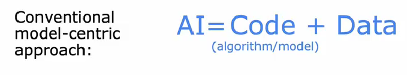

# 机器学习

!!! tip "提要"

    这是我在b站上学习吴恩达老师机器学习课程的课程笔记,主要包括监督学习,无监督学习和强化学习三个部分,笔记中的算法代码均经过运行验证.

!!! info "课程信息"

    - 课程名称:机器学习
    - bilibili：[🔗](https://www.bilibili.com/video/BV1Bq421A74G?p=1&vd_source=ee1a193eb1eecfeb89b800c494cadce0)

