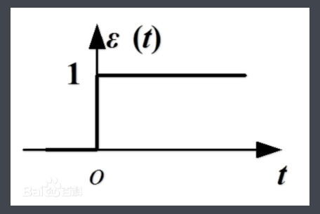
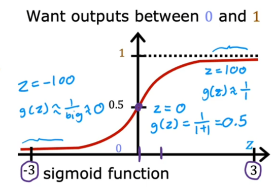
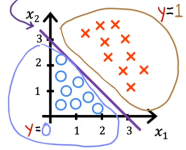
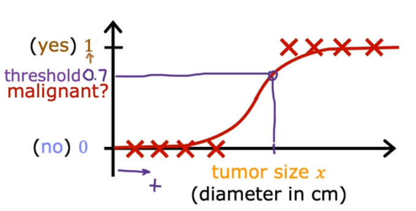
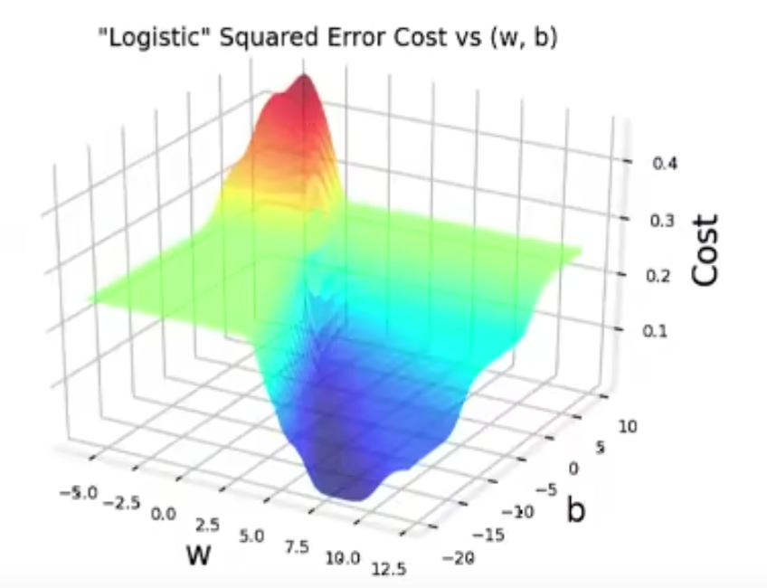
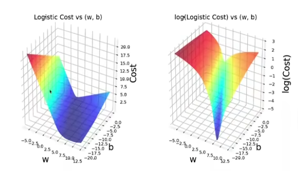

# 二分类模型
最常见的分类任务是二分类任务,即训练集的输出只有两个值---0和1,我们的任务是训练一个分类器,当给出新的输入的时候,能够快速将它划分到某个类别当中去.显然,这个分类器应该是一个函数,当输入满足某些条件,函数值为0,满足另一些条件,函数值为1,最自然能想到的分类函数就是阶跃函数:

!!!阶跃函数
    { width=300px style="border-radius: 10px;" }

当x大于0的时候,分类为1,当x<0的时候分类为0,但是,这是一个分段的不连续的函数,不利于我们后续的操作,所以,要想办法找到一个和阶跃函数比较像的函数作为我们的分类器.

{ width=300px style="border-radius: 10px;" }

我们采取的分类函数就是如图所示的sigmod函数,当x>0的时候,它被分类到1的概率会大于百分之50,同样,当x<0的时候,它的分类到0的概率会大于百分之五十,它的函数表达式为:

$$
g(z)=\frac{1}{1+e^{-z}}
$$

下一步就是把输入映射到z的定义域上,注意到,输入有可能是多维的,最常见的映射方式就是线性变换:

记输入为向量$\vec{x}$,那么通常有:

$$
z=\vec{w}\cdot \vec{x}+b=w_1x_1+w_2x_2+...+w_nx_n+b
$$

当线性映射不满足要求的时候,也可以使用多项式映射,例如:

$$
z=w_1x_1+w_2x_2^2+w_3x_3^3
$$

来获得比较好的转换效果,这一点可以从决策边界上看出来.

于是我们就得到决策函数:

$$
f_{\vec{w},b}(\vec{x})=g(\vec{w} \cdot\vec{x}+b)=\frac{1}{1+e^{\vec{w} \cdot\vec{x}+b}}
$$

其中$z=\vec{w}\cdot \vec{x}+b$可以替换成多项式函数$z=f(\vec{x},\vec{w})$

## 决策边界
我们知道,当z大于0的时候,可以认为输出的都是1,当z小于0的时候,可以认为输出都是0,所以z=0也就被称作决策边界.

例如,一维的时候:

$$
z=wx+b
$$

决策边界就为:

$$
x=-\frac{b}{w}
$$

为数轴上的一个点

二维的时候,决策边界为:

$$
w_1x_1+w_2x_2+b=0
$$

是一条直线

{ width=300px style="border-radius: 10px;" }

如图所示,决策边界将两者分成的鲜明的两大类.

从中我们也不难想到,当两种输出的点之间的界限没有这么清晰,或者很难用直线表示的时候,直线的决策边界也就是线性映射的效果肯定不会很好,这个时候,就需要对点集做非线性映射,得到的决策边界也是非线性的:

{ width=300px style="border-radius: 10px;" }

例如这个图,圆形的决策边界可以很好的满足要求

## 代价函数

{ width=400px style="border-radius: 10px;" }

仿照线性回归的思想,我们用均方误差来代表使用这样的分类函数$f_{\vec{w},b}(\vec{x})$的代价:

$$
J(\vec{w},b)=\frac{1}{2m}\sum_{i=1}^{m}(f_{\vec{w},b}(\vec{x}_i)-y_i)^2
$$

但是,在求解最小值的时候会遇到困难,这家伙是非凸函数,存在许许多多个极小值点,这样,我们在使用梯度下降算法的时候会遇到困难,容易收敛到局部最小值也就是极小值,所以,人们决定不采用这样的代价函数,转而采用了另一种凸的满足条件的代价函数

!!!代价函数非凸
    { width=300px style="border-radius: 10px;" }

定义损失函数$L(f_{\vec{w},b}(\vec{x}_i),{y}_i)$

$$
L(f_{\vec{w},b}(\vec{x}_i),y_i)=\begin{cases}
    -log(f_{\vec{w},b}(\vec{x_i})) \quad y_i=1\\
    -log(1-f_{\vec{w},b}(\vec{x_i}))\quad y_i=0
\end{cases}
$$

也可以直接写成:

$$
L(f_{\vec{w},b}(\vec{x}_i),y_i)=-y_ilog(f_{\vec{w},b}(\vec{x_i}))-(1-y_i)log(1-f_{\vec{w},b}(\vec{x_i}))
$$

代价函数为:

$$
J(w,b)=\frac{1}{m}\sum_{i=1}^mL(f_{\vec{w},b}(\vec{x}_i),y_i)
$$

这个函数具有较为良好的凹凸性,可以使用梯度下降算法直接求解它的最小值,进而得到最优的分类函数

!!!改进的代价函数
    { width=400px style="border-radius: 10px;" }

