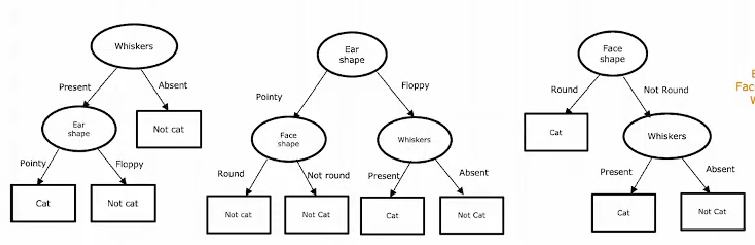
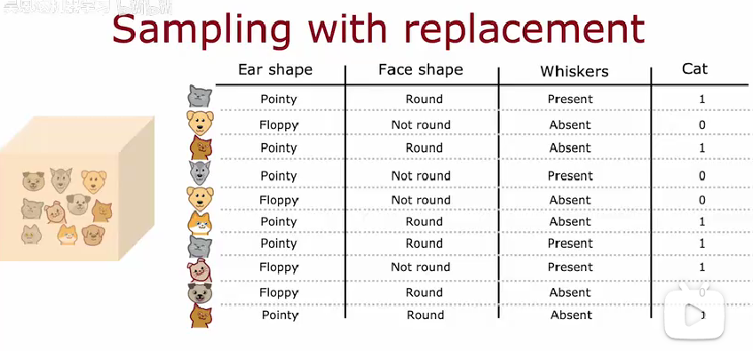
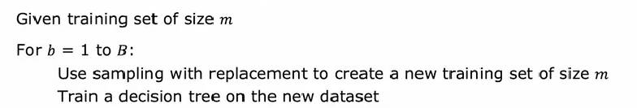
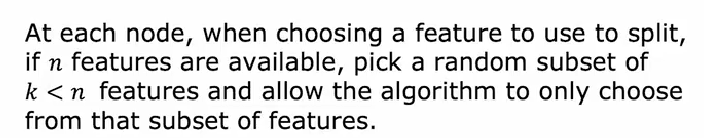
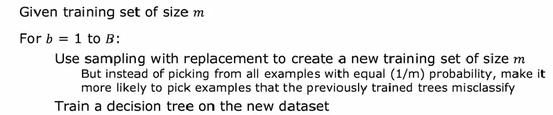
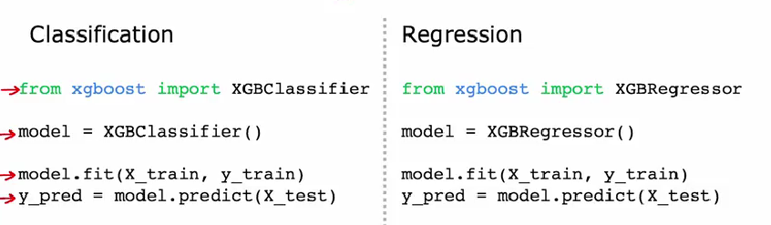

# 随机森林

## 使用多个决策树

在决策树的构建中,我们发现,每个节点的选择是非常依赖训练集的,训练集上很微小的改变都有可能造成节点的顺序和类型发生很大的变化,所以决策树对数据是非常敏感的.

如果尝试构建不同的决策树,让他们一起工作,最后的输出由所有的输出"投票决定",这样构建出来的决策树显然会更加可靠更加值得信赖.



这些不同的树构成一个树集合,随着树集合规模的增大,模型将变得复杂而难以解释,但是预测成功率却会获得显著提升.

## 放回抽样

如何构建大量的不同的决策树?通常采用放回抽样的方式,如果原训练集中存在m个样本,那么获得新训练集的方法就是进行m次放回抽样,然后将抽到的特征向量组合成一个新的训练集,由这样一个新的训练集,我们可以得到一颗新的树.大量重复这样的操作,我们就能够得到大量的不重样的决策树,然后让这些树协同工作,输出可以使用算数平均之类的办法得到总的输出.



## 随机森林算法

将上述的所有步骤统合起来,就得到了随机森林算法,随机体现在放回抽样上,森林体现在决策树的数量上:



对于一些特征较多的数据集,为了提升运算速度,我们在每个节点选择特征的时候通常只在总特征的子集当中去选:



通常,这个子集的大小k可以取做:

$$
k=[\sqrt{n}]
$$

尝试构建一下

```python
# 导入必要的库
import numpy as np
import pandas as pd
from sklearn.model_selection import train_test_split
from sklearn.ensemble import RandomForestClassifier
from sklearn.metrics import accuracy_score


# 引入数据集

df = pd.read_csv(r'E:\project\my-project\docs\theroy\machine-learning\神经网络模型\multi_class_dataset.csv')
X=np.array(df.drop(columns='target').values)
y=np.array(df['target'].values)

# 拆分训练集和测试集:

# 拆分数据集，80% 训练集，20% 测试集
X_train, X_test, y_train, y_test = train_test_split(X, y, test_size=0.2, random_state=42)


model=RandomForestClassifier(
    n_estimators=200, # 树的数量,代表森林的规模
    max_depth=10, # 最大迭代深度
    min_samples_split=5, # 停止分裂的最小样本数
    random_state=42 # 随机种子,可以确保每次运行构建的森林是相同的
)

model.fit(X_train,y_train)

# 使用测试集来评估模型的效果

y_pred=model.predict(X_test)

# 评估准确率

accuracy = accuracy_score(y_test, y_pred)
print(f"模型的准确率: {accuracy}")
```

## XGboost

XGboost算法是对随机森林算法的一种改进,常规的随机森林算法在每一次构建决策树的时候,都是等概率选取全部的点,而XGboost采用了一种故意纠错的思想,下一次选取数据的时候,总是倾向于选取那些上一个树分类错误的数据,然后这个树就起到一个对上一个树纠错的一个功能,这可以确保算法迭代收敛的速度比较快.



这个具体的数学实现比较困难,了解一下就好了,需要的时候直接用




尝试应用一下:

```python
import numpy as np

import pandas as pd

import xgboost as xg

from sklearn.metrics import accuracy_score

# 引入数据集

df = pd.read_csv(r'E:\project\my-project\docs\theroy\machine-learning\神经网络模型\multi_class_dataset.csv')

# 训练集
X=np.array(df.drop(columns='target').values)[0:800]

y=np.array(df['target'].values)[0:800]

# 测试集

X_1=np.array(df.drop(columns='target').values)[800:]
y_1=np.array(df['target'].values)[800:]


# 使用xgboost训练模型

# 通过对参数的设定,可以提高决策树的预测准确程度
model = xg.XGBClassifier(
    learning_rate=0.01,
    n_estimators=1000,
    max_depth=6,
    min_child_weight=1,
    gamma=0,
    subsample=0.8,
    colsample_bytree=0.8,
    objective='multi:softmax',
    random_state=42
)

model.fit(X,y)

y_pred = model.predict(X_1)

# 评估准确率

accuracy = accuracy_score(y_pred,y_1)
print(f"模型的准确率: {accuracy}")

```

准确率依旧不是很高,是我的数据集相关性不够强吗?

