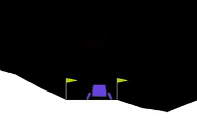
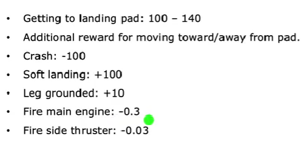
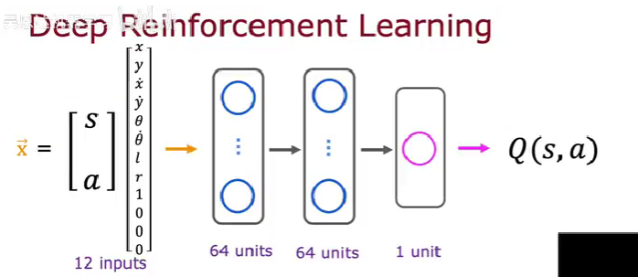
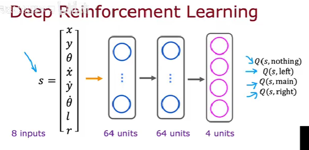
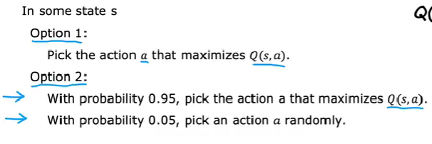
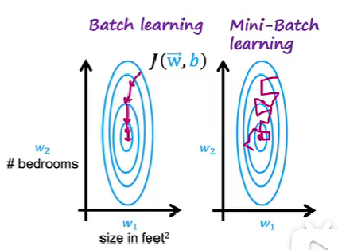

# 深度强化学习

!!! info "想法"
    Bellman方程给出了状态转移关系,但是状态动作值函数的具体形式仍然不明朗,并且依赖于递归去计算相应的函数值.将强化学习和深度学习结合起来是另一种可能的思路,它能够帮助我们描述一个抽象而又难以描述的隐函数关系.

## 月球车

以二维月球车降落为例,其状态可以由下述向量描述:

$$
s=
\begin{bmatrix}
    x\\
    y\\
    z\\
    \theta\\
    \dot{x}\\
    \dot{y}\\
    \dot{z}\\
    \dot{\theta}\\
    l\\
    r\\
\end{bmatrix}
$$

其中l和r是一个二进制变量,分别代表左脚和右脚有没有接触到地面,我们可以根据月球车的降落表现设置一系列奖励值:

如何让月球车做出决策?一个较为可能的判据是计算当前状态下不同动作所可能带来的状态动作值函数,依据函数值的大小决定当前的决策,这就要求我们找到一种计算状态动作值函数的具体方法,然而Bellman方程的计算方式又是依赖于状态动作值函数的具体形式,固然可以通过动态规划的办法一步步迭代下去直到到达最终状态,但是我们希望找到一种更加高效,更加普适的计算方式.

## 学习状态值函数

我们希望神经网络做的是,根据当前的状态和动作,能够返回对应的状态动作值函数值,此时的特征向量为:

$$
\mathbf{x}=
\begin{bmatrix}
    s\\
    a
\end{bmatrix}
$$

对应的标签为:$y=Q(s,a)$

然而,对应的状态动作值函数值是完全未知的,我们完全可以随机猜测一个函数形式,这有点类似于初值估计,体现在神经网络上,就是随机初始的设定参数$\mathbf{W}^{(0)}$和$\mathbf{b}^{(0)}$,这样子估计的函数形式记做$Q^{(0)}$

1. 在脑子中让月球车进行大量的随机动作,得到一系列的元组,作为我们的训练集:

$$
   \begin{aligned}
   (s^{(1)},a^{(1)},&R(s^{(1)}),s'^{(1)}) \\
   (s^{(1)},a^{(1)},&R(s^{(1)}),s'^{(1)})\\
   &\vdots
   \end{aligned}
$$

2. 取大量的特征向量:

   $$
   \mathbf{x^{(i)}}=
   \begin{bmatrix}
       s^{(i)}\\
       a^{(i)}
   \end{bmatrix}
   $$

   为神经网络的输入.

3. 用随机设置初始参数的神经网络计算特征向量的标签:

$$
   y^{(i)}=R(\mathbf{x^{(i)}})+\gamma \max_{a'}Q^{(0)}(s'^{(i)},a')
$$

4. 训练这个神经网络,得到新的参数$\mathbf{W^{new}},\mathbf{b^{new}}$,以及用神经网络表示的新的函数形式$Q^{new}$

5. 用新参数替换掉旧的参数,重复上述过程,神经网络的输出会越来越符合Bellman方程,当参数的变化小于一定值后,终止迭代,训练完毕:

$$
   Q^{(n+1)}\leftarrow Q^{new}
$$

为了比较状态动作值函数,如果每次神经网络都只有一个输出,那么面对同的动作,我们就要重复调用多次神经网络,这无疑是低效的,我们只需要对上述的输入特征向量以及输出特征向量做一些改动,让神经网络能够训练并且同时输出这四个值,这样就能够极大地提升代码运行效率:

$$
\mathbf{x^{(i)}}=
\begin{bmatrix}
    s^{(i)}_1\\
    a^{(i)}_1\\
    a^{(i)}_2\\
    \vdots
\end{bmatrix}
$$

对应的标签为:

$$
\mathbf{y}=
\begin{bmatrix}
    Q^{(n)}(s^{(i)},a^{(i)}_1)\\
    Q^{(n)}(s^{(i)},a^{(i)}_2)\\
    \vdots
\end{bmatrix}
$$

神经网络的架构为:

## 算法改进

### $\varepsilon$-贪婪策略

在训练神经网络的第一步,我们采取让月球车随机运动的方式来获得一系列元组,但是这并不是一个很好的选择,因为Q是一个描述最优策略的函数,而让月球车进入大量随机的状态并不能很好的与Q贴合,因为Q往往只应用在状态空间的最优路径上.

所以,让月球车采取动作需要有一定的讲究,对于一个完美的Q,$\max_a Q(s,a)$一定对应于完美决策,然而,我们训练过程中的Q通常不是完美的,所以我们采取一个随机贪婪策略:

对于现行状态s,我们以较大的概率采取贪婪策略,选择能够使其状态动作函数最大的决策a

$$
\max_a Q(s,a) 
$$

以较小的概率随机接受一个决策.

这样,既可以保证路径逐渐收敛到最优路径上,又可以保证算法有一定几率跳出局部最优解,同时比起随机选择,他的收敛速度要快得多.

### 小批量

BP神经网络在优化参数的时候,会进行大量的梯度下降的运算:

$$
w^{(k+1)}=w^{(k)}-\alpha\frac{\partial }{\partial w}\sum_{i=1}^{1000000}(f_{w,b}(x_i)-y_i)^2
$$

一旦样本量非常大,进行全局的梯度下降就会消耗相当大的计算资源,所以可以尝试采用小批量梯度下降,每一次的梯度下降都随机选择不同的少量样本,例如一次选1000个,这样的梯度下降过程可能会更加曲折,但是单次的运算速度快,通常会比全局梯度下降消耗的总计算资源小.

### 软更新

软更新是一种防止参数振荡的技术,在我们进行深度强化学习的时候,神经网络迭代过程中参数改变可能是非常剧烈的,这样就导致参数在训练过程中发生长时间的振荡,难以收敛到最终的值,或者说,需要额外的一段时间来弥补振荡带来的参数变化,所以,我们想办法让参数的更新不那么剧烈一点,这就是软更新的思想:

以参数$\mathbf{W}$为例:

$$
\mathbf{W^{(n+1)}}=\lambda \mathbf{W^{(n)}}+(1-\lambda)\mathbf{W^{new}}
$$

其中$\lambda$是一个接近1的值,通常可以取0.9,这样就实现了缓慢改变参数的目的.

