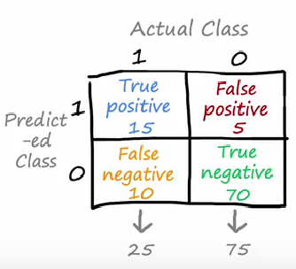
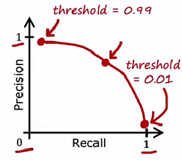

# 准确率和召回率

在训练一个二分类器,如一个疾病判断器的时候,有一些疾病是很难发生的,所以数据集在两个分类之间会发生剧烈的倾斜,大量的数据都是没有病的数据,而只有小部分数据是有病的,所以训练出来的模型就很有可能把有病的病人判断成为没有病的.

为此,我们可能要在输出上做一点偏向,例如,原先的输出是$y>0.5$被认为有病,反之则认为没病,我们可以把这个判断界限稍微往下调整,这样就能尽可能的找到所有的病人,同时,这也带来一个问题,很多原先没有病的病人却被判断为有病了,准确率大大下降.

为此,我们首先将我们模型诊断的病人划分为四类:真阳性,真阴性,假阳性,假阴性

定义两个指标:准确率和召回率又称查准率和查全率:

衡量模型判定的正确性,用真阳性的个数比上预测阳性的个数即为准确率:

$$
P=\frac{TP}{TP+FP}
$$

能不能召回(recall)所有的阳性病人,这就是模型的召回率:

$$
R=\frac{TP}{TP+FN}
$$

很显然,根据刚刚的分析,precision和recall两者之间存在一定的互斥关系,一个模型的优劣要综合两者查看

## F-1 Score

可以绘制P-R曲线,然后再曲线上找到一个P和R都较大的点,这是一个办法:

但是这个只是表观的,如果能将两个指标用一种打分方法量化就更好了,F1 Score 采用了P和R的调和平均来解决这个问题:

$$
F=\frac{2}{\frac{1}{P}+\frac{1}{R}}
$$

当有一个指标过小的时候,F都会很小,只有两者都刚刚好的时候,F才会是一个较大的值.

