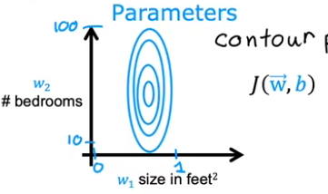
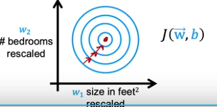
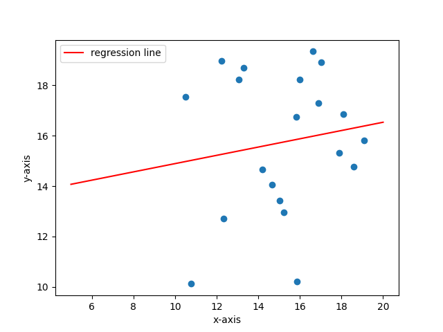
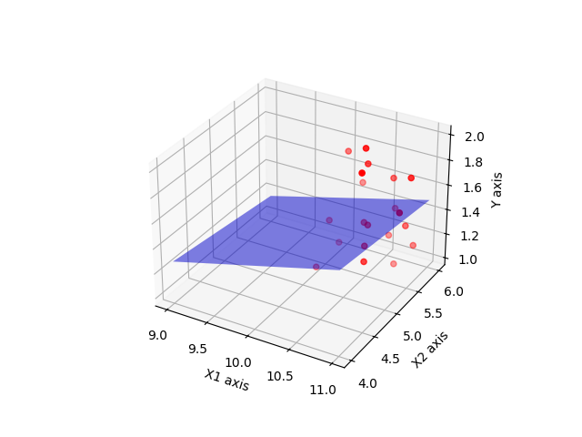

# 线性回归模型
线性回归是最简单的监督学习算法,他的输入是已知的点集,输出是直线,目的是找到一条最优的直线来进行拟合,使得它和给出的点集尽可能的贴合,具体可以用一下语言描述,先从二维的开始:
在平面上存在一系列点集$(x_1,y_1),(x_2,y_2),...,(x_m,y_m)$,要求找到一条直线:

$$
f_{w,b}(x)=wx+b
$$

使得其尽可能满足点集的特征

那么什么叫满足点集的特征,需要使用数学语言描述:
## 代价函数
我们定义一个代价函数对得到的直线进行评价,通过使得代价函数最小,获得最优的直线,换句话说,最贴合点集的直线是使得代价函数取得极小值的直线:
代价函数的形式通常采用误差的平方和的平均,代表了每一个点偏离直线的贡献:

$$
J(w,b)=\frac{1}{2m}\sum_{i=1}^{m}(y_i-f_{w,b}(x_i))^2
$$

前面有个二分之一是为了之后计算的简化,并不影响评价函数的有效性.
从纯数学的角度,使得评价函数取得极小值的条件是:

$$
\begin{cases}
    \displaystyle\frac{\partial J(w,b)}{\partial w}=0\\
    \\
    \displaystyle\frac{\partial J(w,b)}{\partial b}=0
\end{cases}
$$

但是计算机通常不会直接求解方程,下面我们提供一种机器学习经常使用的算法去寻找极小值

## 梯度下降算法
梯度方向是多元函数上升或者下降最快的方向,我们选定一个函数初值,然后在初值上执行一步梯度下降,执行完毕后重新计算梯度再执行下降,如此循环后收敛到一个定值,这通常是函数的极小值,但是,面对多极值代价函数,梯度下降往往不能获得全局最小值,只能得到局部最小值也就是极小值,这就要求我们使用其他算法或者选定合适的初值.

!!!梯度下降
    定义目标向量$\vec{A}=(w,b)$,所以

    $$
    \vec{A}=\vec{A}-\alpha\vec{\nabla} J(w,b)
    $$

    其中$\alpha$被称作学习率,代表了梯度下降的速率的大小,经过不断地迭代,直到$|A|$不再发生变化.
    或者可以写成分量的形式:

    $$
    \begin{cases}
        \displaystyle w=w-\alpha \frac{\partial J(w,b)}{\partial w}\\
        \\
        \displaystyle b=b-\alpha \frac{\partial J(w,b)}{\partial b}
    \end{cases}
    $$

    把上述的式子展开就是:

    $$
    \begin{cases}
    w=w-\alpha\frac{1}{m}\sum_{i=1}^m(f(x_i)-y_i)x_i\\
    b=b-\alpha\frac{1}{m}\sum_{i=1}^m(f(x_i)-y_i)
    \end{cases}
    $$

w和b的赋值必须要同步进行,这样才算做完成一步梯度下降,迭代至值收敛就完成了直线拟合.

## 多元线性回归
如果输入的不再是m个数值,而是m个n维向量,我们需要对线性回归的形式做一些细微的修改:
输入值为$(\vec{x_1},y1),(\vec{x_2},y_2)...(\vec{x_m},y_m)$
其中,$\vec{x_i}=(x_{i1},x_{i2},...,x_{in})^T$是一个列向量,一般默认使用的是列向量,那么对应的回归系数w也可以写成n元向量的形式:

$$
\vec{w}=(w_1,w_2,w_3,...w_n)^T
$$

所以,回归方程可以表示为:

$$
f_{\vec{w},b}(\vec{x})=\mathbf{w}^T\mathbf{x}+b
$$

与此同时,代价函数的形式保持不变,只有细节上的略微改动:

$$
J(\vec{w},b)=\frac{1}{2m}\sum_{i=1}^m(f(\vec{x_i})-y_i)
$$

如法炮制,我们对向量$\vec{w}$和参数$b$同步实行梯度下降:

$$
\vec{w}=\vec{w}-\vec{\nabla}J(\vec{w},b)
$$

对于矢量梯度算子,它可以写成分量形式:

$$
\vec{\nabla}=(\frac{\partial}{\partial w_1},\frac{\partial}{\partial w_2},...,\frac{\partial}{\partial w_n})
$$

所以$\vec{w}$的梯度下降可以写成如下分量形式:

$$
w_j=w_j-\alpha\frac{\partial }{\partial w_j}J(\vec{w},b)
$$

b的梯度下降形式不变

!!!多元回归梯度下降

    $$
    \begin{aligned}
        &w_j=w_j-\alpha\frac{1}{m}\sum_{i=1}^m(f(\vec{x_i})-y_i)x_{ij}\\
        &b=b-\alpha\frac{1}{m}\sum_{i=1}^m(f(\vec{x_i})-y_i)
    \end{aligned}
    $$

## 特征缩放
梯度下降需要一定的迭代次数才能够收敛,这个收敛所需要的迭代次数受到精度,训练数据,学习率等因素的影响,为了提升算法的效率,我们需要在保证准确率的前提下减小算法所需的迭代次数,所以特征缩放是一个好办法.
考察一个二元线性回归

$$
f_{w_1,w_2,b}(x_1,x_2,b)=w_1x_1+w_2x_2+b
$$

直观来看,如果x2的取值范围比x1的偏大,那么相应的w的取值范围会偏小于是就会得到下面的结果
训练集绘制出的代价函数的等高线如下图所示:



两个参数的取值范围不同
此时的梯度下降路线较为曲折,所耗费的时间较长,为了减少迭代所需要的次数,我们要对其中的一个或者两个变量进行缩放,使得其在空间上所处的区域大体对称,这样梯度下降的速度会更快:



从中可以看到,梯度下降会更加直接迅速,所以标准化是非常必要的,具体的标准化有多种方式.

一个是归一化的操作,把训练集的取值范围都缩放到[0,1],比如$x_1$的取值范围是[2000,3000],$x_2$的取值范围是[1,9],对$x$我们执行如下操作:

$$
x_i=\frac{x_i-min\ x_i}{max\ x_i-min\ x_i}
$$

如果想要把范围限定在[-1,1],只需要把分子改成样本均值$\mu$

$$
x_i=\frac{x_i-\mu}{max\ x_i-min\ x_i}
$$

当训练集的样本量足够大的时候,根据大数定律,样本会近似服从正态分布,这个时候我们通常把它归一化成为标准正态分布:

$$
x_i=\frac{x_i-\mu}{\sigma}
$$

$\sigma$为样本标准差


## 代码示例

### 线性回归的代码示例:

``` python
import numpy as np
import matplotlib.pyplot as plt

# 创建一个随机的点列,当做训练集,这里用的是numpy创建的向量,提升运算速度
x = 10 * np.random.rand(20) + 10
y = 10 * np.random.rand(20) + 10

# 给定初始的w和b的值
w, b = 0, 0
a = 0.001  # 学习率
tolerance = 1e-3  # 迭代终止条件

while True:
    # 不断更新梯度下降值
    #在np中,*在向量中的运算是逐元素相乘,类似于点乘
    y_pred = w * x + b
    error = y_pred - y
    decrease_1 = np.sum(error * x) / 20
    decrease_2 = np.sum(error) / 20
    
    w = w - a * decrease_1
    b = b - a * decrease_2
    
    # 迭代终止条件
    if np.abs(decrease_1) < tolerance and np.abs(decrease_2) < tolerance:
        break

print(f'w={w:.2f}, b={b:.2f}')

# 绘制训练集散点图
plt.figure(1)
plt.scatter(x, y)

# 绘制训练得到的直线
x_0 = np.linspace(5, 20, 40)
y_0 = w * x_0 + b
plt.plot(x_0, y_0, label='regression line', color='red')
plt.xlabel('x-axis')
plt.ylabel('y-axis')
plt.legend()

plt.show()

```

得到的结果如下图所示,因为是随机生成的训练集,所以不是很好看
w=0.16, b=13.25


### 多元线性回归的代码
``` python
import numpy as np
import matplotlib.pyplot as plt
from mpl_toolkits.mplot3d import Axes3D

# 生成一系列三维的点
x_1 = np.random.rand(20) + 10
x_2 = np.random.rand(20) + 5
x = np.array([x_1, x_2])

y = np.random.rand(20) + 1

a = 0.001  # 学习率
tolerance = 1e-3  # 迭代终止条件

# 设定初始的w和b
w_1 = 0
w_2 = 0
w = np.array([w_1, w_2])
b = 0

# 迭代更新 w 和 b
while True:
    y_pred = np.dot(w, x) + b
    error = y_pred - y
    decrease_1 = np.dot(error, x_1) / 20
    decrease_2 = np.dot(error, x_2) / 20
    decrease_3 = np.sum(error) / 20

    w_1 = w_1 - a * decrease_1
    w_2 = w_2 - a * decrease_2
    b = b - a * decrease_3
    w=np.array([w_1, w_2])

    if np.abs(decrease_1) < tolerance and np.abs(decrease_2) < tolerance and np.abs(decrease_3) < tolerance:
        break

print(f'w_1={w_1:.2f}, w_2={w_2:.2f}, b={b:.2f}')

# 绘制三维图
fig = plt.figure()
ax = fig.add_subplot(111, projection='3d')

# 绘制散点图
ax.scatter(x_1, x_2, y, c='r', marker='o')

# 生成网格点
x1, x2 = np.meshgrid(np.linspace(9, 11, 40), np.linspace(4, 6, 40))
y_0 = w_1 * x1 + w_2 * x2 + b

# 绘制拟合平面
ax.plot_surface(x1, x2, y_0, alpha=0.5, rstride=100, cstride=100, color='blue')

ax.set_xlabel('X1 axis')
ax.set_ylabel('X2 axis')
ax.set_zlabel('Y axis')

plt.show()

```

得到的结果如图所示:
w_1=0.17, w_2=-0.06, b=0.01

