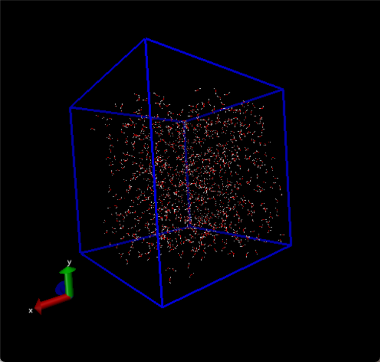

# 从创建一个水盒子开始

## 创建pdb文件

首先,需要用Gaussview生成一个水分子的pdb文件(生成完毕之后需要修改,将O改成OW,两个H分别改成OW1和OW2,然后还要在原子后面添加残基名为SOL),下一步去packmol官网下载安装包https://m3g.github.io/packmol/download.shtml.

tar-xf解压之后,进入解压后的文件夹,直接make,就会出现名为packmol的可执行文件,接着再bashrc中设置环境变量即可:

```
export PATH=$PATH:/root/packmol-21.0.1
```

下一步,编写一个简单的packmol程序,创建water_box.inp文件,输入:

```
tolerance 2.0          # 两个分子之间的最小距离
add_box_sides 1.2      # 允许分子超出盒子边界的1.2倍
output water_box.pdb   # 输出的盒子文件
structure water.pdb    # 单分子文件
  number 1000          # 水分子的个数
  inside cube 0. 0. 0. 50. 50. 50.   # 盒子的对角点的坐标,用于规定盒子的大小
end structure          # 结束创建
```

然后使用packmol执行上述文件:

```
packmol < water_box.inp
```
成功创建了一个水箱



## 生成拓扑文件

拓扑文件包含在模拟中定义分子所需的所有信息。该信息包括非键参数（原子类型和电荷）以及键合参数（键，角度和二氢键）.

通常可以使用gromacs自带的工具实现转化,我们使用pdb2gmx,这个模块可以将pbd格式转化为gromacs格式.gro,同时产生拓扑文件.top以及限制重原子位置的信息(.itp文件)

```
gmx pdb2gmx -f water_box.pdb -o water_box.gro
```
生成的top文件包含以下几个部分:

引入描述力场参数的itp文件

```
; Include forcefield parameters
#include "oplsaa.ff/forcefield.itp"
```

引入水模型的itp文件:

```
; Include water topology
#include "oplsaa.ff/tip4p.itp"
```

水分子的位置限制部分,限制了x,y,z三个方向的力常数:

```
#ifdef POSRES_WATER
; Position restraint for each water oxygen
[ position_restraints ]
;  i funct       fcx        fcy        fcz
   1    1       1000       1000       1000
#endif
```

离子拓扑部分,允许未来向体系中引入离子:

```
#ifdef POSRES_WATER
; Position restraint for each water oxygen
[ position_restraints ]
;  i funct       fcx        fcy        fcz
   1    1       1000       1000       1000
#endif
```

最后两部分是系统定义-即定义了系统的构建方式和分子组成,显示了分子体系的组成类型和水分子个数:

```
[ system ]
; Name
Built with Packmol

[ molecules ]
; Compound        #mols
SOL              1000
```

对于小分子体系,上述的步骤也可以分为两部分,先用`gmx x2top -f .pdb -o .top`生成top文件,然后再使用`gmx editconf -bt cubic -f .pdb -o .gro -d 1` 这个命令是创建盒子,-d 1限制了分子到盒子边界的最小距离.

## 创建.mdp文件

.mdp文件主要用于定义分子动力学模拟的各种参数和设置,其可以定义:模拟类型,积分步长,模拟时间,温度,压力参数等等.

可以使用vscode插件gromacs-helper来快速书写.mdp文件,例如,在em.mdp中输入lazy-em-mdp再回车,即可创建一个能量最小化的mdp文件:

```
define = -DFLEXIBLE
integrator = steep
nsteps = 2000
emtol  = 1000
emstep = 0.01
;
nstxout   = 100
nstlog    = 50
nstenergy = 50
;
pbc = xyz
cutoff-scheme            = Verlet
coulombtype              = PME
rcoulomb                 = 1.0
vdwtype                  = Cut-off
rvdw                     = 1.0
DispCorr                 = EnerPres
;
constraints              = none
```

## 生成tpr文件,运行模拟

有了上述的所有文件,我们可以生成二进制输入文件(.tpr文件),然后运行模拟.

```
gmx grompp -f em.mdp -p topol.top -c water_box.gro -o water_box.tpr
```

-f 用于指定模拟的参数文件,-p用于指定拓扑文件,-c用于指定坐标文件,最后输出tpr文件

接着就可以开始跑模拟了:

```
gmx mdrun -v -s water_box.tpr
```

使用mdrun模块执行分子动力学模拟,-v要求输出详细信息,-s用于指定tpr文件.

或者说使用:

```
gmx mdrun -v -deffnm water_box
```

前者会生成默认的文件名,这样的写法会导致输出的一系列文件都包含water_box前缀.

最后生成日志文件.log ,轨迹文件.trr,能量文件.edr和能量最小化后的结构文件water_box.gro

