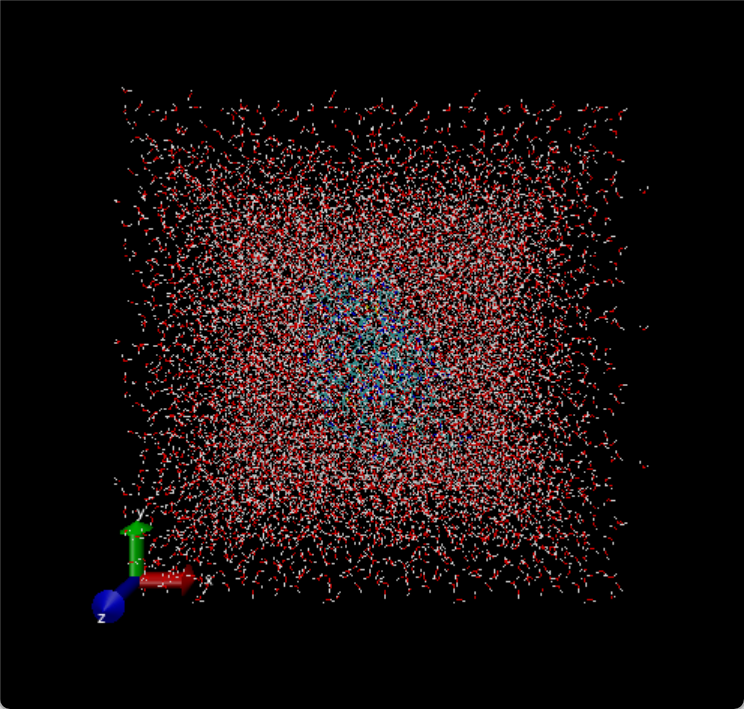
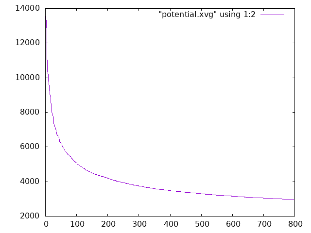
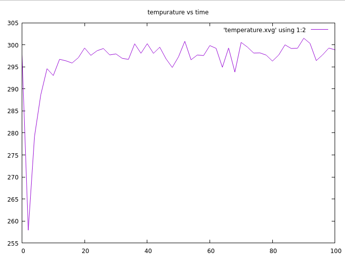
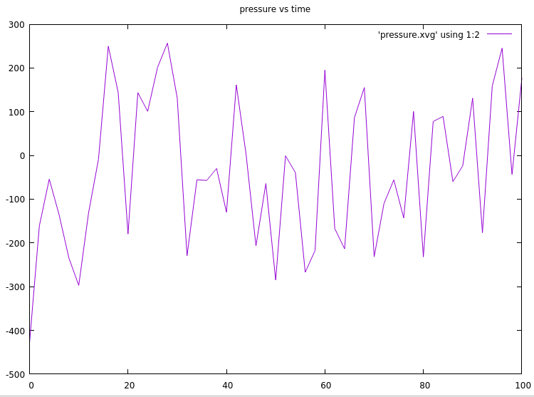
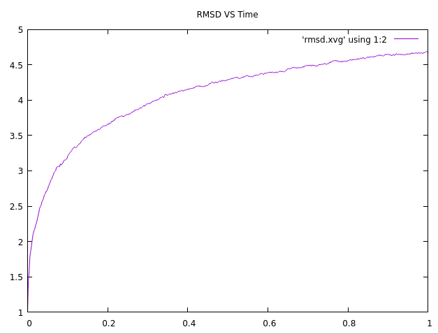

# 水中的溶菌酶

GROMACS Tutorial教程的第一步

## 准备工作

首先去rcsb.org网站上下载1aki的.pdb文件,然后使用grep指令去除掉里面的所有水:

```
grep -v HOH 1aki.pdb > 1AKI_clean.pdb
```

然后下一步,使用pdb2gmx生成.gro文件,.top文件和.itp文件:

```
gmx pdb2gmx -f 1AKI_clean.pdb -o 1AKI_processed.gro -water spce
```

其中,-water space指的是使用SPC/E水模型生成溶剂环境. 然后选用全原子力场` OPLS-AA/L all-atom force field`

由于这次没有用水模型,所以会直接在.top文件中生成atoms对应的力场原子类型:

```asm
[ moleculetype ]
; Name            nrexcl
Protein_chain_A     3

[ atoms ]
;   nr       type  resnr residue  atom   cgnr     charge       mass  typeB    chargeB      massB
; residue   1 LYS rtp LYSH q +2.0
     1   opls_287      1    LYS      N      1       -0.3    14.0027
     2   opls_290      1    LYS     H1      1       0.33      1.008
     3   opls_290      1    LYS     H2      1       0.33      1.008
     4   opls_290      1    LYS     H3      1       0.33      1.008
     5  opls_293B      1    LYS     CA      1       0.25     12.011
     6   opls_140      1    LYS     HA      1       0.06      1.008
     7   opls_136      1    LYS     CB      2      -0.12     12.011
     8   opls_140      1    LYS    HB1      2       0.06      1.008
```

## 定义盒子和溶剂化

使用editconf命令定义盒子的尺寸和类型以及分子体系在盒子中的位置:

```
gmx editconf -f 1AKI_processed.gro -o 1AKI_newbox.gro -c -d 1.0 -bt cubic
```

-c使得蛋白质位于盒子中央,-d 1.0规定蛋白质的每个原子离盒子边缘至少1.0nm,-bt cubic规定盒子为立方体.gromacs先回把分子移动到中央,然后计算x,y,z三个方向的上下限,每个方向都拓展1.0nm,最后再根据最长的方向规整成立方体.这样做可以确保周期性边界条件中蛋白质和其镜像之间的距离大于cutoff,从而与其镜像不会发生相互作用,从而避免错误的力计算,而溶剂中的水则是可以与其镜像作用.

下一步,将分子体系溶剂化:

```
gmx solvate -cp 1AKI_newbox.gro -cs spc216.gro -o 1AKI_solv.gro -p topol.top
```

-cp指定包含蛋白质和盒子信息的输入文件,-cs指定溶剂模型文件,这是gromacs自带的,-p指定拓扑文件,程序会更新其中水分子的数目.

## 添加离子

在topol.top文件的[atom]模块的最后一行,可以发现总电荷数为qtot8,说明体系此时带电,不是中性的,我们需要往突袭中添加离子让体系呈现电中性.

在 GROMACS 中添加离子的工具称为 genion。genion 的作用是读取拓扑结构，并用用户指定的离子替换水分子.genion需要tpr作为输入文件,所以我们需要先根据top文件,gro文件和.mdp文件生成,.mdp文件就用最简单的em.mdp,运行grompp模块:

```
gmx grompp -f em.mdp -c 1AKI_solv.gro -p topol.top -o ions.tpr
```

这里的-c表示coord,然后使用genion:

```
gmx genion -s ions.tpr -o 1AKI_ions.gro -p topol.top -pname NA -nname CL -neutral
```

-s指定输入文件,-o指定输出文件,-pname指定阳离子类型,-nname指定阴离子类型,-neutral指定生成电中性体系.在gromacs 4.5之后,离子都被规范成为指定的大写字符串.



## 优化

首先生成能量最小化的二进制文件:

```
gmx grompp -f em.mdp -c 1AKI_ions.gro -p topol.top -o em.tpr
```

然后使用mdrun模块运行能量最小化:

```
gmx mdrun -v -deffnm em
```

结束之后输出一大堆文献,可以用energy模块读取em.edr文件,将其转化为.xvg文件,然后再用xmgrace绘制优化轨迹

```
gmx energy -f em.edr -o potential.xvg
xmgrace potential.xvg
```
如果没有xmgrace,需要先安装一个:

```
sudo apt install grace
```
一般我喜欢直接用命令行保存,所以可以写:

```
xmgrace -hardcopy -hdevice PNG -printfile 'potential.png' potential.xvg
```

或者也可以使用gnuplot查看,gnuplot进入后输入:

```
set output "potential.png"
plot "potential.xvg" using 1:2 with lines
```

就能将绘制的图像保存在当前目录下.



## 平衡

平衡分为两个阶段,一个是NVT,一个是NPT.

NVT确保体系在恒定体积和温度下达到平衡,NPT确保体系在恒定压力和温度下达到平衡,以确定密度的合理性.

gromacs-helper中不提供纯nvt过程的文件,而是将nvt和npt过程都耦合到npt过程的文件中.我们可以选择关闭压力耦合:
pcoupl=no,将过程转化为纯nvt过程.

生成nvt可执行文件并执行:

```
gmx grompp -f nvt.mdp -c em.gro -r em.gro -o nvt.tpr
gmx mdrun -deffnm nvt
```



然后下一步执行npt任务:

```
gmx grompp -f npt.mdp -c nvt.gro -r nvt.gro -t nvt.cpt -p topol.top -o npt.tpr
gmx mdrun -deffnm npt
```

nvt.cpt是nvt模拟的检查点文件,记载了前一步模拟的速度,能量,状态等等结果, -t nvt.cpt确保npt在nvt的结果下继续运算.



这个压力平衡任务看起来时间要跑长一点.

## MD

gromacs-helper中提供的蛋白质的md模板 lazy-mdp-md-protein,我们将总步数调整为50000,也就是模拟时间1000ps.

```
gmx grompp -f md.mdp -c npt.gro -t npt.cpt -p topol.top -o md.tpr
gmx mdrun -deffnm md -nb gpu
```

## 分析

md运行完毕之后,可以分子整个分子动力学的结果,使用gromacs提供的后处理工具.

由于周期性边界条件的存在,蛋白质的扩散运动可能会导致其被截断,出现一半在左侧,一半在右侧的情况,所以我们需要对轨迹进行修正.

`trjconv`是gromacs的一个后处理模块

```
gmx trjconv -s md_0_1.tpr -f md_0_1.xtc -o md_0_1_noPBC.xtc -pbc mol -center
```

tpr文件提供拓扑信息,xtc是需要处理的原始轨迹,-pbc mol是按照完整分子修正pbc,-center是将体系的几何中心移动到盒子的中心.

输入这个指令后会要求指定居中的对象,我们选择1蛋白质,然后会要求你指定输出的对象,这里指定0,即整个系统.

接下来,为了考察系统的稳定性,我们可以使用rms(均方位移)作为指标

```
gmx rms -s em.tpr -f md_noPBC.xtc -o rmsd.xvg -tu ns
```

-tu指定坐标的单位,这里指定为ns

rmsd衡量的是当前体系所有原子的位移和参考结构之间的差距,参考结构由用户指定(-s),可以使用结构优化完毕的平衡结构,也可以使用晶体结构:



从图中可以看到,构型的均方位移一直在增大,即越来越偏离初始构型,似乎还要一段时间到达平衡.关于体系是否达到平衡,更加可靠的判断方式是看温度,压力和能量.


