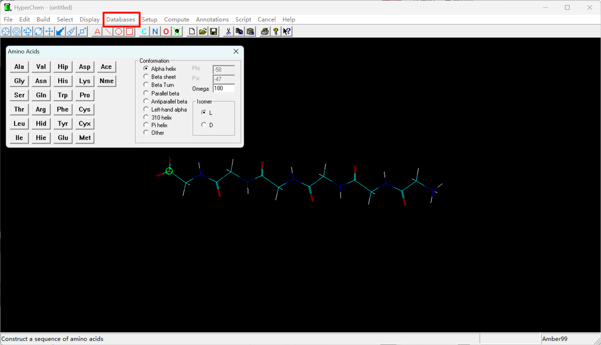
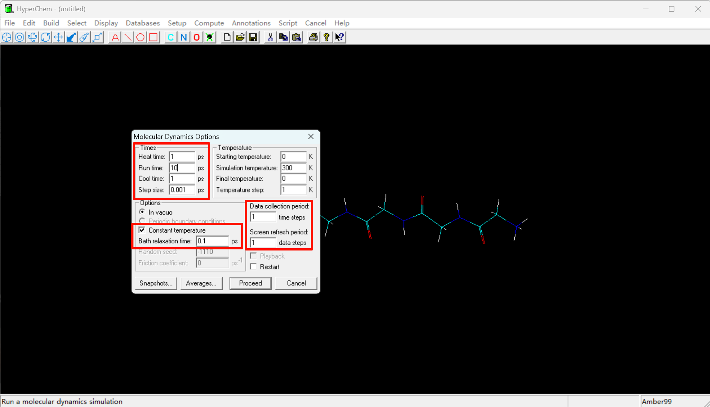
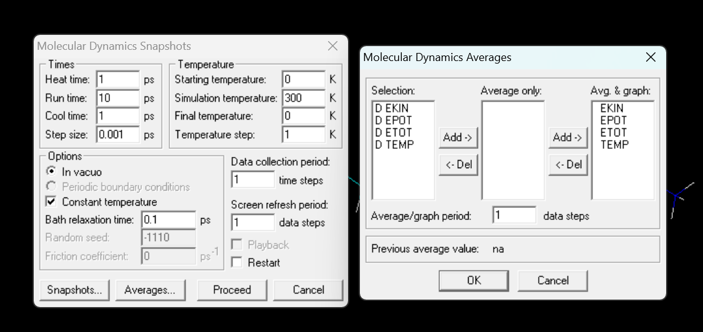
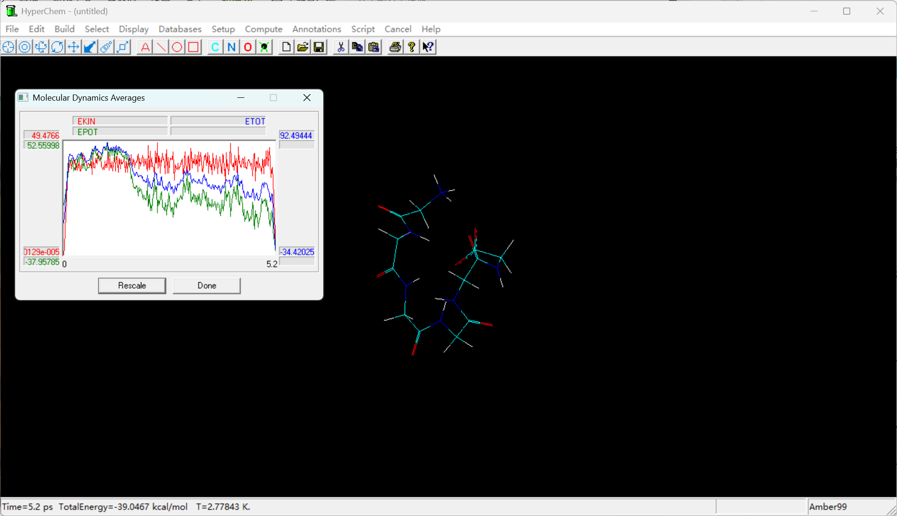
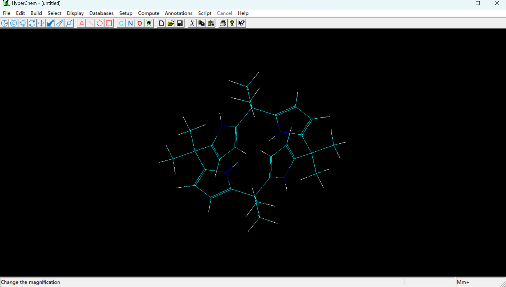
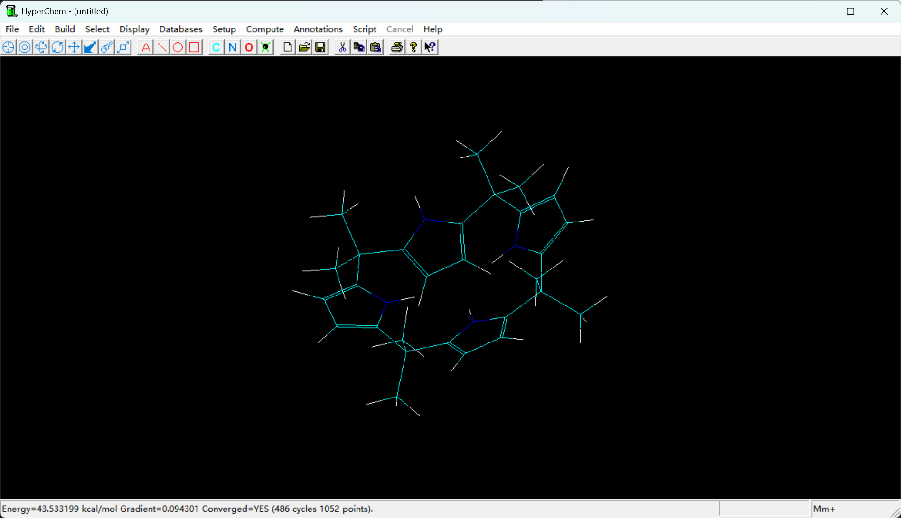
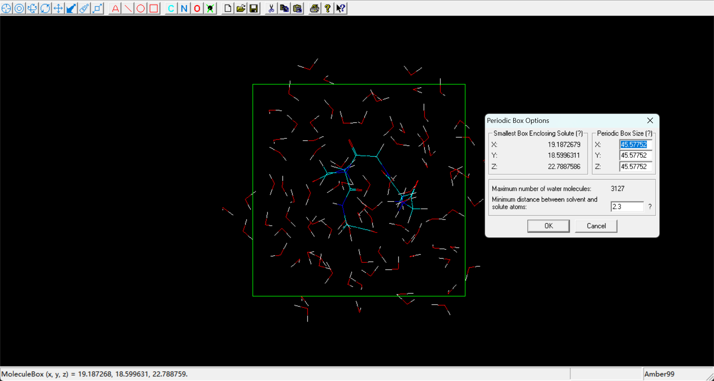
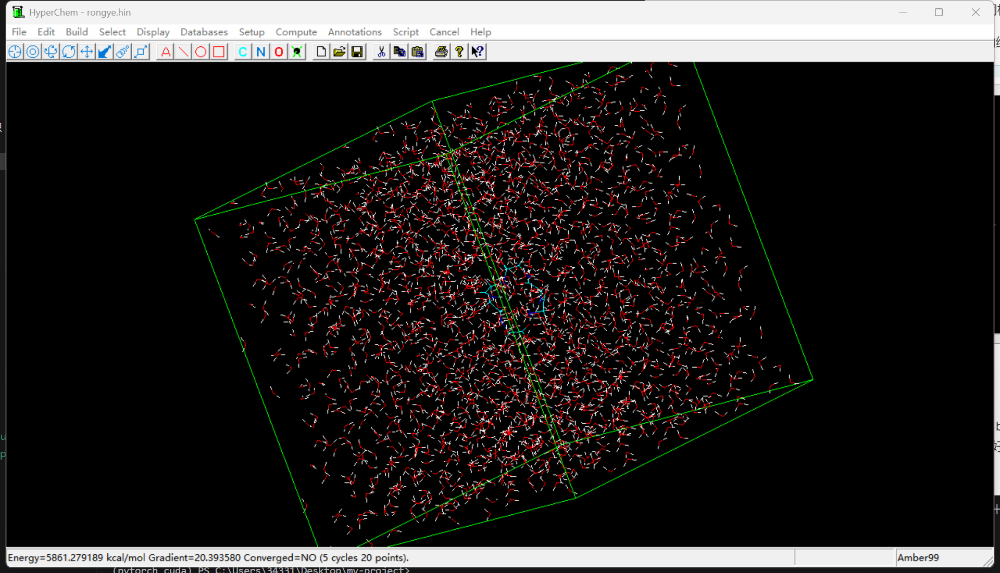
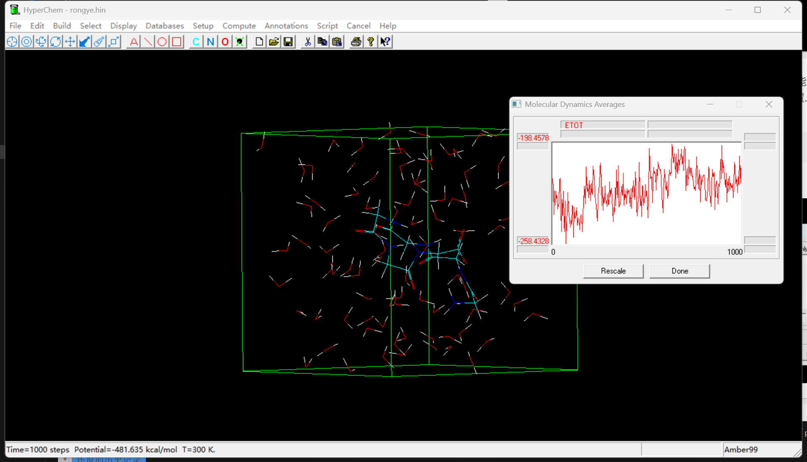

# HyperChem

HyperChem是一款商业化的分子模拟软件,其特点是有图形化界面,方便操作,适合给本科生教学,用来入门分子模拟,这里用hyperchem计算一些分子模拟中的基本任务.

## 大分子动力学模拟

以多肽为例,在database选项中可以快速创建氨基酸序列:



在两端需要补上两性离子.然后,在模拟开始之前,需要进行结构优化:

分子动力学模拟主要有3块需要设置:

1. 开始中间结束的温度和求解微分方程的步长
2. 温控设置,主要是温控监测的时间间隔
3. 数据设置,设置输出数据的频率和屏幕展示的频率



设置完毕后需要保存快照文件(snapshot),average选项会监控各种能量在模拟过程中的变化,值得注意的是,有的时候,.hin文件中不一定会自动指定快照的位置,这个时候需要在`seed`这一行下面加上这句话:

```
dynamics your snapshots path
```

不然重新加载的时候是无法回放模拟过程的





这个模拟结果如图所示,如果想要回看模拟过程,只需勾选playback后再proceed即可

模拟完毕后,.hin,.snp文件会保存在刚刚创建快照的文件夹中,同时,会生成监控的数据随着时间变化的.csv文件,可以用别的作图软件绘制监控指标随时间的变化曲线.

## 淬火动力学构象搜索



以杯[4]吡咯为例,执行淬火动力学构象搜索,我们将模拟的温度设置为4000K,高温下维持5ps,确保其有足够的能量跨过势垒,进而对构象空间执行搜索.

分子动力学模拟执行完毕后,勾选playback选项后再点击snapshots,即可回看模拟过程任意时间点的结构,将这些结构进行结构优化即有概率得到不同构象.

例如取出我模拟过程2ps的结构,进行结构优化,就得到顺式的结构:



## 模拟溶液

溶液的模拟依赖于周期性边界条件,在Hyperchem的periodic box选项中可以设置盒子的大小,同时会给出水分子的数目,如果要追求精度,自然是越多越好.





当然这张图里面的太多了,可以适当减小,事实上,只要确保一定程度上可以反映化学环境,能量就足以收敛了,再多就是浪费算力了.还有一点要注意的是,这个在跑动力学之前也要进行结构优化.

## 蒙特卡洛模拟

Monte carlo的目的是为了模拟玻尔兹曼分布下的体系的热力学性质,设置和分子模拟类似,最后得到能量-步数曲线后还要自己做平均(取收敛部分),得到玻尔兹曼分布下的总能量:

