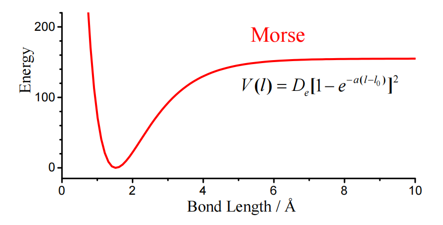
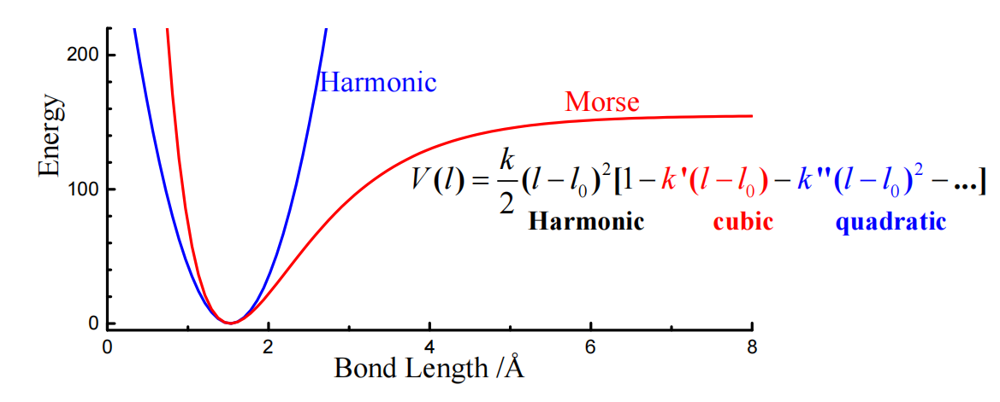
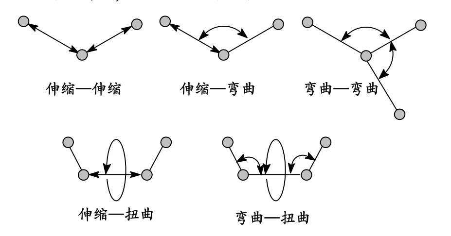
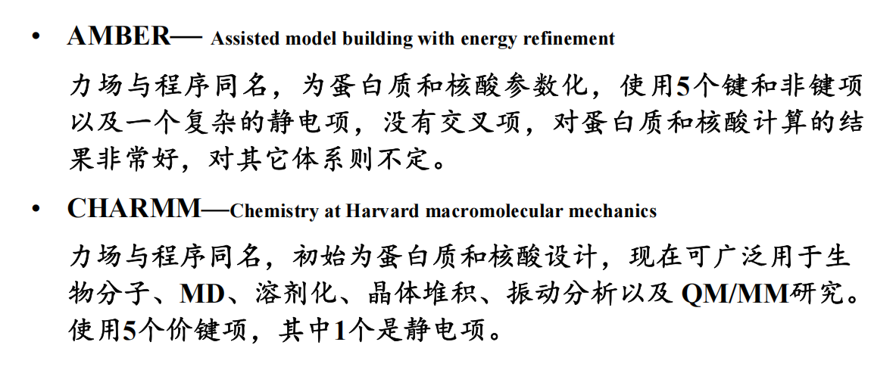
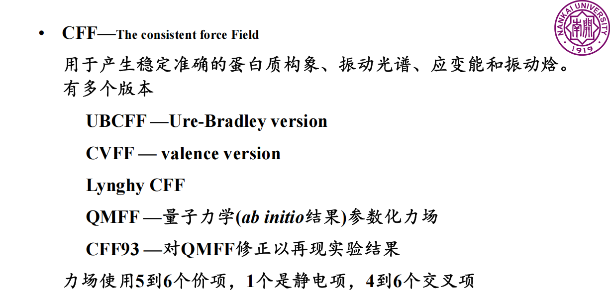
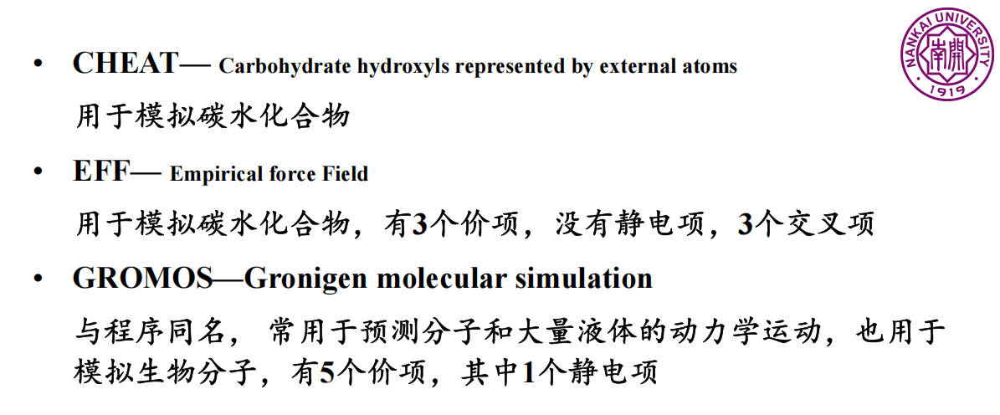
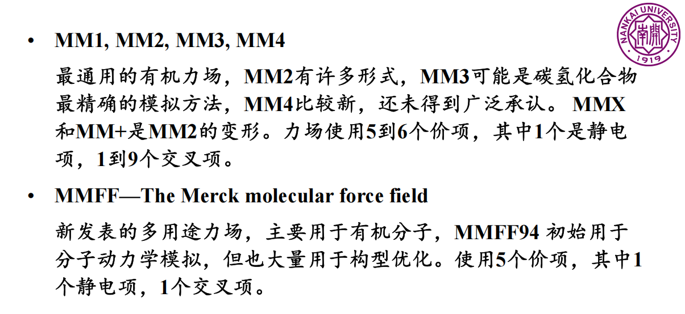
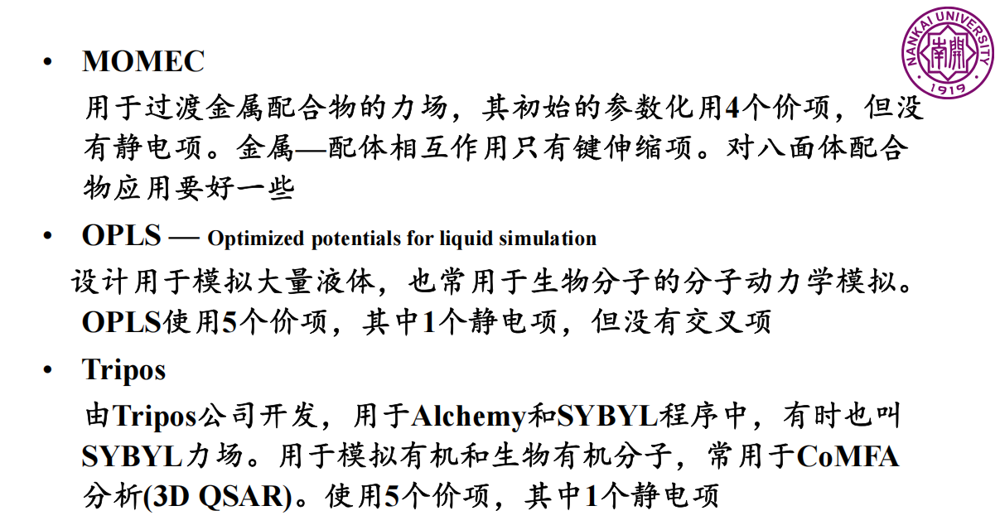
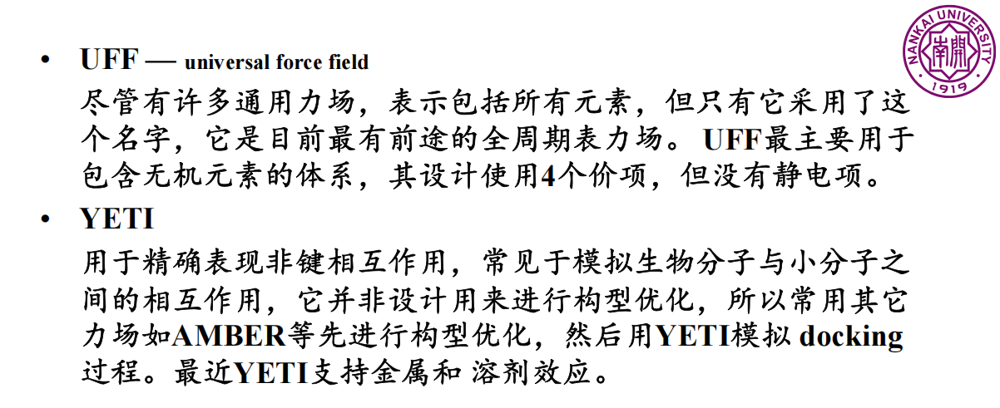

# 分子力场

由于从头算对于大分子体系过于耗时,这导致精确计算大分子体系变得困难.

因此,在实际应用中,我们通常使用分子力场来模拟大分子体系.

分子力场是一种经验性的模型,它通过将分子体系分解为原子,并使用经验参数来描述原子之间的相互作用,从而简化计算.

有了力场之后,根据求解牛顿运动微分方程,就可以得到分子体系随着时间的演化过程,这就是分子动力学模拟.

## Reference

分子模拟部分的笔记参照了南开大学精品课程《量子化学与分子力学/分子模拟》制作,在b站上可以找到该课程的相应的链接.

## 分子势函数

分子模拟中,我们将原子和原子之间的相互作用拆解成为5种基本相互作用,分别是:

- 键伸缩
- 键角弯曲
- 二面角扭转
- 范德华相互作用
- 静电相互作用

这五种相互作用具有一定的参数,这样的分解不一定是物理上有意义的,但是数学上是自洽的,总能量由参数控制,这样的分解方法在实际应用过程中表现良好.

键伸缩和键角弯曲都被简化为谐振子模型,即有一个所谓的平衡键长和平衡键角,能量由谐振子描述.

二面角的扭转被简化为周期性模型,二面角翻转到一定程度后,在能量上又会变得等价.

范德华相互作用由 Lennard-Jones 6-12 势描述,它描述了原子之间的长程相互作用

静电相互作用由库仑定律描述,原子被抽象成为点电荷,即原子核和电子云被等效成一个电荷,这个电荷通过拟合静电势的方法确定.

最终,一个分子的总能量可以被描述为:

$$
E_{total} = \sum_{bonds} \frac{1}{2}k_i (l_i - l_{i,eq})^2 + \sum_{angles} \frac{1}{2}k_i (θ_i - θ_{i,eq})^2 + \\
\sum_{torsions} \frac{1}{2}V_n(1+\cos(n\omega-\phi))+\\
\sum_{i}\sum_{j>i}4\epsilon_{ij}\left[\left(\frac{\sigma_{ij}}{r_{ij}}\right)^{12}-\left(\frac{\sigma_{ij}}{r_{ij}}\right)^{6}\right]+\frac{q_i q_j}{4\pi\epsilon_0 r_{ij}}
$$

从上面的定义中可以看出,力场参数的确定是分子力场模拟的关键,同时,我们必须一开始就制定好成键与否,即经典的分子模拟中不存在成键和断键的情况.

## 势函数修正

上述的势函数是一个比较粗糙的版本,很多时候,为了具体的需求,可以在上面进行修正,例如,键伸缩更加精确的表达式是Morse式:

$$
V(r) = D_e(1-\exp(-\beta(r-r_e)))^2
$$

我们可以考虑在平衡位置附近多展开几阶,从而得到更加精确的势函数.

||Morse势|
|:---:|:---:|
||校正后的键伸缩函数|

同理对于高张力的环,其键角的势函数可以被修正为:

$$
V(\theta) = \frac{1}{2}k_2(\theta-\theta_0)^2[1-k'(\theta-\theta_0)-k''(\theta-\theta_0)^2+ \cdots ]
$$

二面角势函数用于表征键的旋转势垒,其常常用傅里叶级数逼近:

$$
V(\phi) = \sum_{n=1}^{N}V_n(1+\cos(n\omega-\phi))
$$

取有限的截断项.

有的时候为了增加精度,甚至会增加一些能量的交叉项:

## 常见力场

