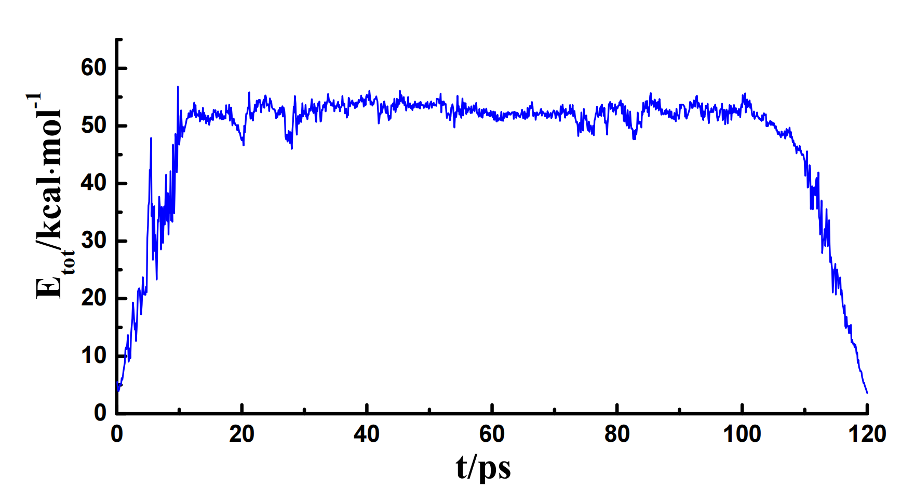
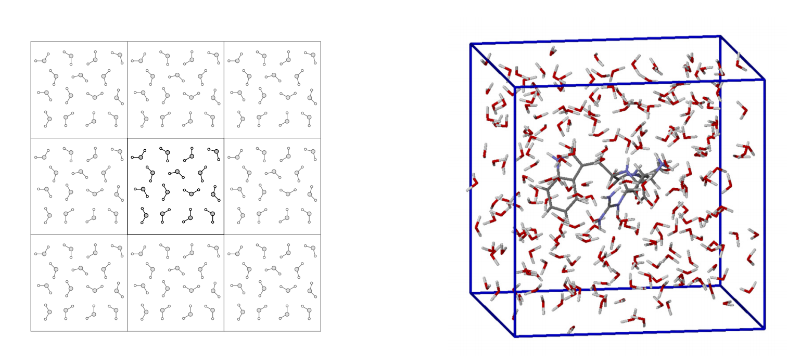

# 分子动力学模拟

有了势函数,其实就有了力,那么,我们就可以通过牛顿第二定律来求解运动方程,进而求得整个系统随时间演化的规律:

$$
\begin{cases}
&F_i = -\nabla_{r_i}E_{total}(r_1,r_2,\cdots,r_N)\\
&\displaystyle \frac{d^2r_i}{dt^2} = -\frac{F_i}{m_i}
\end{cases}
$$

这就是分子动力学模拟

一般来说,由于势函数的表达式是已知的,所以计算能量的梯度时候,我们采用的往往是解析梯度,而多体运动微分方程只能通过数值方法求解,并且整个系统是混沌的.

## 模拟的一般步骤

1. 对初始体系进行结构优化,不优化很容易出现分子爆炸的现象
2. 从0K开始进行升温,直到到达指定温度
3. 在指定温度下维持一段时间,此时,为了维持体系的温度,软件会补充和移走一部分动能,确保其尽量在模拟温度下进行.
4. 退火(视需要而定),缓慢降温到0K,这个时候得到的构象再经过优化,其能量往往是比较低的.

||
|:---:|
|模拟过程的能量变化|

## 构象搜索

### 淬火动力学

将一个分子体系升高到一个极高的温度,通常是几千K,使用高温跨过分子间各个构象的势垒,于是高温条件下就会产生大量可能的构象,这相当于对势能面做一遍扫描,我们取大量不同的高温快照,将这些分子进行优化,这样就得到了大量的局部极小点,这有助于我们搜索亚稳态和全局最小点.

值得注意的是,由于分子力场永远是基于成键的前提进行的,连接的键永远不会断裂,这带来的一个好处是,我们使用高温淬火进行搜索的时候,永远搜索的还是这个分子,但是,如果对量子化学问题应用类似的全局优化算法,由于成键和断键的问题存在,即使搜索到了全局最小值,很多时候这个也不是我们想要的了.

### 模拟退火

模拟退火其实和模拟退火算法很像,将体系升高到高温,使得其有足够多的动能跨过势垒,在各个构象中跳跃,一旦搜索到全局最小值,跳跃的速度势必会减慢,随着我们降温操作的不断进行,该分子体系越不可能跳出全局最小值,最终,体系会稳定在全局最小值.

## 模拟溶液

溶液的模拟器核心就是周期性边界条件,由于算力有限,我们可以模拟的溶液环境中必然不能包含过多的分子,那么,想要尽可能真实的模拟溶液环境,就需要使用周期性边界条件,即,分子从盒子的一段出去,会从另一端回来,这样,就相当于我们模拟了一个无限大的溶液环境.

## 蒙特卡洛模拟

蒙特卡洛模拟是用来计算分子体系的平均性质的,真实的体系,其构象往往会有一定的概率分布,其体现出来的热力学性质也是这些构象热力学性质的期望,而蒙特卡洛模拟就是通过随机抽样,来计算这些期望值.

例如,构象分布往往满足玻尔兹曼分布,对于一个随机生成的构象,其能量为$E_i$,那么,其出现的概率为$P_i = \frac{e^{-E_i/RT}}{Z}$,其中$Z$是归一化因子,称为配分函数.

但是配分函数需要所有构象的能量,而这时我们做不到的,所以,只能通过一个马尔科夫过程从时间尺度来近似模拟玻尔兹曼分布:

$$
p(i\to j) = e^{-\beta(E_j-E_i)}
$$

然后程序生成一个随机数,如果$p(i\to j) > \xi$,则接受该构象,否则,则拒绝该构象.

每次判断结束后,程序都会记录该构象的能量,最后,程序会计算出平均能量.

随着模拟次数的不断增多,程序会逐渐收敛到玻尔兹曼分布,此时,程序计算出的平均能量就是体系的热力学性质.
